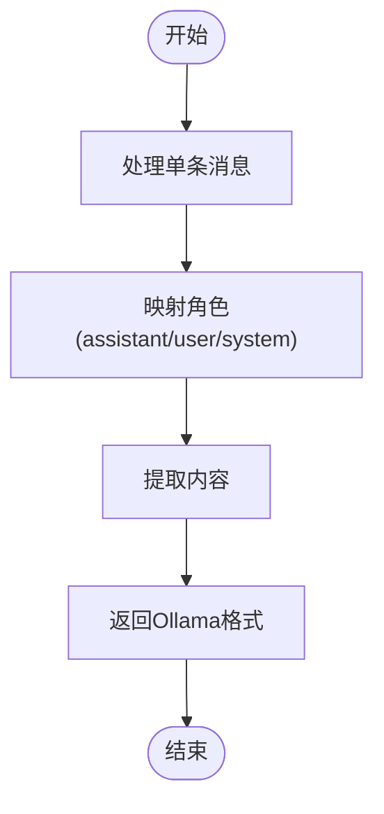

# AI提供商集成

<cite>
**本文档中引用的文件**  
- [src/core/api/index.ts](file://src/core/api/index.ts)
- [src/core/api/providers/anthropic.ts](file://src/core/api/providers/anthropic.ts)
- [src/core/api/providers/openai.ts](file://src/core/api/providers/openai.ts)
- [src/core/api/providers/gemini.ts](file://src/core/api/providers/gemini.ts)
- [src/core/api/providers/ollama.ts](file://src/core/api/providers/ollama.ts)
- [src/core/api/providers/vertex.ts](file://src/core/api/providers/vertex.ts)
- [src/core/api/providers/litellm.ts](file://src/core/api/providers/litellm.ts)
- [src/core/api/transform/openai-format.ts](file://src/core/api/transform/openai-format.ts)
- [src/core/api/transform/gemini-format.ts](file://src/core/api/transform/gemini-format.ts)
- [src/core/api/transform/ollama-format.ts](file://src/core/api/transform/ollama-format.ts)
</cite>

## 目录
1. [简介](#简介)
2. [项目结构](#项目结构)
3. [核心组件](#核心组件)
4. [架构概述](#架构概述)
5. [详细组件分析](#详细组件分析)
6. [依赖分析](#依赖分析)
7. [性能考虑](#性能考虑)
8. [故障排除指南](#故障排除指南)
9. [结论](#结论)

## 简介
本文档详细阐述了AI提供商集成系统的实现机制。系统通过统一的接口抽象，支持多种AI模型提供商（如Anthropic、OpenAI、Gemini、Ollama、Vertex AI、LiteLLM等），并提供标准化的请求处理、响应转换和错误重试机制。核心目标是将异构的AI服务接口统一为一致的内部格式，简化上层应用的调用逻辑。

## 项目结构
AI提供商集成功能主要位于`src/core/api`目录下，包含`providers`和`transform`两个核心子模块。`providers`目录下为各个AI提供商的具体适配器实现，`transform`目录包含响应格式化工具，`index.ts`文件提供全局请求路由和重试策略。


**图示来源**  
- [src/core/api/index.ts](file://src/core/api/index.ts)
- [src/core/api/providers](file://src/core/api/providers)
- [src/core/api/transform](file://src/core/api/transform)

**节来源**  
- [src/core/api/index.ts](file://src/core/api/index.ts)

## 核心组件
系统的核心组件包括：API处理器接口（`ApiHandler`）、提供商适配器（如`AnthropicHandler`、`OpenAiHandler`等）、响应转换工具（如`openai-format.ts`）和全局请求管理器。这些组件共同实现了对多种AI服务的统一访问。

**节来源**  
- [src/core/api/index.ts](file://src/core/api/index.ts)
- [src/core/api/providers/anthropic.ts](file://src/core/api/providers/anthropic.ts)
- [src/core/api/providers/openai.ts](file://src/core/api/providers/openai.ts)

## 架构概述
系统采用适配器模式，为每个AI提供商创建独立的处理器类，这些类均实现统一的`ApiHandler`接口。请求通过`buildApiHandler`工厂方法路由到具体的处理器，响应通过`transform`模块中的格式化工具统一为内部标准格式。


**图示来源**  
- [src/core/api/index.ts](file://src/core/api/index.ts)
- [src/core/api/providers/anthropic.ts](file://src/core/api/providers/anthropic.ts)
- [src/core/api/providers/openai.ts](file://src/core/api/providers/openai.ts)
- [src/core/api/providers/gemini.ts](file://src/core/api/providers/gemini.ts)
- [src/core/api/providers/ollama.ts](file://src/core/api/providers/ollama.ts)
- [src/core/api/providers/vertex.ts](file://src/core/api/providers/vertex.ts)
- [src/core/api/providers/litellm.ts](file://src/core/api/providers/litellm.ts)

## 详细组件分析

### 提供商适配器分析
每个提供商适配器负责处理特定AI服务的认证、请求发送和响应解析。适配器通过`ensureClient`方法确保客户端实例的正确初始化，并通过`createMessage`方法实现流式响应处理。

#### Anthropic适配器
Anthropic适配器使用`@anthropic-ai/sdk`库，支持缓存控制和思维预算功能。它通过`cache_control`字段优化请求性能，并处理扩展思维模式下的特殊参数。


**图示来源**  
- [src/core/api/providers/anthropic.ts](file://src/core/api/providers/anthropic.ts)

**节来源**  
- [src/core/api/providers/anthropic.ts](file://src/core/api/providers/anthropic.ts)

#### OpenAI适配器
OpenAI适配器支持标准OpenAI和Azure OpenAI服务，通过`convertToOpenAiMessages`工具将内部消息格式转换为OpenAI兼容格式，并处理o1系列模型的特殊格式要求。


**图示来源**  
- [src/core/api/providers/openai.ts](file://src/core/api/providers/openai.ts)

**节来源**  
- [src/core/api/providers/openai.ts](file://src/core/api/providers/openai.ts)

#### Gemini适配器
Gemini适配器支持Google的Gemini API和Vertex AI服务，实现了隐式缓存策略和精确的成本核算。它通过`calculateCost`方法分离即时成本和持续存储成本。


**图示来源**  
- [src/core/api/providers/gemini.ts](file://src/core/api/providers/gemini.ts)

**节来源**  
- [src/core/api/providers/gemini.ts](file://src/core/api/providers/gemini.ts)

#### Ollama适配器
Ollama适配器通过`ollama` npm包与本地或远程Ollama服务通信，支持API密钥认证和请求超时控制。它将内部消息格式转换为Ollama兼容格式进行处理。


**图示来源**  
- [src/core/api/providers/ollama.ts](file://src/core/api/providers/ollama.ts)

**节来源**  
- [src/core/api/providers/ollama.ts](file://src/core/api/providers/ollama.ts)

#### Vertex AI适配器
Vertex AI适配器作为多提供商网关，根据模型ID路由到Gemini或Anthropic服务。它通过`ensureGeminiHandler`和`ensureAnthropicClient`方法管理不同服务的客户端实例。


**图示来源**  
- [src/core/api/providers/vertex.ts](file://src/core/api/providers/vertex.ts)

**节来源**  
- [src/core/api/providers/vertex.ts](file://src/core/api/providers/vertex.ts)

#### LiteLLM适配器
LiteLLM适配器通过LiteLLM代理层访问多种AI服务，支持动态模型信息获取和成本计算。它通过`fetchModelsInfo`方法缓存模型信息以提高性能。


**图示来源**  
- [src/core/api/providers/litellm.ts](file://src/core/api/providers/litellm.ts)

**节来源**  
- [src/core/api/providers/litellm.ts](file://src/core/api/providers/litellm.ts)

### 格式化工具分析
格式化工具负责将不同提供商的异构响应统一为内部标准化格式，确保上层应用的一致性体验。

#### OpenAI格式化工具
`openai-format.ts`工具将内部消息格式转换为OpenAI兼容格式，处理内容块的类型转换和结构重组。


**图示来源**  
- [src/core/api/transform/openai-format.ts](file://src/core/api/transform/openai-format.ts)

**节来源**  
- [src/core/api/transform/openai-format.ts](file://src/core/api/transform/openai-format.ts)

#### Gemini格式化工具
`gemini-format.ts`工具将Anthropic风格的消息格式转换为Gemini API所需的格式，处理角色映射和内容结构转换。


**图示来源**  
- [src/core/api/transform/gemini-format.ts](file://src/core/api/transform/gemini-format.ts)

**节来源**  
- [src/core/api/transform/gemini-format.ts](file://src/core/api/transform/gemini-format.ts)

#### Ollama格式化工具
`ollama-format.ts`工具将内部消息格式转换为Ollama兼容格式，确保消息角色和内容的正确映射。



**图示来源**  
- [src/core/api/transform/ollama-format.ts](file://src/core/api/transform/ollama-format.ts)

**节来源**  
- [src/core/api/transform/ollama-format.ts](file://src/core/api/transform/ollama-format.ts)

### 全局请求管理分析
`index.ts`文件中的`buildApiHandler`函数实现全局请求路由、重试机制和错误处理策略，是整个AI集成系统的核心入口。


**图示来源**  
- [src/core/api/index.ts](file://src/core/api/index.ts)

**节来源**  
- [src/core/api/index.ts](file://src/core/api/index.ts)

## 依赖分析
系统通过清晰的依赖关系实现了高内聚低耦合的设计。核心API模块依赖于共享类型定义（`@shared/api`），各提供商适配器依赖于相应的第三方SDK，格式化工具依赖于核心API定义。

```mermaid
graph TD
A[src/core/api] --> B[@shared/api]
A --> C[@anthropic-ai/sdk]
A --> D[openai]
A --> E[@google/genai]
A --> F[ollama]
B --> G[类型定义]
C --> H[Anthropic API]
D --> I[OpenAI API]
E --> J[Gemini API]
F --> K[Ollama服务]
```

**图示来源**  
- [src/core/api/index.ts](file://src/core/api/index.ts)
- [src/core/api/providers/anthropic.ts](file://src/core/api/providers/anthropic.ts)
- [src/core/api/providers/openai.ts](file://src/core/api/providers/openai.ts)
- [src/core/api/providers/gemini.ts](file://src/core/api/providers/gemini.ts)
- [src/core/api/providers/ollama.ts](file://src/core/api/providers/ollama.ts)

**节来源**  
- [src/core/api/index.ts](file://src/core/api/index.ts)
- [src/core/api/providers](file://src/core/api/providers)

## 性能考虑
系统在性能方面进行了多项优化：使用客户端实例缓存避免重复创建、实现请求超时机制防止挂起、采用流式响应处理减少内存占用、通过缓存控制优化重复请求性能。Gemini适配器还实现了特殊的缓存策略以降低API调用成本。

## 故障排除指南
常见问题包括认证失败、请求超时和响应格式错误。认证问题通常由缺失或错误的API密钥引起；超时问题可能需要调整`requestTimeoutMs`参数；格式错误应检查消息转换工具的兼容性。系统内置的重试机制（`withRetry`装饰器）可自动处理临时性网络错误。

**节来源**  
- [src/core/api/retry.ts](file://src/core/api/retry.ts)
- [src/core/api/providers/anthropic.ts](file://src/core/api/providers/anthropic.ts)
- [src/core/api/providers/ollama.ts](file://src/core/api/providers/ollama.ts)

## 结论
AI提供商集成系统通过适配器模式成功抽象了多种AI服务的差异，提供了统一、稳定和可扩展的接口。系统设计充分考虑了性能、成本和可靠性，支持流式响应处理和复杂的认证机制，为上层应用提供了强大的AI能力支持。