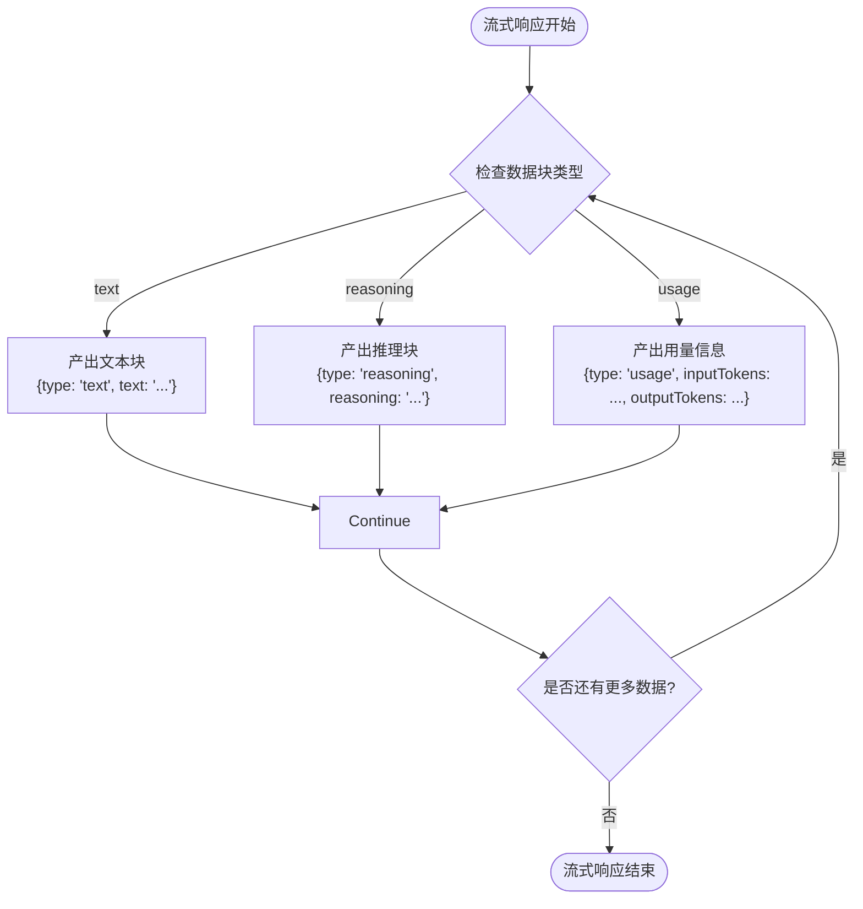
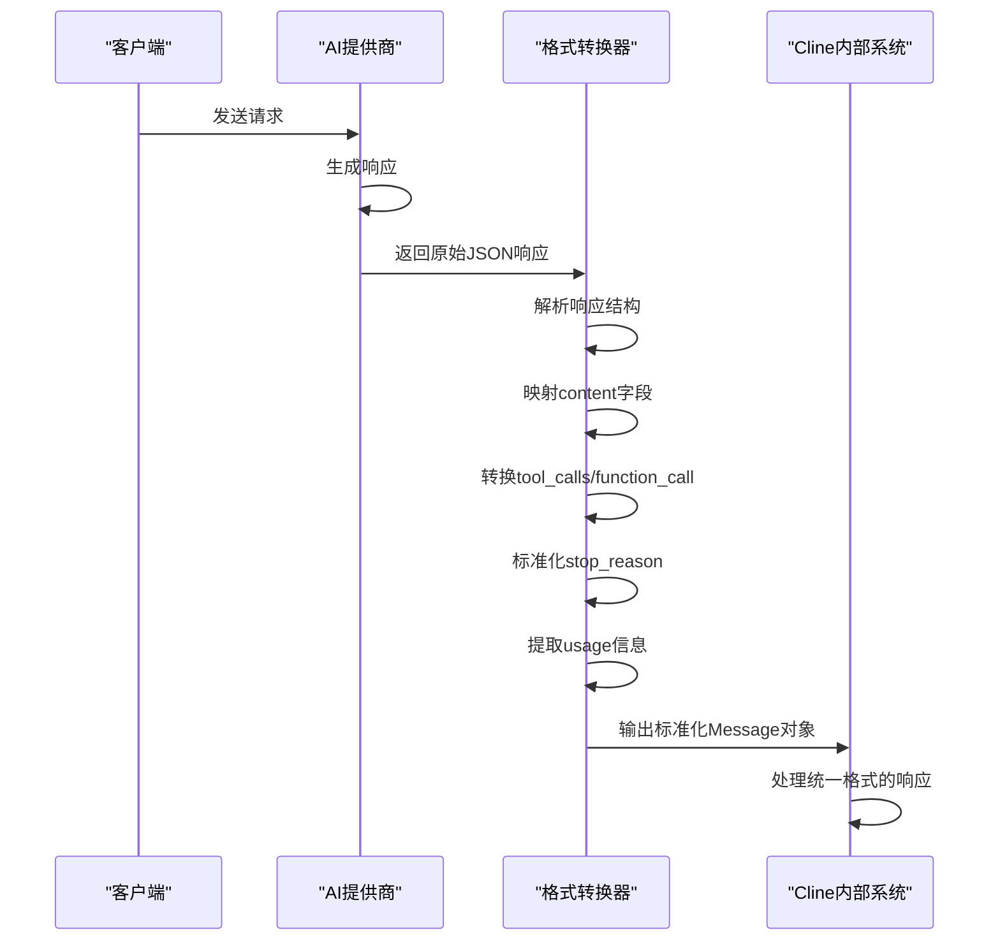

# 响应格式化与转换

<cite>
**本文档中引用的文件**  
- [openai-format.ts](file://src/core/api/transform/openai-format.ts)
- [gemini-format.ts](file://src/core/api/transform/gemini-format.ts)
- [ollama-format.ts](file://src/core/api/transform/ollama-format.ts)
- [stream.ts](file://src/core/api/transform/stream.ts)
- [openrouter-stream.ts](file://src/core/api/transform/openrouter-stream.ts)
</cite>

## 目录
1. [简介](#简介)
2. [核心转换模块](#核心转换模块)
3. [格式化函数详解](#格式化函数详解)
4. [流式响应处理机制](#流式响应处理机制)
5. [完整转换流程示例](#完整转换流程示例)
6. [统一格式的优势](#统一格式的优势)

## 简介
本项目通过`src/core/api/transform`目录下的模块，将来自不同AI提供商（如OpenAI、Gemini、Ollama等）的异构响应统一转换为Cline内部的标准数据格式。这一机制确保了上层业务逻辑能够以一致的方式处理来自不同模型的响应，屏蔽了底层API差异。

## 核心转换模块

该模块的核心职责是实现不同AI平台之间的消息格式互操作性。所有转换函数均遵循统一的设计模式：接收特定平台的输入格式，将其映射到Cline内部使用的Anthropic SDK兼容格式，或反之。

**Section sources**
- [openai-format.ts](file://src/core/api/transform/openai-format.ts#L1-L210)
- [gemini-format.ts](file://src/core/api/transform/gemini-format.ts#L1-L84)
- [ollama-format.ts](file://src/core/api/transform/ollama-format.ts#L1-L110)

## 格式化函数详解

### OpenAI 格式转换
`openai-format.ts`中的`convertToOpenAiMessages`函数负责将Anthropic格式的消息转换为OpenAI兼容格式。关键字段映射包括：
- `content`：文本内容直接映射，图像内容转换为`image_url`结构
- `tool_calls`：工具调用从`tool_use`块转换为OpenAI的`function`调用格式
- `tool_call_id`：在反向转换中用于关联工具结果

当处理工具结果时，系统会先处理`tool_result`块，并将其转换为`role: "tool"`的消息类型。

**Section sources**
- [openai-format.ts](file://src/core/api/transform/openai-format.ts#L1-L110)

### Gemini 格式转换
`gemini-format.ts`实现了与Gemini API的双向转换：
- `convertAnthropicMessageToGemini`：将内部消息转换为Gemini所需的`Content`结构，其中`role`映射为`user`或`model`
- `convertGeminiResponseToAnthropic`：将Gemini响应转换为标准的Anthropic `Message`对象

特别地，Gemini响应中的终止原因（`finishReason`）被映射为Cline标准的`stop_reason`字段，如`STOP`→`end_turn`，`MAX_TOKENS`→`max_tokens`。

**Section sources**
- [gemini-format.ts](file://src/core/api/transform/gemini-format.ts#L1-L84)

### Ollama 格式转换
`ollama-format.ts`中的`convertToOllamaMessages`函数处理Ollama平台的兼容性问题：
- 图像数据被编码为`data:image/png;base64,...`格式的字符串
- 工具结果中的图像被提取到`images`数组中，同时在内容中保留占位符文本
- Ollama不支持复杂的多块内容结构，因此所有内容被扁平化为单一字符串

**Section sources**
- [ollama-format.ts](file://src/core/api/transform/ollama-format.ts#L1-L110)

## 流式响应处理机制

### 基础流式接口
`stream.ts`定义了统一的流式响应接口`ApiStream`，其产出的`ApiStreamChunk`包含三种类型：
- `text`：普通文本响应块
- `reasoning`：推理过程内容
- `usage`：令牌使用统计信息

**Diagram sources**
- [stream.ts](file://src/core/api/transform/stream.ts#L1-L23)

### OpenRouter 流式处理
`openrouter-stream.ts`封装了OpenRouter平台的流式请求创建逻辑：
- 自动将内部消息格式转换为OpenAI格式
- 支持提示缓存（prompt caching）功能，通过`cache_control`字段优化性能
- 处理特定模型的参数配置，如DeepSeek R1需要设置特定的temperature和top_p值
- 支持扩展思考（extended thinking）模式，通过`reasoning`参数控制思考令牌预算

该模块还实现了供应商排序逻辑，确保特定模型（如Kimi-K2）仅通过支持长上下文的供应商提供服务。

**Section sources**
- [openrouter-stream.ts](file://src/core/api/transform/openrouter-stream.ts#L1-L181)

## 完整转换流程示例

以下是从原始API响应到内部标准化对象的完整转换流程：

**Diagram sources**
- [openai-format.ts](file://src/core/api/transform/openai-format.ts#L128-L187)
- [gemini-format.ts](file://src/core/api/transform/gemini-format.ts#L41-L82)
- [ollama-format.ts](file://src/core/api/transform/ollama-format.ts#L29-L108)

## 统一格式的优势

将不同AI提供商的响应统一为标准格式为上层业务逻辑带来了显著优势：

1. **解耦性**：任务执行、上下文管理等核心模块无需关心底层AI提供商的具体实现细节
2. **可维护性**：新增AI提供商时，只需实现相应的转换函数，无需修改现有业务逻辑
3. **一致性**：所有模型的响应都遵循相同的结构，简化了错误处理和日志记录
4. **可测试性**：可以使用模拟的标准化响应进行单元测试，不依赖特定API
5. **性能监控**：统一的usage字段使得跨平台成本计算和性能分析成为可能

这种设计模式体现了清晰的分层架构思想，将协议转换的关注点与业务逻辑的关注点完全分离。

**Section sources**
- [openai-format.ts](file://src/core/api/transform/openai-format.ts#L1-L210)
- [gemini-format.ts](file://src/core/api/transform/gemini-format.ts#L1-L84)
- [ollama-format.ts](file://src/core/api/transform/ollama-format.ts#L1-L110)
- [stream.ts](file://src/core/api/transform/stream.ts#L1-L23)