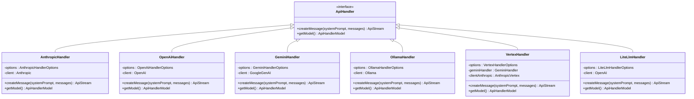

# 核心适配器实现

<cite>
**本文档中引用的文件**  
- [anthropic.ts](file://src/core/api/providers/anthropic.ts)
- [openai.ts](file://src/core/api/providers/openai.ts)
- [gemini.ts](file://src/core/api/providers/gemini.ts)
- [ollama.ts](file://src/core/api/providers/ollama.ts)
- [vertex.ts](file://src/core/api/providers/vertex.ts)
- [litellm.ts](file://src/core/api/providers/litellm.ts)
- [types.ts](file://src/core/api/providers/types.ts)
- [retry.ts](file://src/core/api/retry.ts)
- [index.ts](file://src/core/api/index.ts)
</cite>

## 目录
1. [简介](#简介)
2. [认证机制](#认证机制)
3. [HTTP请求构建](#http请求构建)
4. [错误处理策略](#错误处理策略)
5. [重试逻辑实现](#重试逻辑实现)
6. [与全局API索引模块的集成](#与全局api索引模块的集成)
7. [各提供商适配器详解](#各提供商适配器详解)
8. [设计模式与接口规范](#设计模式与接口规范)

## 简介
本文档深入分析AI提供商核心适配器的实现细节，涵盖`src/core/api/providers`目录下的主要提供商模块，包括Anthropic、OpenAI、Gemini、Ollama、Vertex AI和LiteLLM。文档详细解释了每个适配器的类或函数实现，重点关注认证机制、HTTP请求构建、错误处理、重试逻辑以及与全局API索引模块的集成方式。通过分析这些核心组件，为开发新适配器提供设计指导和实现规范。

## 认证机制
AI提供商适配器的认证机制主要依赖于API密钥进行身份验证，不同提供商采用不同的认证方式。

Anthropic适配器通过`apiKey`参数进行认证，若未提供API密钥则抛出错误。OpenAI适配器同样使用`openAiApiKey`进行认证，并根据配置的`azureApiVersion`或URL特征判断是否为Azure端点，从而选择相应的客户端初始化方式。

Gemini适配器支持两种认证方式：标准API密钥认证和Vertex AI认证。当`isVertex`选项为true时，使用`vertexProjectId`和`vertexRegion`进行Vertex AI认证；否则使用`geminiApiKey`进行标准认证。

Ollama适配器支持通过`ollamaApiKey`进行认证，该密钥作为Bearer令牌包含在请求头中，适用于Ollama云服务或需要认证的实例。

LiteLLM适配器使用`liteLlmApiKey`进行认证，该密钥在请求模型信息和创建聊天补全时作为认证凭据。

**Section sources**
- [anthropic.ts](file://src/core/api/providers/anthropic.ts#L30-L35)
- [openai.ts](file://src/core/api/providers/openai.ts#L45-L55)
- [gemini.ts](file://src/core/api/providers/gemini.ts#L85-L100)
- [ollama.ts](file://src/core/api/providers/ollama.ts#L45-L50)
- [litellm.ts](file://src/core/api/providers/litellm.ts#L40-L45)

## HTTP请求构建
各提供商适配器在构建HTTP请求时，遵循统一的模式但根据提供商的API规范进行特定调整。

Anthropic适配器使用`@anthropic-ai/sdk`库创建客户端，根据配置的`anthropicBaseUrl`设置基础URL。在创建消息时，根据模型ID和功能支持情况构建请求体，包括模型、最大令牌数、温度、系统提示和消息历史等参数。

OpenAI适配器根据是否为Azure端点选择`AzureOpenAI`或`OpenAI`客户端。请求构建时，将Anthropic格式的消息转换为OpenAI格式，并根据模型特性（如Deepseek Reasoner或o1系列模型）应用特定的格式转换。

Gemini适配器使用`@google/genai`库，根据认证方式初始化客户端。请求配置包括系统指令、温度和思考配置（如果支持）。通过`generateContentStream`方法创建流式响应。

Ollama适配器使用`ollama`库，通过`host`配置设置基础URL。请求构建时，将消息转换为Ollama格式，并在选项中设置上下文窗口大小`num_ctx`。

LiteLLM适配器使用`openai`库，但将基础URL指向LiteLLM服务器。请求构建时，支持提示缓存功能，通过`cache_control`字段在系统消息和最后两条用户消息上应用缓存控制。

**Section sources**
- [anthropic.ts](file://src/core/api/providers/anthropic.ts#L60-L200)
- [openai.ts](file://src/core/api/providers/openai.ts#L55-L100)
- [gemini.ts](file://src/core/api/providers/gemini.ts#L120-L180)
- [ollama.ts](file://src/core/api/providers/ollama.ts#L55-L70)
- [litellm.ts](file://src/core/api/providers/litellm.ts#L100-L150)

## 错误处理策略
各适配器实现了针对不同提供商的特定错误处理策略，确保系统稳定性和用户体验。

Anthropic适配器在客户端创建和消息创建过程中捕获错误，并抛出带有描述性消息的Error对象。对于重试错误，使用`RetriableError`类包装，包含状态码和重试后信息。

OpenAI适配器在客户端创建时捕获错误，并在流处理过程中捕获和记录错误，确保不会中断整个处理流程。

Gemini适配器实现了复杂的错误处理机制，特别针对速率限制错误。当收到429状态码时，从响应中解析重试延迟信息，并创建`RetriableError`实例。同时，使用正则表达式模式匹配各种形式的速率限制错误消息，确保能够识别不同格式的限流错误。

Ollama适配器实现了超时机制，通过Promise.race在请求和超时之间进行竞争，防止请求无限期挂起。同时，增强错误报告，记录状态码和错误消息，便于问题诊断。

LiteLLM适配器在获取模型信息时实现了重试机制，当使用x-litellm-api-key头失败时，尝试使用Authorization头进行认证，提高了兼容性。

**Section sources**
- [anthropic.ts](file://src/core/api/providers/anthropic.ts#L35-L40)
- [openai.ts](file://src/core/api/providers/openai.ts#L50-L55)
- [gemini.ts](file://src/core/api/providers/gemini.ts#L250-L300)
- [ollama.ts](file://src/core/api/providers/ollama.ts#L90-L110)
- [litellm.ts](file://src/core/api/providers/litellm.ts#L150-L180)

## 重试逻辑实现
重试逻辑通过`withRetry`装饰器实现，该装饰器定义在`retry.ts`文件中，为所有适配器提供统一的重试机制。

`withRetry`函数接受`RetryOptions`参数，包括最大重试次数、基础延迟、最大延迟和是否重试所有错误。默认配置为3次重试，基础延迟1秒，最大延迟10秒。

重试逻辑首先检查错误是否为速率限制错误（状态码429或`RetriableError`实例），如果是则执行重试。重试延迟从响应头中获取，包括`retry-after`、`x-ratelimit-reset`和`ratelimit-reset`等标准头。如果未找到这些头，则使用指数退避算法计算延迟。

在重试过程中，如果配置了`onRetryAttempt`回调，则在每次重试前调用该回调，便于监控和日志记录。延迟时间通过`setTimeout`实现，确保异步等待。

Gemini适配器在`withRetry`装饰器中配置了更激进的重试策略：4次重试，基础延迟2秒，最大延迟15秒，以应对Google API可能的不稳定性。

**Diagram sources**
- [retry.ts](file://src/core/api/retry.ts#L1-L86)
- [gemini.ts](file://src/core/api/providers/gemini.ts#L150-L160)

**Section sources**
- [retry.ts](file://src/core/api/retry.ts#L1-L86)
- [gemini.ts](file://src/core/api/providers/gemini.ts#L150-L160)

## 与全局API索引模块的集成
适配器与全局API索引模块通过`index.ts`文件中的工厂函数进行集成，实现了统一的接口和灵活的提供商选择。

`createHandlerForProvider`函数作为工厂方法，根据提供的`apiProvider`参数选择并实例化相应的适配器。该函数使用switch语句匹配提供商ID，并传递配置选项创建对应的处理器实例。

`buildApiHandler`函数在创建处理器前进行配置验证，特别是检查思考预算令牌数是否超过模型的最大令牌数，如果超出则自动调整为安全值，防止API错误。

所有适配器实现`ApiHandler`接口，确保统一的方法签名。该接口定义了`createMessage`方法用于创建消息流，以及`getModel`方法获取模型信息。

适配器通过`CommonApiHandlerOptions`接口接收共享选项，如`onRetryAttempt`回调，实现了跨适配器的一致性。

**Diagram sources**
- [index.ts](file://src/core/api/index.ts#L1-L420)
- [anthropic.ts](file://src/core/api/providers/anthropic.ts#L1-L247)
- [openai.ts](file://src/core/api/providers/openai.ts#L1-L141)
- [gemini.ts](file://src/core/api/providers/gemini.ts#L1-L473)
- [ollama.ts](file://src/core/api/providers/ollama.ts#L1-L123)
- [vertex.ts](file://src/core/api/providers/vertex.ts#L1-L279)
- [litellm.ts](file://src/core/api/providers/litellm.ts#L1-L350)

**Section sources**
- [index.ts](file://src/core/api/index.ts#L1-L420)

## 各提供商适配器详解
### Anthropic适配器
Anthropic适配器实现了对Anthropic API的完整支持，包括Claude系列模型的扩展思考功能。适配器通过`ensureClient`方法确保客户端单例，避免重复创建。在创建消息时，根据模型ID和思考预算配置是否启用扩展思考模式。对于支持缓存的模型，通过`cache_control`字段在系统提示和最后两条用户消息上设置临时缓存，优化性能和成本。

**Section sources**
- [anthropic.ts](file://src/core/api/providers/anthropic.ts#L1-L247)

### OpenAI适配器
OpenAI适配器支持标准OpenAI和Azure OpenAI服务。通过`azureApiVersion`或URL特征自动识别Azure端点。适配器实现了消息格式转换，将Anthropic格式的消息转换为OpenAI格式。对于特定模型系列（如o1、o3、o4），使用"developer"角色并禁用温度参数。支持R1格式转换，确保与特定模型的兼容性。

**Section sources**
- [openai.ts](file://src/core/api/providers/openai.ts#L1-L141)

### Gemini适配器
Gemini适配器支持标准Gemini API和Vertex AI上的Gemini模型。实现了详细的成本计算功能，区分输入令牌、输出令牌和缓存读取成本。通过`calculateCost`方法提供精确的费用估算。适配器还实现了性能遥测，记录首令牌时间、总持续时间和吞吐量等指标，便于监控和优化。

**Section sources**
- [gemini.ts](file://src/core/api/providers/gemini.ts#L1-L473)

### Ollama适配器
Ollama适配器提供了对本地Ollama服务的支持。实现了请求超时机制，防止长时间挂起。通过`requestTimeoutMs`选项配置超时时间，默认30秒。适配器支持通过API密钥进行认证，适用于需要安全访问的Ollama实例。在创建消息时，配置`num_ctx`选项以控制上下文窗口大小。

**Section sources**
- [ollama.ts](file://src/core/api/providers/ollama.ts#L1-L123)

### Vertex AI适配器
Vertex AI适配器是一个复合适配器，支持Vertex AI上的Anthropic和Gemini模型。通过`ensureGeminiHandler`和`ensureAnthropicClient`方法分别管理Gemini和Anthropic的客户端实例。根据模型ID判断使用哪个后端：非Claude模型使用GeminiHandler，Claude模型使用AnthropicVertex客户端。这种设计实现了单一接口下的多后端支持。

**Section sources**
- [vertex.ts](file://src/core/api/providers/vertex.ts#L1-L279)

### LiteLLM适配器
LiteLLM适配器作为统一的AI网关，支持多种后端提供商。实现了模型信息缓存，减少对LiteLLM服务器的频繁查询。通过`fetchModelsInfo`方法获取模型详细信息，包括成本和功能支持。适配器支持提示缓存，通过`cache_control`字段优化性能。还实现了会话ID跟踪，便于在LiteLLM层面进行请求关联和分析。

**Section sources**
- [litellm.ts](file://src/core/api/providers/litellm.ts#L1-L350)

## 设计模式与接口规范
### 设计模式
适配器实现中采用了多种设计模式：

**工厂模式**：`createHandlerForProvider`函数作为工厂方法，根据提供商类型创建相应的处理器实例，实现了对象创建的封装和解耦。

**装饰器模式**：`withRetry`装饰器为方法添加重试功能，无需修改方法内部逻辑，实现了关注点分离。

**单例模式**：各适配器通过`ensureClient`方法确保客户端实例的唯一性，避免资源浪费。

**策略模式**：错误处理和重试策略根据不同提供商和错误类型动态选择，提高了系统的灵活性。

### 接口规范
所有适配器遵循统一的接口规范：

**ApiHandler接口**：定义了`createMessage`和`getModel`两个核心方法，确保所有适配器具有相同的方法签名。

**选项接口**：每个适配器定义自己的选项接口，继承`CommonApiHandlerOptions`，实现了共享选项和特定选项的结合。

**流式响应**：`createMessage`方法返回`ApiStream`异步生成器，支持流式处理响应，提高了用户体验。

**错误处理**：统一使用`RetriableError`类表示可重试错误，包含状态码和重试后信息，便于重试逻辑处理。

**配置验证**：在`buildApiHandler`中进行配置验证，特别是令牌数限制检查，防止API调用失败。

这些设计模式和接口规范确保了适配器系统的可扩展性、一致性和可维护性，为添加新的AI提供商支持提供了清晰的指导。

**Section sources**
- [index.ts](file://src/core/api/index.ts#L1-L420)
- [retry.ts](file://src/core/api/retry.ts#L1-L86)
- [types.ts](file://src/core/api/providers/types.ts#L1-L30)