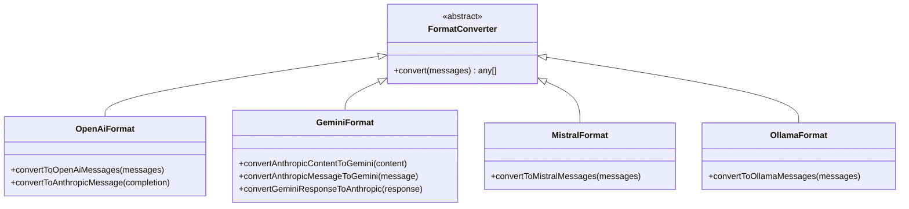

# 多模型AI支持

<cite>
**本文档中引用的文件**  
- [anthropic.ts](file://src/core/api/providers/anthropic.ts)
- [openai.ts](file://src/core/api/providers/openai.ts)
- [gemini.ts](file://src/core/api/providers/gemini.ts)
- [index.ts](file://src/core/api/index.ts)
- [openai-format.ts](file://src/core/api/transform/openai-format.ts)
- [gemini-format.ts](file://src/core/api/transform/gemini-format.ts)
- [mistral-format.ts](file://src/core/api/transform/mistral-format.ts)
- [ollama-format.ts](file://src/core/api/transform/ollama-format.ts)
</cite>

## 目录
1. [简介](#简介)
2. [适配器统一接口机制](#适配器统一接口机制)
3. [请求路由与转换逻辑](#请求路由与转换逻辑)
4. [格式化工具作用](#格式化工具作用)
5. [用户配置与动态切换](#用户配置与动态切换)
6. [配置示例](#配置示例)
7. [故障排除指南](#故障排除指南)
8. [结论](#结论)

## 简介
本系统实现了对多模型AI服务的统一支持，通过标准化接口整合了Anthropic、OpenAI、Gemini等多个AI服务商的API。系统采用适配器模式将不同服务商的API调用统一到一个标准化接口，并通过转换逻辑实现请求和响应的格式转换。用户可以在设置界面配置多个模型提供商，并在运行时动态切换使用。

## 适配器统一接口机制

系统在`src/core/api/providers`目录下为每个AI服务商实现了适配器类，这些适配器都实现了统一的`ApiHandler`接口。适配器负责将标准化的请求转换为特定服务商的API调用格式，并将服务商的响应转换回标准化格式。


**图示来源**
- [anthropic.ts](file://src/core/api/providers/anthropic.ts#L24-L247)
- [openai.ts](file://src/core/api/providers/openai.ts#L34-L140)
- [gemini.ts](file://src/core/api/providers/gemini.ts#L58-L472)

**本节来源**
- [anthropic.ts](file://src/core/api/providers/anthropic.ts#L24-L247)
- [openai.ts](file://src/core/api/providers/openai.ts#L34-L140)
- [gemini.ts](file://src/core/api/providers/gemini.ts#L58-L472)

## 请求路由与转换逻辑

`src/core/api/index.ts`文件中的`buildApiHandler`函数负责根据配置信息路由到相应的适配器。系统通过`createHandlerForProvider`函数根据`apiProvider`配置项选择对应的处理器，并根据当前模式（plan或act）获取相应的模型配置。


**图示来源**
- [index.ts](file://src/core/api/index.ts#L200-L240)

**本节来源**
- [index.ts](file://src/core/api/index.ts#L200-L240)

## 格式化工具作用

`src/core/api/transform`目录下的格式化工具负责在不同AI服务商的API格式之间进行转换。这些工具确保了系统内部使用Anthropic的消息格式，而在与不同服务商通信时能正确转换为相应格式。

### OpenAI格式转换
`openai-format.ts`中的`convertToOpenAiMessages`函数将Anthropic格式的消息转换为OpenAI兼容格式，处理文本、图像和工具调用等不同类型的内容块。


**图示来源**
- [openai-format.ts](file://src/core/api/transform/openai-format.ts#L4-L100)

### Gemini格式转换
`gemini-format.ts`中的`convertAnthropicMessageToGemini`函数将Anthropic格式的消息转换为Gemini API所需的格式，包括角色映射（user→user，assistant→model）和内容块转换。


**图示来源**
- [gemini-format.ts](file://src/core/api/transform/gemini-format.ts#L20-L40)

### 其他格式转换
系统还提供了针对Mistral和Ollama等其他服务商的格式转换工具，确保所有服务商都能通过统一的接口进行通信。



**图示来源**
- [openai-format.ts](file://src/core/api/transform/openai-format.ts)
- [gemini-format.ts](file://src/core/api/transform/gemini-format.ts)
- [mistral-format.ts](file://src/core/api/transform/mistral-format.ts)
- [ollama-format.ts](file://src/core/api/transform/ollama-format.ts)

**本节来源**
- [openai-format.ts](file://src/core/api/transform/openai-format.ts#L4-L210)
- [gemini-format.ts](file://src/core/api/transform/gemini-format.ts#L4-L83)
- [mistral-format.ts](file://src/core/api/transform/mistral-format.ts#L4-L61)
- [ollama-format.ts](file://src/core/api/transform/ollama-format.ts#L4-L109)

## 用户配置与动态切换

用户可以通过设置界面配置多个模型提供商，并在运行时根据需要动态切换。系统支持为"plan"和"act"两种模式分别配置不同的提供商和模型。

### 配置结构
系统使用`ApiConfiguration`接口定义配置结构，包含各个服务商的API密钥、基础URL、模型ID等信息。


### 动态切换机制
系统在运行时根据当前模式和配置动态创建相应的API处理器，实现无缝切换。


**本节来源**
- [index.ts](file://src/core/api/index.ts#L1-L420)
- [webview-ui/src/components/settings/README.md](file://webview-ui/src/components/settings/README.md#L31-L124)

## 配置示例

以下是一个完整的配置示例，展示了如何配置多个AI服务商：

```typescript
const apiConfiguration: ApiConfiguration = {
  // 通用配置
  apiKey: "anthropic-api-key-123",
  onRetryAttempt: (retryCount) => console.log(`Retry attempt: ${retryCount}`),
  
  // OpenAI配置
  openAiApiKey: "openai-api-key-456",
  openAiBaseUrl: "https://api.openai.com/v1",
  planModeOpenAiModelId: "gpt-4o",
  actModeOpenAiModelId: "gpt-4-turbo",
  
  // Gemini配置
  geminiApiKey: "gemini-api-key-789",
  geminiBaseUrl: "https://generativelanguage.googleapis.com/v1beta",
  planModeApiModelId: "gemini-1.5-pro",
  actModeApiModelId: "gemini-1.5-flash",
  
  // 模式特定配置
  planModeApiProvider: "openai",
  actModeApiProvider: "gemini",
  
  // 思考预算配置
  planModeThinkingBudgetTokens: 8192,
  actModeThinkingBudgetTokens: 4096,
}
```

## 故障排除指南

### API密钥无效
当遇到API密钥无效的问题时，请检查以下几点：

1. **密钥格式**：确保密钥没有多余的空格或特殊字符
2. **密钥权限**：确认密钥具有相应的API访问权限
3. **环境变量**：如果使用环境变量，确保已正确加载


### 模型不可用
当指定的模型不可用时，系统会自动回退到默认模型。建议的解决方案包括：

1. **检查模型ID**：确认模型ID拼写正确
2. **查看服务商文档**：确认模型是否在您的区域可用
3. **使用模型选择器**：通过界面选择可用的模型

### 常见错误处理
系统实现了统一的错误处理机制，包括：

- **重试机制**：对于临时性错误自动重试
- **降级策略**：当主要服务商不可用时切换到备用服务商
- **缓存优化**：利用各服务商的缓存机制降低延迟和成本

**本节来源**
- [index.ts](file://src/core/api/index.ts#L200-L240)
- [anthropic.ts](file://src/core/api/providers/anthropic.ts#L100-L150)
- [openai.ts](file://src/core/api/providers/openai.ts#L50-L80)
- [gemini.ts](file://src/core/api/providers/gemini.ts#L300-L350)

## 结论
本系统通过适配器模式和格式转换工具实现了对多模型AI服务的统一支持。核心机制包括：为每个服务商实现统一接口的适配器、通过路由逻辑动态选择处理器、使用格式化工具进行请求响应转换、以及提供用户友好的配置界面。这种设计使得系统能够灵活支持多种AI服务商，并允许用户根据需求动态切换，同时保持代码的可维护性和扩展性。