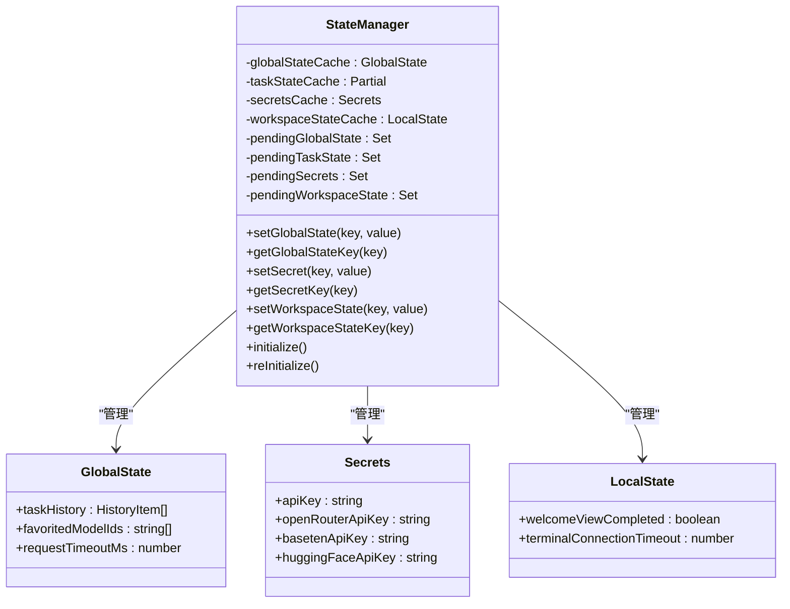

# 后端模型管理

<cite>
**本文档中引用的文件**  
- [refreshOpenAiModels.ts](file://src/core/controller/models/refreshOpenAiModels.ts)
- [refreshHuggingFaceModels.ts](file://src/core/controller/models/refreshHuggingFaceModels.ts)
- [getLmStudioModels.ts](file://src/core/controller/models/getLmStudioModels.ts)
- [StateManager.ts](file://src/core/storage/StateManager.ts)
- [config.ts](file://src/config.ts)
- [refreshBasetenModels.ts](file://src/core/controller/models/refreshBasetenModels.ts)
- [refreshGroqModels.ts](file://src/core/controller/models/refreshGroqModels.ts)
- [refreshOpenRouterModels.ts](file://src/core/controller/models/refreshOpenRouterModels.ts)
- [refreshRequestyModels.ts](file://src/core/controller/models/refreshRequestyModels.ts)
</cite>

## 目录
1. [简介](#简介)
2. [核心模型刷新机制](#核心模型刷新机制)
3. [本地模型服务器交互](#本地模型服务器交互)
4. [模型数据存储与管理](#模型数据存储与管理)
5. [配置管理](#配置管理)
6. [调用流程图](#调用流程图)
7. [性能优化与错误处理](#性能优化与错误处理)
8. [结论](#结论)

## 简介
本文档详细阐述了后端模型管理系统的实现机制，重点分析了不同模型提供商的模型列表获取方式、本地模型服务器交互、模型数据存储管理、配置系统以及整体调用流程。系统通过统一的接口设计实现了对多种模型提供商的支持，并通过状态管理机制确保了数据的一致性和持久性。

## 核心模型刷新机制

### OpenAI 模型刷新
`refreshOpenAiModels` 函数负责从 OpenAI API 获取可用模型列表。该函数接收控制器实例和包含基础 URL 与 API 密钥的请求对象，通过 HTTP GET 请求访问 `/models` 端点获取模型数据。函数首先验证基础 URL 的有效性，然后在请求头中添加授权信息，最后解析响应数据并提取模型 ID 列表。如果请求失败，函数会返回空列表并记录错误信息。

**Section sources**
- [refreshOpenAiModels.ts](file://src/core/controller/models/refreshOpenAiModels.ts#L1-L38)

### Hugging Face 模型刷新
`refreshHuggingFaceModels` 函数实现了从 Hugging Face API 获取模型列表的完整流程。该函数采用多层容错机制：首先尝试从 Hugging Face 路由器 API 获取模型数据，然后将结果转换为 OpenRouter 兼容格式。如果 API 调用失败，系统会尝试从本地缓存加载模型数据。如果缓存也不存在，则使用静态模型作为最终回退方案。

该函数还实现了缓存目录管理，确保缓存文件存储在扩展的全局存储路径中。模型信息包括最大令牌数、上下文窗口、图像支持等属性，并根据静态模型配置进行补充和修正。

**Section sources**
- [refreshHuggingFaceModels.ts](file://src/core/controller/models/refreshHuggingFaceModels.ts#L1-L113)

### 其他模型提供商刷新
系统还支持多种其他模型提供商的刷新功能：

- **Baseten**: `refreshBasetenModels` 函数通过 Baseten 推理 API 获取模型列表，实现了详细的错误处理机制，包括针对不同 HTTP 状态码的特定错误消息。
- **Groq**: `refreshGroqModels` 函数从 Groq 的 OpenAI 兼容 API 获取模型数据，并根据模型名称模式检测图像支持能力。
- **OpenRouter**: `refreshOpenRouterModels` 函数从 OpenRouter API 获取模型列表，并对特定模型（如 Claude 系列）进行特殊处理，包括上下文窗口限制和缓存价格设置。
- **Requesty**: `refreshRequestyModels` 函数通过 Requesty 服务 URL 获取模型数据，并解析价格信息。

这些函数都遵循相似的设计模式：优先尝试实时 API 调用，失败时回退到缓存或静态数据，确保系统在各种网络条件下都能提供可用的模型列表。

**Section sources**
- [refreshBasetenModels.ts](file://src/core/controller/models/refreshBasetenModels.ts#L1-L233)
- [refreshGroqModels.ts](file://src/core/controller/models/refreshGroqModels.ts#L1-L258)
- [refreshOpenRouterModels.ts](file://src/core/controller/models/refreshOpenRouterModels.ts#L1-L284)
- [refreshRequestyModels.ts](file://src/core/controller/models/refreshRequestyModels.ts#L1-L58)

## 本地模型服务器交互

### LM Studio 模型获取
`getLmStudioModels` 函数负责与本地运行的 LM Studio 服务器交互。该函数默认连接到 `http://localhost:1234`，但允许通过请求参数指定自定义基础 URL。函数通过向 `/api/v0/models` 端点发送 HTTP 请求获取可用模型列表，并将响应数据中的模型信息转换为字符串数组返回。

该实现采用了现代化的 Fetch API 而非 Axios，简化了依赖关系。函数同样包含 URL 验证和错误处理机制，确保在服务器不可用或网络问题时能够优雅降级。

**Section sources**
- [getLmStudioModels.ts](file://src/core/controller/models/getLmStudioModels.ts#L1-L28)

## 模型数据存储与管理

### StateManager 架构
`StateManager` 类是系统的核心状态管理组件，采用内存缓存与异步磁盘持久化相结合的设计模式。该类维护了全局状态、任务状态、密钥和工作区状态的内存缓存，提供即时读写访问，同时通过防抖机制异步将更改持久化到磁盘。

**Diagram sources**
- [StateManager.ts](file://src/core/storage/StateManager.ts#L1-L799)

### 持久化机制
系统采用防抖持久化策略，将状态更改延迟 500 毫秒后批量写入磁盘。这种设计平衡了性能和数据安全性，避免了频繁的磁盘 I/O 操作。`scheduleDebouncedPersistence` 方法负责管理防抖定时器，当状态发生变化时重置定时器，确保在短时间内多次状态更改只触发一次持久化操作。

对于任务历史等特殊状态，系统使用独立的 JSON 文件进行存储，并通过 chokidar 文件监视器监听外部更改，确保多实例间的同步。

**Section sources**
- [StateManager.ts](file://src/core/storage/StateManager.ts#L1-L799)

## 配置管理

### 环境配置
`config.ts` 文件定义了系统的环境配置机制，支持生产、预发布和本地三种环境。每种环境都有独立的基础 URL 配置，包括应用基础 URL、API 基础 URL 和 MCP 基础 URL。系统通过 `CLINE_ENVIRONMENT` 环境变量确定当前运行环境，如果没有指定则默认使用生产环境。

**Diagram sources**
- [config.ts](file://src/config.ts#L1-L81)

### 配置结构
系统配置包括：
- **应用基础 URL**: Web 应用的访问地址
- **API 基础 URL**: 核心 API 服务的地址
- **MCP 基础 URL**: MCP 服务的地址
- **Firebase 配置**: 认证和数据库连接信息

这些配置在模块加载时一次性初始化，避免了重复计算和内存占用。

**Section sources**
- [config.ts](file://src/config.ts#L1-L81)

## 调用流程图

### 模型管理调用流程

**Diagram sources**
- [refreshOpenAiModels.ts](file://src/core/controller/models/refreshOpenAiModels.ts#L1-L38)
- [StateManager.ts](file://src/core/storage/StateManager.ts#L1-L799)

## 性能优化与错误处理

### 性能优化策略
1. **内存缓存**: 所有状态读写首先在内存中进行，提供即时响应
2. **防抖持久化**: 状态更改批量写入磁盘，减少 I/O 操作频率
3. **缓存目录**: 模型列表等大型数据存储在专用缓存目录中
4. **文件监视**: 使用 chokidar 监听外部状态更改，避免轮询开销

### 错误处理机制
系统实现了多层次的错误处理策略：

- **API 调用错误**: 针对不同 HTTP 状态码提供具体错误消息，如 401 状态码返回"API 密钥无效"
- **网络错误**: 捕获连接超时和网络中断错误，提示用户检查网络连接
- **降级策略**: API 调用失败时自动回退到缓存数据或静态模型
- **异常捕获**: 所有异步操作都包含 try-catch 块，防止未处理的异常导致系统崩溃

对于 Baseten 和 Groq 等提供商，系统还实现了特定的 API 密钥格式验证，如检查 Groq 密钥是否以"gsk_"开头。

**Section sources**
- [refreshBasetenModels.ts](file://src/core/controller/models/refreshBasetenModels.ts#L1-L233)
- [refreshGroqModels.ts](file://src/core/controller/models/refreshGroqModels.ts#L1-L258)
- [StateManager.ts](file://src/core/storage/StateManager.ts#L1-L799)

## 结论
后端模型管理系统通过统一的接口设计和稳健的状态管理机制，实现了对多种模型提供商的支持。系统采用内存缓存与异步持久化相结合的方式，在保证性能的同时确保数据安全。多层次的错误处理和降级策略使系统在各种网络条件下都能稳定运行。未来可以考虑增加更多模型提供商的支持，以及优化缓存策略以进一步提升性能。