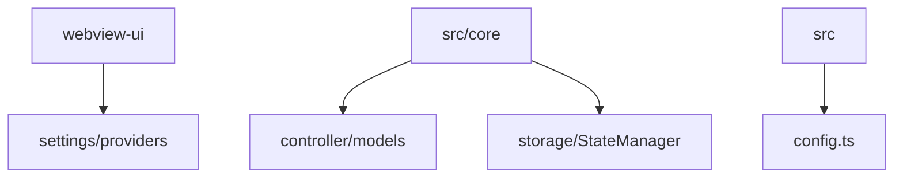
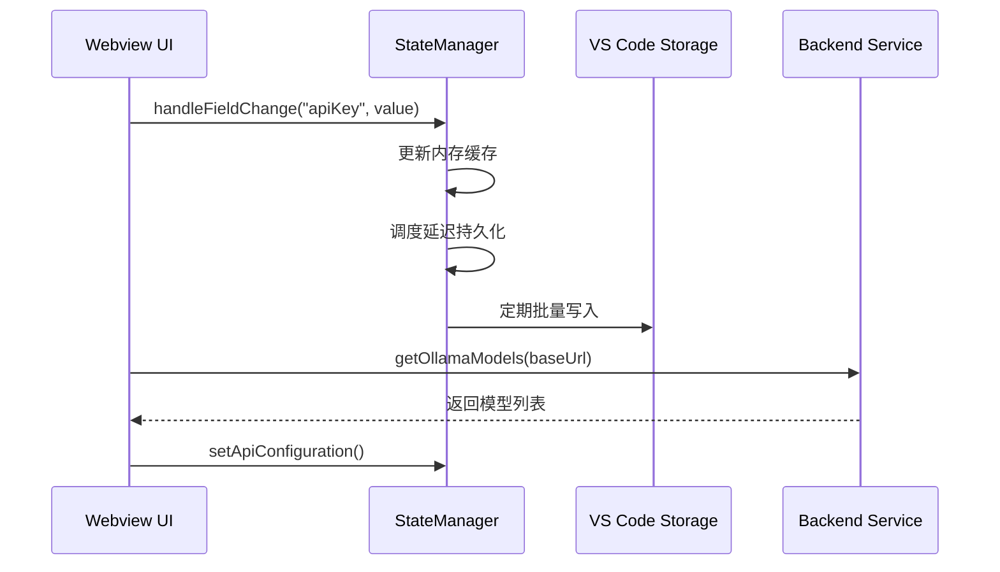
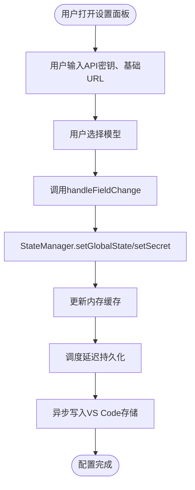
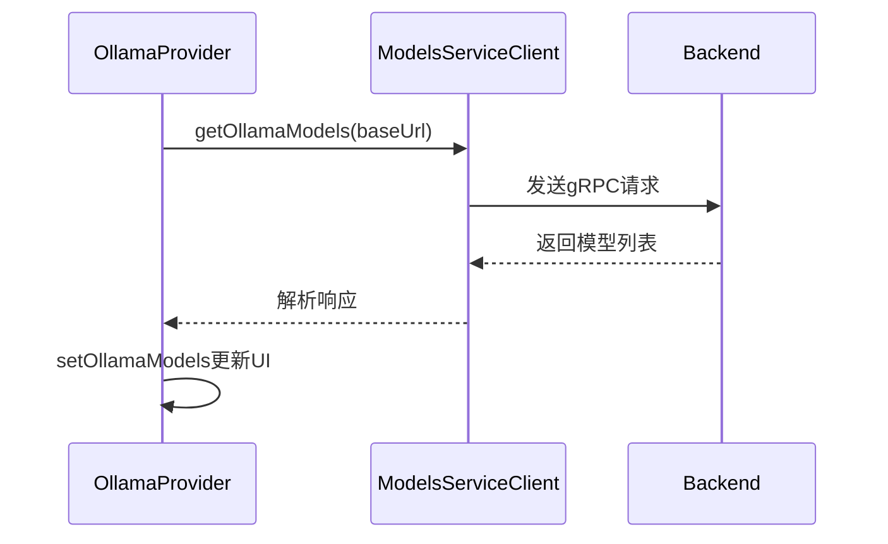
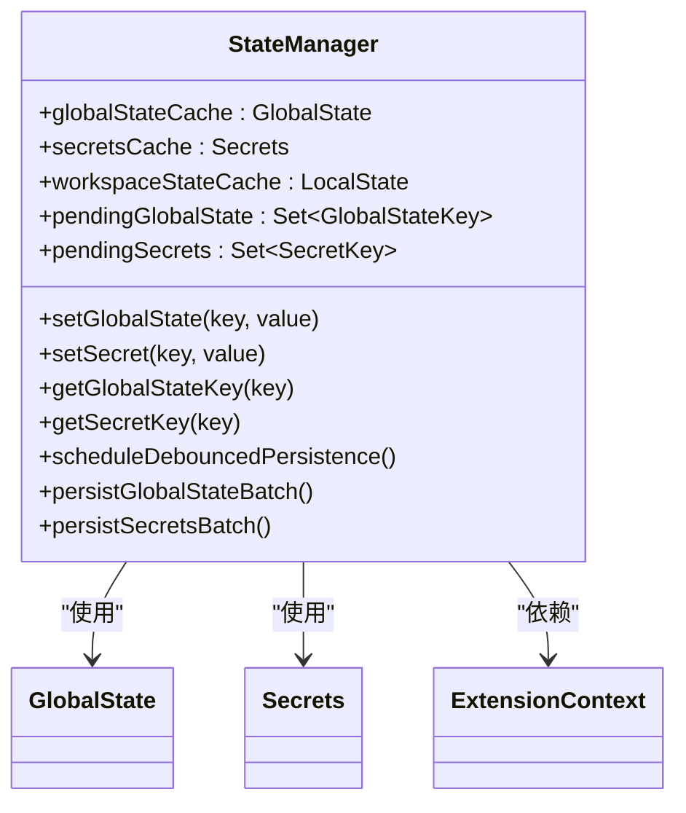
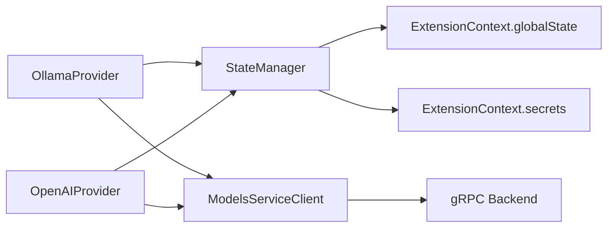

# 模型配置管理

<cite>
**本文档中引用的文件**  
- [OpenAIProvider.tsx](file://webview-ui/src/components/settings/providers/OpenAIProvider.tsx)
- [OllamaProvider.tsx](file://webview-ui/src/components/settings/providers/OllamaProvider.tsx)
- [refreshOpenAiModels.ts](file://src/core/controller/models/refreshOpenAiModels.ts)
- [refreshOllamaModels.ts](file://src/core/controller/models/getOllamaModels.ts)
- [StateManager.ts](file://src/core/storage/StateManager.ts)
- [config.ts](file://src/config.ts)
</cite>

## 目录
1. [简介](#简介)
2. [项目结构](#项目结构)
3. [核心组件](#核心组件)
4. [架构概述](#架构概述)
5. [详细组件分析](#详细组件分析)
6. [依赖分析](#依赖分析)
7. [性能考虑](#性能考虑)
8. [故障排除指南](#故障排除指南)
9. [结论](#结论)

## 简介
本文档详细说明了如何通过Webview UI的设置面板配置多个AI提供商的模型参数，包括API密钥、基础URL和首选模型。文档涵盖配置的持久化机制、默认配置来源以及动态获取模型列表的功能。目标是为用户提供从添加新提供商到在任务中选择特定模型的完整操作流程，并提供常见问题的解决方案。

## 项目结构
模型配置管理功能分布在多个目录中，主要包括Web UI组件、模型刷新逻辑、状态管理与配置定义。

**Diagram sources**
- [webview-ui/src/components/settings/providers](file://webview-ui/src/components/settings/providers)
- [src/core/controller/models](file://src/core/controller/models)
- [src/core/storage/StateManager.ts](file://src/core/storage/StateManager.ts)
- [src/config.ts](file://src/config.ts)

**Section sources**
- [webview-ui/src/components/settings](file://webview-ui/src/components/settings)
- [src/core/controller/models](file://src/core/controller/models)

## 核心组件
核心组件包括用于配置AI提供商的UI组件（如`OpenAIProvider.tsx`、`OllamaProvider.tsx`）、用于动态获取模型列表的控制器函数（如`refreshOpenAiModels.ts`）、负责配置持久化的`StateManager.ts`以及定义默认配置的`config.ts`。

**Section sources**
- [OpenAIProvider.tsx](file://webview-ui/src/components/settings/providers/OpenAIProvider.tsx)
- [OllamaProvider.tsx](file://webview-ui/src/components/settings/providers/OllamaProvider.tsx)
- [refreshOpenAiModels.ts](file://src/core/controller/models/refreshOpenAiModels.ts)
- [StateManager.ts](file://src/core/storage/StateManager.ts)
- [config.ts](file://src/config.ts)

## 架构概述
系统通过Webview UI收集用户输入，利用`StateManager`进行状态的内存缓存与异步持久化，并通过调用后端服务动态获取可用模型列表。配置信息分为全局状态、密钥和工作区状态，分别存储于VS Code的`globalState`、`secrets`和`workspaceState`中。

**Diagram sources**
- [StateManager.ts](file://src/core/storage/StateManager.ts)
- [OllamaProvider.tsx](file://webview-ui/src/components/settings/providers/OllamaProvider.tsx)

## 详细组件分析

### OpenAI与Ollama提供商配置分析
`OpenAIProvider.tsx`和`OllamaProvider.tsx`是Webview UI中的React组件，允许用户配置OpenAI和Ollama提供商的API密钥、基础URL和首选模型。用户输入通过`useApiConfigurationHandlers`钩子处理，最终调用`StateManager`的`setGlobalState`或`setSecret`方法。

**Diagram sources**
- [OpenAIProvider.tsx](file://webview-ui/src/components/settings/providers/OpenAIProvider.tsx)
- [OllamaProvider.tsx](file://webview-ui/src/components/settings/providers/OllamaProvider.tsx)
- [StateManager.ts](file://src/core/storage/StateManager.ts)

### 模型列表动态获取分析
`src/core/controller/models`目录下的`refresh*Models.ts`函数（如`refreshOpenAiModels.ts`、`getOllamaModels.ts`）负责通过gRPC服务调用后端接口，根据用户配置的基础URL动态获取可用模型列表。这些函数被UI组件通过`useEffect`或定时器周期性调用。

**Diagram sources**
- [OllamaProvider.tsx](file://webview-ui/src/components/settings/providers/OllamaProvider.tsx)
- [getOllamaModels.ts](file://src/core/controller/models/getOllamaModels.ts)

### 配置持久化机制分析
`StateManager.ts`是核心状态管理类，采用内存缓存加异步持久化的策略。所有配置读写首先操作内存中的`globalStateCache`、`secretsCache`等对象，然后将变更标记为“待持久化”，通过`setTimeout`进行防抖，最终批量写入VS Code的持久化存储。

**Diagram sources**
- [StateManager.ts](file://src/core/storage/StateManager.ts)
- [state-keys.ts](file://src/core/storage/state-keys.ts)

### 默认配置分析
`config.ts`文件定义了应用运行环境（生产、预发布、本地）及其对应的API基础URL和Firebase配置。这些是应用级别的常量，不涉及用户可配置的AI模型参数。用户模型配置的默认值通常由UI组件的初始状态或`StateManager`的初始化逻辑提供。

**Section sources**
- [config.ts](file://src/config.ts)

## 依赖分析
模型配置管理模块依赖于VS Code的`ExtensionContext`进行存储，依赖于gRPC服务进行模型列表获取，并通过Webview与用户交互。

**Diagram sources**
- [StateManager.ts](file://src/core/storage/StateManager.ts)
- [OllamaProvider.tsx](file://webview-ui/src/components/settings/providers/OllamaProvider.tsx)
- [OpenAIProvider.tsx](file://webview-ui/src/components/settings/providers/OpenAIProvider.tsx)

## 性能考虑
`StateManager`采用防抖（debounce）和批量写入策略，将短时间内多次配置变更合并为一次磁盘I/O操作，显著减少了对VS Code存储API的调用频率，提升了性能和响应速度。模型列表的获取也通过定时器（如每2秒）进行轮询，避免了不必要的频繁请求。

## 故障排除指南
本节解决模型配置中常见的问题。

**Section sources**
- [OllamaProvider.tsx](file://webview-ui/src/components/settings/providers/OllamaProvider.tsx)
- [getOllamaModels.ts](file://src/core/controller/models/getOllamaModels.ts)
- [StateManager.ts](file://src/core/storage/StateManager.ts)

### 问题1：模型列表无法加载
* **症状**：在Ollama设置面板中，显示“无法从Ollama服务器获取模型”。
* **原因**：Ollama服务未运行，或配置的基础URL不正确。
* **解决方案**：
  1. 确保Ollama服务已在本地启动。
  2. 在设置中检查“自定义基础URL”是否正确（默认为`http://localhost:11434`）。
  3. 如果使用云服务，确保已正确配置API密钥。

### 问题2：配置更改后不生效
* **症状**：修改API密钥或模型后，新任务仍使用旧配置。
* **原因**：`StateManager`的持久化是异步的，或存在缓存未及时更新。
* **解决方案**：
  1. 等待几秒钟，让异步持久化完成。
  2. 尝试重启VS Code。
  3. 检查`StateManager`的`onPersistenceError`回调是否被触发，以排查写入失败。

## 结论
模型配置管理系统通过清晰的分层设计，实现了用户友好的配置界面、高效的动态模型发现和可靠的持久化存储。理解`StateManager`的缓存与异步写入机制对于排查配置问题至关重要。遵循本文档的指南，用户可以顺利配置和管理多个AI提供商。