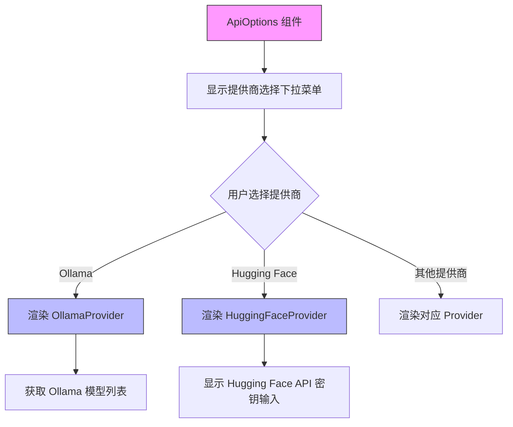
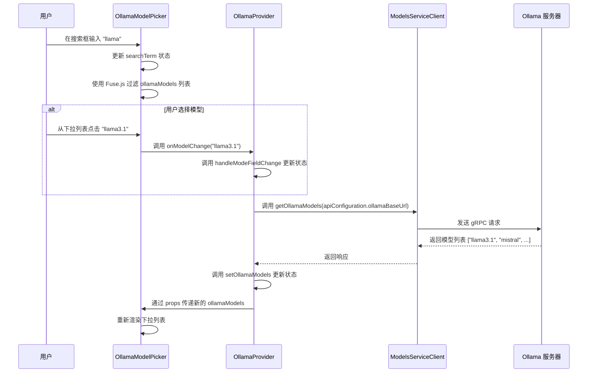

# 用户界面配置

<cite>
**本文档中引用的文件**  
- [ApiOptions.tsx](file://webview-ui/src/components/settings/ApiOptions.tsx)
- [OllamaProvider.tsx](file://webview-ui/src/components/settings/providers/OllamaProvider.tsx)
- [HuggingFaceProvider.tsx](file://webview-ui/src/components/settings/providers/HuggingFaceProvider.tsx)
- [OllamaModelPicker.tsx](file://webview-ui/src/components/settings/OllamaModelPicker.tsx)
</cite>

## 目录
1. [简介](#简介)
2. [核心组件概览](#核心组件概览)
3. [通用配置容器：ApiOptions](#通用配置容器apioptions)
4. [AI提供商配置组件](#ai提供商配置组件)
5. [模型选择器实现：OllamaModelPicker](#模型选择器实现ollamamodelpicker)
6. [用户交互流程与状态管理](#用户交互流程与状态管理)
7. [表单验证与错误处理](#表单验证与错误处理)
8. [常见问题排查](#常见问题排查)
9. [总结](#总结)

## 简介
本文档详细描述了Cline扩展中模型配置用户界面的实现机制。重点分析Webview UI中的设置面板，特别是为不同AI提供商（如OpenAI、Ollama、Hugging Face等）提供统一配置界面的组件。文档将深入探讨`ApiOptions.tsx`作为通用配置容器的作用，`OllamaProvider.tsx`和`HuggingFaceProvider.tsx`等提供商组件的实现细节，以及`OllamaModelPicker.tsx`如何与后端交互以动态获取可用模型列表。同时，本文档将解释表单验证、状态更新和错误处理机制，并提供解决UI层面常见问题的指导。

## 核心组件概览
模型配置UI由多个协同工作的React组件构成，形成一个分层的配置系统。核心组件包括：
- **ApiOptions**: 作为顶级配置容器，管理提供商选择和条件渲染。
- **Provider Components**: 如`OllamaProvider`和`HuggingFaceProvider`，为特定AI服务提供定制化配置界面。
- **ModelPicker Components**: 如`OllamaModelPicker`，提供可搜索、可过滤的模型选择界面。
- **Common Fields**: 通用输入组件，如`ApiKeyField`和`BaseUrlField`，确保UI一致性。

这些组件通过React Context（`ExtensionStateContext`）和自定义Hook（`useApiConfigurationHandlers`）共享应用状态和处理配置变更。

**Section sources**
- [ApiOptions.tsx](file://webview-ui/src/components/settings/ApiOptions.tsx)
- [OllamaProvider.tsx](file://webview-ui/src/components/settings/providers/OllamaProvider.tsx)

## 通用配置容器：ApiOptions
`ApiOptions.tsx`是整个配置面板的核心控制器。它负责：
1.  **提供商选择**: 提供一个可搜索的下拉菜单，允许用户从支持的AI提供商列表中进行选择。
2.  **条件渲染**: 根据用户选择的提供商，动态渲染对应的配置组件（如`OllamaProvider`或`HuggingFaceProvider`）。
3.  **状态管理**: 通过`useExtensionState` Hook访问全局配置状态，并通过`useApiConfigurationHandlers` Hook获取状态更新函数。

该组件使用`Fuse.js`库实现高效的模糊搜索，提升用户体验。当用户在搜索框中输入时，列表会实时过滤。选择新的提供商后，`handleModeFieldChange`函数会更新`apiConfiguration`中的`selectedProvider`字段，触发UI重新渲染。

**Diagram sources**
- [ApiOptions.tsx](file://webview-ui/src/components/settings/ApiOptions.tsx)

**Section sources**
- [ApiOptions.tsx](file://webview-ui/src/components/settings/ApiOptions.tsx)

## AI提供商配置组件
### OllamaProvider 分析
`OllamaProvider.tsx`为本地Ollama服务提供完整的配置界面。其主要功能包括：

- **基础URL设置**: 允许用户指定Ollama服务器的自定义地址，默认为`http://localhost:11434`。
- **API密钥输入**: 为需要认证的Ollama实例或云服务提供可选的API密钥输入。
- **动态模型选择**: 通过`OllamaModelPicker`组件，从Ollama服务器获取并展示可用的模型列表。
- **上下文窗口配置**: 允许用户设置模型的上下文窗口大小。
- **请求超时设置**: 配置API请求的最大等待时间。

该组件通过`useInterval` Hook每2秒轮询一次`ModelsServiceClient.getOllamaModels`，确保模型列表的实时性。如果无法获取模型列表，会显示相应的错误提示。

**Section sources**
- [OllamaProvider.tsx](file://webview-ui/src/components/settings/providers/OllamaProvider.tsx)

### HuggingFaceProvider 分析
`HuggingFaceProvider.tsx`为Hugging Face Inference API提供配置。其功能相对简洁：

- **API密钥输入**: 要求用户输入Hugging Face API密钥，用于身份验证。
- **模型选择器**: 当`showModelOptions`为真时，显示`HuggingFaceModelPicker`以选择具体模型。

该组件强调了密钥的本地存储属性，并提供了获取API密钥的链接。它依赖于`normalizeApiConfiguration`工具函数来确定当前选中的模型ID。

**Section sources**
- [HuggingFaceProvider.tsx](file://webview-ui/src/components/settings/providers/HuggingFaceProvider.tsx)

## 模型选择器实现：OllamaModelPicker
`OllamaModelPicker.tsx`是一个独立的、可复用的UI组件，用于选择Ollama模型。其关键特性如下：

- **实时搜索**: 使用`Fuse.js`对模型ID列表进行模糊搜索，支持高亮匹配项。
- **键盘导航**: 支持使用方向键和回车键进行选择，提升可访问性。
- **状态同步**: 组件的内部搜索状态（`searchTerm`）与外部传入的`selectedModelId`保持同步。当外部状态变化时，搜索框内容会自动更新。
- **防抖与性能**: 使用`React.memo`进行性能优化，避免不必要的重渲染。

该组件通过`onModelChange`回调函数将用户的选择通知父组件（如`OllamaProvider`），从而更新全局配置状态。

**Diagram sources**
- [OllamaModelPicker.tsx](file://webview-ui/src/components/settings/OllamaModelPicker.tsx)
- [OllamaProvider.tsx](file://webview-ui/src/components/settings/providers/OllamaProvider.tsx)

**Section sources**
- [OllamaModelPicker.tsx](file://webview-ui/src/components/settings/OllamaModelPicker.tsx)

## 用户交互流程与状态管理
配置面板的用户交互流程如下：
1.  用户打开设置面板。
2.  在`ApiOptions`中选择一个AI提供商（如Ollama）。
3.  对应的提供商组件（`OllamaProvider`）被渲染。
4.  `OllamaProvider`立即调用`getOllamaModels`从后端获取模型列表。
5.  用户在`OllamaModelPicker`中搜索并选择一个模型。
6.  选择事件通过回调函数传递，最终调用`handleFieldChange`或`handleModeFieldChange`更新`apiConfiguration`状态。
7.  状态更新后，UI重新渲染以反映新配置。

状态管理通过`ExtensionStateContext`实现，确保配置数据在不同组件间一致。`useApiConfigurationHandlers` Hook封装了状态更新的逻辑，使组件无需直接操作复杂的状态结构。

**Section sources**
- [ApiOptions.tsx](file://webview-ui/src/components/settings/ApiOptions.tsx)
- [OllamaProvider.tsx](file://webview-ui/src/components/settings/providers/OllamaProvider.tsx)
- [useApiConfigurationHandlers.ts](file://webview-ui/src/components/settings/utils/useApiConfigurationHandlers.ts)

## 表单验证与错误处理
该UI系统实现了多层次的验证和错误处理：
- **客户端验证**: `DebouncedTextField`等输入组件在值变化时进行基本验证（如将字符串转换为数字）。
- **错误消息显示**: `ApiOptions`组件接受`apiErrorMessage`和`modelIdErrorMessage`作为props，并在相应位置显示错误信息。
- **后端错误处理**: 在调用`getOllamaModels`等异步操作时，使用`try-catch`捕获错误，并在控制台记录错误信息，同时将模型列表置为空。
- **状态降级**: 当无法获取模型列表时，`OllamaProvider`会显示友好的提示信息，引导用户检查Ollama服务状态或手动输入模型ID。

这种设计确保了即使后端服务暂时不可用，UI也能保持可用性，并为用户提供清晰的故障排除指引。

**Section sources**
- [ApiOptions.tsx](file://webview-ui/src/components/settings/ApiOptions.tsx)
- [OllamaProvider.tsx](file://webview-ui/src/components/settings/providers/OllamaProvider.tsx)

## 常见问题排查
### 配置项不显示
- **原因**: 可能是`apiConfiguration`状态未正确初始化，或`useExtensionState`未能正确获取上下文。
- **解决**: 检查`ExtensionStateContext`的Provider是否在组件树的更高层级被正确包裹。

### 保存后配置立即重置
- **原因**: 状态更新函数（`handleFieldChange`）可能未正确执行，或更新后的状态未被持久化。
- **解决**: 检查`useApiConfigurationHandlers`返回的函数是否正确地调用了底层的状态管理服务（如`updateApiConfigurationProto`）。

### Ollama模型列表为空
- **原因**: Ollama服务未运行，或`ollamaBaseUrl`配置错误。
- **解决**: 确认Ollama服务正在运行，并检查基础URL是否正确。查看浏览器开发者工具的网络和控制台标签页，确认`getOllamaModels`请求是否成功。

### 搜索功能无响应
- **原因**: `Fuse.js`库可能未正确加载，或搜索项数据为空。
- **解决**: 确保`ollamaModels`或`providerOptions`数组已正确传递给组件。

**Section sources**
- [ApiOptions.tsx](file://webview-ui/src/components/settings/ApiOptions.tsx)
- [OllamaProvider.tsx](file://webview-ui/src/components/settings/providers/OllamaProvider.tsx)

## 总结
Cline的模型配置UI通过模块化和分层的设计，为多种AI提供商提供了统一且灵活的配置体验。`ApiOptions`作为中央控制器，实现了提供商的动态切换；各个`Provider`组件则针对特定服务提供了定制化的配置选项；而`OllamaModelPicker`等通用组件确保了UI的一致性和可复用性。通过React Context和自定义Hook，系统实现了高效的状态管理和数据流。该设计不仅提升了用户体验，也为未来支持更多AI提供商奠定了坚实的基础。