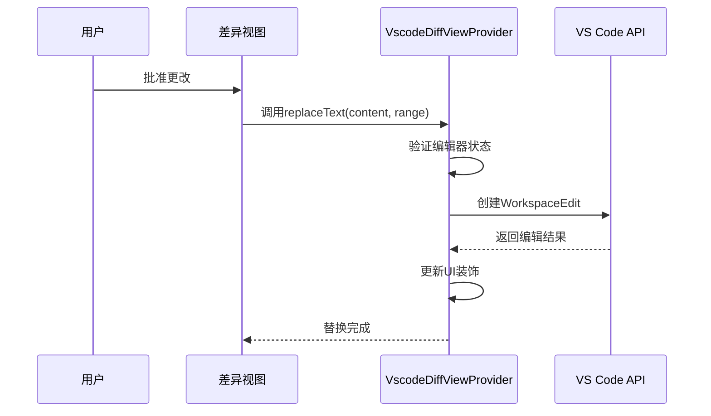
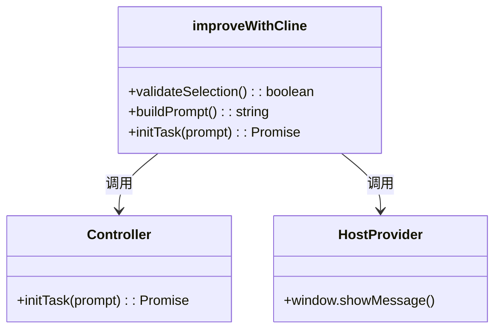

# 变更应用与确认

<cite>
**本文档中引用的文件**
- [improveWithCline.ts](file://src/core/controller/commands/improveWithCline.ts)
- [VscodeDiffViewProvider.ts](file://src/hosts/vscode/VscodeDiffViewProvider.ts)
- [diff.ts](file://src/core/assistant-message/diff.ts)
- [fs.ts](file://src/utils/fs.ts)
</cite>

## 目录
1. [简介](#简介)
2. [核心流程概述](#核心流程概述)
3. [用户确认后的变更应用](#用户确认后的变更应用)
4. [文件内容修改机制](#文件内容修改机制)
5. [变更持久化](#变更持久化)
6. [协调命令分析](#协调命令分析)
7. [关键错误处理场景](#关键错误处理场景)
8. [最佳实践](#最佳实践)

## 简介
本文档深入解析在差异视图中用户批准更改后，系统如何精确地应用变更。重点分析从用户确认到文件内容修改、持久化存储的完整生命周期，涵盖`replaceText`、`saveDocument`等核心函数的工作机制，以及`improveWithCline`命令作为协调者的角色。同时，详细说明系统如何处理文件冲突和写入失败等关键错误场景，并提供确保数据一致性和原子性的最佳实践。

## 核心流程概述
当用户在差异视图中批准由AI生成的代码改进建议时，系统启动一个精确的变更应用流程。该流程始于用户交互，通过特定的命令触发任务，利用复杂的文本替换算法修改文件内容，并最终将更改安全地持久化到磁盘。整个过程由`improveWithCline`等命令协调，确保了从任务执行、差异展示到变更应用的无缝衔接。

**Section sources**
- [improveWithCline.ts](file://src/core/controller/commands/improveWithCline.ts)

## 用户确认后的变更应用
一旦用户在差异视图中确认了更改，系统便进入变更应用阶段。此阶段的核心是将AI生成的差异（diff）精确地应用到目标文件上。系统通过`VscodeDiffViewProvider`类提供的`replaceText`方法来实现这一功能。该方法接收新的文本内容、需要替换的行范围以及当前光标行等参数，然后在VS Code编辑器中执行替换操作。



**Diagram sources**
- [VscodeDiffViewProvider.ts](file://src/hosts/vscode/VscodeDiffViewProvider.ts#L90-L114)

**Section sources**
- [VscodeDiffViewProvider.ts](file://src/hosts/vscode/VscodeDiffViewProvider.ts#L90-L114)

## 文件内容修改机制
`replaceText`函数是实现精确文本替换的关键。它首先检查当前差异编辑器（diff editor）是否处于活动状态，以防止用户在操作过程中关闭了编辑器。随后，它会将光标移动到文档开头，避免干扰流式动画。核心的替换操作通过VS Code的`WorkspaceEdit` API完成：创建一个编辑对象，定义一个从起始行到结束行的范围（列位置为0），并将该范围内的内容替换为新的文本。此过程确保了替换的原子性，即要么全部成功，要么全部失败。

**Section sources**
- [VscodeDiffViewProvider.ts](file://src/hosts/vscode/VscodeDiffViewProvider.ts#L90-L114)

## 变更持久化
在内存中的文本被成功修改后，必须将其持久化到磁盘。这一任务由`saveDocument`方法完成。该方法首先检查差异编辑器是否存在以及文档是否已被修改（`isDirty`）。只有当文档确实有未保存的更改时，才会调用`document.save()`方法。此设计避免了不必要的I/O操作，提高了效率。`saveDocument`的成功执行标志着变更已安全地写入文件系统。

```mermaid
flowchart TD
A[开始保存] --> B{编辑器存在?}
B --> |否| C[返回 false]
B --> |是| D{文档已修改?}
D --> |否| C[返回 false]
D --> |是| E[调用 document.save()]
E --> F[等待保存完成]
F --> G[返回 true]
```

**Diagram sources**
- [VscodeDiffViewProvider.ts](file://src/hosts/vscode/VscodeDiffViewProvider.ts#L161-L170)

**Section sources**
- [VscodeDiffViewProvider.ts](file://src/hosts/vscode/VscodeDiffViewProvider.ts#L161-L170)

## 协调命令分析
`improveWithCline`命令是整个代码改进流程的协调者。当用户选择一段代码并执行此命令时，它首先验证选中的文本是否非空。如果有效，它会构建一个包含所选代码的提示（prompt），并调用`controller.initTask(prompt)`来初始化一个新的任务。这个任务会触发AI模型生成改进建议，最终以差异的形式展示给用户。因此，`improveWithCline`不仅启动了任务，还管理了从用户请求到AI响应再到差异展示的整个生命周期。



**Diagram sources**
- [improveWithCline.ts](file://src/core/controller/commands/improveWithCline.ts#L7-L24)

**Section sources**
- [improveWithCline.ts](file://src/core/controller/commands/improveWithCline.ts#L7-L24)

## 关键错误处理场景
系统在变更应用过程中会遇到多种错误情况，其中两个最关键的场景是文件冲突和磁盘写入失败。

1.  **文件外部修改（冲突）**: 如果在用户批准更改后、保存之前，目标文件被其他进程（如另一个编辑器或Git操作）修改，VS Code的`document.save()`方法会检测到文件版本不一致，并可能抛出异常或触发冲突解决对话框。这确保了不会意外覆盖其他来源的更改。
2.  **磁盘写入失败**: 这种情况可能由多种原因引起，例如磁盘空间不足、权限不足或文件被锁定。`writeFile`工具函数在`src/utils/fs.ts`中处理底层的文件写入，它会捕获`fs.writeFile`可能抛出的任何I/O错误。虽然`saveDocument`方法本身没有显式处理异常，但VS Code的API通常会处理这类底层错误，并向用户显示相应的错误消息。

**Section sources**
- [VscodeDiffViewProvider.ts](file://src/hosts/vscode/VscodeDiffViewProvider.ts#L161-L170)
- [fs.ts](file://src/utils/fs.ts#L81-L106)

## 最佳实践
为了确保变更应用的原子性和数据一致性，应遵循以下最佳实践：

1.  **利用编辑器的事务机制**: `WorkspaceEdit`和`document.save()`是原子操作，应依赖这些机制来保证更改的完整性，避免手动分步写入。
2.  **检查文件状态**: 在执行任何写入操作前，始终检查文件是否仍然存在且可访问，以应对文件被删除或移动的情况。
3.  **优雅处理冲突**: 设计用户界面以清晰地提示文件冲突，并提供合并选项，而不是静默失败。
4.  **日志记录**: 对关键的I/O操作（如文件读写）进行日志记录，以便于调试和追踪问题。
5.  **权限验证**: 在写入文件前，验证应用是否有足够的权限，尤其是在处理系统文件或受保护目录时。

遵循这些实践可以最大限度地减少数据丢失和损坏的风险，确保用户体验的可靠性和安全性。