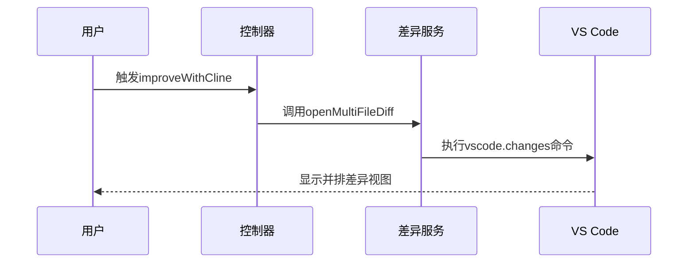
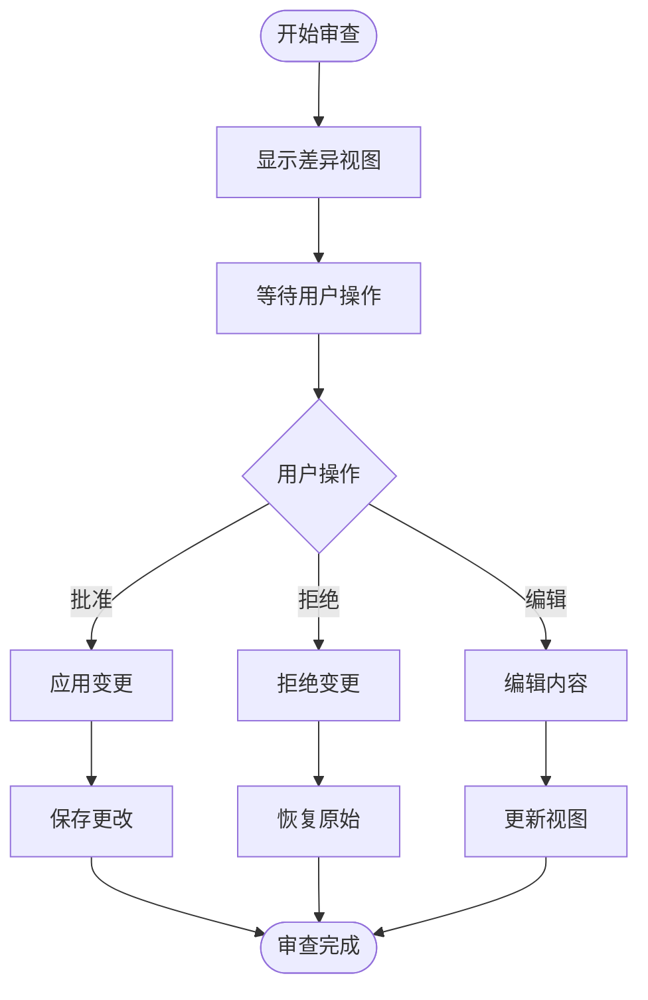
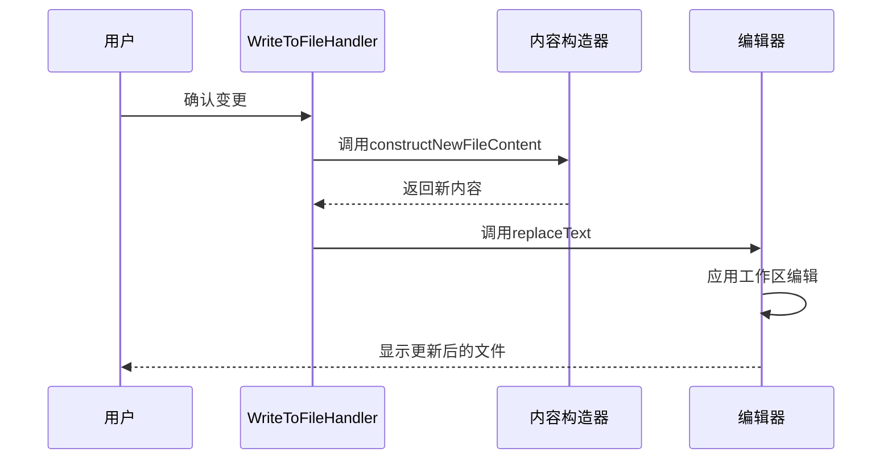
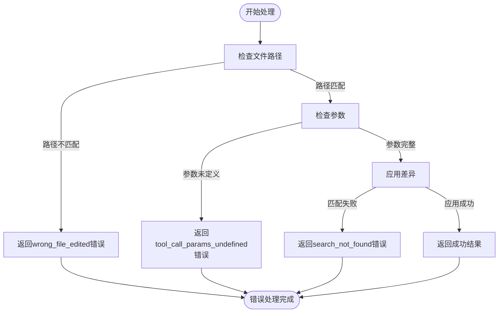

# 差异审查工作流

<cite>
**本文档引用的文件**  
- [openMultiFileDiff.ts](file://src/hosts/vscode/hostbridge/diff/openMultiFileDiff.ts)
- [VscodeDiffViewProvider.ts](file://src/hosts/vscode/VscodeDiffViewProvider.ts)
- [ExternalDiffviewProvider.ts](file://src/hosts/external/ExternalDiffviewProvider.ts)
- [improveWithCline.ts](file://src/core/controller/commands/improveWithCline.ts)
- [diff.ts](file://src/core/assistant-message/diff.ts)
- [WriteToFileToolHandler.ts](file://src/core/task/tools/handlers/WriteToFileToolHandler.ts)
- [multifile-diff.ts](file://src/core/task/multifile-diff.ts)
- [ClineWrapper.ts](file://evals/diff-edits/ClineWrapper.ts)
</cite>

## 目录
1. [简介](#简介)
2. [差异审查工作流概述](#差异审查工作流概述)
3. [并排差异视图创建](#并排差异视图创建)
4. [用户交互机制](#用户交互机制)
5. [变更应用流程](#变更应用流程)
6. [错误处理场景](#错误处理场景)
7. [性能优化策略](#性能优化策略)
8. [结论](#结论)

## 简介
差异审查工作流是系统中用于可视化和管理代码变更的核心功能。该工作流从`openMultiFileDiff`调用开始，通过创建并排的差异视图来展示原始文件与建议更改之间的对比。用户可以逐块批准或拒绝更改，并编辑建议内容。当用户确认后，`replaceText`函数将应用变更，而`improveWithCline`命令协调整个审查流程。本文档将深入剖析这一完整工作流程，包括错误处理和性能优化策略。

## 差异审查工作流概述
差异审查工作流始于用户选择代码并触发`improveWithCline`命令。该命令初始化任务并生成改进提示，随后系统解析助手消息以提取工具调用。如果检测到`replace_in_file`工具调用，则进入差异编辑流程。系统使用`constructNewFileContent`函数处理差异内容，并通过`openMultiFileDiff`创建并排视图供用户审查。用户可以通过批准/拒绝机制控制变更应用，最终通过`replaceText`实现持久化更改。

**Section sources**
- [improveWithCline.ts](file://src/core/controller/commands/improveWithCline.ts#L7-L24)
- [ClineWrapper.ts](file://evals/diff-edits/ClineWrapper.ts#L237-L351)

## 并排差异视图创建
并排差异视图的创建由`openMultiFileDiff`函数负责。该函数接收包含标题和差异信息的请求，使用VS Code的`vscode.changes`命令创建差异视图。每个差异项包含文件路径、左侧内容（原始）和右侧内容（更改后），通过自定义URI方案`cline-diff`传递编码后的内容。

**Diagram sources**
- [openMultiFileDiff.ts](file://src/hosts/vscode/hostbridge/diff/openMultiFileDiff.ts#L6-L29)
- [VscodeDiffViewProvider.ts](file://src/hosts/vscode/VscodeDiffViewProvider.ts#L0-L195)

## 用户交互机制
用户交互机制允许用户逐块审查和控制代码变更。系统提供批准/拒绝按钮，用户可以接受或拒绝特定更改块。此外，用户可以直接在差异视图中编辑建议内容。`VscodeDiffViewProvider`管理差异编辑器的状态，处理文本替换和滚动动画，确保流畅的用户体验。

**Diagram sources**
- [VscodeDiffViewProvider.ts](file://src/hosts/vscode/VscodeDiffViewProvider.ts#L90-L114)
- [ExternalDiffviewProvider.ts](file://src/hosts/external/ExternalDiffviewProvider.ts#L18-L32)

## 变更应用流程
变更应用流程由`replaceText`函数实现，该函数在用户确认后将更改应用到文件。对于VS Code环境，`VscodeDiffViewProvider`直接操作工作区编辑，而对于外部环境则通过`HostProvider`代理调用。`WriteToFileToolHandler`负责验证和准备文件操作，使用`constructNewFileContent`根据差异或直接内容构建新文件内容。

**Diagram sources**
- [WriteToFileToolHandler.ts](file://src/core/task/tools/handlers/WriteToFileToolHandler.ts#L347-L370)
- [diff.ts](file://src/core/assistant-message/diff.ts#L226-L244)

## 错误处理场景
系统实现了全面的错误处理机制。当搜索块无法匹配时，会抛出"does not match anything"错误。对于格式错误的差异，系统会捕获并报告具体错误类型。`WriteToFileToolHandler`中的异常处理确保在错误发生时恢复差异视图状态，防止数据丢失。此外，文件路径不匹配和参数未定义等场景都有相应的错误处理逻辑。

**Diagram sources**
- [ClineWrapper.ts](file://evals/diff-edits/ClineWrapper.ts#L281-L350)
- [diff.ts](file://src/core/assistant-message/diff.test.ts#L0-L80)

## 性能优化策略
系统采用多种性能优化策略。`constructNewFileContent`函数支持增量输出，允许在找到匹配位置后立即追加替换行，实现部分更新的实时查看。系统使用版本映射机制选择合适的文件内容构造器，确保兼容性和性能。此外，通过`setTimeoutPromise`引入人工延迟，让诊断服务有足够时间跟上变更，避免竞争条件。

**Section sources**
- [diff.ts](file://src/core/assistant-message/diff.ts#L226-L244)
- [WriteToFileToolHandler.ts](file://src/core/task/tools/handlers/WriteToFileToolHandler.ts#L146-L180)

## 结论
差异审查工作流通过`openMultiFileDiff`创建并排视图，结合`replaceText`实现变更应用，由`improveWithCline`协调整个流程。系统提供了完善的用户交互机制，包括逐块批准/拒绝和内容编辑功能。通过多层次的错误处理和性能优化策略，确保了审查过程的可靠性和效率。该工作流为代码改进和协作审查提供了强大而直观的工具支持。