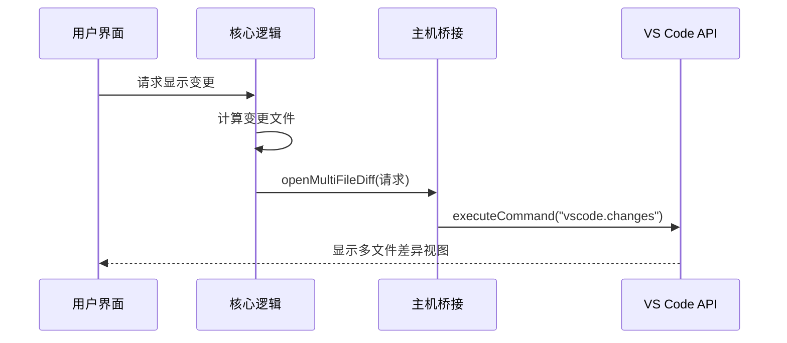

# 差异预览机制

<cite>
**本文档中引用的文件**  
- [VscodeDiffViewProvider.ts](file://src/hosts/vscode/VscodeDiffViewProvider.ts)
- [diff.proto](file://proto/host/diff.proto)
- [multifile-diff.ts](file://src/core/task/multifile-diff.ts)
- [openMultiFileDiff.ts](file://src/hosts/vscode/hostbridge/diff/openMultiFileDiff.ts)
</cite>

## 目录
1. [简介](#简介)
2. [核心组件与协议结构](#核心组件与协议结构)
3. [多文件差异预览的实现流程](#多文件差异预览的实现流程)
4. [VscodeDiffViewProvider 与 VS Code 集成机制](#vscodeDiffViewProvider-与-vs-code-集成机制)
5. [用户界面展示与交互功能](#用户界面展示与交互功能)
6. [实际代码调用示例](#实际代码调用示例)
7. [性能考量与优化策略](#性能考量与优化策略)
8. [结论](#结论)

## 简介
本文档详细阐述了 Cline 扩展中差异预览功能的实现机制。重点分析了 `openMultiFileDiff` 如何基于 `diff.proto` 中定义的协议结构创建多文件差异视图，包括文件内容获取、差异块计算与高亮显示。同时描述了 `VscodeDiffViewProvider` 如何与 VS Code 原生差异查看器集成，支持并排（side-by-side）和内联（inline）对比模式。文档还说明了用户界面如何展示代码增删改，并支持导航与上下文查看，最后讨论了在处理大型文件或大量更改时的性能优化策略。

## 核心组件与协议结构

### diff.proto 协议定义
`diff.proto` 文件定义了差异服务的核心接口和数据结构，是跨平台通信的基础。其中关键消息包括：

- **OpenMultiFileDiffRequest**：包含标题和多个 `ContentDiff` 对象的列表。
- **ContentDiff**：表示单个文件的左右内容对比，包含文件路径、左侧内容（原内容）和右侧内容（新内容）。

该协议通过 gRPC 实现跨进程通信，确保前端 UI 与核心逻辑解耦。

**Section sources**
- [diff.proto](file://proto/host/diff.proto#L1-L108)

## 多文件差异预览的实现流程

### 数据准备阶段
`showChangedFilesDiff` 函数负责准备差异预览所需的数据。它首先根据消息时间戳定位到特定任务执行点，然后通过 `CheckpointTracker` 获取自上次检查点以来所有变更的文件列表。

对于每个变更文件，系统会提取其变更前（`before`）和变更后（`after`）的内容，构建成 `ContentDiff` 结构体数组。此过程支持两种模式：
- 自上次任务完成以来的变更
- 自指定检查点以来的变更

### 差异视图触发
准备好数据后，调用 `HostProvider.diff.openMultiFileDiff` 方法，将包含标题和差异内容的请求对象发送至主机桥接层。


**Diagram sources**
- [multifile-diff.ts](file://src/core/task/multifile-diff.ts#L0-L121)

**Section sources**
- [multifile-diff.ts](file://src/core/task/multifile-diff.ts#L0-L121)

## VscodeDiffViewProvider 与 VS Code 集成机制

### 自定义 URI 方案
`VscodeDiffViewProvider` 使用自定义 URI 方案 `cline-diff` 来提供虚拟文件内容。当需要显示原始内容时，系统将内容编码为 Base64 并附加到查询参数中，例如：

```
cline-diff:/relative/path?base64EncodedContent
```

这种方式避免了临时文件的创建，提升了安全性和性能。

### 与原生差异查看器集成
通过调用 VS Code 的 `vscode.diff` 命令，系统可以无缝集成原生差异查看功能。左侧使用自定义 URI 提供原始内容，右侧指向实际文件路径，从而实现并排对比。

对于多文件场景，使用 `vscode.changes` 命令批量打开多个差异视图，统一以指定标题组织。



**Diagram sources**
- [openMultiFileDiff.ts](file://src/hosts/vscode/hostbridge/diff/openMultiFileDiff.ts#L0-L29)
- [VscodeDiffViewProvider.ts](file://src/hosts/vscode/VscodeDiffViewProvider.ts#L0-L195)

**Section sources**
- [openMultiFileDiff.ts](file://src/hosts/vscode/hostbridge/diff/openMultiFileDiff.ts#L0-L29)
- [VscodeDiffViewProvider.ts](file://src/hosts/vscode/VscodeDiffViewProvider.ts#L0-L195)

## 用户界面展示与交互功能

### 差异高亮与语法着色
得益于 VS Code 原生差异查看器，系统自动提供行级和字符级差异高亮。添加的代码以绿色背景显示，删除的代码以红色背景显示，修改部分则清晰标注变化区域。

语法着色根据文件类型自动应用，确保代码可读性。

### 导航与上下文查看
用户可通过以下方式与差异视图交互：
- 点击文件列表快速跳转到特定文件的差异
- 使用滚动条或导航按钮浏览长文件
- 在差异编辑器中直接编辑右侧内容（可保存回原文件）
- 查看完整的上下文以理解变更影响

系统还提供了装饰器（DecorationController）用于动态标记活动行和淡出区域，增强视觉引导。

**Section sources**
- [VscodeDiffViewProvider.ts](file://src/hosts/vscode/VscodeDiffViewProvider.ts#L0-L195)

## 实际代码调用示例

### 触发多文件差异预览
```typescript
HostProvider.diff.openMultiFileDiff({
  title: "本次任务变更",
  diffs: [
    {
      filePath: "/project/src/index.ts",
      leftContent: "旧版本代码内容",
      rightContent: "新版本代码内容"
    },
    {
      filePath: "/project/src/utils.ts",
      leftContent: "旧版本工具函数",
      rightContent: "重构后的工具函数"
    }
  ]
});
```

### 配置选项
可通过设置标题来自定义差异视图的显示名称。内容应为完整文件内容而非补丁片段，以保证语法解析准确性。

**Section sources**
- [multifile-diff.ts](file://src/core/task/multifile-diff.ts#L0-L121)
- [openMultiFileDiff.ts](file://src/hosts/vscode/hostbridge/diff/openMultiFileDiff.ts#L0-L29)

## 性能考量与优化策略

### 大型文件处理
对于大型文件，系统采用流式处理策略：
- 按需加载内容块
- 延迟语法高亮计算
- 分阶段渲染差异块

### 大量更改优化
当涉及大量文件变更时：
- 批量操作减少 UI 更新次数
- 异步处理避免界面冻结
- 虚拟滚动技术提升渲染效率

### 内存管理
通过虚拟 URI 方案避免创建物理临时文件，减少磁盘 I/O。所有内容保留在内存中并通过 Base64 编码传输，确保快速访问同时控制内存占用。

**Section sources**
- [VscodeDiffViewProvider.ts](file://src/hosts/vscode/VscodeDiffViewProvider.ts#L0-L195)
- [openMultiFileDiff.ts](file://src/hosts/vscode/hostbridge/diff/openMultiFileDiff.ts#L0-L29)

## 结论
Cline 的差异预览机制通过 `diff.proto` 协议定义、`openMultiFileDiff` 实现和 `VscodeDiffViewProvider` 集成，构建了一套高效、可扩展的多文件对比系统。该设计充分利用了 VS Code 原生差异查看能力，同时通过自定义 URI 方案实现了无临时文件的安全预览。系统支持丰富的用户交互功能，并针对大型文件和大量更改进行了性能优化，为开发者提供了流畅的代码变更审查体验。