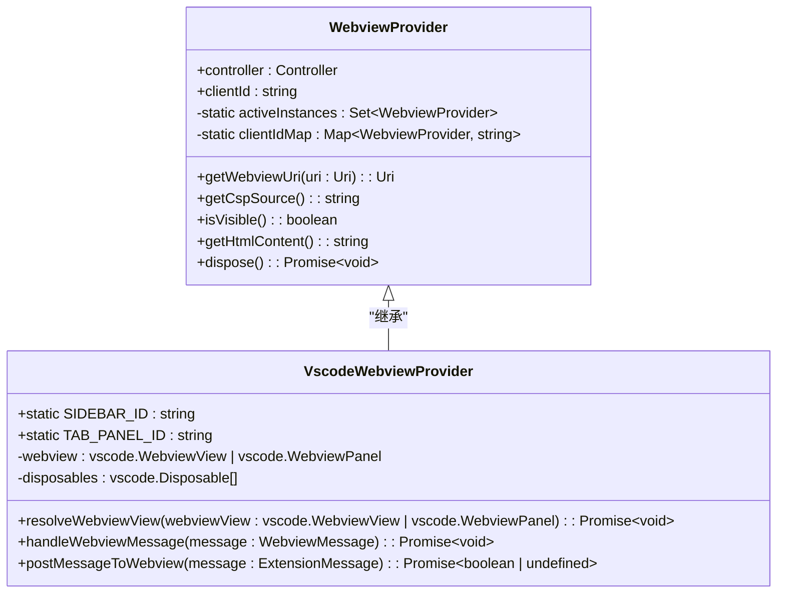
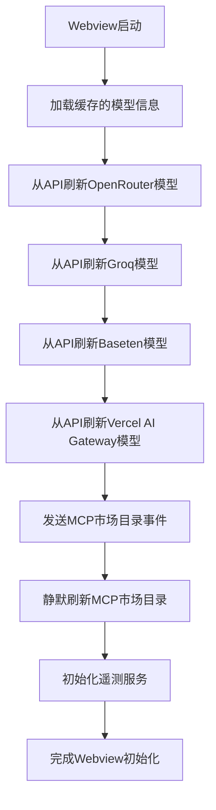
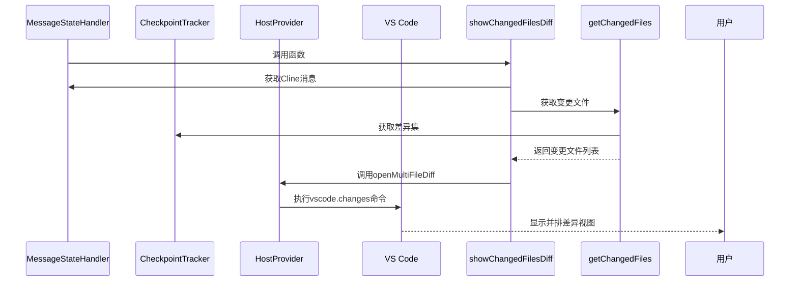
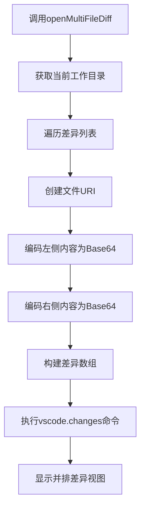
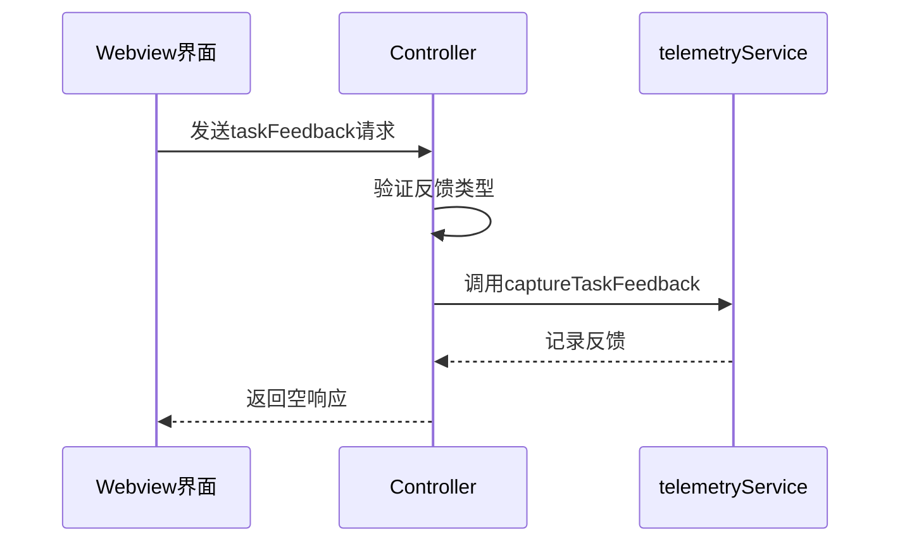
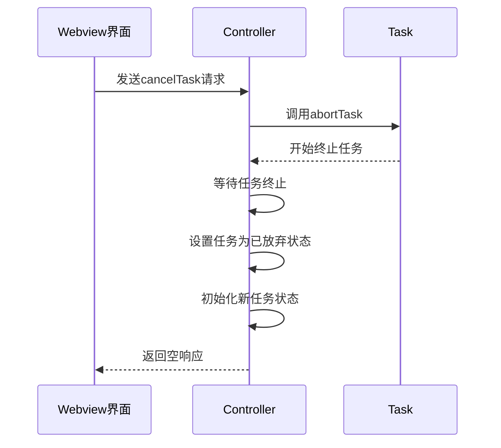
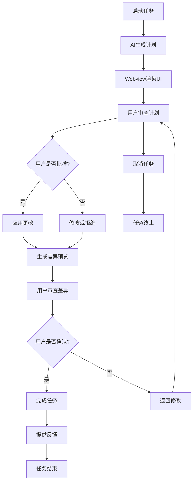

# 用户控制与审查

<cite>
**本文档引用的文件**
- [WebviewProvider.ts](file://src/core/webview/WebviewProvider.ts)
- [VscodeWebviewProvider.ts](file://src/hosts/vscode/VscodeWebviewProvider.ts)
- [initializeWebview.ts](file://src/core/controller/ui/initializeWebview.ts)
- [multifile-diff.ts](file://src/core/task/multifile-diff.ts)
- [openMultiFileDiff.ts](file://src/hosts/vscode/hostbridge/diff/openMultiFileDiff.ts)
- [taskFeedback.ts](file://src/core/controller/task/taskFeedback.ts)
- [cancelTask.ts](file://src/core/controller/task/cancelTask.ts)
</cite>

## 目录
1. [简介](#简介)
2. [用户控制流程概述](#用户控制流程概述)
3. [Webview UI 渲染机制](#webview-ui-渲染机制)
4. [差异审查机制](#差异审查机制)
5. [用户控制命令实现](#用户控制命令实现)
6. [用户旅程图](#用户旅程图)
7. [结论](#结论)

## 简介
本文档全面阐述了Cline扩展中"用户控制与审查"的完整流程。从AI生成计划开始，详细描述了该计划如何通过`WebviewProvider`在VS Code侧边栏中渲染为可交互的UI界面。重点说明了差异审查（diff review）机制，包括`openMultiFileDiff`如何并排显示变更预览，以及用户如何逐个批准或拒绝更改。同时解释了`taskFeedback`和`cancelTask`等关键控制命令的实现方式。最后提供用户旅程图，展示从任务启动到最终确认的完整闭环。

## 用户控制流程概述

Cline扩展的用户控制与审查流程始于AI生成的任务计划，该计划通过Webview在VS Code界面中呈现为可交互的UI。用户可以审查AI建议的更改，通过差异视图预览文件变更，并选择批准或拒绝每个更改。在整个过程中，用户拥有完全的控制权，可以通过反馈机制提供评价，或随时取消正在进行的任务。

该流程确保了AI辅助开发的安全性和可控性，使开发者能够全面审查所有自动生成的代码变更，避免意外或不期望的修改被应用到项目中。

**Section sources**
- [WebviewProvider.ts](file://src/core/webview/WebviewProvider.ts)
- [VscodeWebviewProvider.ts](file://src/hosts/vscode/VscodeWebviewProvider.ts)

## Webview UI 渲染机制

### WebviewProvider 架构
Cline使用`WebviewProvider`类作为Webview的基类，负责管理Webview的生命周期和内容渲染。该类通过继承实现不同类型的Webview（侧边栏或标签页），并提供统一的接口来处理消息通信和状态管理。

**Diagram sources**
- [WebviewProvider.ts](file://src/core/webview/WebviewProvider.ts#L1-L324)
- [VscodeWebviewProvider.ts](file://src/hosts/vscode/VscodeWebviewProvider.ts#L1-L234)

### Webview 初始化流程
当Webview首次创建时，`initializeWebview`函数负责初始化过程，包括加载缓存的模型信息、从API刷新最新的模型列表，并设置遥测服务状态。这一过程确保了UI界面显示的是最新和最准确的信息。

**Diagram sources**
- [initializeWebview.ts](file://src/core/controller/ui/initializeWebview.ts#L1-L240)

**Section sources**
- [initializeWebview.ts](file://src/core/controller/ui/initializeWebview.ts#L1-L240)

## 差异审查机制

### 多文件差异显示
Cline的差异审查机制通过`showChangedFilesDiff`函数实现，该函数负责收集和显示文件变更。当AI完成任务后，系统会比较任务前后的文件状态，生成差异集，并通过`openMultiFileDiff`命令在VS Code中显示。

**Diagram sources**
- [multifile-diff.ts](file://src/core/task/multifile-diff.ts#L1-L122)

### 差异预览实现
`openMultiFileDiff`函数是差异预览的核心实现，它使用VS Code的`vscode.changes`命令来显示并排的文件差异。函数将左右两侧的内容编码为Base64格式，并通过自定义URI方案传递给VS Code的差异查看器。

**Diagram sources**
- [openMultiFileDiff.ts](file://src/hosts/vscode/hostbridge/diff/openMultiFileDiff.ts#L1-L31)

**Section sources**
- [multifile-diff.ts](file://src/core/task/multifile-diff.ts#L1-L122)
- [openMultiFileDiff.ts](file://src/hosts/vscode/hostbridge/diff/openMultiFileDiff.ts#L1-L31)

## 用户控制命令实现

### 任务反馈机制
`taskFeedback`函数处理用户的反馈（点赞/点踩），并将反馈信息发送到遥测服务。该机制允许用户对AI生成的计划质量进行评价，帮助改进系统性能。

**Diagram sources**
- [taskFeedback.ts](file://src/core/controller/task/taskFeedback.ts#L1-L29)

### 任务取消机制
`cancelTask`函数允许用户取消正在进行的任务。该函数通过调用控制器的`abortTask`方法来终止任务执行，并等待任务完全停止。

**Diagram sources**
- [cancelTask.ts](file://src/core/controller/task/cancelTask.ts#L1-L13)
- [index.ts](file://src/core/controller/index.ts#L339-L367)

**Section sources**
- [taskFeedback.ts](file://src/core/controller/task/taskFeedback.ts#L1-L29)
- [cancelTask.ts](file://src/core/controller/task/cancelTask.ts#L1-L13)

## 用户旅程图

**Diagram sources**
- [WebviewProvider.ts](file://src/core/webview/WebviewProvider.ts)
- [VscodeWebviewProvider.ts](file://src/hosts/vscode/VscodeWebviewProvider.ts)
- [multifile-diff.ts](file://src/core/task/multifile-diff.ts)
- [openMultiFileDiff.ts](file://src/hosts/vscode/hostbridge/diff/openMultiFileDiff.ts)

## 结论
Cline扩展的用户控制与审查机制为AI辅助开发提供了安全可靠的框架。通过Webview在VS Code侧边栏中渲染可交互的UI，用户可以全面审查AI生成的计划和代码变更。差异审查机制允许用户并排查看变更预览，并逐个批准或拒绝更改。控制命令如`taskFeedback`和`cancelTask`确保了用户在整个开发过程中的完全控制权。这一闭环系统既发挥了AI的效率优势，又保持了开发者对代码质量和安全性的最终决定权。