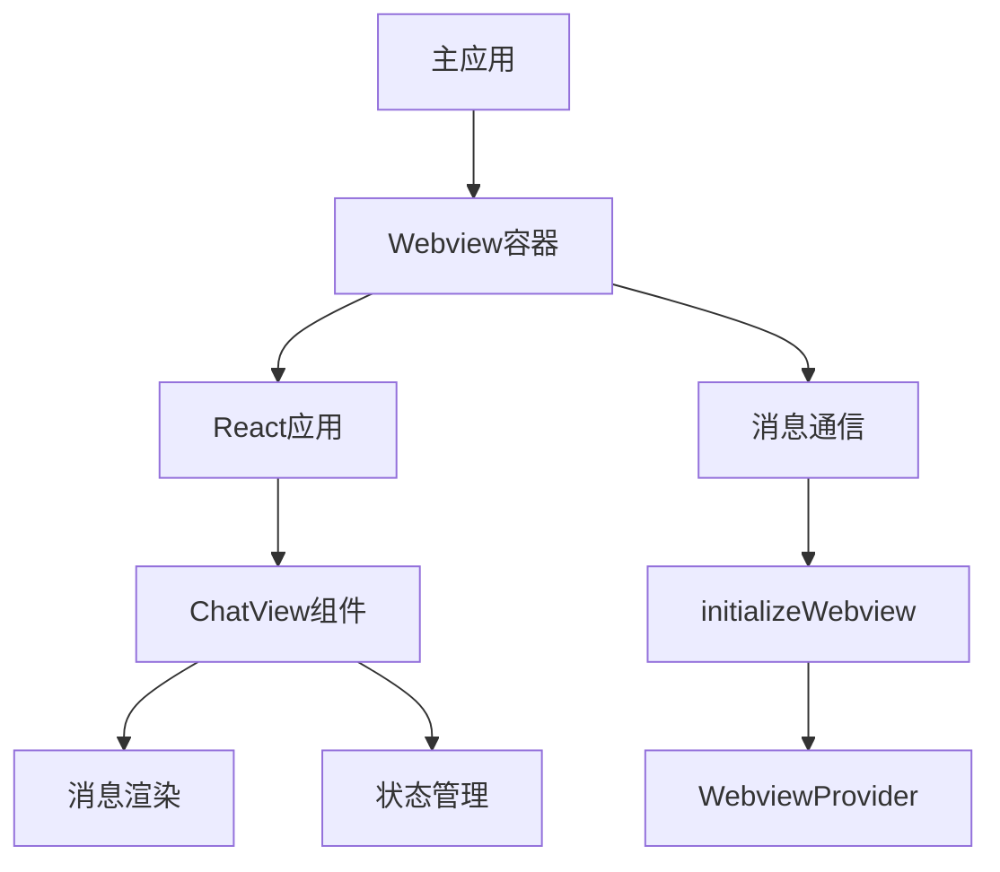
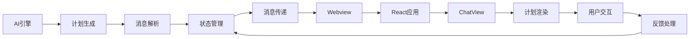
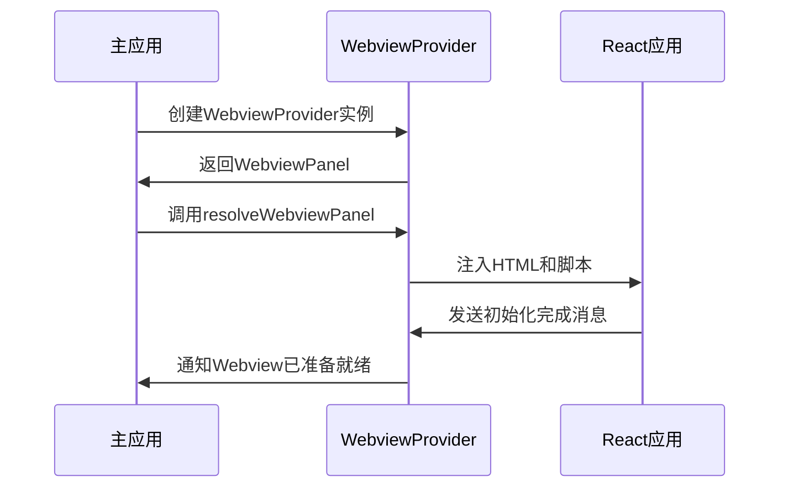
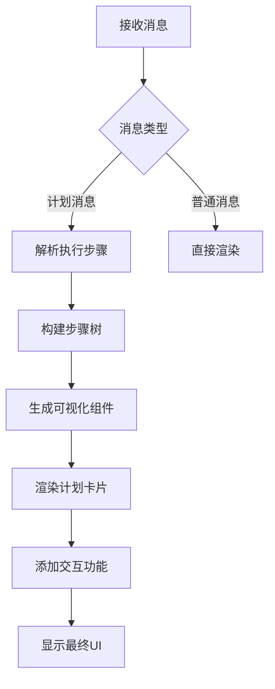
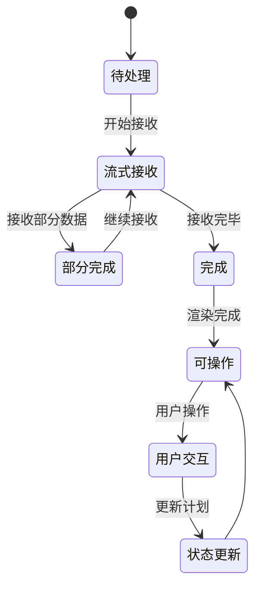
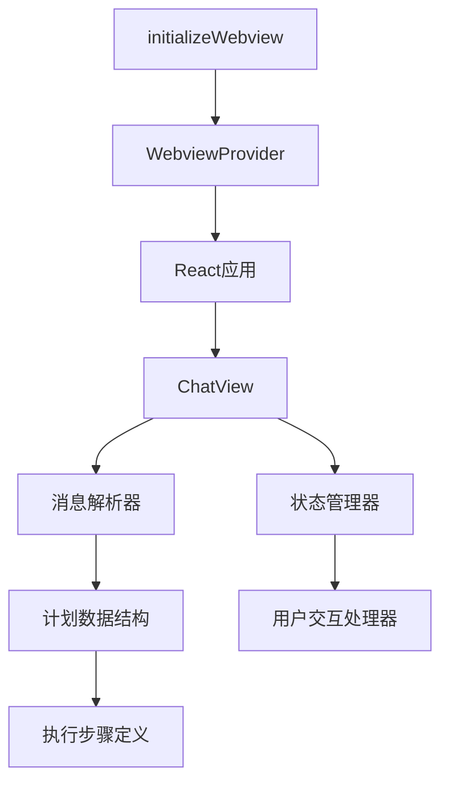

# 计划可视化

<cite>
**本文档中引用的文件**  
- [initializeWebview.ts](file://src/core/controller/ui/initializeWebview.ts)
- [ChatView.tsx](file://webview-ui/src/components/chat/ChatView.tsx)
- [message-state.ts](file://src/core/task/message-state.ts)
- [parse-assistant-message.ts](file://src/core/assistant-message/parse-assistant-message.ts)
- [WebviewProvider.ts](file://src/core/webview/WebviewProvider.ts)
- [ChatRow.tsx](file://webview-ui/src/components/chat/ChatRow.tsx)
- [MessageRenderer.tsx](file://webview-ui/src/components/chat/chat-view/components/messages/MessageRenderer.tsx)
</cite>

## 目录

1. [引言](#引言)
2. [项目结构](#项目结构)
3. [核心组件](#核心组件)
4. [架构概览](#架构概览)
5. [详细组件分析](#详细组件分析)
6. [依赖分析](#依赖分析)
7. [性能考虑](#性能考虑)
8. [故障排除指南](#故障排除指南)
9. [结论](#结论)

## 引言

本文档详细解释AI生成的执行计划如何在用户界面中进行可视化呈现。重点描述`initializeWebview`如何加载React应用，`ChatView.tsx`中的组件如何解析和渲染计划消息，以及消息状态管理机制如何处理部分消息、流式更新和用户交互反馈。通过代码结构分析和UI渲染逻辑说明，展示系统如何确保计划的可读性和可操作性。

## 项目结构

项目采用分层架构，将核心逻辑与用户界面分离。核心功能位于`src/core`目录，而用户界面由独立的React应用`webview-ui`实现，通过Webview技术集成到主应用中。

**Diagram sources**
- [initializeWebview.ts](file://src/core/controller/ui/initializeWebview.ts)
- [WebviewProvider.ts](file://src/core/webview/WebviewProvider.ts)

**Section sources**
- [initializeWebview.ts](file://src/core/controller/ui/initializeWebview.ts)
- [WebviewProvider.ts](file://src/core/webview/WebviewProvider.ts)

## 核心组件

核心组件包括`initializeWebview`用于初始化Webview环境，`ChatView.tsx`作为主聊天界面组件，以及`message-state.ts`中定义的消息状态管理机制。这些组件协同工作，实现AI计划的可视化和交互。

**Section sources**
- [initializeWebview.ts](file://src/core/controller/ui/initializeWebview.ts)
- [ChatView.tsx](file://webview-ui/src/components/chat/ChatView.tsx)
- [message-state.ts](file://src/core/task/message-state.ts)

## 架构概览

系统采用前后端分离架构，通过消息传递机制实现通信。核心逻辑处理AI响应并解析执行计划，前端React应用负责渲染和用户交互。

**Diagram sources**
- [parse-assistant-message.ts](file://src/core/assistant-message/parse-assistant-message.ts)
- [message-state.ts](file://src/core/task/message-state.ts)
- [ChatView.tsx](file://webview-ui/src/components/chat/ChatView.tsx)

## 详细组件分析

### initializeWebview分析

`initializeWebview`函数负责初始化Webview环境，加载React构建的应用，并建立前后端通信通道。

#### Webview初始化流程

**Diagram sources**
- [initializeWebview.ts](file://src/core/controller/ui/initializeWebview.ts)
- [WebviewProvider.ts](file://src/core/webview/WebviewProvider.ts)

**Section sources**
- [initializeWebview.ts](file://src/core/controller/ui/initializeWebview.ts)
- [WebviewProvider.ts](file://src/core/webview/WebviewProvider.ts)

### ChatView组件分析

`ChatView.tsx`是主聊天界面组件，负责解析和渲染AI生成的执行计划。

#### 消息解析与渲染流程

**Diagram sources**
- [ChatView.tsx](file://webview-ui/src/components/chat/ChatView.tsx)
- [MessageRenderer.tsx](file://webview-ui/src/components/chat/chat-view/components/messages/MessageRenderer.tsx)

**Section sources**
- [ChatView.tsx](file://webview-ui/src/components/chat/ChatView.tsx)
- [ChatRow.tsx](file://webview-ui/src/components/chat/ChatRow.tsx)

### 消息状态管理机制

消息状态管理机制处理部分消息、流式更新和用户交互反馈，确保计划的实时性和可操作性。

#### 消息状态转换

**Diagram sources**
- [message-state.ts](file://src/core/task/message-state.ts)
- [parse-assistant-message.ts](file://src/core/assistant-message/parse-assistant-message.ts)

**Section sources**
- [message-state.ts](file://src/core/task/message-state.ts)
- [parse-assistant-message.ts](file://src/core/assistant-message/parse-assistant-message.ts)

## 依赖分析

系统组件间存在明确的依赖关系，确保计划可视化功能的正常运行。

**Diagram sources**
- [initializeWebview.ts](file://src/core/controller/ui/initializeWebview.ts)
- [ChatView.tsx](file://webview-ui/src/components/chat/ChatView.tsx)
- [message-state.ts](file://src/core/task/message-state.ts)

**Section sources**
- [initializeWebview.ts](file://src/core/controller/ui/initializeWebview.ts)
- [ChatView.tsx](file://webview-ui/src/components/chat/ChatView.tsx)
- [message-state.ts](file://src/core/task/message-state.ts)

## 性能考虑

系统在计划可视化方面进行了多项性能优化，确保流畅的用户体验。

- 消息流式处理避免界面卡顿
- 虚拟滚动技术优化长计划渲染
- 懒加载机制减少初始加载时间
- 状态批处理减少重渲染次数
- Web Worker处理复杂解析任务

## 故障排除指南

### 常见问题及解决方案

| 问题现象 | 可能原因 | 解决方案 |
|--------|--------|--------|
| 计划不显示 | 消息解析失败 | 检查AI响应格式是否符合预期 |
| 渲染卡顿 | 计划过长 | 启用虚拟滚动或分页显示 |
| 交互无响应 | 状态管理异常 | 检查消息状态转换逻辑 |
| 部分消息丢失 | 流式传输中断 | 检查网络连接和消息完整性 |

**Section sources**
- [message-state.ts](file://src/core/task/message-state.ts)
- [ChatView.tsx](file://webview-ui/src/components/chat/ChatView.tsx)

## 结论

本文档详细分析了AI生成执行计划的可视化实现机制。通过`initializeWebview`初始化Webview环境，加载React应用，并通过`ChatView.tsx`组件解析和渲染计划消息。消息状态管理机制有效处理部分消息、流式更新和用户交互反馈，确保计划的可读性和可操作性。系统采用分层架构和清晰的依赖关系，实现了高效、可靠的计划可视化功能。