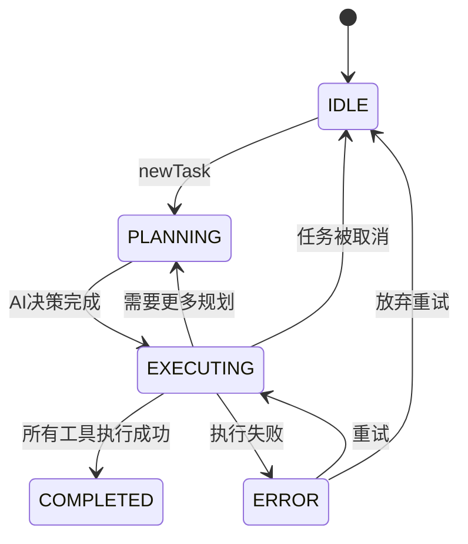
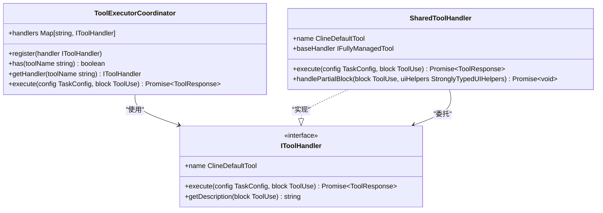
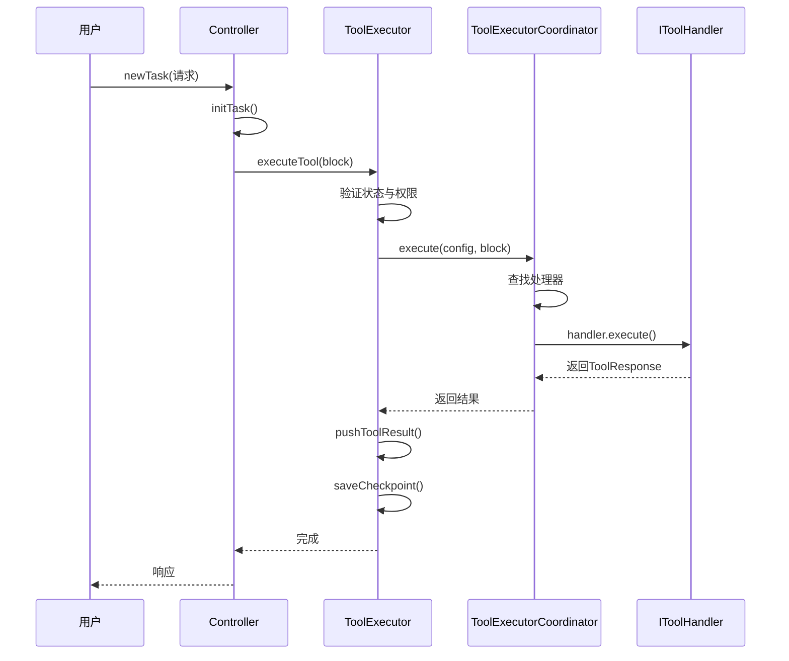

# 任务执行引擎

<cite>
**本文档中引用的文件**  
- [ToolExecutor.ts](file://src/core/task/ToolExecutor.ts)
- [TaskState.ts](file://src/core/task/TaskState.ts)
- [ToolExecutorCoordinator.ts](file://src/core/task/tools/ToolExecutorCoordinator.ts)
- [newTask.ts](file://src/core/controller/task/newTask.ts)
</cite>

## 目录
1. [简介](#简介)
2. [核心组件](#核心组件)
3. [任务状态机](#任务状态机)
4. [工具执行协调器](#工具执行协调器)
5. [任务执行流程](#任务执行流程)
6. [任务中断与恢复机制](#任务中断与恢复机制)
7. [结论](#结论)

## 简介
任务执行引擎是系统的核心调度模块，负责管理任务从创建到完成的整个生命周期。该引擎通过`ToolExecutor`作为中央调度器，协调各类工具处理器的执行，并通过`TaskState`维护任务的当前状态。`ToolExecutorCoordinator`则根据AI的决策，按序或并行地调用不同的工具处理器，确保任务高效、安全地执行。

## 核心组件

`ToolExecutor`是任务执行的核心类，负责接收工具调用请求、管理执行上下文、处理错误以及协调工具的执行流程。它通过`TaskState`跟踪任务的运行状态，并利用`ToolExecutorCoordinator`来分发具体的工具执行任务。

**节段来源**  
- [ToolExecutor.ts](file://src/core/task/ToolExecutor.ts#L50-L405)
- [TaskState.ts](file://src/core/task/TaskState.ts#L4-L64)

## 任务状态机

`TaskState`类定义了任务在其生命周期中可能经历的各种状态和标志。这些状态包括：

- **IDLE**：任务尚未初始化，处于空闲状态。
- **PLANNING**：任务正在规划阶段，AI正在生成执行计划。
- **EXECUTING**：任务已进入执行阶段，工具正在被调用。
- **COMPLETED**：任务成功完成，所有操作均已执行完毕。

状态转换逻辑由`ToolExecutor`在执行过程中动态管理。例如，当用户发起新任务时，`newTask`命令会触发任务从`IDLE`状态进入`PLANNING`状态；当AI决定执行具体操作时，任务进入`EXECUTING`状态；最终任务完成后，状态变为`COMPLETED`。

此外，`TaskState`还包含多个标志位来控制执行流程，如`didRejectTool`表示用户拒绝了某个工具调用，`didAlreadyUseTool`防止同一消息中重复使用工具，`abort`用于标记任务是否被中止等。

**图示来源**  
- [TaskState.ts](file://src/core/task/TaskState.ts#L4-L64)

**节段来源**  
- [TaskState.ts](file://src/core/task/TaskState.ts#L4-L64)

## 工具执行协调器

`ToolExecutorCoordinator`是工具执行的协调中心，采用注册-分发模式管理所有可用的工具处理器。其主要职责包括：

1. **注册工具处理器**：通过`register`方法将各类工具处理器（如`ListFilesToolHandler`、`ReadFileToolHandler`等）注册到内部映射表中。
2. **路由工具调用**：根据工具名称查找对应的处理器，并调用其`execute`方法。
3. **执行隔离**：确保每个工具调用都在独立的上下文中执行，避免相互干扰。

`ToolExecutor`在构造函数中初始化`ToolExecutorCoordinator`，并通过`registerToolHandlers`方法注册所有支持的工具。这使得系统具有良好的扩展性，新增工具只需实现`IToolHandler`接口并注册即可。

**图示来源**  
- [ToolExecutorCoordinator.ts](file://src/core/task/tools/ToolExecutorCoordinator.ts#L47-L81)

**节段来源**  
- [ToolExecutor.ts](file://src/core/task/ToolExecutor.ts#L50-L405)
- [ToolExecutorCoordinator.ts](file://src/core/task/tools/ToolExecutorCoordinator.ts#L47-L81)

## 任务执行流程

任务执行流程始于`newTask`命令的触发。以下是完整的执行序列：

1. 用户通过UI或API发起`newTask`请求。
2. `newTask`控制器调用`initTask`初始化任务。
3. `ToolExecutor`开始监听工具调用。
4. AI模型生成工具使用请求（`ToolUse`）。
5. `ToolExecutor`验证请求合法性（如是否在计划模式下调用了受限工具）。
6. `ToolExecutorCoordinator`根据工具名称分发请求至对应处理器。
7. 工具处理器执行具体操作并返回结果。
8. 结果被推送到用户消息内容中，并保存检查点。
9. 任务状态更新，循环至下一步。

**图示来源**  
- [ToolExecutor.ts](file://src/core/task/ToolExecutor.ts#L50-L405)
- [newTask.ts](file://src/core/controller/task/newTask.ts#L10-L13)

**节段来源**  
- [ToolExecutor.ts](file://src/core/task/ToolExecutor.ts#L50-L405)
- [newTask.ts](file://src/core/controller/task/newTask.ts#L10-L13)

## 任务中断与恢复机制

系统提供了完善的任务中断与恢复机制：

- **中断机制**：当用户拒绝某个工具调用时，`TaskState.didRejectTool`被置为`true`，后续工具调用将被跳过，直到任务重置。
- **超时处理**：虽然代码中未直接体现，但可通过`executeCommandTool`的`timeoutSeconds`参数实现命令执行超时控制。
- **恢复机制**：通过`saveCheckpoint`方法定期保存任务状态，允许在中断后从最近的检查点恢复执行。`reinitExistingTaskFromId`回调也支持从ID重新初始化现有任务。

这些机制确保了任务执行的鲁棒性和用户体验的连续性。

**节段来源**  
- [ToolExecutor.ts](file://src/core/task/ToolExecutor.ts#L50-L405)
- [TaskState.ts](file://src/core/task/TaskState.ts#L4-L64)

## 结论

任务执行引擎通过`ToolExecutor`、`TaskState`和`ToolExecutorCoordinator`三个核心组件的协同工作，实现了对任务生命周期的全面管理。状态机清晰地定义了任务的各个阶段及其转换逻辑，协调器确保了工具调用的安全与高效，而完整的执行流程和中断恢复机制则保障了系统的稳定性和可用性。这一架构设计既满足了功能需求，又具备良好的可扩展性和可维护性。