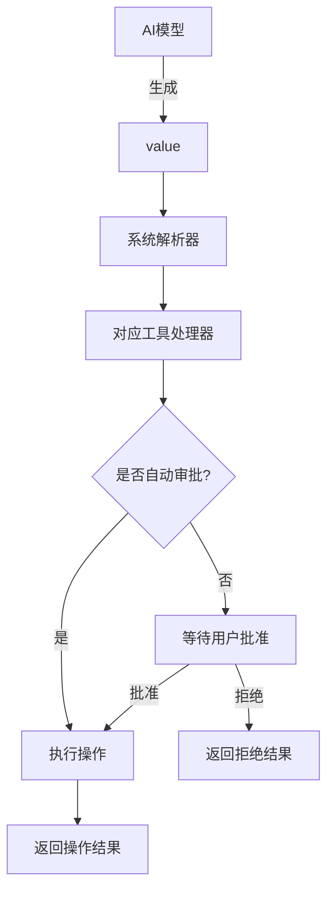
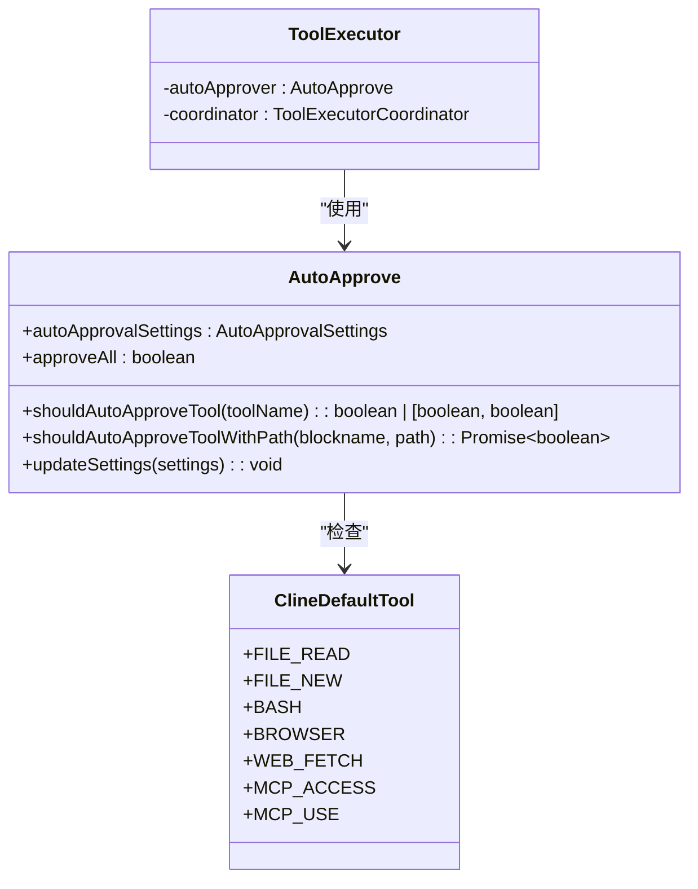

# 原子工具集

<cite>
**本文档中引用的文件**  
- [ReadFileToolHandler.ts](file://src/core/task/tools/handlers/ReadFileToolHandler.ts)
- [WriteToFileToolHandler.ts](file://src/core/task/tools/handlers/WriteToFileToolHandler.ts)
- [ExecuteCommandToolHandler.ts](file://src/core/task/tools/handlers/ExecuteCommandToolHandler.ts)
- [autoApprove.ts](file://src/core/task/tools/autoApprove.ts)
- [ToolExecutor.ts](file://src/core/task/ToolExecutor.ts)
- [tool_use/index.ts](file://src/core/prompts/system-prompt/components/tool_use/index.ts)
- [tool_use/formatting.ts](file://src/core/prompts/system-prompt/components/tool_use/formatting.ts)
- [tool_use/tools.ts](file://src/core/prompts/system-prompt/components/tool_use/tools.ts)
- [responses.ts](file://src/core/prompts/responses.ts)
- [toggleToolAutoApprove.ts](file://src/core/controller/mcp/toggleToolAutoApprove.ts)
</cite>

## 目录
1. [简介](#简介)
2. [工具处理器详解](#工具处理器详解)
   - [ReadFileToolHandler](#readfiletoolhandler)
   - [WriteToFileToolHandler](#writetofiletoolhandler)
   - [ExecuteCommandToolHandler](#executecommandtoolhandler)
3. [工具交互机制](#工具交互机制)
4. [权限模型与自动审批](#权限模型与自动审批)
5. [工具调用流程示例](#工具调用流程示例)

## 简介
原子工具集是系统中用于执行具体操作的核心组件集合。这些工具通过`tool_use`指令与AI模型进行交互，允许模型在用户批准后执行文件读取、写入、命令执行等操作。每个工具处理器（Handler）负责特定类型的操作，并遵循统一的审批流程和安全策略。工具定义位于`system-prompt/tools`中，确保模型能够正确格式化工具调用请求。

**Section sources**
- [tool_use/index.ts](file://src/core/prompts/system-prompt/components/tool_use/index.ts)
- [responses.ts](file://src/core/prompts/responses.ts)

## 工具处理器详解

### ReadFileToolHandler
`ReadFileToolHandler`用于读取指定路径的文件内容。该处理器首先验证路径参数的完整性，检查是否受`.clineignore`规则限制，然后根据自动审批设置决定是否需要用户确认。

- **功能**：读取文件内容
- **输入参数**：
  - `path`（必需）：要读取的文件相对路径
- **输出结果**：文件的文本内容；若为图像文件，则同时返回图像数据块
- **可能的错误**：
  - 缺少`path`参数
  - 文件路径被`.clineignore`规则阻止访问
  - 文件不存在或无法读取

当自动审批启用且操作位于工作区内部时，工具将自动执行；否则需用户手动批准。

**Section sources**
- [ReadFileToolHandler.ts](file://src/core/task/tools/handlers/ReadFileToolHandler.ts)

### WriteToFileToolHandler
`WriteToFileToolHandler`支持创建新文件、覆盖现有文件内容或通过diff补丁修改文件。此处理器可处理`write_to_file`、`replace_in_file`和`new_rule`三种操作类型。

- **功能**：写入或替换文件内容
- **输入参数**：
  - `path`（必需）：目标文件路径
  - `content`（`write_to_file`和`new_rule`必需）：要写入的完整内容
  - `diff`（`replace_in_file`必需）：描述修改的diff补丁
- **输出结果**：成功时返回格式化的编辑结果；若用户拒绝，则返回拒绝说明
- **可能的错误**：
  - 必需参数缺失
  - `.clineignore`阻止访问
  - Diff补丁应用失败（如搜索文本未找到）
  - 文件系统写入错误

处理器会预处理内容以去除模型可能添加的Markdown代码块标记或HTML实体，并在执行前打开编辑器实时流式显示更改。

**Section sources**
- [WriteToFileToolHandler.ts](file://src/core/task/tools/handlers/WriteToFileToolHandler.ts)

### ExecuteCommandToolHandler
`ExecuteCommandToolHandler`用于在终端执行shell命令。该工具要求模型明确声明命令是否安全（`requires_approval`参数），并据此结合用户的自动审批设置决定执行策略。

- **功能**：在终端执行命令
- **输入参数**：
  - `command`（必需）：要执行的命令字符串
  - `requires_approval`（必需）：布尔值，指示命令是否需要审批
  - `timeout`（可选）：命令超时时间（秒）
- **输出结果**：命令执行的输出结果
- **可能的错误**：
  - 缺少`command`或`requires_approval`参数
  - 命令试图访问被`.clineignore`保护的文件
  - 用户拒绝执行
  - 命令执行超时或失败

在“yolo模式”下，未指定超时的命令将默认设置为30秒。

**Section sources**
- [ExecuteCommandToolHandler.ts](file://src/core/task/tools/handlers/ExecuteCommandToolHandler.ts)

## 工具交互机制
工具使用通过XML风格的标签进行格式化。AI模型在请求中使用特定的工具名称标签包裹参数，系统解析后触发相应的处理器。基本格式如下：

```xml
<tool_name>
<parameter1_name>value1</parameter1_name>
<parameter2_name>value2</parameter2_name>
</tool_name>
```

例如，读取文件的调用示例：
```xml
<read_file>
<path>src/main.js</path>
</read_file>
```

所有工具调用均在`system-prompt/tools`中定义，并通过`getToolUseSection`函数动态生成系统提示的一部分。工具使用说明由`getToolUseFormattingSection`提供，确保模型了解正确的格式要求。



**Diagram sources**
- [tool_use/index.ts](file://src/core/prompts/system-prompt/components/tool_use/index.ts)
- [tool_use/formatting.ts](file://src/core/prompts/system-prompt/components/tool_use/formatting.ts)

**Section sources**
- [tool_use/index.ts](file://src/core/prompts/system-prompt/components/tool_use/index.ts)
- [tool_use/formatting.ts](file://src/core/prompts/system-prompt/components/tool_use/formatting.ts)
- [responses.ts](file://src/core/prompts/responses.ts)

## 权限模型与自动审批
系统采用基于设置的权限控制和自动审批机制。`AutoApprove`类根据`AutoApprovalSettings`配置决定是否自动批准特定工具的执行。

- **自动审批条件**：
  - 全局`approveAll`启用时，所有工具自动批准
  - 按工具类型配置：读取文件、编辑文件、执行安全命令等可分别设置
  - 按路径位置区分：工作区内与外部操作可设置不同策略

对于MCP（Model Control Protocol）工具，用户可在UI中为每个服务器的每个工具单独切换自动审批状态，通过`toggleToolAutoApprove`控制器处理请求。



**Diagram sources**
- [autoApprove.ts](file://src/core/task/tools/autoApprove.ts)
- [ToolExecutor.ts](file://src/core/task/ToolExecutor.ts)

**Section sources**
- [autoApprove.ts](file://src/core/task/tools/autoApprove.ts)
- [ToolExecutor.ts](file://src/core/task/ToolExecutor.ts)
- [toggleToolAutoApprove.ts](file://src/core/controller/mcp/toggleToolAutoApprove.ts)

## 工具调用流程示例
用户通过`/improve`等命令触发任务后，系统创建任务上下文并初始化工具执行器。AI模型分析需求后生成工具调用请求，例如：

```xml
<read_file>
<path>src/config.json</path>
</read_file>
```

系统解析该请求，调用`ReadFileToolHandler`。若自动审批条件满足，则直接读取文件并返回内容；否则向用户显示批准提示。用户批准后，操作执行并将结果返回给模型，模型据此生成下一步操作，直至任务完成并通过`attempt_completion`工具提交最终结果。

此流程确保了所有外部操作都经过适当的安全审查，同时允许通过配置实现高效自动化。

**Section sources**
- [ReadFileToolHandler.ts](file://src/core/task/tools/handlers/ReadFileToolHandler.ts)
- [WriteToFileToolHandler.ts](file://src/core/task/tools/handlers/WriteToFileToolHandler.ts)
- [ExecuteCommandToolHandler.ts](file://src/core/task/tools/handlers/ExecuteCommandToolHandler.ts)