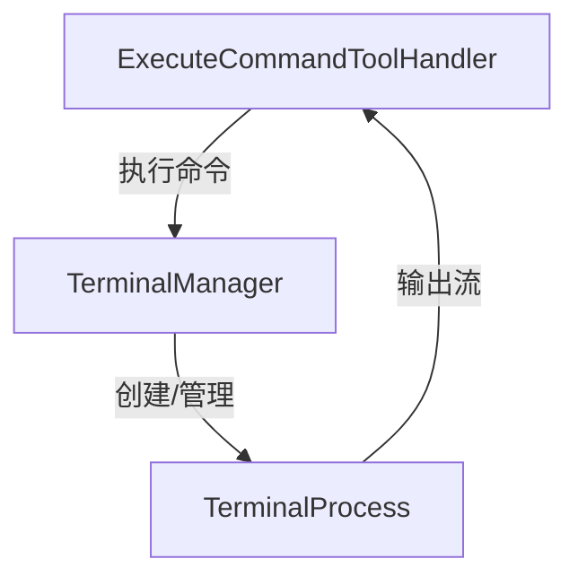
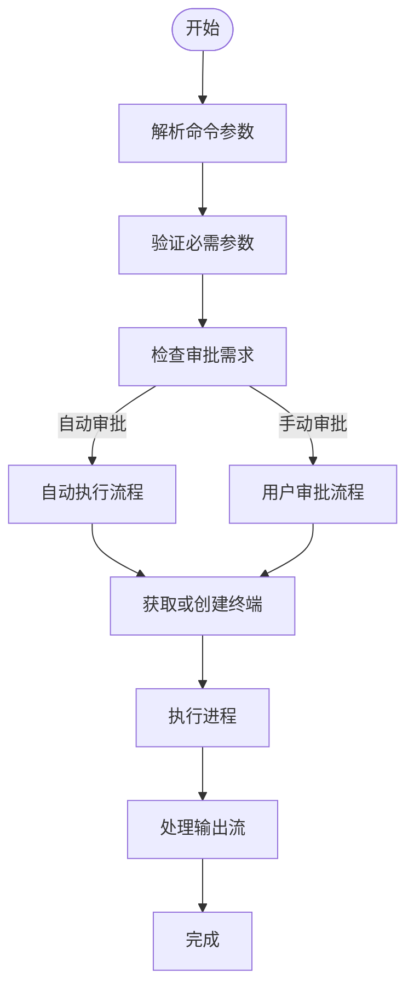
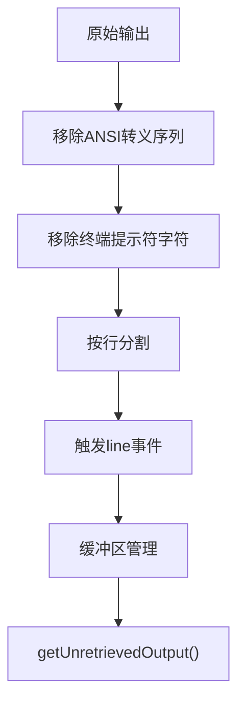
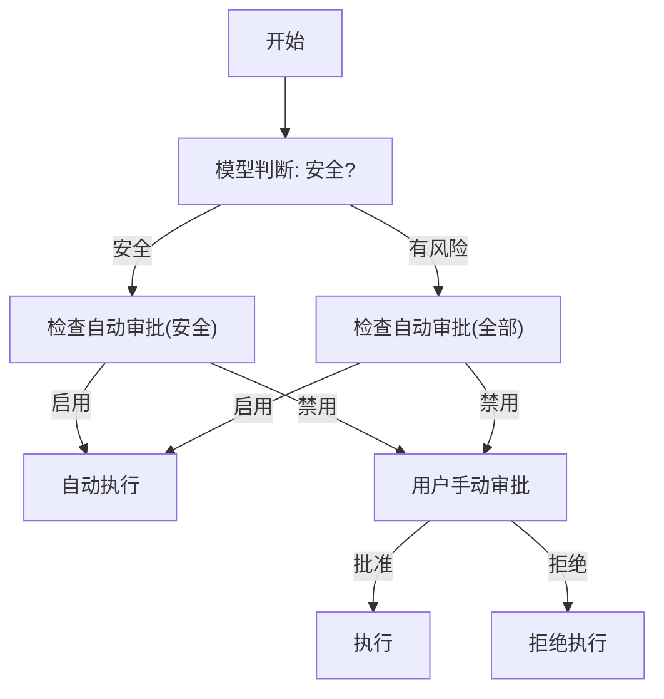
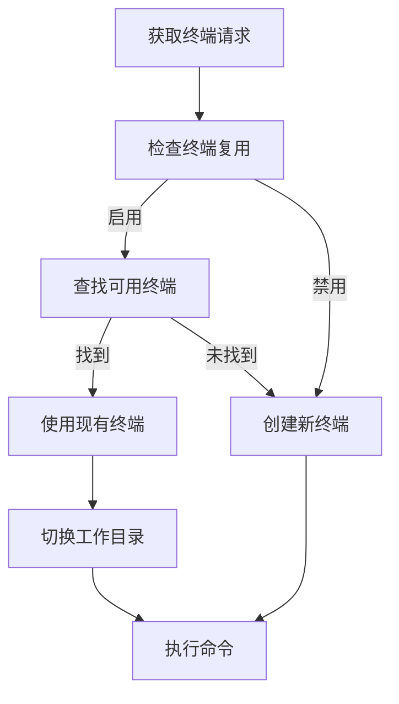

# 命令执行工具

<cite>
**本文档引用的文件**
- [ExecuteCommandToolHandler.ts](file://src/core/task/tools/handlers/ExecuteCommandToolHandler.ts)
- [TerminalManager.ts](file://src/integrations/terminal/TerminalManager.ts)
- [TerminalProcess.ts](file://src/integrations/terminal/TerminalProcess.ts)
- [shell.ts](file://src/utils/shell.ts)
- [getAvailableTerminalProfiles.ts](file://src/core/controller/state/getAvailableTerminalProfiles.ts)
</cite>

## 目录
1. [简介](#简介)
2. [核心组件](#核心组件)
3. [工作流程解析](#工作流程解析)
4. [输入参数详解](#输入参数详解)
5. [输出结果说明](#输出结果说明)
6. [安全机制](#安全机制)
7. [VS Code终端集成](#vs-code终端集成)
8. [代码示例](#代码示例)
9. [结论](#结论)

## 简介
命令执行工具是Cline系统中的核心功能模块，负责安全地执行shell命令并管理终端会话。该工具通过`ExecuteCommandToolHandler`类实现，与`TerminalManager`和`TerminalProcess`组件协同工作，提供完整的命令执行生命周期管理。本参考文档深入解析该工具的工作原理、安全机制和集成方式。

## 核心组件

命令执行工具由三个核心组件构成：`ExecuteCommandToolHandler`负责命令解析和安全审批，`TerminalManager`管理终端会话的创建和复用，`TerminalProcess`处理进程执行和输出流管理。

**组件关系图**


**图示来源**
- [ExecuteCommandToolHandler.ts](file://src/core/task/tools/handlers/ExecuteCommandToolHandler.ts)
- [TerminalManager.ts](file://src/integrations/terminal/TerminalManager.ts)
- [TerminalProcess.ts](file://src/integrations/terminal/TerminalProcess.ts)

**本节来源**
- [ExecuteCommandToolHandler.ts](file://src/core/task/tools/handlers/ExecuteCommandToolHandler.ts)
- [TerminalManager.ts](file://src/integrations/terminal/TerminalManager.ts)
- [TerminalProcess.ts](file://src/integrations/terminal/TerminalProcess.ts)

## 工作流程解析

命令执行工具的工作流程分为四个主要阶段：命令解析、安全审批、终端管理、进程执行。

**工作流程图**


**图示来源**
- [ExecuteCommandToolHandler.ts](file://src/core/task/tools/handlers/ExecuteCommandToolHandler.ts)
- [TerminalManager.ts](file://src/integrations/terminal/TerminalManager.ts)

**本节来源**
- [ExecuteCommandToolHandler.ts](file://src/core/task/tools/handlers/ExecuteCommandToolHandler.ts)
- [TerminalManager.ts](file://src/integrations/terminal/TerminalManager.ts)

## 输入参数详解

命令执行工具接受三个主要输入参数，这些参数通过工具调用块（ToolUse）传递。

### 命令字符串 (command)
命令字符串是必需参数，指定要执行的shell命令。该参数直接传递给终端进行执行。

### 审批需求 (requires_approval)
审批需求参数决定命令是否需要用户审批。值为"true"表示需要审批，"false"表示不需要。

### 超时设置 (timeout)
超时设置参数指定命令执行的最大时间（秒）。在yolo模式下，如果未指定超时时间，默认为30秒。

**参数表格**
| 参数名称 | 是否必需 | 类型 | 默认值 | 说明 |
|---------|--------|------|--------|------|
| command | 是 | 字符串 | 无 | 要执行的shell命令 |
| requires_approval | 是 | 字符串 | 无 | 是否需要用户审批 ("true"/"false") |
| timeout | 否 | 字符串 | 30秒(yolo模式) | 命令执行超时时间(秒) |

**本节来源**
- [ExecuteCommandToolHandler.ts](file://src/core/task/tools/handlers/ExecuteCommandToolHandler.ts)

## 输出结果说明

命令执行工具的输出结果包含标准输出、标准错误和退出码等信息。

### 标准输出 (stdout)
通过`TerminalProcess`的`line`事件实时流式输出。输出经过处理，移除ANSI转义序列和终端提示符字符。

### 标准错误 (stderr)
与标准输出合并处理，通过相同的事件机制输出。

### 退出码
通过`completed`事件隐式表示。成功执行时触发`completed`事件，失败时触发`error`事件。

**输出处理流程**


**图示来源**
- [TerminalProcess.ts](file://src/integrations/terminal/TerminalProcess.ts)

**本节来源**
- [TerminalProcess.ts](file://src/integrations/terminal/TerminalProcess.ts)

## 安全机制

命令执行工具实现了多层次的安全机制，确保命令执行的安全性。

### 命令白名单
通过`clineIgnoreController`验证命令，防止访问被忽略的文件或目录。

### 自动审批流程
基于模型判断和用户设置的双重验证机制：
- 当模型认为命令安全且用户启用了安全命令自动审批时，自动执行
- 当模型认为命令有风险但用户启用了所有命令自动审批时，自动执行

### 注入攻击防护
对特定模型（如Gemini）的输出进行HTML转义处理，防止命令注入攻击。

**安全审批流程图**


**图示来源**
- [ExecuteCommandToolHandler.ts](file://src/core/task/tools/handlers/ExecuteCommandToolHandler.ts)

**本节来源**
- [ExecuteCommandToolHandler.ts](file://src/core/task/tools/handlers/ExecuteCommandToolHandler.ts)

## VS Code终端集成

命令执行工具深度集成VS Code终端，支持多种终端配置和会话管理。

### 终端配置文件
通过`getAvailableTerminalProfiles`函数获取可用的终端配置文件，支持跨平台配置。

**支持的终端配置文件**
- Windows: PowerShell 7, Windows PowerShell, Command Prompt, WSL Bash, Git Bash
- macOS: zsh, bash
- Linux: bash, zsh, dash

### 终端会话管理
`TerminalManager`负责终端会话的创建、复用和管理，支持：
- 终端复用
- 工作目录管理
- Shell集成API检测
- 超时处理

**终端管理流程**


**图示来源**
- [TerminalManager.ts](file://src/integrations/terminal/TerminalManager.ts)
- [shell.ts](file://src/utils/shell.ts)

**本节来源**
- [TerminalManager.ts](file://src/integrations/terminal/TerminalManager.ts)
- [shell.ts](file://src/utils/shell.ts)
- [getAvailableTerminalProfiles.ts](file://src/core/controller/state/getAvailableTerminalProfiles.ts)

## 代码示例

以下示例展示如何使用命令执行工具安全地执行shell命令。

### 基本命令执行
```typescript
// 创建命令执行请求
const command = "ls -la"
const requiresApproval = "true"
const timeout = "60"

// 工具会自动处理审批流程和终端管理
// 输出通过事件流式传输
process.on('line', (outputLine) => {
    console.log(outputLine)
})

// 等待命令完成
await process
```

### 流式输出处理
```typescript
// 监听实时输出
terminalProcess.on('line', (line) => {
    // 处理每一行输出
    handleOutputLine(line)
})

// 继续执行而不等待完成
terminalProcess.continue()

// 稍后获取未处理的输出
const unretrievedOutput = terminalManager.getUnretrievedOutput(terminalId)
```

**本节来源**
- [TerminalProcess.ts](file://src/integrations/terminal/TerminalProcess.ts)
- [TerminalManager.ts](file://src/integrations/terminal/TerminalManager.ts)

## 结论

命令执行工具通过`ExecuteCommandToolHandler`、`TerminalManager`和`TerminalProcess`三个核心组件的协同工作，提供了安全、高效的shell命令执行能力。该工具实现了完善的审批机制、终端会话管理和流式输出处理，同时深度集成VS Code终端环境。通过多层次的安全防护措施，确保了命令执行的安全性，为开发者提供了可靠的命令执行解决方案。