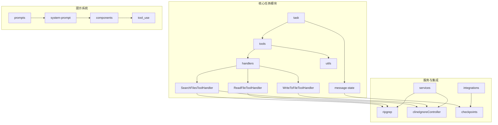
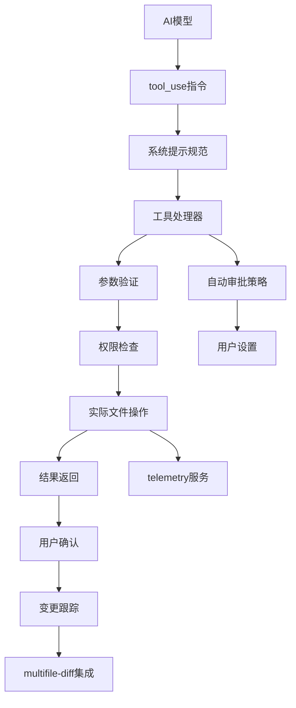
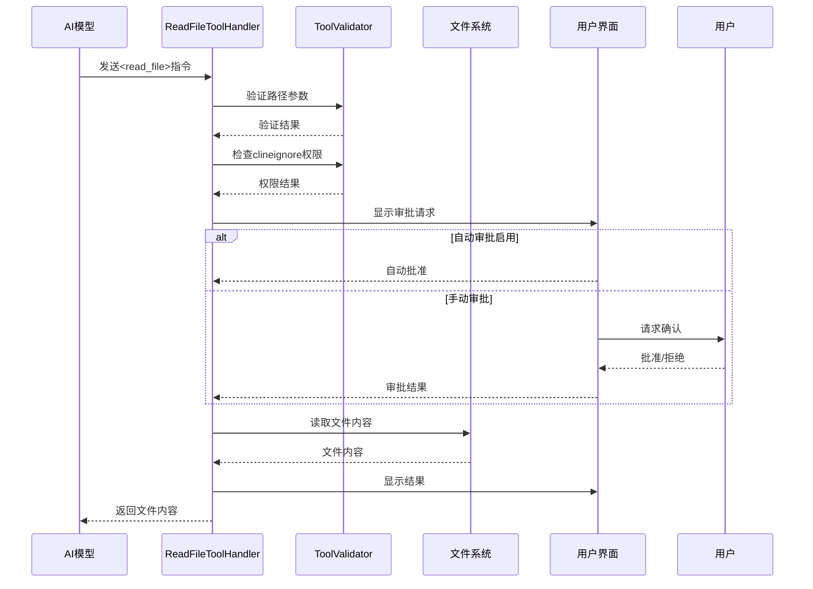
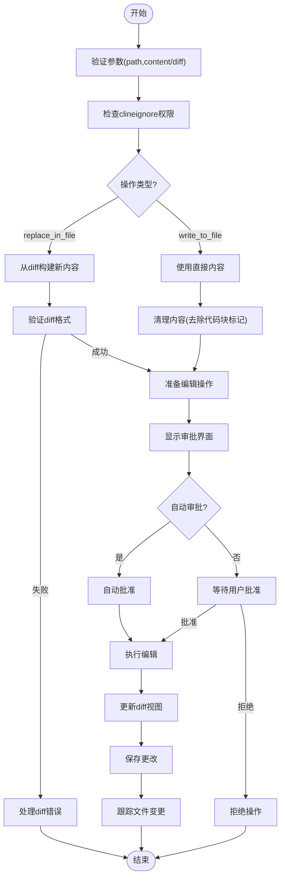

# 文件操作工具

<cite>
**本文档中引用的文件**  
- [ReadFileToolHandler.ts](file://src/core/task/tools/handlers/ReadFileToolHandler.ts)
- [WriteToFileToolHandler.ts](file://src/core/task/tools/handlers/WriteToFileToolHandler.ts)
- [SearchFilesToolHandler.ts](file://src/core/task/tools/handlers/SearchFilesToolHandler.ts)
- [multifile-diff.ts](file://src/core/task/multifile-diff.ts)
- [responses.ts](file://src/core/prompts/responses.ts)
- [guidelines.ts](file://src/core/prompts/system-prompt/components/tool_use/guidelines.ts)
- [formatting.ts](file://src/core/prompts/system-prompt/components/tool_use/formatting.ts)
- [index.ts](file://src/core/prompts/system-prompt/components/tool_use/index.ts)
</cite>

## 目录
1. [简介](#简介)
2. [项目结构](#项目结构)
3. [核心组件](#核心组件)
4. [架构概述](#架构概述)
5. [详细组件分析](#详细组件分析)
6. [依赖分析](#依赖分析)
7. [性能考虑](#性能考虑)
8. [故障排除指南](#故障排除指南)
9. [结论](#结论)

## 简介
本文档详细介绍了 Cline 系统中的文件操作工具，重点分析 `ReadFileToolHandler`、`WriteToFileToolHandler` 和 `SearchFilesToolHandler` 的实现机制。文档涵盖这些工具的输入参数、输出结果、错误处理策略、权限控制、自动审批机制以及与 `multifile-diff` 系统的集成方式。通过分析工具如何通过 `tool_use` 指令与 AI 模型交互，并在 `system-prompt/tools` 中定义其行为，为开发者和用户提供全面的技术参考。

## 项目结构
文件操作工具主要位于 `src/core/task/tools/handlers` 目录下，相关工具定义和提示系统位于 `src/core/prompts/system-prompt` 目录。文件操作的上下文跟踪和变更管理由 `src/core/context` 和 `src/integrations/checkpoints` 模块支持。



**Diagram sources**
- [ReadFileToolHandler.ts](file://src/core/task/tools/handlers/ReadFileToolHandler.ts)
- [WriteToFileToolHandler.ts](file://src/core/task/tools/handlers/WriteToFileToolHandler.ts)
- [SearchFilesToolHandler.ts](file://src/core/task/tools/handlers/SearchFilesToolHandler.ts)
- [multifile-diff.ts](file://src/core/task/multifile-diff.ts)

**Section sources**
- [ReadFileToolHandler.ts](file://src/core/task/tools/handlers/ReadFileToolHandler.ts)
- [WriteToFileToolHandler.ts](file://src/core/task/tools/handlers/WriteToFileToolHandler.ts)
- [SearchFilesToolHandler.ts](file://src/core/task/tools/handlers/SearchFilesToolHandler.ts)
- [multifile-diff.ts](file://src/core/task/multifile-diff.ts)

## 核心组件
文件操作工具的核心组件包括三个主要处理器：`ReadFileToolHandler` 用于读取文件内容，`WriteToFileToolHandler` 用于创建或修改文件，`SearchFilesToolHandler` 用于在文件中搜索特定模式。这些处理器实现了 `IFullyManagedTool` 接口，通过统一的执行和审批流程确保操作的安全性。

**Section sources**
- [ReadFileToolHandler.ts](file://src/core/task/tools/handlers/ReadFileToolHandler.ts#L1-L125)
- [WriteToFileToolHandler.ts](file://src/core/task/tools/handlers/WriteToFileToolHandler.ts#L1-L423)
- [SearchFilesToolHandler.ts](file://src/core/task/tools/handlers/SearchFilesToolHandler.ts#L1-L129)

## 架构概述
文件操作工具的架构采用分层设计，上层为 AI 模型提供工具调用接口，中层为工具处理器处理具体逻辑，底层为文件系统操作和权限验证。工具调用遵循 `tool_use` 指令格式，通过系统提示定义行为规范，确保操作的可预测性和安全性。



**Diagram sources**
- [ReadFileToolHandler.ts](file://src/core/task/tools/handlers/ReadFileToolHandler.ts)
- [WriteToFileToolHandler.ts](file://src/core/task/tools/handlers/WriteToFileToolHandler.ts)
- [SearchFilesToolHandler.ts](file://src/core/task/tools/handlers/SearchFilesToolHandler.ts)
- [responses.ts](file://src/core/prompts/responses.ts)
- [guidelines.ts](file://src/core/prompts/system-prompt/components/tool_use/guidelines.ts)

## 详细组件分析

### ReadFileToolHandler 分析
`ReadFileToolHandler` 负责处理文件读取操作，实现安全的文件内容访问机制。

#### 实现机制


**Diagram sources**
- [ReadFileToolHandler.ts](file://src/core/task/tools/handlers/ReadFileToolHandler.ts#L1-L125)

**Section sources**
- [ReadFileToolHandler.ts](file://src/core/task/tools/handlers/ReadFileToolHandler.ts#L1-L125)

### WriteToFileToolHandler 分析
`WriteToFileToolHandler` 处理文件写入操作，支持创建新文件、修改现有文件和添加规则等多种操作。

#### 实现机制


**Diagram sources**
- [WriteToFileToolHandler.ts](file://src/core/task/tools/handlers/WriteToFileToolHandler.ts#L1-L423)

**Section sources**
- [WriteToFileToolHandler.ts](file://src/core/task/tools/handlers/WriteToFileToolHandler.ts#L1-L423)

### SearchFilesToolHandler 分析
`SearchFilesToolHandler` 提供文件搜索功能，支持正则表达式搜索和文件模式过滤。

#### 实现机制
```mermaid
classDiagram
class SearchFilesToolHandler {
+name : string
+getDescription(block : ToolUse) string
+handlePartialBlock(block : ToolUse, uiHelpers : StronglyTypedUIHelpers) Promise~void~
+execute(config : TaskConfig, block : ToolUse) Promise~ToolResponse~
+validateAndPrepareSearch(config : TaskConfig, block : ToolUse) Promise~SearchParams | undefined~
}
class ToolValidator {
+assertRequiredParams(block : ToolUse, ...params : string[]) ValidationResult
+checkClineIgnorePath(path : string) ValidationResult
}
class TaskConfig {
+cwd : string
+callbacks : Callbacks
+services : Services
+taskState : TaskState
}
class ToolUse {
+name : string
+params : Record~string, any~
+partial : boolean
}
SearchFilesToolHandler --> ToolValidator : "使用"
SearchFilesToolHandler --> TaskConfig : "执行上下文"
SearchFilesToolHandler --> ToolUse : "处理"
SearchFilesToolHandler --> "regexSearchFiles" : "调用"
```

**Diagram sources**
- [SearchFilesToolHandler.ts](file://src/core/task/tools/handlers/SearchFilesToolHandler.ts#L1-L129)

**Section sources**
- [SearchFilesToolHandler.ts](file://src/core/task/tools/handlers/SearchFilesToolHandler.ts#L1-L129)

## 依赖分析
文件操作工具依赖多个核心模块和服务，形成完整的功能链。

```mermaid
erDiagram
TOOL_HANDLER ||--o{ VALIDATOR : "使用"
TOOL_HANDLER ||--o{ CALLBACKS : "调用"
TOOL_HANDLER ||--o{ SERVICES : "访问"
TOOL_HANDLER ||--o{ TELEMETRY : "上报"
SEARCH_HANDLER ||--o{ RIPGREP : "搜索"
WRITE_HANDLER ||--o{ DIFF_VIEW : "编辑"
READ_HANDLER ||--o{ FILE_EXTRACTOR : "提取"
TOOL_HANDLER ||--o{ MULTIFILE_DIFF : "集成"
class VALIDATOR {
检查参数
验证权限
处理错误
}
class CALLBACKS {
say()
ask()
shouldAutoApproveToolWithPath()
}
class SERVICES {
diffViewProvider
clineIgnoreController
fileContextTracker
}
class TELEMETRY {
captureToolUsage()
captureDiffEditFailure()
}
class RIPGREP {
regexSearchFiles()
}
class DIFF_VIEW {
open()
update()
saveChanges()
}
class MULTIFILE_DIFF {
showChangedFilesDiff()
getChangedFiles()
}
```

**Diagram sources**
- [ReadFileToolHandler.ts](file://src/core/task/tools/handlers/ReadFileToolHandler.ts)
- [WriteToFileToolHandler.ts](file://src/core/task/tools/handlers/WriteToFileToolHandler.ts)
- [SearchFilesToolHandler.ts](file://src/core/task/tools/handlers/SearchFilesToolHandler.ts)
- [multifile-diff.ts](file://src/core/task/multifile-diff.ts)

**Section sources**
- [ReadFileToolHandler.ts](file://src/core/task/tools/handlers/ReadFileToolHandler.ts)
- [WriteToFileToolHandler.ts](file://src/core/task/tools/handlers/WriteToFileToolHandler.ts)
- [SearchFilesToolHandler.ts](file://src/core/task/tools/handlers/SearchFilesToolHandler.ts)
- [multifile-diff.ts](file://src/core/task/multifile-diff.ts)

## 性能考虑
文件操作工具在设计时考虑了性能优化，包括：
- 使用流式处理部分结果，避免大文件加载延迟
- 缓存文件系统状态，减少重复的路径解析
- 异步执行耗时操作，保持界面响应性
- 批量处理文件变更，减少系统调用次数
- 智能的自动审批策略，减少用户交互开销

## 故障排除指南
### 常见问题及解决方案
| 问题现象 | 可能原因 | 解决方案 |
|--------|--------|--------|
| 文件读取失败 | 文件不存在或权限不足 | 检查文件路径是否正确，确认文件存在且可读 |
| 写入操作被拒绝 | clineignore规则阻止 | 检查.clineignore文件配置，调整规则或路径 |
| 搜索无结果 | 正则表达式错误或文件模式不匹配 | 验证正则表达式语法，检查文件扩展名过滤 |
| diff应用失败 | 搜索替换文本不匹配 | 确保diff中的搜索文本与文件实际内容完全一致 |
| 自动审批未生效 | 设置未正确配置 | 检查自动审批设置，确认路径匹配规则 |

**Section sources**
- [ReadFileToolHandler.ts](file://src/core/task/tools/handlers/ReadFileToolHandler.ts)
- [WriteToFileToolHandler.ts](file://src/core/task/tools/handlers/WriteToFileToolHandler.ts)
- [SearchFilesToolHandler.ts](file://src/core/task/tools/handlers/SearchFilesToolHandler.ts)

## 结论
Cline 的文件操作工具提供了一套完整、安全的文件处理机制。通过标准化的 `tool_use` 指令格式、严格的权限控制、灵活的审批策略和与 `multifile-diff` 系统的深度集成，确保了代码变更的可追溯性和安全性。这些工具的设计体现了对开发者体验和系统安全性的平衡考虑，为 AI 辅助编程提供了可靠的基础支持。