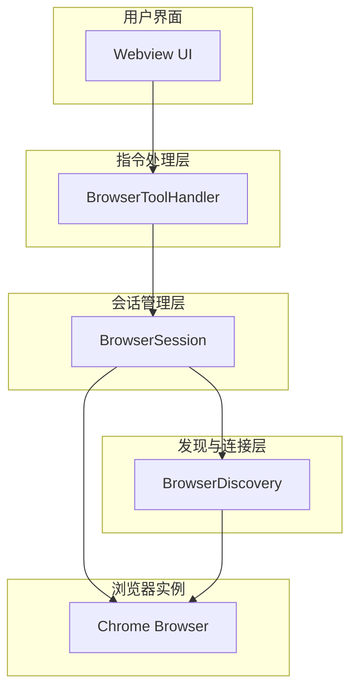
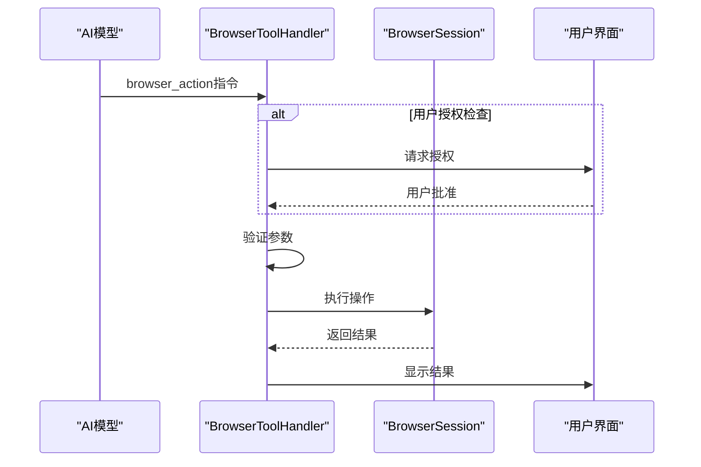
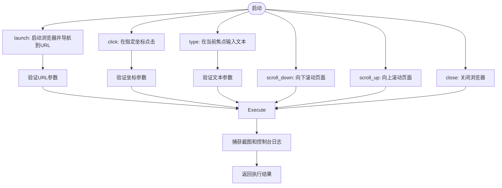
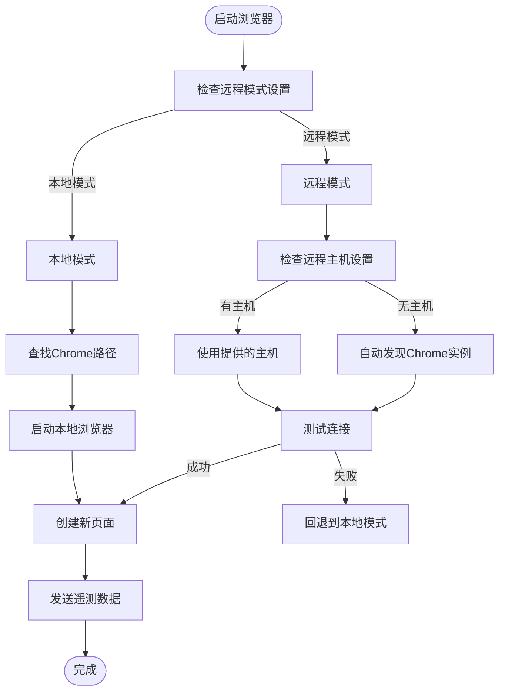
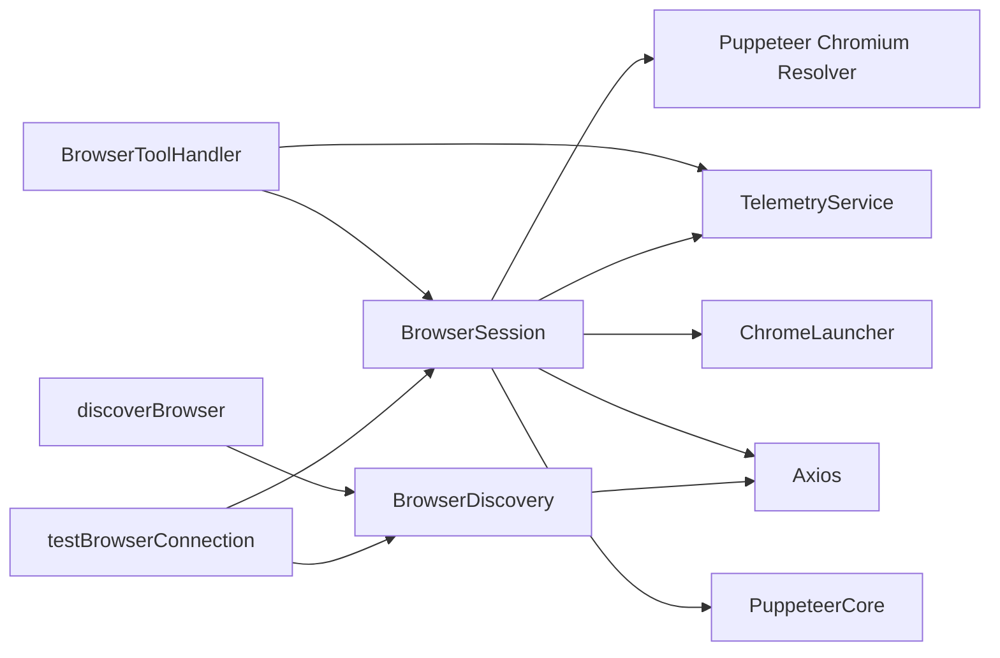

# 浏览器控制工具

<cite>
**本文档引用的文件**  
- [BrowserToolHandler.ts](file://src/core/task/tools/handlers/BrowserToolHandler.ts)
- [BrowserSession.ts](file://src/services/browser/BrowserSession.ts)
- [discoverBrowser.ts](file://src/core/controller/browser/discoverBrowser.ts)
- [testBrowserConnection.ts](file://src/core/controller/browser/testBrowserConnection.ts)
- [BrowserDiscovery.ts](file://src/services/browser/BrowserDiscovery.ts)
</cite>

## 目录
1. [简介](#简介)
2. [核心组件](#核心组件)
3. [架构概览](#架构概览)
4. [详细组件分析](#详细组件分析)
5. [依赖关系分析](#依赖关系分析)
6. [性能考量](#性能考量)
7. [故障排除指南](#故障排除指南)
8. [结论](#结论)

## 简介
浏览器控制工具是一个深度集成的自动化系统，允许AI模型通过`browser_action`指令控制浏览器实例。该工具支持本地和远程浏览器操作，提供完整的网页导航、交互和内容捕获功能。系统设计注重安全性，通过用户授权机制和沙箱环境保护用户隐私。本工具在端到端测试和复杂网页交互场景中具有重要应用价值。

## 核心组件

浏览器控制工具的核心由`BrowserToolHandler`和`BrowserSession`两个主要组件构成。`BrowserToolHandler`作为AI指令的接收器和执行协调器，负责解析`browser_action`指令并调用相应的浏览器操作。`BrowserSession`则管理实际的浏览器实例，处理与Chrome DevTools Protocol的底层通信。这两个组件协同工作，实现了从用户请求到浏览器自动化执行的完整流程。

**核心组件来源**
- [BrowserToolHandler.ts](file://src/core/task/tools/handlers/BrowserToolHandler.ts#L0-L200)
- [BrowserSession.ts](file://src/services/browser/BrowserSession.ts#L0-L636)

## 架构概览

浏览器控制工具采用分层架构设计，将指令处理、会话管理和底层通信分离。这种设计提高了系统的可维护性和可扩展性。



**图表来源**  
- [BrowserToolHandler.ts](file://src/core/task/tools/handlers/BrowserToolHandler.ts#L0-L200)
- [BrowserSession.ts](file://src/services/browser/BrowserSession.ts#L0-L636)
- [discoverBrowser.ts](file://src/core/controller/browser/discoverBrowser.ts#L0-L46)

## 详细组件分析

### BrowserToolHandler 分析

`BrowserToolHandler`是浏览器自动化功能的核心协调器，实现了`IFullyManagedTool`接口。它负责接收AI模型的`browser_action`指令，处理用户授权流程，并调用`BrowserSession`执行具体操作。

#### 指令处理流程


**图表来源**  
- [BrowserToolHandler.ts](file://src/core/task/tools/handlers/BrowserToolHandler.ts#L0-L200)

#### 操作类型支持


**图表来源**  
- [BrowserToolHandler.ts](file://src/core/task/tools/handlers/BrowserToolHandler.ts#L89-L169)

### BrowserSession 分析

`BrowserSession`类负责管理与浏览器实例的实际连接和操作。它支持本地和远程两种模式，通过Puppeteer Core与Chrome DevTools Protocol进行通信。

#### 浏览器会话类图
```mermaid
classDiagram
class BrowserSession {
-context : vscode.ExtensionContext
-browser : Browser
-page : Page
-browserSettings : BrowserSettings
-isConnectedToRemote : boolean
-sessionStartTime : number
+launchBrowser() : Promise~void~
+closeBrowser() : Promise~BrowserActionResult~
+navigateToUrl(url : string) : Promise~BrowserActionResult~
+click(coordinate : string) : Promise~BrowserActionResult~
+type(text : string) : Promise~BrowserActionResult~
+scrollDown() : Promise~BrowserActionResult~
+scrollUp() : Promise~BrowserActionResult~
+testConnection(host : string) : Promise~{success : boolean, message : string}~
}
class BrowserDiscovery {
+discoverChromeInstances() : Promise~string | null~
+isPortOpen(host : string, port : number) : Promise~boolean~
+testBrowserConnection(host : string) : Promise~{success : boolean, message : string, endpoint? : string}~
}
BrowserSession --> BrowserDiscovery : "使用"
```

**图表来源**  
- [BrowserSession.ts](file://src/services/browser/BrowserSession.ts#L0-L636)
- [BrowserDiscovery.ts](file://src/services/browser/BrowserDiscovery.ts#L0-L46)

#### 连接建立流程


**图表来源**  
- [BrowserSession.ts](file://src/services/browser/BrowserSession.ts#L0-L636)

## 依赖关系分析

浏览器控制工具依赖于多个外部库和内部服务，形成了复杂的依赖网络。



**图表来源**  
- [BrowserToolHandler.ts](file://src/core/task/tools/handlers/BrowserToolHandler.ts#L0-L200)
- [BrowserSession.ts](file://src/services/browser/BrowserSession.ts#L0-L636)
- [discoverBrowser.ts](file://src/core/controller/browser/discoverBrowser.ts#L0-L46)
- [testBrowserConnection.ts](file://src/core/controller/browser/testBrowserConnection.ts#L0-L62)

## 性能考量

浏览器控制工具在设计时考虑了多项性能优化措施。首先，系统实现了WebSocket端点缓存机制，当连接到远程浏览器时，会缓存成功的WebSocket端点，避免重复的发现和连接过程。其次，在截图捕获方面，工具优先使用WebP格式以减少数据大小，仅在失败时回退到PNG格式。此外，页面加载采用了智能等待策略，通过监测HTML内容稳定性来判断页面是否完全加载，而不是依赖固定的等待时间。

对于控制台日志的捕获，系统实现了活动等待机制，只有在控制台500毫秒内无新日志输出时才认为日志收集完成，最长等待3秒。这种设计平衡了响应速度和数据完整性。在错误处理方面，所有操作都包含适当的超时设置，防止因页面加载异常而导致的无限等待。

## 故障排除指南

当浏览器控制工具无法正常工作时，可以按照以下步骤进行排查：

1. **检查Chrome调试模式**：确保Chrome浏览器已使用`--remote-debugging-port=9222`参数启动。
2. **验证网络连接**：如果使用远程模式，确保目标主机的9222端口可访问。
3. **检查权限设置**：确认用户已授权浏览器操作，特别是在首次使用时。
4. **查看日志输出**：检查开发者控制台中的错误信息，通常能提供具体的失败原因。
5. **尝试重新发现**：使用`discoverBrowser`功能重新搜索可用的Chrome实例。

常见问题包括Chrome未正确启动调试模式、防火墙阻止端口访问、用户未授权操作等。系统设计了详细的错误消息和遥测数据收集，有助于快速定位和解决问题。

**故障排除来源**  
- [discoverBrowser.ts](file://src/core/controller/browser/discoverBrowser.ts#L0-L46)
- [testBrowserConnection.ts](file://src/core/controller/browser/testBrowserConnection.ts#L0-L62)
- [BrowserSession.ts](file://src/services/browser/BrowserSession.ts#L0-L636)

## 结论

浏览器控制工具提供了一套完整的浏览器自动化解决方案，通过`BrowserToolHandler`和`BrowserSession`的协同工作，实现了从AI指令到浏览器操作的无缝转换。该工具支持丰富的操作类型，包括导航、点击、输入和滚动等，满足了复杂网页交互的需求。安全方面，通过用户授权机制和沙箱环境设计，有效保护了用户隐私和系统安全。在端到端测试和自动化工作流场景中，该工具展现了强大的应用潜力，为AI驱动的浏览器自动化提供了可靠的技术基础。