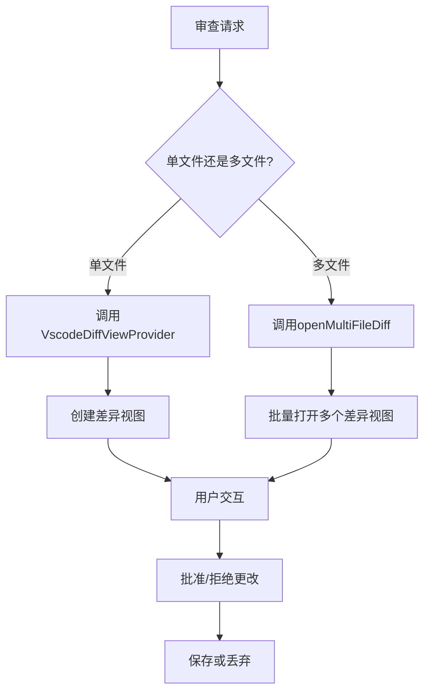
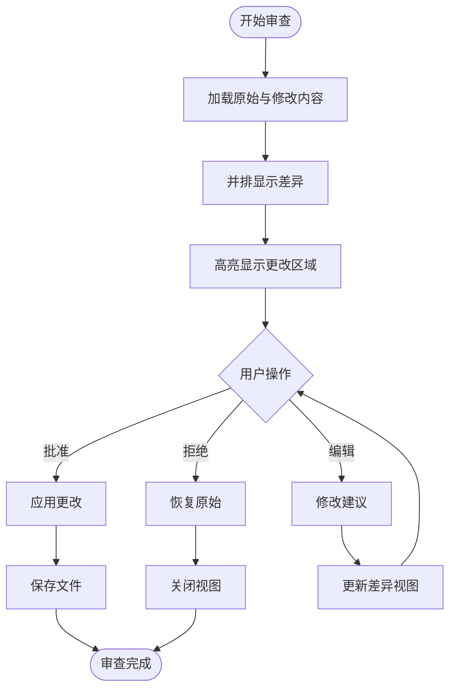
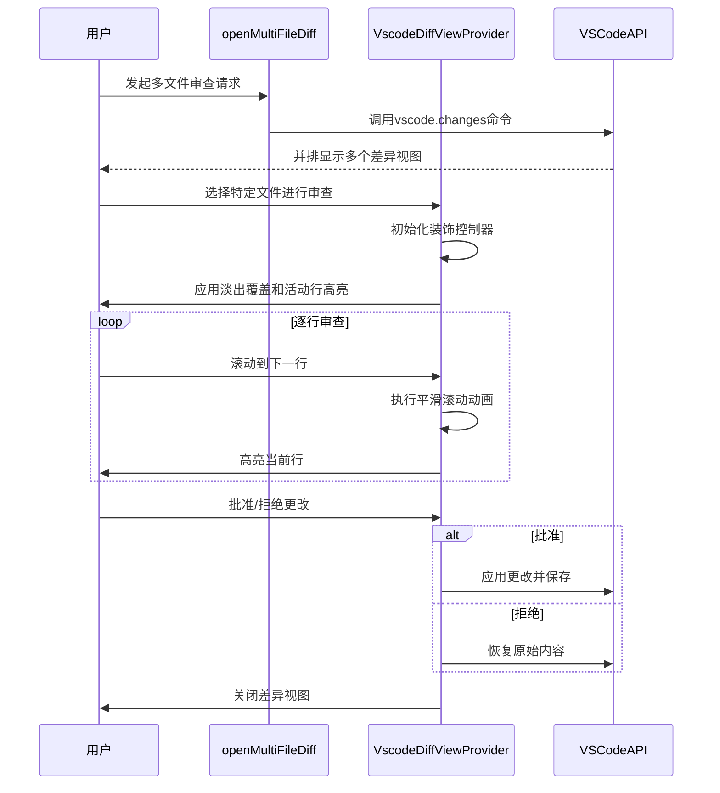

# 差异审查

<cite>
**本文档中引用的文件**  
- [openMultiFileDiff.ts](file://src/hosts/vscode/hostbridge/diff/openMultiFileDiff.ts)
- [openDiff.ts](file://src/hosts/vscode/hostbridge/diff/openDiff.ts)
- [VscodeDiffViewProvider.ts](file://src/hosts/vscode/VscodeDiffViewProvider.ts)
</cite>

## 目录
1. [简介](#简介)
2. [核心组件分析](#核心组件分析)
3. [差异审查流程架构](#差异审查流程架构)
4. [多文件差异处理机制](#多文件差异处理机制)
5. [用户界面与交互设计](#用户界面与交互设计)
6. [生命周期与状态管理](#生命周期与状态管理)
7. [用户体验流程图](#用户体验流程图)
8. [性能优化策略](#性能优化策略)
9. [结论](#结论)

## 简介
本文档详细阐述了Cline系统中差异审查流程的实现机制。重点分析了如何利用VS Code API在差异编辑器中并排显示原始文件与AI建议修改内容，以及相关组件如何协同工作以提供高效、直观的代码审查体验。

## 核心组件分析

差异审查功能主要由三个核心组件构成：`openMultiFileDiff.ts`、`openDiff.ts` 和 `VscodeDiffViewProvider.ts`。这些组件共同实现了从请求处理到视图展示的完整流程。

**Section sources**
- [openMultiFileDiff.ts](file://src/hosts/vscode/hostbridge/diff/openMultiFileDiff.ts#L1-L31)
- [openDiff.ts](file://src/hosts/vscode/hostbridge/diff/openDiff.ts#L1-L6)
- [VscodeDiffViewProvider.ts](file://src/hosts/vscode/VscodeDiffViewProvider.ts#L1-L196)

## 差异审查流程架构

**Diagram sources**
- [openMultiFileDiff.ts](file://src/hosts/vscode/hostbridge/diff/openMultiFileDiff.ts#L6-L29)
- [VscodeDiffViewProvider.ts](file://src/hosts/vscode/VscodeDiffViewProvider.ts#L8-L194)

## 多文件差异处理机制

`openMultiFileDiff.ts` 负责处理多文件差异审查请求。该模块通过 `vscode.changes` 命令批量打开多个差异视图。每个差异视图使用自定义URI方案 `cline-diff` 来标识，并将原始内容和建议修改内容分别编码为Base64格式存储在查询参数中。

当处理多文件差异时，系统会：
1. 获取当前工作目录(cwd)
2. 遍历所有差异项
3. 为每个文件创建左侧(原始)和右侧(修改后)的URI
4. 使用VS Code的内置命令批量打开差异视图

值得注意的是，`openDiff.ts` 模块明确不支持直接调用，而是引导开发者使用 `VscodeDiffViewProvider` 进行单文件差异处理。

**Section sources**
- [openMultiFileDiff.ts](file://src/hosts/vscode/hostbridge/diff/openMultiFileDiff.ts#L6-L29)
- [openDiff.ts](file://src/hosts/vscode/hostbridge/diff/openDiff.ts#L2-L4)

## 用户界面与交互设计

系统通过高亮显示待审查的更改来增强用户体验。`VscodeDiffViewProvider` 使用装饰控制器(DecorationController)实现以下视觉效果：

- **淡出覆盖层**：初始时对所有行应用淡出效果，突出显示正在处理的部分
- **活动行高亮**：实时高亮当前正在审查或修改的行
- **平滑滚动动画**：提供流畅的滚动体验，帮助用户跟踪更改过程

用户可以逐个或批量批准/拒绝更改。系统通过监听编辑器状态变化来管理这些操作，并在用户保存文档时应用最终决定。

**Diagram sources**
- [VscodeDiffViewProvider.ts](file://src/hosts/vscode/VscodeDiffViewProvider.ts#L8-L194)

**Section sources**
- [VscodeDiffViewProvider.ts](file://src/hosts/vscode/VscodeDiffViewProvider.ts#L8-L194)

## 生命周期与状态管理

`VscodeDiffViewProvider` 类继承自 `DiffViewProvider`，负责管理差异视图的整个生命周期。其主要职责包括：

- **视图打开**：检查目标文件是否已打开，避免重复加载
- **状态维护**：跟踪活动的差异编辑器实例和相关控制器
- **资源清理**：在适当时候清除装饰和关闭视图
- **异常处理**：处理超时、用户关闭编辑器等边界情况

关键方法包括：
- `openDiffEditor`：初始化并打开差异视图
- `replaceText`：替换指定范围的文本内容
- `scrollEditorToLine`：滚动到指定行
- `truncateDocument`：截断文档到指定行数
- `resetDiffView`：重置视图状态

系统还实现了10秒的超时机制，防止在性能较差的机器上无限等待。

**Section sources**
- [VscodeDiffViewProvider.ts](file://src/hosts/vscode/VscodeDiffViewProvider.ts#L8-L194)

## 用户体验流程图

**Diagram sources**
- [openMultiFileDiff.ts](file://src/hosts/vscode/hostbridge/diff/openMultiFileDiff.ts#L6-L29)
- [VscodeDiffViewProvider.ts](file://src/hosts/vscode/VscodeDiffViewProvider.ts#L8-L194)

## 性能优化策略

系统采用了多种性能优化策略来确保流畅的用户体验：

1. **懒加载机制**：虽然当前实现中未显式展示，但Base64编码的内容传输方式天然支持按需解码，可作为大文件差异的懒加载基础
2. **批量操作**：`openMultiFileDiff` 支持一次性处理多个文件差异，减少API调用次数
3. **内存管理**：通过及时清理装饰控制器和重置视图状态来释放资源
4. **超时保护**：为关键操作设置超时限制，防止界面冻结
5. **平滑动画**：使用定时器控制滚动动画帧率(~60fps)，平衡流畅性与性能消耗

建议未来可进一步优化：
- 实现真正的分块加载，仅传输和渲染可见区域的差异
- 添加差异预览模式，先显示摘要再按需展开细节
- 缓存常用文件的解析结果，减少重复计算

**Section sources**
- [VscodeDiffViewProvider.ts](file://src/hosts/vscode/VscodeDiffViewProvider.ts#L8-L194)
- [openMultiFileDiff.ts](file://src/hosts/vscode/hostbridge/diff/openMultiFileDiff.ts#L6-L29)

## 结论
Cline的差异审查系统通过精心设计的组件分工和VS Code API的深度集成，提供了高效、直观的代码审查体验。`VscodeDiffViewProvider` 作为核心组件，不仅管理着差异视图的完整生命周期，还通过丰富的视觉反馈增强了用户交互。多文件处理能力通过 `openMultiFileDiff` 模块得到支持，而系统的性能优化策略确保了即使在处理大型项目时也能保持响应性。整体架构清晰、职责分明，为未来的功能扩展和性能提升奠定了良好基础。