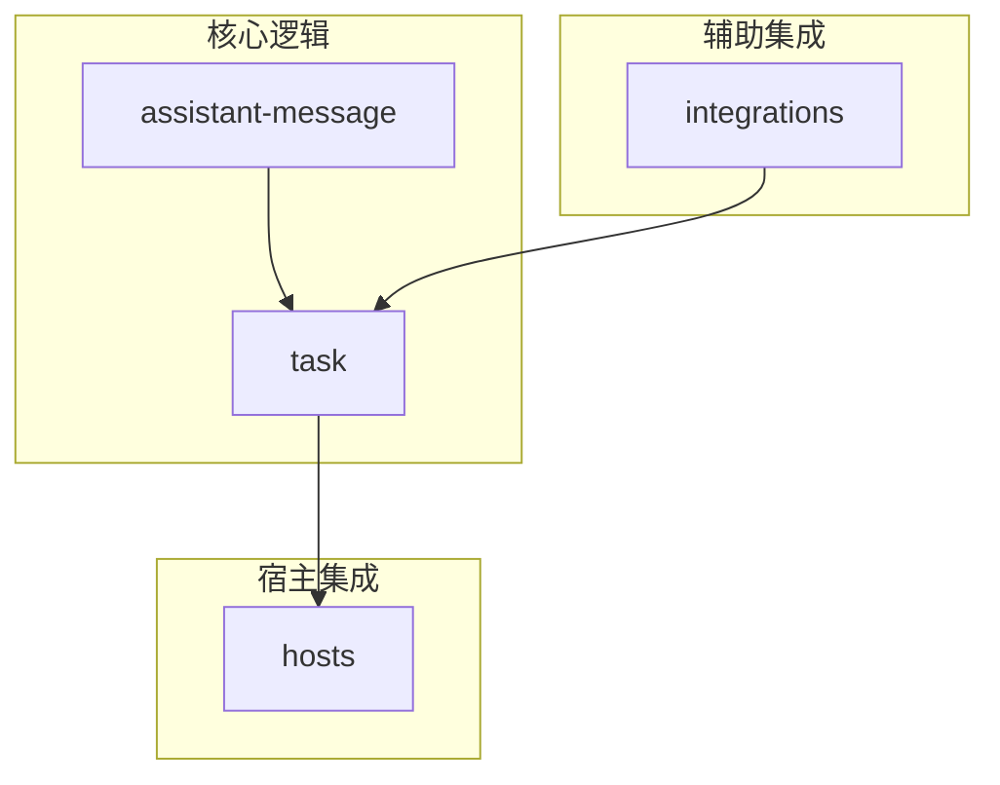
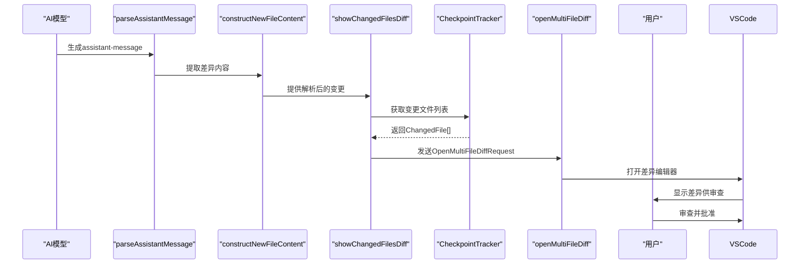
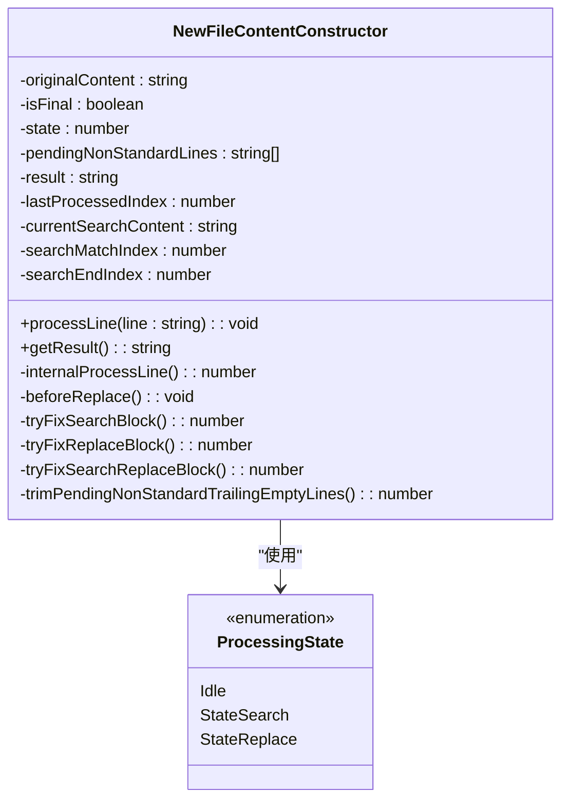
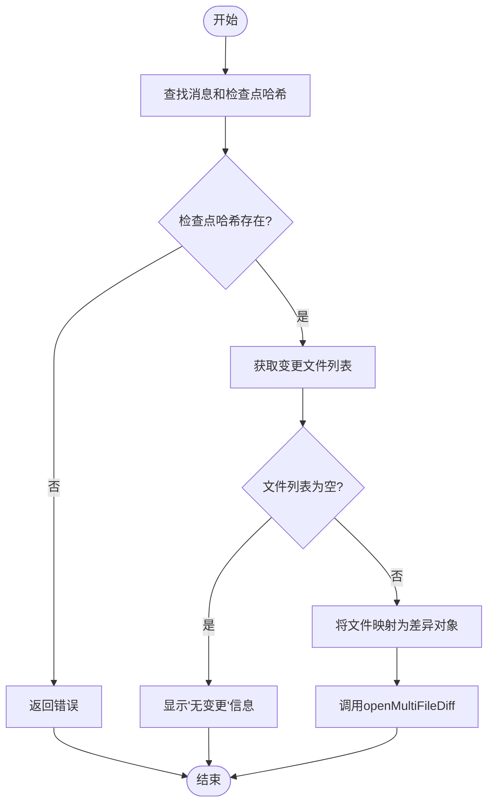
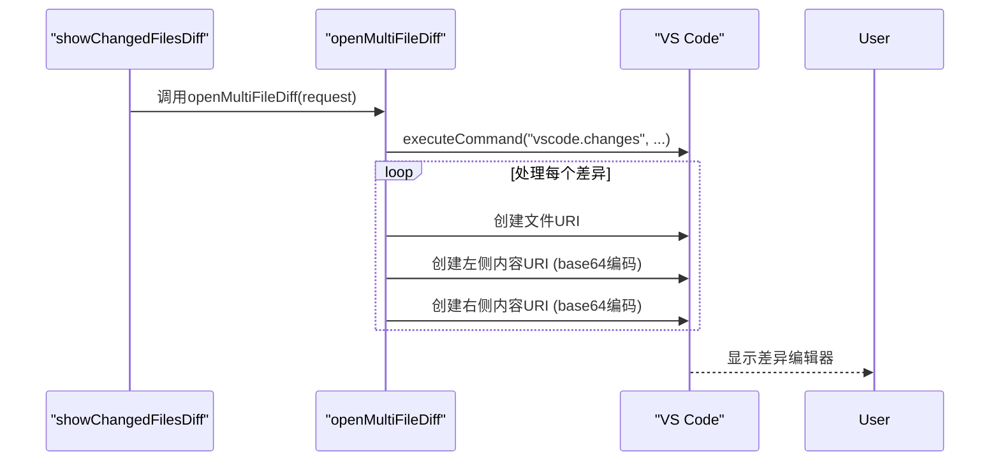
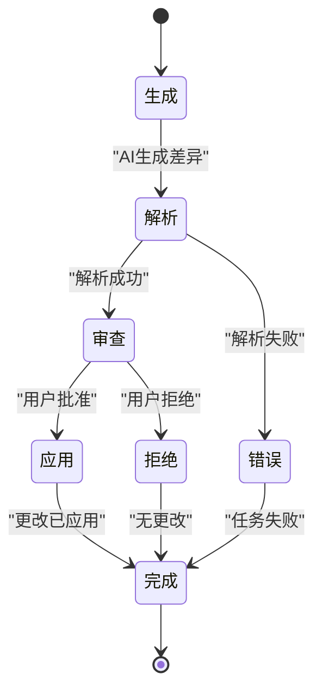
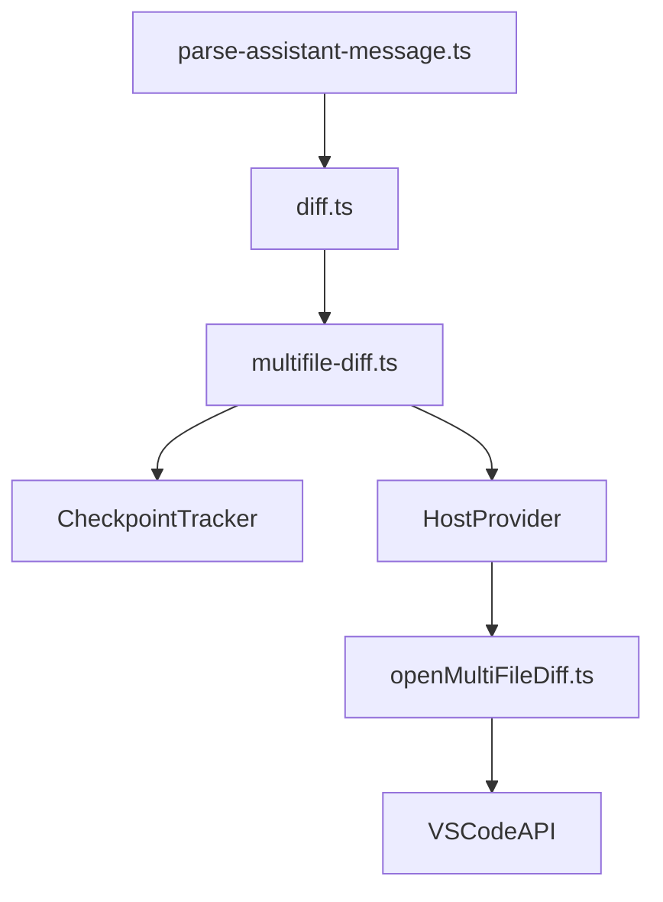

# 差异应用

<cite>
**本文档中引用的文件**  
- [diff.ts](file://src/core/assistant-message/diff.ts)
- [multifile-diff.ts](file://src/core/task/multifile-diff.ts)
- [openMultiFileDiff.ts](file://src/hosts/vscode/hostbridge/diff/openMultiFileDiff.ts)
- [replaceText.ts](file://src/hosts/vscode/hostbridge/diff/replaceText.ts)
- [parse-assistant-message.ts](file://src/core/assistant-message/parse-assistant-message.ts)
</cite>

## 目录
1. [简介](#简介)
2. [项目结构](#项目结构)
3. [核心组件](#核心组件)
4. [架构概述](#架构概述)
5. [详细组件分析](#详细组件分析)
6. [依赖分析](#依赖分析)
7. [性能考虑](#性能考虑)
8. [故障排除指南](#故障排除指南)
9. [结论](#结论)

## 简介
本文档深入探讨了AI生成的多文件差异在Cline系统中的处理流程。重点分析了`diff.ts`解析器如何将AI生成的`assistant-message`中的差异内容解析为可执行的文件操作，`multifile-diff.ts`如何将这些解析后的差异映射到实际的文件系统操作，以及`openMultiFileDiff.ts`如何在VS Code中打开差异编辑器供用户审查。文档还阐述了`replaceText.ts`在用户批准后安全应用文本替换的机制，提供了一个完整的差异生命周期状态转换图，并讨论了行号偏移、编码问题和部分应用等边缘情况的处理。

## 项目结构
该功能的核心实现分布在`src`目录下的多个子模块中，主要涉及`core`、`hosts`和`integrations`三个部分。`core`模块负责核心的差异解析和消息处理逻辑，`hosts`模块负责与VS Code等宿主环境的集成，`integrations`模块则提供了检查点跟踪等辅助功能。

**Diagram sources**
- [diff.ts](file://src/core/assistant-message/diff.ts)
- [multifile-diff.ts](file://src/core/task/multifile-diff.ts)
- [openMultiFileDiff.ts](file://src/hosts/vscode/hostbridge/diff/openMultiFileDiff.ts)

**Section sources**
- [project_structure](file://project_structure#L1-L200)

## 核心组件
核心组件包括`diff.ts`中的差异解析器、`multifile-diff.ts`中的多文件差异处理器、`openMultiFileDiff.ts`中的VS Code差异视图打开器，以及`replaceText.ts`中的文本替换服务。这些组件协同工作，实现了从AI生成的差异到用户审查再到最终应用的完整流程。

**Section sources**
- [diff.ts](file://src/core/assistant-message/diff.ts#L1-L832)
- [multifile-diff.ts](file://src/core/task/multifile-diff.ts#L1-L122)
- [openMultiFileDiff.ts](file://src/hosts/vscode/hostbridge/diff/openMultiFileDiff.ts#L1-L31)
- [replaceText.ts](file://src/hosts/vscode/hostbridge/diff/replaceText.ts#L1-L6)

## 架构概述
整个差异应用流程遵循一个清晰的架构：首先，AI生成的包含差异的`assistant-message`被`parse-assistant-message.ts`解析为结构化的消息块。接着，`diff.ts`中的`constructNewFileContent`函数负责解析这些差异块，将其转换为对文件内容的修改指令。然后，`multifile-diff.ts`利用检查点跟踪器获取变更文件列表，并将这些变更传递给宿主环境。最后，`openMultiFileDiff.ts`在VS Code中打开一个多文件差异视图，供用户审查。用户批准后，更改将被应用。

**Diagram sources**
- [parse-assistant-message.ts](file://src/core/assistant-message/parse-assistant-message.ts#L1-L238)
- [diff.ts](file://src/core/assistant-message/diff.ts#L1-L832)
- [multifile-diff.ts](file://src/core/task/multifile-diff.ts#L1-L122)
- [openMultiFileDiff.ts](file://src/hosts/vscode/hostbridge/diff/openMultiFileDiff.ts#L1-L31)

## 详细组件分析

### 差异解析器分析
`diff.ts`文件中的`constructNewFileContent`函数是整个流程的核心。它采用一种特殊的`SEARCH/REPLACE`块格式来解析差异。该函数支持增量处理，可以处理流式传输的差异内容。

#### 差异解析器类图

**Diagram sources**
- [diff.ts](file://src/core/assistant-message/diff.ts#L1-L832)

**Section sources**
- [diff.ts](file://src/core/assistant-message/diff.ts#L1-L832)

### 多文件差异处理器分析
`multifile-diff.ts`文件中的`showChangedFilesDiff`函数负责协调差异的展示。它首先通过`messageStateHandler`找到对应的消息和检查点哈希，然后调用`getChangedFiles`函数获取自上次检查点以来所有变更的文件。

#### 多文件差异处理流程图

**Diagram sources**
- [multifile-diff.ts](file://src/core/task/multifile-diff.ts#L1-L122)

**Section sources**
- [multifile-diff.ts](file://src/core/task/multifile-diff.ts#L1-L122)

### VS Code差异视图分析
`openMultiFileDiff.ts`文件实现了与VS Code的集成。它使用VS Code的`vscode.changes`命令来打开一个内置的多文件差异视图。

#### VS Code差异视图序列图

**Diagram sources**
- [openMultiFileDiff.ts](file://src/hosts/vscode/hostbridge/diff/openMultiFileDiff.ts#L1-L31)

**Section sources**
- [openMultiFileDiff.ts](file://src/hosts/vscode/hostbridge/diff/openMultiFileDiff.ts#L1-L31)

### 文本替换服务分析
`replaceText.ts`文件目前是一个占位符实现，它明确抛出一个错误，指示应使用`VscodeDiffViewProvider`来处理文本替换。这表明实际的文本替换逻辑是在`VscodeDiffViewProvider`中实现的，而不是通过这个独立的服务。

**Section sources**
- [replaceText.ts](file://src/hosts/vscode/hostbridge/diff/replaceText.ts#L1-L6)

### 差异生命周期状态图

**Diagram sources**
- [diff.ts](file://src/core/assistant-message/diff.ts#L1-L832)
- [multifile-diff.ts](file://src/core/task/multifile-diff.ts#L1-L122)
- [openMultiFileDiff.ts](file://src/hosts/vscode/hostbridge/diff/openMultiFileDiff.ts#L1-L31)

## 依赖分析
该功能依赖于多个核心模块。`diff.ts`依赖于`parse-assistant-message.ts`来获取结构化的消息块。`multifile-diff.ts`依赖于`CheckpointTracker`来获取文件变更，并依赖于`HostProvider`来与宿主环境通信。`openMultiFileDiff.ts`依赖于VS Code的API来打开差异视图。这些依赖关系确保了组件之间的松耦合和高内聚。

**Diagram sources**
- [parse-assistant-message.ts](file://src/core/assistant-message/parse-assistant-message.ts#L1-L238)
- [diff.ts](file://src/core/assistant-message/diff.ts#L1-L832)
- [multifile-diff.ts](file://src/core/task/multifile-diff.ts#L1-L122)
- [openMultiFileDiff.ts](file://src/hosts/vscode/hostbridge/diff/openMultiFileDiff.ts#L1-L31)

**Section sources**
- [diff.ts](file://src/core/assistant-message/diff.ts#L1-L832)
- [multifile-diff.ts](file://src/core/task/multifile-diff.ts#L1-L122)
- [openMultiFileDiff.ts](file://src/hosts/vscode/hostbridge/diff/openMultiFileDiff.ts#L1-L31)

## 性能考虑
差异解析器`constructNewFileContent`在处理大文件时可能会遇到性能瓶颈，因为它需要在原始内容中搜索匹配的文本块。为了优化性能，它实现了多种匹配策略，包括精确匹配、行修剪匹配和块锚点匹配。对于非常大的文件，建议使用更小、更精确的`SEARCH`块来减少搜索范围。多文件差异的展示是通过VS Code的原生命令完成的，因此其性能主要取决于VS Code的实现。

## 故障排除指南
常见的问题包括差异解析失败和文件路径不匹配。差异解析失败通常是由于`SEARCH`块中的内容与原始文件不完全匹配。系统会尝试使用行修剪和块锚点等后备策略，但如果所有策略都失败，则会抛出错误。文件路径不匹配问题可能发生在模型生成了错误的文件路径时。此外，`replaceText`服务目前不可用，任何尝试调用它的操作都会失败，正确的做法是通过差异视图进行更改。

**Section sources**
- [diff.ts](file://src/core/assistant-message/diff.ts#L1-L832)
- [multifile-diff.ts](file://src/core/task/multifile-diff.ts#L1-L122)
- [replaceText.ts](file://src/hosts/vscode/hostbridge/diff/replaceText.ts#L1-L6)

## 结论
Cline的差异应用系统通过一个精心设计的流程，将AI生成的文本差异安全、可靠地转换为可审查和可应用的文件更改。该系统利用了强大的解析器、检查点跟踪和与VS Code的深度集成，为用户提供了一个流畅的开发体验。尽管`replaceText`服务目前是一个占位符，但整体架构为未来的扩展和优化奠定了坚实的基础。