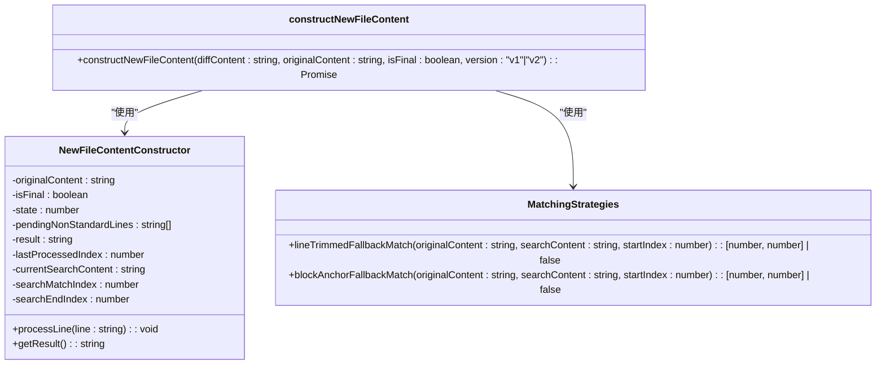
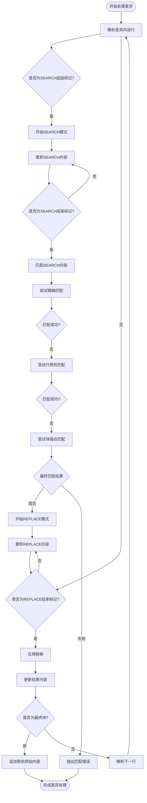
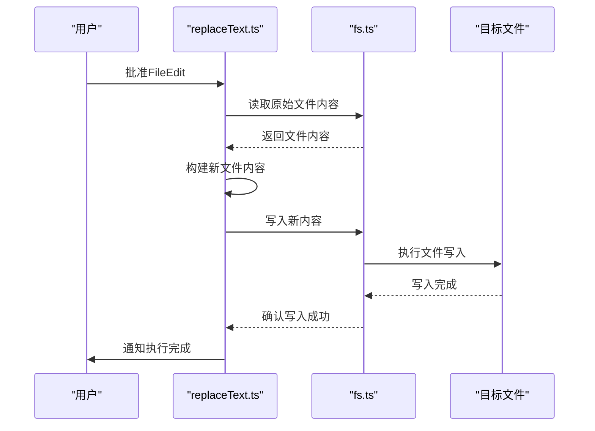
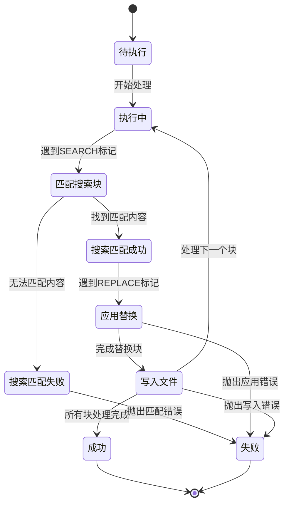

# 差异执行

<cite>
**本文档中引用的文件**
- [replaceText.ts](file://src/core/assistant-message/diff.ts)
- [saveDocument.ts](file://src/hosts/vscode/hostbridge/diff/saveDocument.ts)
- [truncateDocument.ts](file://src/hosts/vscode/hostbridge/diff/truncateDocument.ts)
- [fs.ts](file://src/utils/fs.ts)
</cite>

## 目录
1. [引言](#引言)
2. [核心组件分析](#核心组件分析)
3. [差异执行流程详解](#差异执行流程详解)
4. [文件操作与状态一致性](#文件操作与状态一致性)
5. [错误处理机制](#错误处理机制)
6. [状态机图示](#状态机图示)
7. [最佳实践建议](#最佳实践建议)
8. [结论](#结论)

## 引言
差异执行阶段是代码编辑系统中的关键环节，负责将用户批准的`FileEdit`对象安全地应用到实际文件中。该过程涉及复杂的文本替换逻辑、文件读写操作以及状态一致性维护。本权威文档深入解析`replaceText.ts`模块如何实现这一核心功能，并阐述`saveDocument.ts`和`truncateDocument.ts`在确保文件状态一致性方面的作用。

## 核心组件分析

`replaceText.ts`模块（实际文件路径为`diff.ts`）是差异执行的核心，其主要职责是解析并应用SEARCH/REPLACE格式的差异块。该模块通过`constructNewFileContent`函数实现增量式文件内容重构，支持v1和v2两个版本的处理逻辑。

**Diagram sources**
- [diff.ts](file://src/core/assistant-message/diff.ts#L0-L832)

**Section sources**
- [diff.ts](file://src/core/assistant-message/diff.ts#L0-L832)

## 差异执行流程详解

差异执行流程始于用户批准`FileEdit`对象，随后系统调用`constructNewFileContent`函数处理差异内容。该函数采用分阶段匹配策略来定位原始文件中的目标文本：

1. **精确匹配**：首先尝试在原始内容中查找完全匹配的SEARCH块
2. **行修剪匹配**：若精确匹配失败，则进行逐行比较，忽略首尾空白字符
3. **块锚点匹配**：对于三行以上的代码块，使用首尾行作为锚点进行定位

当SEARCH块为空时，系统根据原始文件状态判断操作类型：若原始文件为空则为新建文件操作，否则为全文件替换操作。

**Diagram sources**
- [diff.ts](file://src/core/assistant-message/diff.ts#L0-L832)

**Section sources**
- [diff.ts](file://src/core/assistant-message/diff.ts#L0-L832)

## 文件操作与状态一致性

在差异执行过程中，文件的读取和写入操作由底层文件系统模块管理。`fs.ts`文件提供了关键的文件操作函数，包括`writeFile`用于写入内容，`fileExistsAtPath`用于检查文件存在性，以及`createDirectoriesForFile`用于创建必要的目录结构。

**Diagram sources**
- [diff.ts](file://src/core/assistant-message/diff.ts#L0-L832)
- [fs.ts](file://src/utils/fs.ts#L0-L164)

**Section sources**
- [diff.ts](file://src/core/assistant-message/diff.ts#L0-L832)
- [fs.ts](file://src/utils/fs.ts#L0-L164)

## 错误处理机制

差异执行系统实现了多层次的错误处理机制，以应对各种异常情况：

- **文件锁定**：当目标文件被其他进程锁定时，文件写入操作会失败，系统会捕获相应的异常并返回错误信息
- **权限不足**：如果当前用户没有足够的权限修改目标文件，操作系统会拒绝写入请求，系统会记录权限错误
- **磁盘空间不足**：在写入大文件时，系统会检查可用磁盘空间，避免因空间不足导致的写入中断

此外，差异解析过程中的格式错误也会被严格检测，例如SEARCH块与原始内容不匹配、标记格式错误等情况都会触发相应的错误处理流程。

**Section sources**
- [diff.ts](file://src/core/assistant-message/diff.ts#L0-L832)
- [fs.ts](file://src/utils/fs.ts#L0-L164)

## 状态机图示

**Diagram sources**
- [diff.ts](file://src/core/assistant-message/diff.ts#L0-L832)

## 最佳实践建议

1. **确保原子性操作**：在执行文件替换时，应尽量保证操作的原子性，避免中间状态被其他进程读取
2. **实施预检查**：在执行前检查目标文件的可写性、磁盘空间等条件，提前发现潜在问题
3. **使用临时文件**：对于大型文件修改，建议先写入临时文件，验证无误后再替换原文件
4. **记录操作日志**：详细记录每次差异执行的过程和结果，便于问题追踪和审计
5. **实现回滚机制**：在关键操作前备份原文件，以便在失败时能够快速恢复

**Section sources**
- [diff.ts](file://src/core/assistant-message/diff.ts#L0-L832)
- [fs.ts](file://src/utils/fs.ts#L0-L164)

## 结论
差异执行阶段通过精密的文本匹配算法和稳健的文件操作机制，实现了从`FileEdit`对象到实际文件修改的安全转换。系统采用多级匹配策略确保了高成功率，同时通过完善的错误处理机制保障了系统的可靠性。开发者在实现类似功能时，应重点关注状态一致性、错误恢复和性能优化等方面。