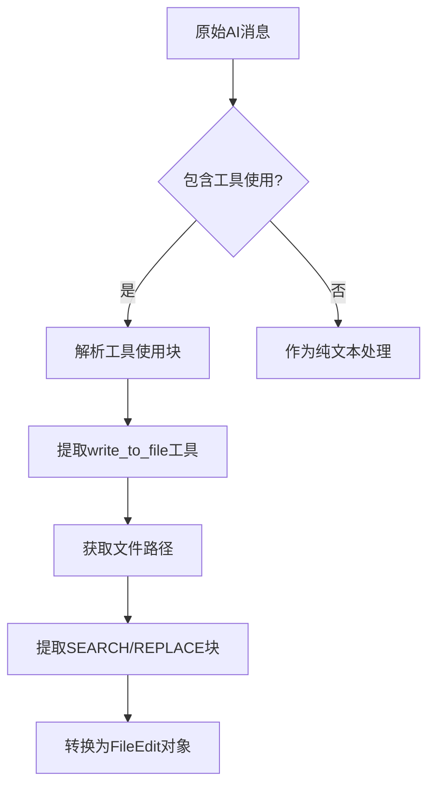
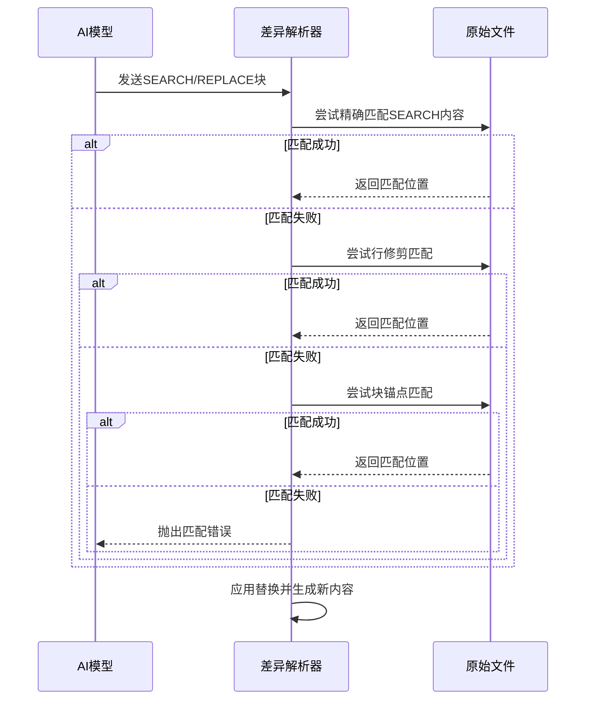
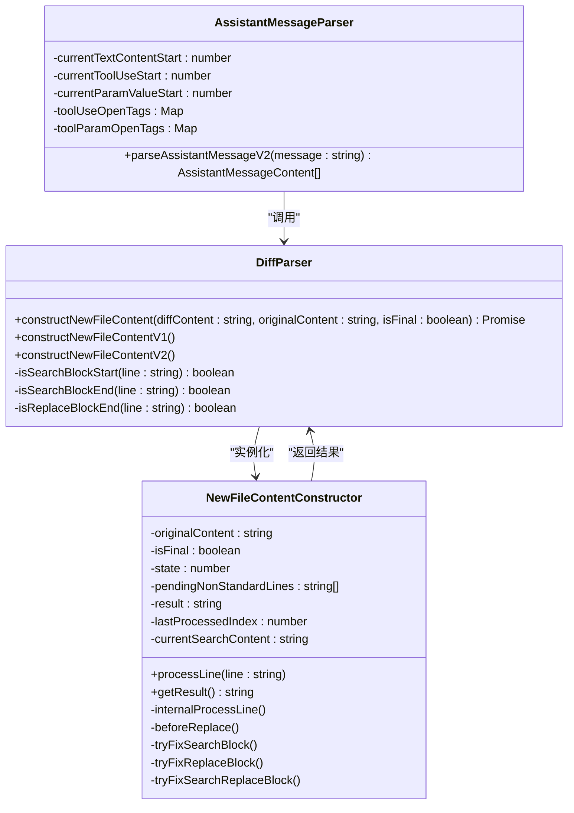
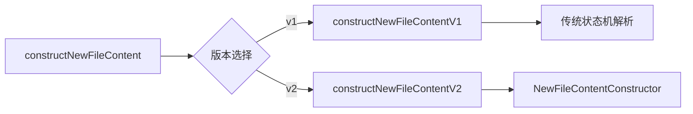

# 差异解析

<cite>
**本文档中引用的文件**  
- [diff.ts](file://src/core/assistant-message/diff.ts)
- [diff_edge_cases.test.ts](file://src/core/assistant-message/diff_edge_cases.test.ts)
- [parse-assistant-message.ts](file://src/core/assistant-message/parse-assistant-message.ts)
</cite>

## 目录
1. [简介](#简介)
2. [核心解析流程](#核心解析流程)
3. [差异格式支持](#差异格式支持)
4. [边缘情况处理](#边缘情况处理)
5. [解析协调流程](#解析协调流程)
6. [扩展指南](#扩展指南)

## 简介
本文档深入解析AI生成的`assistant-message`中多文件差异的处理机制。重点阐述`diff.ts`解析器如何将AI返回的原始文本差异转换为结构化的`FileEdit`对象，以及`parse-assistant-message.ts`如何协调整个解析过程。文档详细说明了解析器支持的各种差异格式、边缘情况处理策略，并为开发者提供扩展支持新格式的指导。

## 核心解析流程

[深入分析核心解析组件及其工作原理]

**文件编辑对象结构**
- **文件路径**: 被修改文件的相对路径
- **起始行号**: 修改开始的行号（从1开始）
- **删除行数**: 将被替换的行数
- **插入内容**: 将要插入的新内容

**Section sources**
- [diff.ts](file://src/core/assistant-message/diff.ts#L226-L244)

## 差异格式支持

[详细说明解析器支持的各种差异格式]



**Diagram sources**
- [parse-assistant-message.ts](file://src/core/assistant-message/parse-assistant-message.ts#L23-L33)
- [diff.ts](file://src/core/assistant-message/diff.ts#L226-L244)

### 自定义SEARCH/REPLACE格式
解析器主要支持一种自定义的SEARCH/REPLACE格式，其结构如下：

```
------- SEARCH
[需要在原文件中查找的精确内容]
=======
[要替换的新内容]
+++++++ REPLACE
```

**支持的变体**
- **SEARCH标记**: 支持7个或更多连字符后跟"SEARCH"，如`------- SEARCH`或`--------- SEARCH`
- **分隔符**: 支持3个或更多等号作为分隔符，如`===`或`=======`
- **REPLACE标记**: 支持7个或更多加号后跟"REPLACE"，如`+++++++ REPLACE`

**Section sources**
- [diff.ts](file://src/core/assistant-message/diff.ts#L1-L50)
- [diff_edge_cases.test.ts](file://src/core/assistant-message/diff_edge_cases.test.ts#L1-L139)

## 边缘情况处理

[详细分析diff_edge_cases.test.ts中覆盖的边缘情况]

### 行号偏移处理
当AI生成的差异块与原文件内容不完全匹配时，解析器采用多级匹配策略：

1. **精确匹配**: 首先尝试在原文件中找到与SEARCH块完全匹配的内容
2. **行修剪匹配**: 如果精确匹配失败，则按行进行比较，忽略每行首尾的空白字符
3. **块锚点匹配**: 对于3行以上的块，使用首行和末行作为锚点进行匹配



**Diagram sources**
- [diff.ts](file://src/core/assistant-message/diff.ts#L100-L200)
- [diff_edge_cases.test.ts](file://src/core/assistant-message/diff_edge_cases.test.ts#L50-L80)

### 空文件和空SEARCH块处理
解析器对空文件和空SEARCH块有特殊处理逻辑：

- **空SEARCH块 + 空文件**: 表示创建新文件（纯插入）
- **空SEARCH块 + 非空文件**: 表示完全替换文件内容
- **非空SEARCH块 + 空文件**: 匹配失败，抛出错误

**编码问题处理**
解析器在处理文件内容时保持原始编码不变，不进行任何编码转换。所有字符串操作都基于UTF-8编码进行，确保多字节字符的正确处理。

**部分行匹配**
解析器要求AI输出完整的行，不支持部分行匹配。每行必须以换行符结束，确保行边界清晰。

**Section sources**
- [diff.ts](file://src/core/assistant-message/diff.ts#L245-L300)
- [diff_edge_cases.test.ts](file://src/core/assistant-message/diff_edge_cases.test.ts#L80-L120)

## 解析协调流程

[说明parse-assistant-message.ts如何协调整个解析过程]



**Diagram sources**
- [parse-assistant-message.ts](file://src/core/assistant-message/parse-assistant-message.ts#L23-L33)
- [diff.ts](file://src/core/assistant-message/diff.ts#L226-L244)
- [diff.ts](file://src/core/assistant-message/diff.ts#L798-L831)

### 版本化解析策略
解析器支持v1和v2两个版本，通过`constructNewFileContentVersionMapping`对象进行版本映射：



**Section sources**
- [diff.ts](file://src/core/assistant-message/diff.ts#L226-L244)
- [diff.ts](file://src/core/assistant-message/diff.ts#L798-L831)

## 扩展指南

[为开发者提供如何扩展解析器以支持新格式的指导]

### 添加新差异格式支持
要扩展解析器以支持新的差异格式，建议遵循以下步骤：

1. **分析新格式结构**: 确定新格式的开始、分隔和结束标记
2. **添加正则表达式匹配**: 在`diff.ts`中添加相应的正则表达式来识别新格式的标记
3. **实现解析逻辑**: 创建新的解析函数或扩展现有函数来处理新格式
4. **更新版本映射**: 在`constructNewFileContentVersionMapping`中添加新版本的支持
5. **编写测试用例**: 在`diff_edge_cases.test.ts`中添加针对新格式的测试用例

### 最佳实践
- **保持向后兼容**: 确保新版本的解析器能够处理旧格式的差异
- **错误处理**: 为不支持的格式提供清晰的错误信息
- **性能考虑**: 避免在大文件上进行全文件搜索，优先使用行级或块级匹配
- **增量处理**: 支持流式处理，允许在接收到部分差异时就开始解析

**Section sources**
- [diff.ts](file://src/core/assistant-message/diff.ts#L226-L244)
- [diff_edge_cases.test.ts](file://src/core/assistant-message/diff_edge_cases.test.ts#L1-L139)