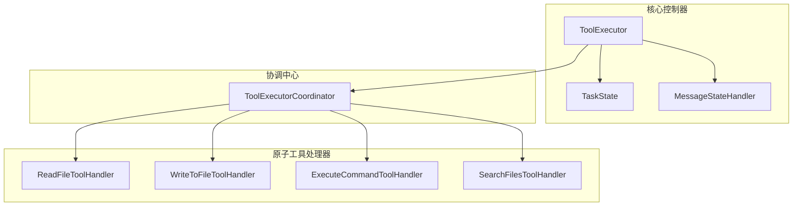
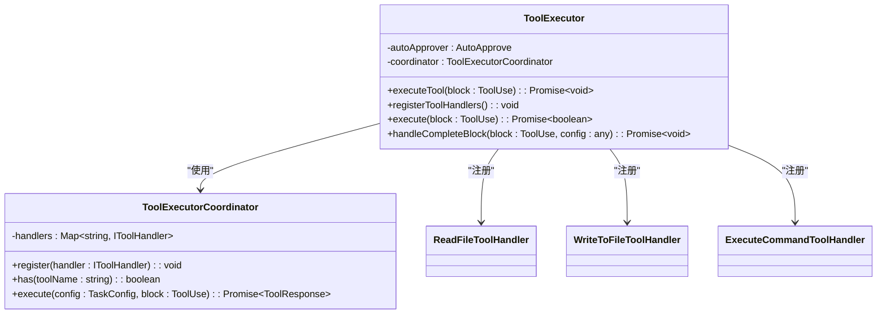
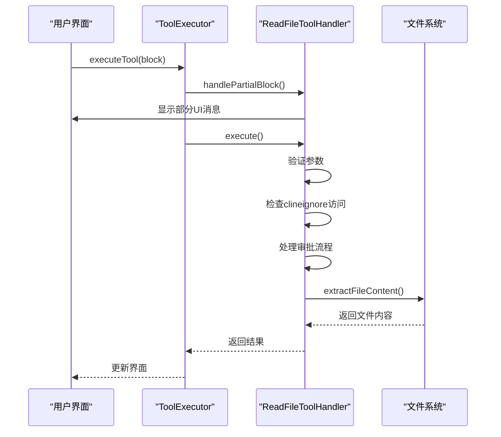
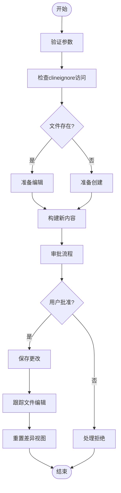
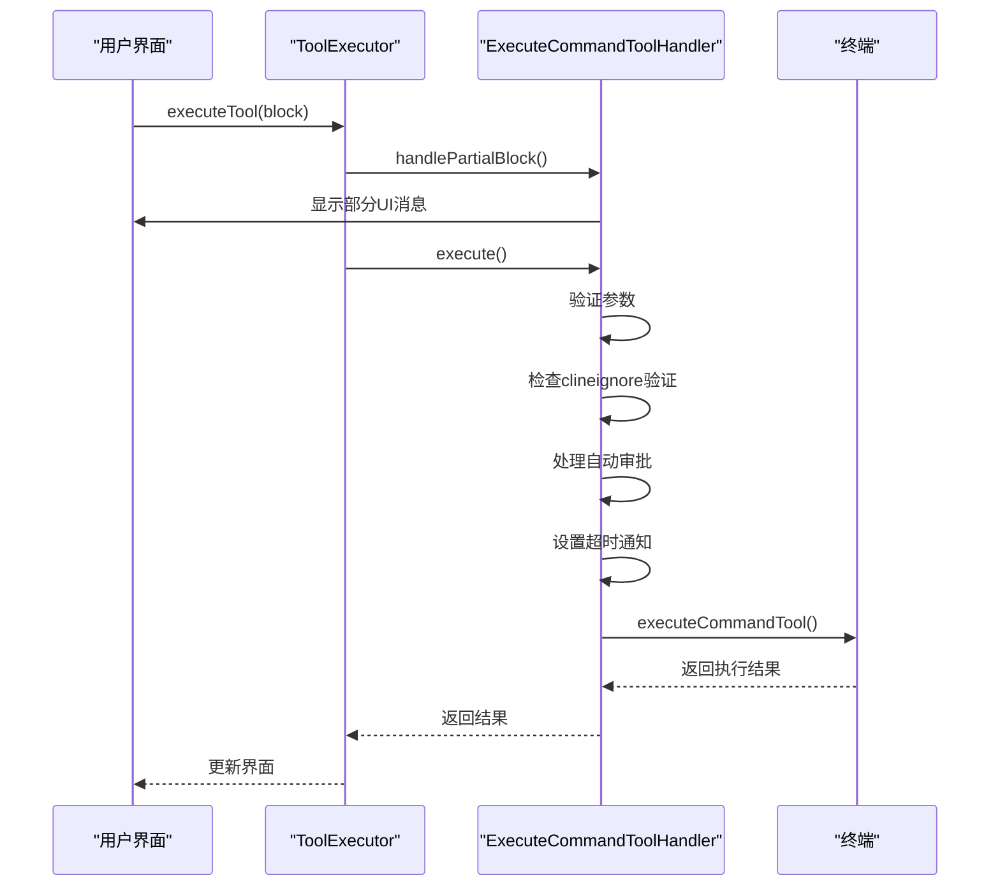
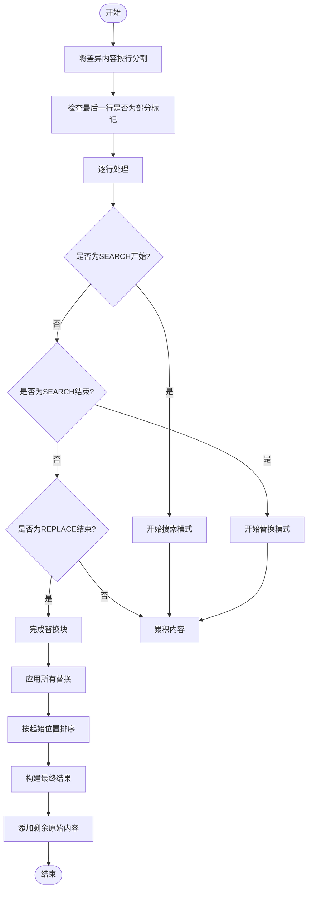
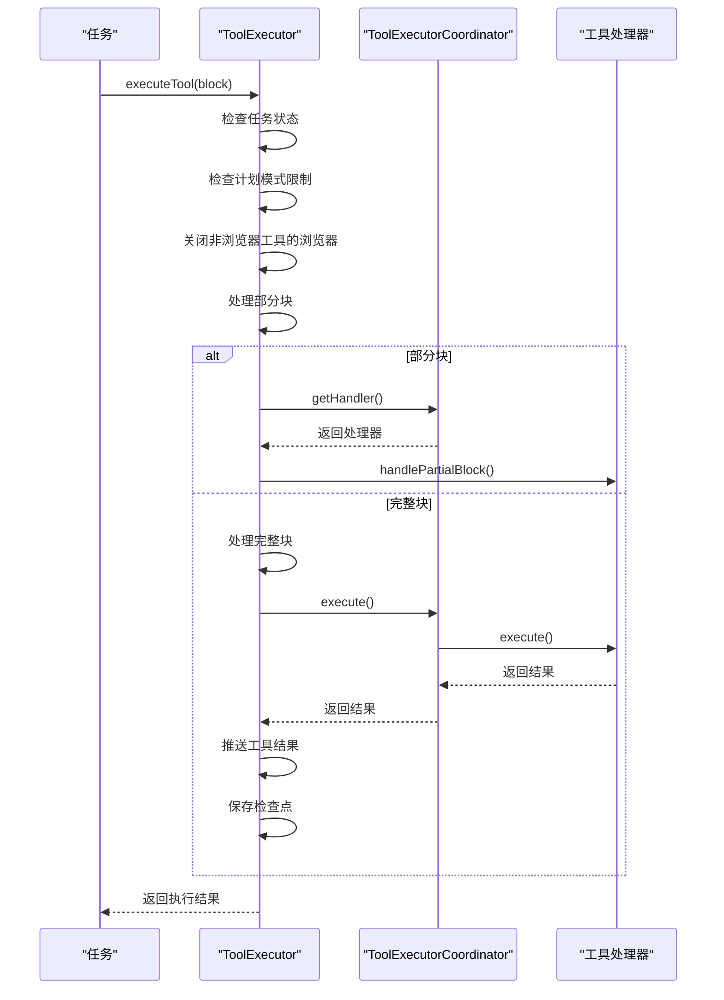
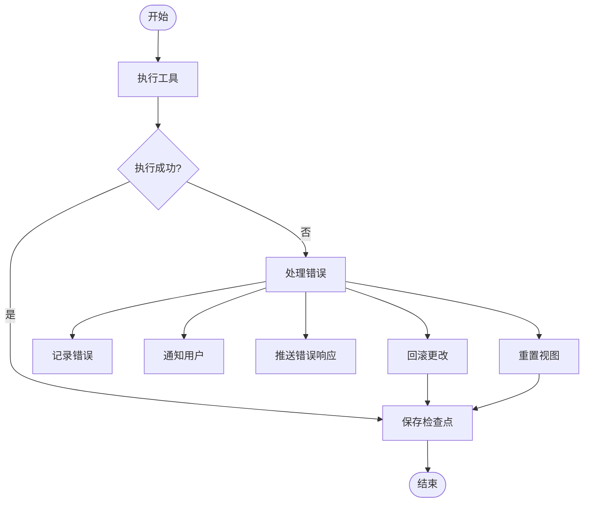
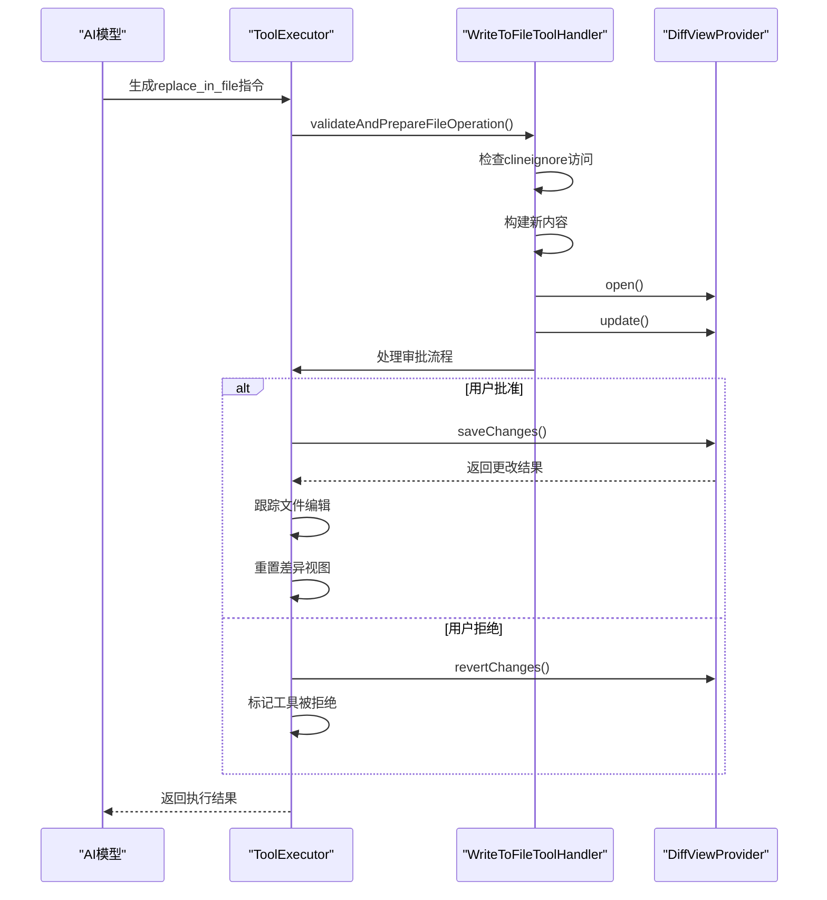
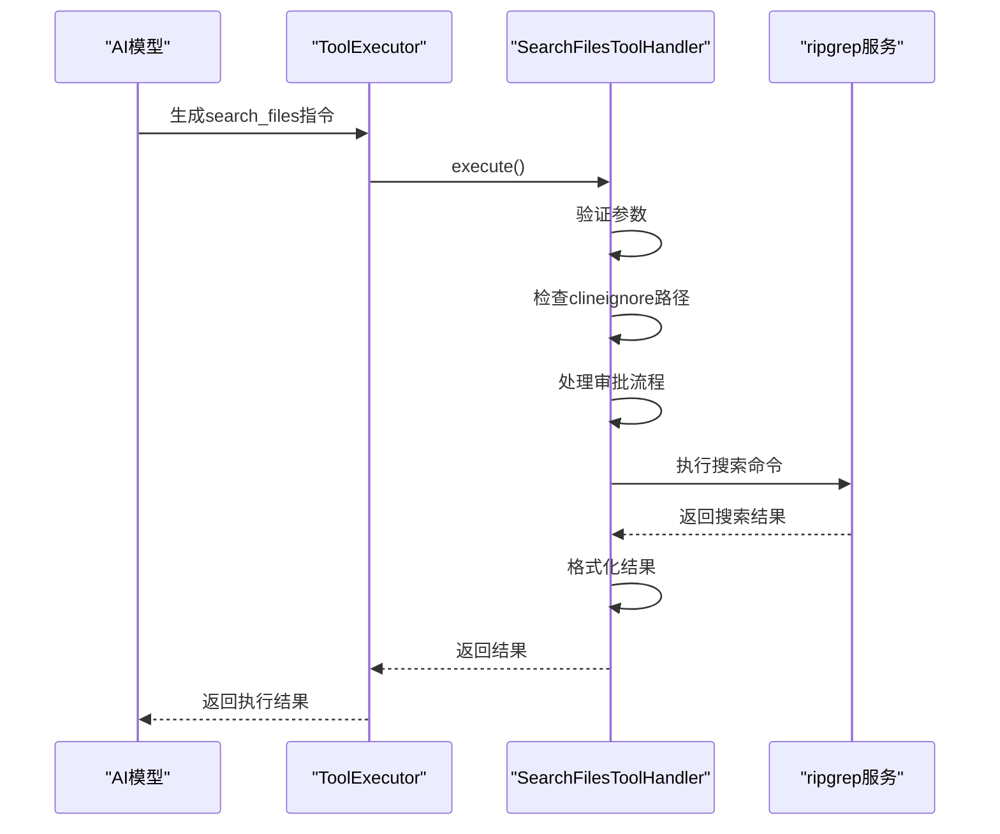

# 自主编码

<cite>
**本文档中引用的文件 **  
- [ToolExecutor.ts](file://src/core/task/ToolExecutor.ts)
- [ToolExecutorCoordinator.ts](file://src/core/task/tools/ToolExecutorCoordinator.ts)
- [ReadFileToolHandler.ts](file://src/core/task/tools/handlers/ReadFileToolHandler.ts)
- [WriteToFileToolHandler.ts](file://src/core/task/tools/handlers/WriteToFileToolHandler.ts)
- [ExecuteCommandToolHandler.ts](file://src/core/task/tools/handlers/ExecuteCommandToolHandler.ts)
- [diff.ts](file://src/core/assistant-message/diff.ts)
- [multifile-diff.ts](file://src/core/task/multifile-diff.ts)
- [CheckpointTracker.ts](file://src/integrations/checkpoints/CheckpointTracker.ts)
</cite>

## 目录
1. [简介](#简介)
2. [核心架构](#核心架构)
3. [核心组件分析](#核心组件分析)
4. [多文件差异处理流程](#多文件差异处理流程)
5. [工具执行协调机制](#工具执行协调机制)
6. [错误处理与回滚策略](#错误处理与回滚策略)
7. [实际调用链示例](#实际调用链示例)
8. [结论](#结论)

## 简介
本文档深入探讨了"自主编码"功能的实现机制，重点分析了`ToolExecutor`如何作为核心调度器，通过`ToolExecutorCoordinator`协调一系列原子工具（如`ReadFileToolHandler`、`WriteToFileToolHandler`、`ExecuteCommandToolHandler`）来完成复杂任务。文档详细解释了AI生成的多文件差异（multifile diff）如何被解析、验证并应用到代码库中，提供了从用户输入任务到代码变更落地的完整流程。同时，文档还讨论了错误处理机制和执行回滚策略，确保系统的稳定性和可靠性。

## 核心架构
自主编码功能的核心架构围绕`ToolExecutor`和`ToolExecutorCoordinator`构建，形成了一个分层的调度和执行系统。`ToolExecutor`作为主控制器，负责管理任务状态、配置和回调，而`ToolExecutorCoordinator`则作为工具处理器的注册中心，负责路由和执行具体的工具调用。

**Diagram sources**
- [ToolExecutor.ts](file://src/core/task/ToolExecutor.ts#L50-L405)
- [ToolExecutorCoordinator.ts](file://src/core/task/tools/ToolExecutorCoordinator.ts#L47-L81)

**Section sources**
- [ToolExecutor.ts](file://src/core/task/ToolExecutor.ts#L50-L405)
- [ToolExecutorCoordinator.ts](file://src/core/task/tools/ToolExecutorCoordinator.ts#L47-L81)

## 核心组件分析
### ToolExecutor 分析
`ToolExecutor`是自主编码功能的核心调度器，负责协调和管理所有工具的执行。它通过`ToolExecutorCoordinator`注册和管理各种工具处理器，并根据任务需求调度相应的工具。

**Diagram sources**
- [ToolExecutor.ts](file://src/core/task/ToolExecutor.ts#L50-L405)
- [ToolExecutorCoordinator.ts](file://src/core/task/tools/ToolExecutorCoordinator.ts#L47-L81)

**Section sources**
- [ToolExecutor.ts](file://src/core/task/ToolExecutor.ts#L50-L405)

### 原子工具处理器分析
#### 文件读取处理器
`ReadFileToolHandler`负责处理文件读取操作，它实现了`IFullyManagedTool`接口，能够处理部分和完整的工具调用。

**Diagram sources**
- [ReadFileToolHandler.ts](file://src/core/task/tools/handlers/ReadFileToolHandler.ts#L16-L124)

**Section sources**
- [ReadFileToolHandler.ts](file://src/core/task/tools/handlers/ReadFileToolHandler.ts#L16-L124)

#### 文件写入处理器
`WriteToFileToolHandler`负责处理文件写入操作，支持`write_to_file`、`replace_in_file`和`new_rule`三种操作。

**Diagram sources**
- [WriteToFileToolHandler.ts](file://src/core/task/tools/handlers/WriteToFileToolHandler.ts#L21-L422)

**Section sources**
- [WriteToFileToolHandler.ts](file://src/core/task/tools/handlers/WriteToFileToolHandler.ts#L21-L422)

#### 命令执行处理器
`ExecuteCommandToolHandler`负责执行命令行操作，确保命令的安全性和可控性。

**Diagram sources**
- [ExecuteCommandToolHandler.ts](file://src/core/task/tools/handlers/ExecuteCommandToolHandler.ts#L16-L146)

**Section sources**
- [ExecuteCommandToolHandler.ts](file://src/core/task/tools/handlers/ExecuteCommandToolHandler.ts#L16-L146)

## 多文件差异处理流程
自主编码功能通过`constructNewFileContent`函数处理AI生成的多文件差异，确保差异能够被正确解析和应用。

**Diagram sources**
- [diff.ts](file://src/core/assistant-message/diff.ts#L0-L799)

**Section sources**
- [diff.ts](file://src/core/assistant-message/diff.ts#L0-L799)

## 工具执行协调机制
`ToolExecutor`通过`ToolExecutorCoordinator`实现工具执行的协调机制，确保各种工具能够有序、安全地执行。

**Diagram sources**
- [ToolExecutor.ts](file://src/core/task/ToolExecutor.ts#L50-L405)
- [ToolExecutorCoordinator.ts](file://src/core/task/tools/ToolExecutorCoordinator.ts#L47-L81)

**Section sources**
- [ToolExecutor.ts](file://src/core/task/ToolExecutor.ts#L50-L405)

## 错误处理与回滚策略
系统实现了完善的错误处理和回滚策略，确保在出现问题时能够及时恢复。

**Diagram sources**
- [WriteToFileToolHandler.ts](file://src/core/task/tools/handlers/WriteToFileToolHandler.ts#L21-L422)
- [CheckpointTracker.ts](file://src/integrations/checkpoints/CheckpointTracker.ts#L235-L263)

**Section sources**
- [WriteToFileToolHandler.ts](file://src/core/task/tools/handlers/WriteToFileToolHandler.ts#L21-L422)
- [CheckpointTracker.ts](file://src/integrations/checkpoints/CheckpointTracker.ts#L235-L263)

## 实际调用链示例
### replace_in_file 调用链
当AI生成`replace_in_file`指令时，系统会按照以下流程执行：

**Diagram sources**
- [WriteToFileToolHandler.ts](file://src/core/task/tools/handlers/WriteToFileToolHandler.ts#L21-L422)

**Section sources**
- [WriteToFileToolHandler.ts](file://src/core/task/tools/handlers/WriteToFileToolHandler.ts#L21-L422)

### search_files 调用链
当AI生成`search_files`指令时，系统会按照以下流程执行：

**Diagram sources**
- [SearchFilesToolHandler.ts](file://src/core/task/tools/handlers/SearchFilesToolHandler.ts)
- [ripgrep.ts](file://src/services/ripgrep/index.ts)

**Section sources**
- [SearchFilesToolHandler.ts](file://src/core/task/tools/handlers/SearchFilesToolHandler.ts)

## 结论
自主编码功能通过`ToolExecutor`和`ToolExecutorCoordinator`构建了一个高效、安全的工具执行框架。系统能够准确解析和应用AI生成的多文件差异，通过完善的错误处理和回滚策略确保代码变更的安全性。各种原子工具处理器（如`ReadFileToolHandler`、`WriteToFileToolHandler`、`ExecuteCommandToolHandler`）协同工作，实现了从用户输入到代码变更落地的完整闭环。这一架构不仅提高了开发效率，还确保了代码质量和系统稳定性。