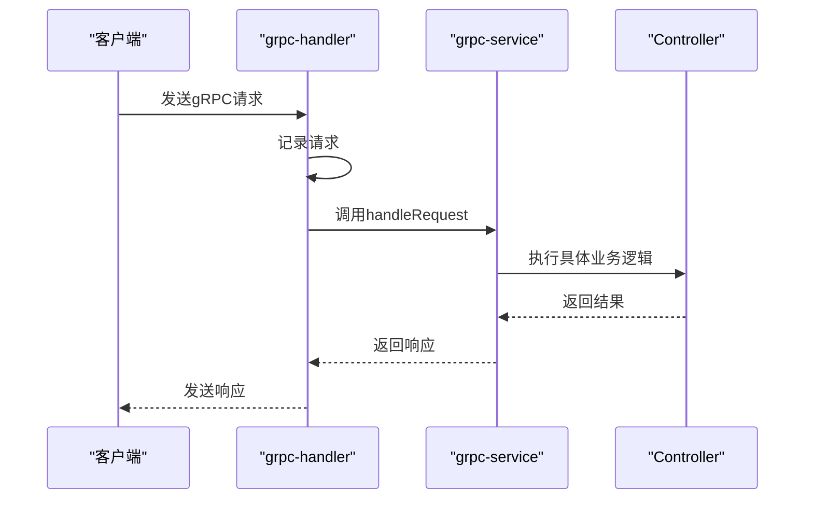
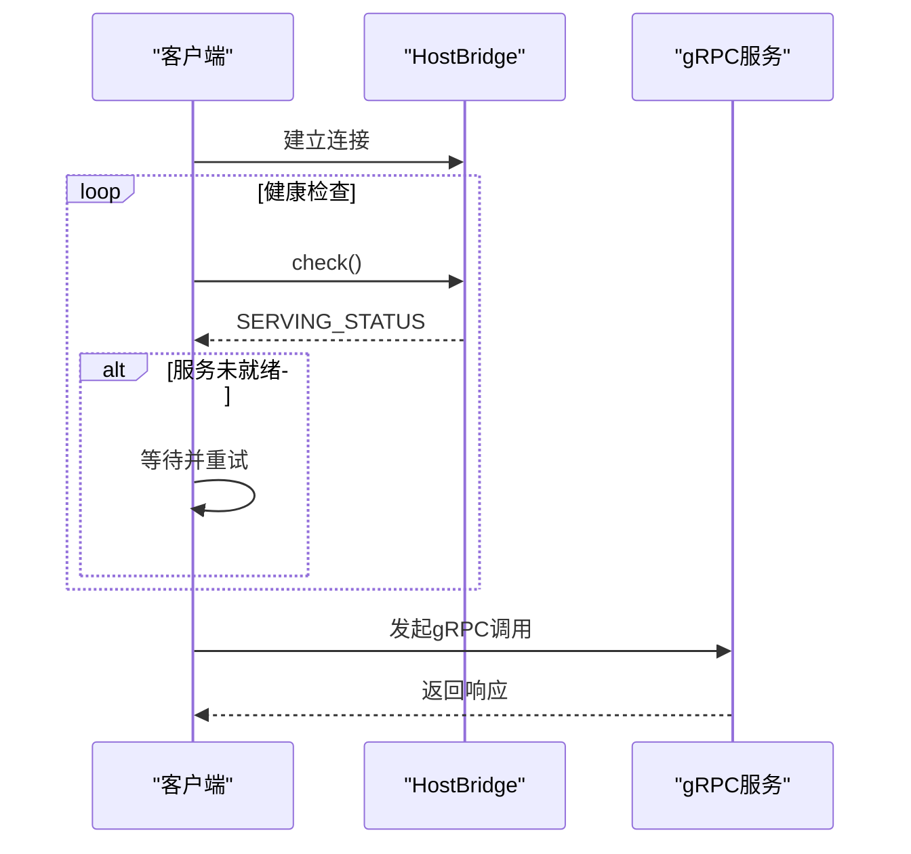
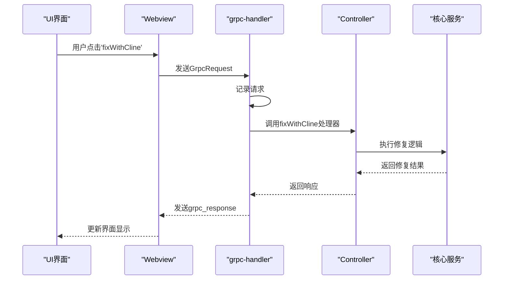

# gRPC通信机制

<cite>
**本文档中引用的文件**  
- [account.proto](file://proto/cline/account.proto)
- [diff.proto](file://proto/host/diff.proto)
- [grpc-handler.ts](file://src/core/controller/grpc-handler.ts)
- [grpc-service.ts](file://src/core/controller/grpc-service.ts)
- [hostbridge-client.ts](file://src/standalone/hostbridge-client.ts)
</cite>

## 目录
1. [引言](#引言)
2. [Protocol Buffers与接口定义](#protocol-buffers与接口定义)
3. [gRPC服务端实现](#grpc服务端实现)
4. [gRPC客户端调用](#grpc客户端调用)
5. 'fixWithCline'任务通信流程
6. 错误处理与超时配置
7. 双向流式通信
8. 调试技巧与工具推荐
9. 结论

## 引言
本文档深入探讨了VS Code扩展与核心服务之间基于gRPC的高效、类型安全的通信机制。通过分析Protocol Buffers接口定义、gRPC服务端与客户端的实现，详细阐述了系统如何实现跨进程通信，确保数据传输的可靠性与性能。

## Protocol Buffers与接口定义
Protocol Buffers（简称Protobuf）是gRPC通信的基础，用于定义服务接口和消息结构。在本项目中，`account.proto`和`diff.proto`文件分别定义了账户服务和差异视图服务的接口。

`account.proto`定义了账户相关的操作，包括用户登录、登出、认证状态订阅、获取用户积分等。该文件使用`service`关键字定义`AccountService`，其中每个`rpc`方法对应一个远程过程调用，如`getUserCredits`用于获取用户积分数据。

`diff.proto`则定义了差异视图服务，提供打开差异视图、获取文档内容、替换文本、滚动差异等操作。`DiffService`中的`openMultiFileDiff`方法支持在内存中显示多个文件的前后状态对比。

这些`.proto`文件通过`protoc`编译器生成类型安全的客户端和服务端代码，确保通信双方对消息格式有统一的理解。

**Section sources**
- [account.proto](file://proto/cline/account.proto#L1-L135)
- [diff.proto](file://proto/host/diff.proto#L1-L107)

## gRPC服务端实现
gRPC服务端的实现主要由`grpc-handler.ts`和`grpc-service.ts`两个文件构成，负责处理来自客户端的请求并返回响应。

`grpc-handler.ts`是gRPC请求的入口点，`handleGrpcRequest`函数根据请求类型（流式或非流式）分发到相应的处理函数。对于非流式请求，调用`handleUnaryRequest`；对于流式请求，则调用`handleStreamingRequest`。该文件还实现了请求记录功能，通过`GrpcRecorderBuilder`对请求和响应进行日志记录，便于调试和监控。

`grpc-service.ts`定义了`ServiceRegistry`类，用于注册和管理服务方法。通过`createServiceRegistry`工厂函数创建服务注册表，支持注册普通方法和流式方法。`ServiceRegistry`维护了方法元数据，能够区分流式和非流式方法，并在处理请求时进行正确的路由。

**Diagram sources**
- [grpc-handler.ts](file://src/core/controller/grpc-handler.ts#L1-L202)
- [grpc-service.ts](file://src/core/controller/grpc-service.ts#L1-L153)

**Section sources**
- [grpc-handler.ts](file://src/core/controller/grpc-handler.ts#L1-L202)
- [grpc-service.ts](file://src/core/controller/grpc-service.ts#L1-L153)

## gRPC客户端调用
客户端通过`hostbridge-client.ts`文件与gRPC服务进行通信。该文件提供了`waitForHostBridgeReady`函数，用于等待HostBridge服务就绪，通过健康检查机制确保服务可用性。

客户端使用`@grpc/grpc-js`库创建gRPC通道和客户端实例。`BaseGrpcClient`抽象类提供了连接管理、自动重连和错误处理的通用逻辑，确保客户端在网络故障后能够自动恢复。

**Diagram sources**
- [hostbridge-client.ts](file://src/standalone/hostbridge-client.ts#L1-L49)

**Section sources**
- [hostbridge-client.ts](file://src/standalone/hostbridge-client.ts#L1-L49)

## 'fixWithCline'任务通信流程
以'fixWithCline'任务为例，展示从UI发出到后端执行的完整通信流程。

**Diagram sources**
- [grpc-handler.ts](file://src/core/controller/grpc-handler.ts#L1-L202)
- [controller中的fixWithCline实现](file://src/core/controller/commands/fixWithCline.ts)

## 错误处理与超时配置
系统实现了完善的错误处理机制。在`grpc-handler.ts`中，所有服务调用都被包裹在try-catch块中，捕获的错误会被转换为包含错误消息的响应发送回客户端。

超时配置通过gRPC客户端的调用选项实现，可以在发起请求时指定超时时间。服务端也会对长时间运行的操作进行超时控制，避免资源占用。

**Section sources**
- [grpc-handler.ts](file://src/core/controller/grpc-handler.ts#L1-L202)

## 双向流式通信
对于需要持续通信的场景，系统支持双向流式通信。`account.proto`中的`subscribeToAuthStatusUpdate`方法就是一个典型的流式RPC，服务端可以持续向客户端推送认证状态更新。

流式通信通过`StreamingResponseHandler`接口实现，允许服务端在处理过程中多次发送响应，直到流结束。`isLast`参数用于标识是否为最后一条消息，`sequenceNumber`用于消息排序。

**Section sources**
- [account.proto](file://proto/cline/account.proto#L1-L135)
- [grpc-handler.ts](file://src/core/controller/grpc-handler.ts#L1-L202)

## 调试技巧与工具推荐
调试gRPC通信时，可以利用以下技巧和工具：

1. 启用`GrpcRecorder`记录所有请求和响应，便于分析通信内容
2. 使用gRPC CLI工具直接调用服务接口进行测试
3. 查看服务端日志，特别是错误堆栈信息
4. 使用网络抓包工具分析gRPC流量

推荐使用gRPCurl命令行工具，它类似于curl，但专为gRPC设计，可以方便地测试gRPC服务。

## 结论
本文档详细介绍了基于gRPC的通信机制，从Protocol Buffers接口定义到服务端和客户端的实现，再到具体的通信流程和错误处理。该机制确保了VS Code扩展与核心服务之间的高效、类型安全的通信，为系统的稳定运行提供了坚实的基础。