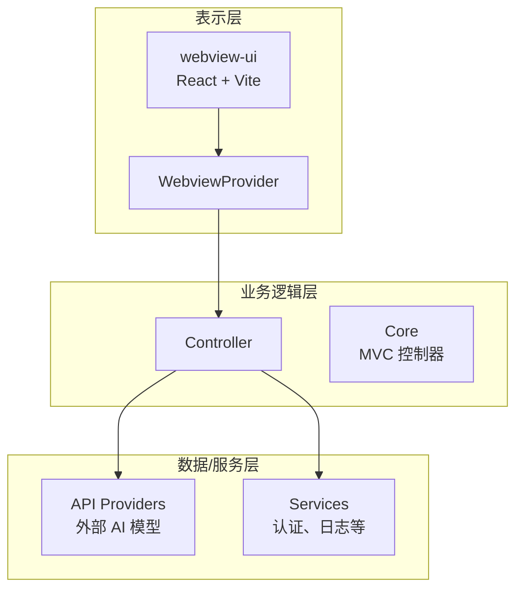
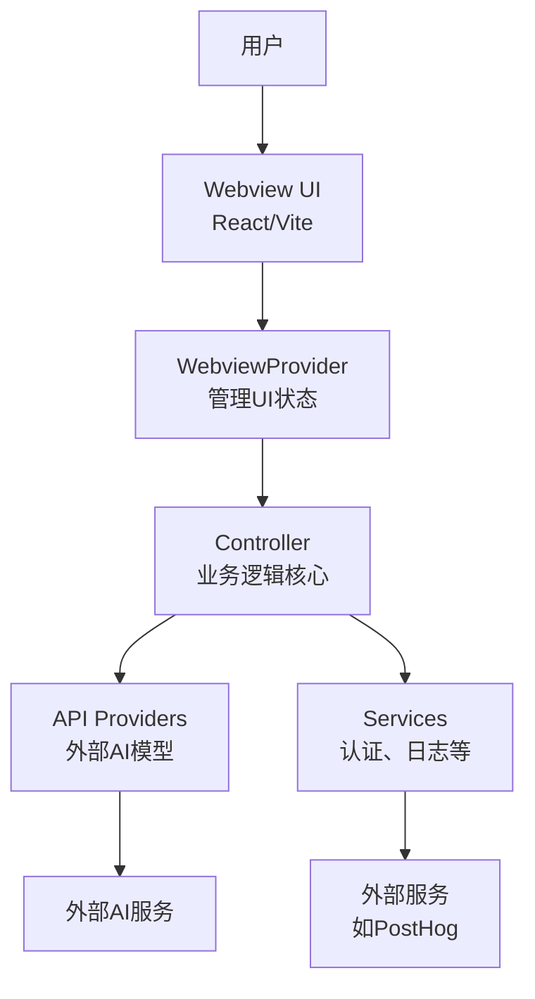
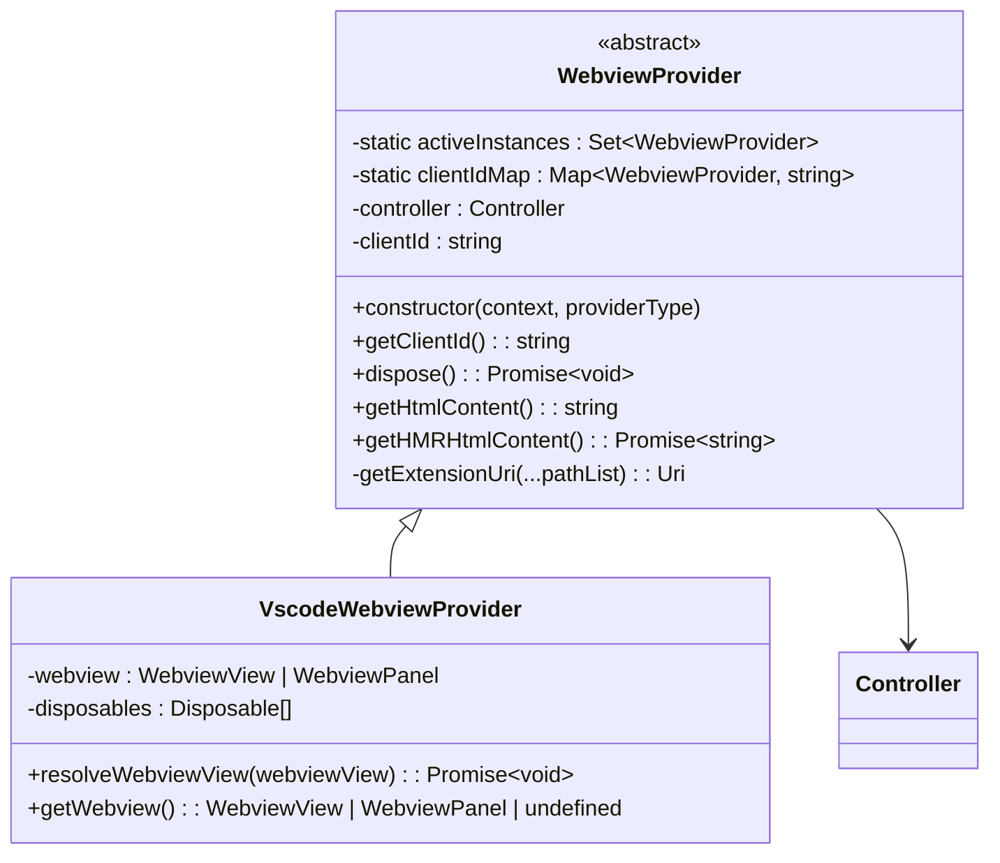
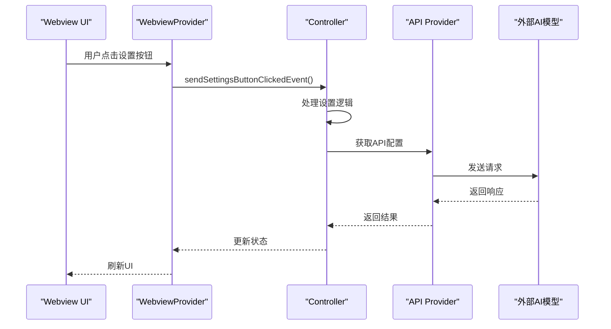
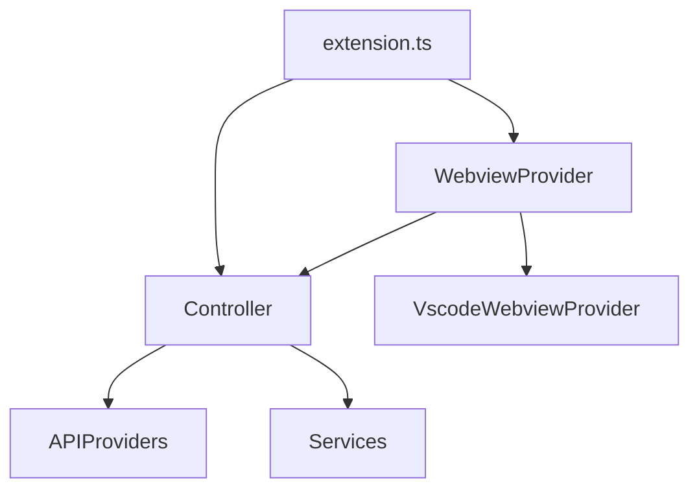

# 架构概览

<cite>
**本文档中引用的文件**  
- [extension.ts](file://src/extension.ts)
- [WebviewProvider.ts](file://src/core/webview/WebviewProvider.ts)
- [VscodeWebviewProvider.ts](file://src/hosts/vscode/VscodeWebviewProvider.ts)
- [types.ts](file://src/shared/webview/types.ts)
- [subscribeToSettingsButtonClicked.ts](file://src/core/controller/ui/subscribeToSettingsButtonClicked.ts)
- [controller/index.ts](file://src/core/controller/index.ts)
</cite>

## 目录
1. [简介](#简介)
2. [项目结构](#项目结构)
3. [核心组件](#核心组件)
4. [架构概述](#架构概述)
5. [详细组件分析](#详细组件分析)
6. [依赖分析](#依赖分析)
7. [性能考虑](#性能考虑)
8. [故障排除指南](#故障排除指南)
9. [结论](#结论)

## 简介
cline 是一个基于 MVC 与分层架构设计的 VS Code 扩展，旨在通过集成 AI 模型提升开发效率。该系统采用清晰的三层架构：表示层（Webview UI）负责用户界面展示，业务逻辑层（Core Controller）处理用户指令并协调任务执行，数据/服务层（API Providers）负责与外部 AI 模型通信。本文档将深入解析其架构设计，重点阐述 `extension.ts` 作为主入口点如何初始化 Webview 和控制器，`WebviewProvider` 如何管理 UI 状态，以及 `Controller` 如何将用户操作转化为具体任务。通过系统上下文图和容器图，我们将说明各主要组件的职责和交互方式，并为初学者提供简单易懂的比喻，同时为高级开发者提供技术深度。

## 项目结构
cline 项目采用模块化设计，文件组织清晰，遵循功能划分原则。核心代码位于 `src` 目录下，主要分为 `core`（核心逻辑）、`hosts`（宿主环境适配）、`services`（服务层）和 `webview-ui`（前端界面）等模块。`core` 目录包含控制器、API 提供者和上下文管理等核心组件；`hosts` 目录实现与 VS Code 等宿主环境的桥接；`webview-ui` 是一个独立的 React 应用，使用 Vite 构建，负责用户界面的渲染。这种分层结构确保了代码的高内聚低耦合，便于维护和扩展。

**图示来源**  
- [extension.ts](file://src/extension.ts#L1-L598)
- [WebviewProvider.ts](file://src/core/webview/WebviewProvider.ts#L1-L324)

**本节来源**  
- [extension.ts](file://src/extension.ts#L1-L598)
- [WebviewProvider.ts](file://src/core/webview/WebviewProvider.ts#L1-L324)

## 核心组件
cline 的核心组件包括 `extension.ts`、`WebviewProvider` 和 `Controller`。`extension.ts` 作为主入口点，在 VS Code 扩展激活时负责初始化整个系统，注册命令和事件处理器。`WebviewProvider` 是 Webview 的管理器，负责创建和管理 Webview 实例，处理 UI 状态和与宿主环境的交互。`Controller` 是业务逻辑的核心，接收来自 Webview 的用户指令，协调任务执行，并与外部服务通信。这些组件共同构成了 cline 的 MVC 架构，实现了关注点分离。

**本节来源**  
- [extension.ts](file://src/extension.ts#L1-L598)
- [WebviewProvider.ts](file://src/core/webview/WebviewProvider.ts#L1-L324)
- [controller/index.ts](file://src/core/controller/index.ts#L1-L100)

## 架构概述
cline 采用经典的 MVC（Model-View-Controller）模式与分层架构相结合的设计。表示层由 `webview-ui` 构建，使用 React 和 Vite 创建动态的用户界面。业务逻辑层由 `Controller` 类实现，负责处理用户指令、管理任务状态和协调各组件间的交互。数据/服务层包含多个 `API Providers`，它们封装了与不同外部 AI 模型（如 Anthropic、OpenAI 等）的通信逻辑。`extension.ts` 作为系统的入口点，负责初始化 `WebviewProvider` 和 `Controller`，建立各层之间的连接。

**图示来源**  
- [extension.ts](file://src/extension.ts#L1-L598)
- [WebviewProvider.ts](file://src/core/webview/WebviewProvider.ts#L1-L324)
- [controller/index.ts](file://src/core/controller/index.ts#L1-L100)

## 详细组件分析
### WebviewProvider 分析
`WebviewProvider` 是 cline 架构中的关键组件，它作为表示层与业务逻辑层之间的桥梁。该类是一个抽象基类，定义了 Webview 的通用行为，如获取 Webview URI、生成内容安全策略（CSP）和管理实例生命周期。在 VS Code 环境中，`VscodeWebviewProvider` 继承自 `WebviewProvider`，实现了具体的平台适配逻辑。`WebviewProvider` 负责创建 `Controller` 实例，并通过 `getHtmlContent` 方法注入 React 应用的构建产物，从而将前端界面与后端逻辑连接起来。

#### 类图

**图示来源**  
- [WebviewProvider.ts](file://src/core/webview/WebviewProvider.ts#L1-L324)
- [VscodeWebviewProvider.ts](file://src/hosts/vscode/VscodeWebviewProvider.ts#L1-L100)

**本节来源**  
- [WebviewProvider.ts](file://src/core/webview/WebviewProvider.ts#L1-L324)
- [VscodeWebviewProvider.ts](file://src/hosts/vscode/VscodeWebviewProvider.ts#L1-L100)

### Controller 分析
`Controller` 是 cline 的业务逻辑核心，它接收来自 `WebviewProvider` 的用户指令，执行相应的操作，并将结果返回给 UI。`Controller` 通过订阅机制与 UI 保持通信，例如 `subscribeToSettingsButtonClicked` 会监听设置按钮的点击事件，并触发相应的处理逻辑。`Controller` 还负责管理任务状态、调用 API 提供者与外部 AI 模型通信，并处理错误和异常情况。它是 MVC 模式中的 "C"（Controller），协调模型和视图之间的交互。

#### 序列图

**图示来源**  
- [extension.ts](file://src/extension.ts#L1-L598)
- [subscribeToSettingsButtonClicked.ts](file://src/core/controller/ui/subscribeToSettingsButtonClicked.ts#L1-L30)
- [controller/index.ts](file://src/core/controller/index.ts#L1-L100)

**本节来源**  
- [extension.ts](file://src/extension.ts#L1-L598)
- [subscribeToSettingsButtonClicked.ts](file://src/core/controller/ui/subscribeToSettingsButtonClicked.ts#L1-L30)
- [controller/index.ts](file://src/core/controller/index.ts#L1-L100)

## 依赖分析
cline 的组件间依赖关系清晰，体现了良好的分层设计。`extension.ts` 依赖于 `WebviewProvider` 和 `Controller`，负责它们的初始化和注册。`WebviewProvider` 依赖于 `Controller` 来处理业务逻辑，并依赖于 `VscodeWebviewProvider` 实现平台特定的功能。`Controller` 依赖于各种 `API Providers` 来与外部服务通信，并依赖于 `services` 模块提供的认证、日志等功能。这种依赖关系确保了各层之间的松耦合，使得系统易于测试和维护。

**图示来源**  
- [extension.ts](file://src/extension.ts#L1-L598)
- [WebviewProvider.ts](file://src/core/webview/WebviewProvider.ts#L1-L324)
- [controller/index.ts](file://src/core/controller/index.ts#L1-L100)

**本节来源**  
- [extension.ts](file://src/extension.ts#L1-L598)
- [WebviewProvider.ts](file://src/core/webview/WebviewProvider.ts#L1-L324)
- [controller/index.ts](file://src/core/controller/index.ts#L1-L100)

## 性能考虑
cline 在性能方面做了多项优化。首先，通过 `retainContextWhenHidden: true` 配置，Webview 在隐藏时保留上下文，避免了频繁的重新加载，提升了用户体验。其次，系统使用了内容安全策略（CSP）来限制资源加载，提高了安全性。此外，`Controller` 实例的复用和事件订阅机制减少了不必要的对象创建和内存消耗。对于与外部 AI 模型的通信，系统实现了重试机制和错误处理，确保了在高负载或网络不稳定情况下的稳定性。

## 故障排除指南
当 cline 出现问题时，可以按照以下步骤进行排查：
1. **检查 Webview 是否正常加载**：确认 `getHtmlContent` 方法是否正确生成了 HTML，并且资源路径是否正确。
2. **验证 Controller 初始化**：检查 `extension.ts` 中的 `initialize` 函数是否成功返回了 `VscodeWebviewProvider` 实例。
3. **检查事件订阅**：确认 `Controller` 中的事件订阅（如 `subscribeToSettingsButtonClicked`）是否正确注册。
4. **查看日志输出**：利用 `Logger` 服务输出的日志信息，定位问题发生的具体位置。
5. **验证外部服务连接**：如果涉及 API 调用，检查网络连接和认证信息是否正确。

**本节来源**  
- [extension.ts](file://src/extension.ts#L1-L598)
- [WebviewProvider.ts](file://src/core/webview/WebviewProvider.ts#L1-L324)
- [Logger](file://src/services/logging/Logger.ts#L1-L50)

## 结论
cline 通过采用 MVC 与分层架构设计，成功构建了一个高效、可维护的 VS Code 扩展。其清晰的组件划分和职责分离，使得系统易于理解和扩展。`extension.ts` 作为主入口点，`WebviewProvider` 作为 UI 管理器，`Controller` 作为业务逻辑核心，三者协同工作，实现了从用户交互到任务执行的完整流程。该架构不仅为初学者提供了直观的理解模型，也为高级开发者提供了深入的技术细节，是一个优秀的现代软件架构实践案例。