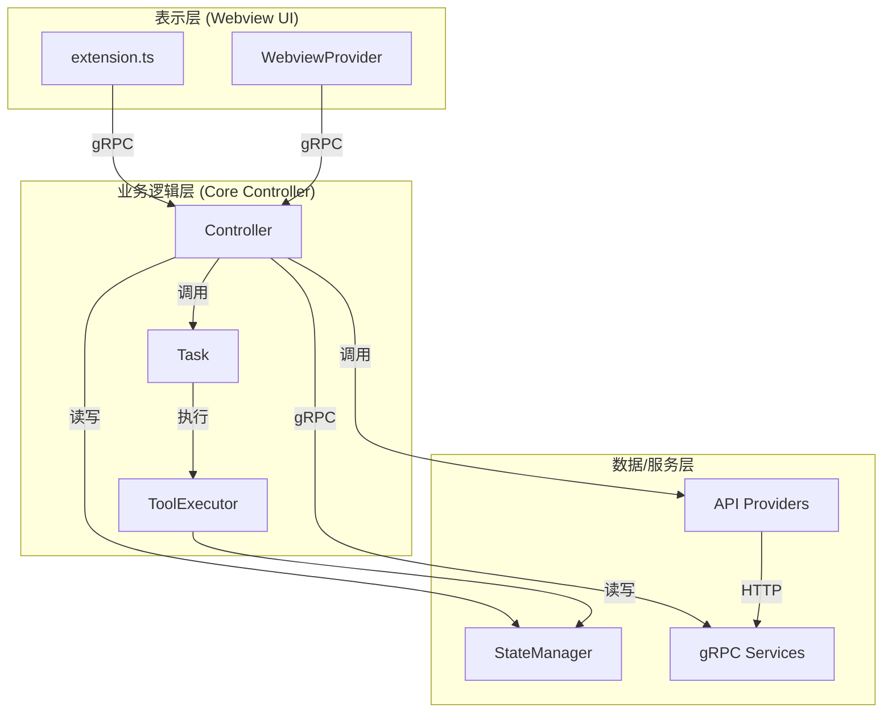
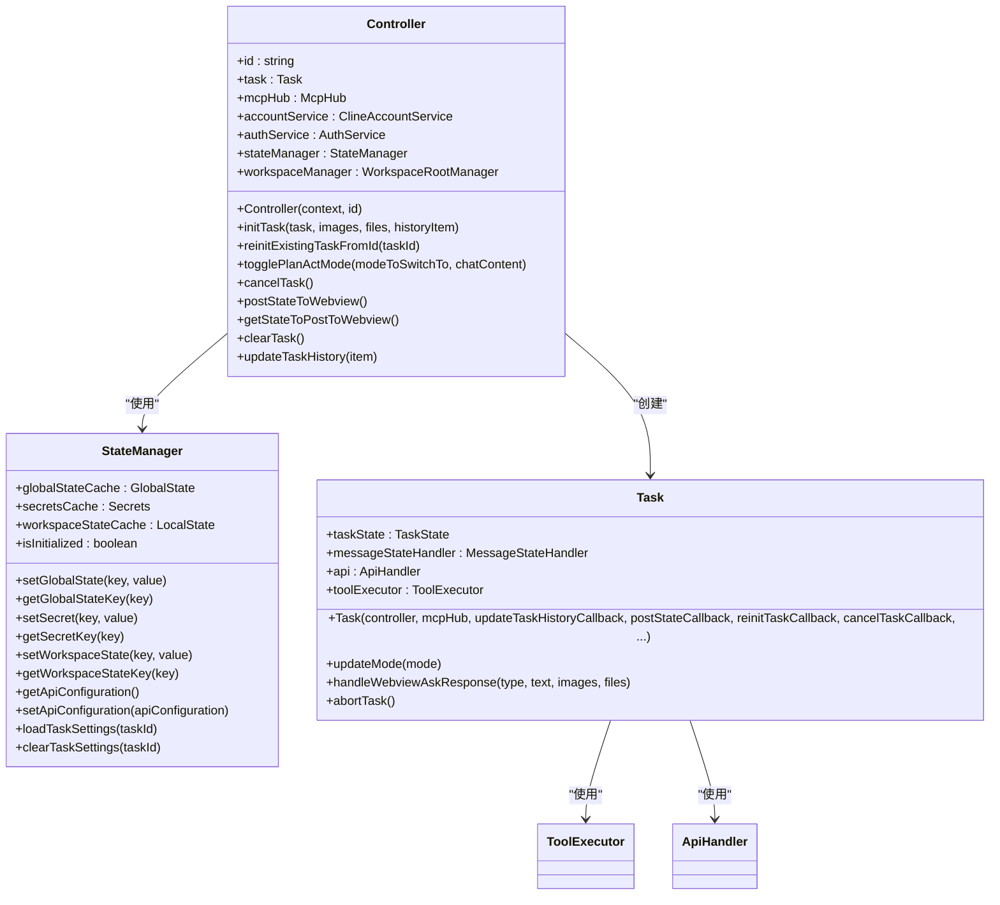
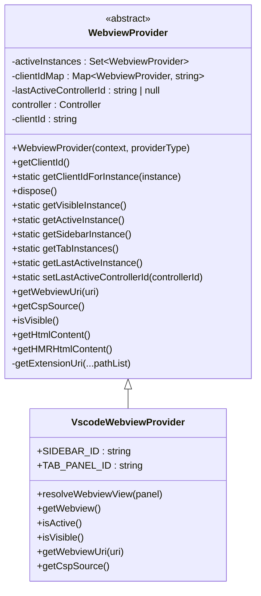
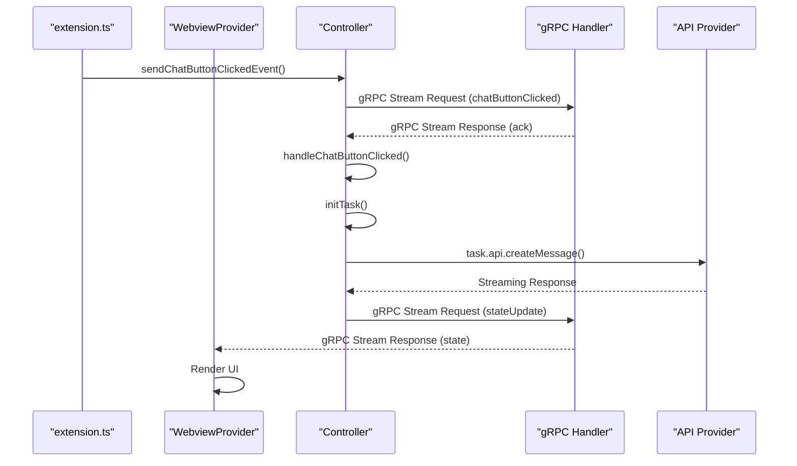
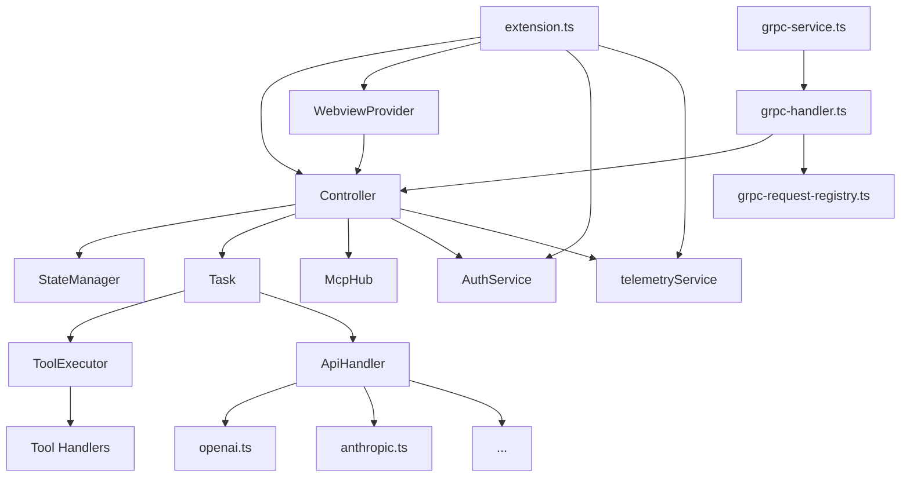

# 核心架构

<cite>
**本文档中引用的文件**  
- [extension.ts](file://src/extension.ts)
- [WebviewProvider.ts](file://src/core/webview/WebviewProvider.ts)
- [index.ts](file://src/core/controller/index.ts)
- [StateManager.ts](file://src/core/storage/StateManager.ts)
- [web.proto](file://proto/cline/web.proto)
- [openai.ts](file://src/core/api/providers/openai.ts)
- [initializeWebview.ts](file://src/core/controller/ui/initializeWebview.ts)
</cite>

## 目录
1. [引言](#引言)
2. [项目结构](#项目结构)
3. [核心组件](#核心组件)
4. [架构概述](#架构概述)
5. [详细组件分析](#详细组件分析)
6. [依赖分析](#依赖分析)
7. [性能考虑](#性能考虑)
8. [故障排除指南](#故障排除指南)
9. [结论](#结论)

## 引言

cline 是一个基于 VS Code 扩展的智能开发助手，其核心架构采用 MVC（Model-View-Controller）与分层架构相结合的设计模式。该架构旨在实现表示层、业务逻辑层和数据/服务层之间的清晰分离，从而支持可扩展性、可维护性以及与 VS Code 的松耦合集成。本权威文档将深入解析 cline 的核心架构，重点阐述其三个核心层次：表示层（Webview UI）、业务逻辑层（Core Controller）和数据/服务层（API Providers, gRPC Services）。文档将详细说明 gRPC 和 Protocol Buffers 在组件间通信中的关键作用，特别是 VS Code 扩展与底层核心服务之间的通信机制。此外，还将提供详细的组件图，解释状态管理（StateManager）如何在各层之间同步数据。

## 项目结构

cline 项目遵循清晰的模块化结构，将不同功能的代码组织在独立的目录中。核心功能主要集中在 `src` 目录下，其中 `core` 子目录包含了 MVC 架构的核心实现。`core` 目录下的 `controller`、`webview` 和 `storage` 等子目录分别对应了控制器、视图和模型层。`proto` 目录存放了所有使用 Protocol Buffers 定义的 gRPC 服务和消息，是跨层通信的契约。`api/providers` 目录则包含了与各种 AI 模型提供商（如 OpenAI, Anthropic 等）交互的客户端实现，构成了数据/服务层的重要部分。

```mermaid
graph TD
subgraph "src"
A[core] --> B[controller]
A --> C[webview]
A --> D[storage]
A --> E[api/providers]
A --> F[prompts]
A --> G[task]
end
subgraph "proto"
H[cline] --> I[web.proto]
H --> J[ui.proto]
H --> K[state.proto]
end
subgraph "hosts"
L[vscode] --> M[hostbridge]
end
A < --> H
A < --> L
```

**Diagram sources**
- [src](file://src)
- [proto](file://proto)
- [hosts](file://hosts)

**Section sources**
- [src](file://src)
- [proto](file://proto)

## 核心组件

cline 的核心组件围绕 MVC 模式构建。`WebviewProvider` 类是表示层的核心，负责管理嵌入在 VS Code 中的 Webview 界面，处理用户输入并渲染输出。`Controller` 类是业务逻辑层的中枢，它接收来自 `WebviewProvider` 的用户指令，协调各种服务（如 API 调用、文件操作、MCP 集成等）来执行复杂的任务。`StateManager` 类是模型层的关键，它提供了一个高性能的内存缓存，用于存储和同步应用状态、用户设置和任务历史，确保数据在各层之间的一致性。`grpc-service.ts` 和 `grpc-handler.ts` 文件则实现了 gRPC 服务器和处理器，是连接 VS Code 扩展与核心服务的桥梁。

**Section sources**
- [WebviewProvider.ts](file://src/core/webview/WebviewProvider.ts)
- [index.ts](file://src/core/controller/index.ts)
- [StateManager.ts](file://src/core/storage/StateManager.ts)
- [grpc-service.ts](file://src/core/controller/grpc-service.ts)
- [grpc-handler.ts](file://src/core/controller/grpc-handler.ts)

## 架构概述

cline 的架构是一个典型的分层系统，清晰地划分为表示层、业务逻辑层和数据/服务层。表示层由 `WebviewProvider` 实现，它通过 React 构建用户界面，并利用 gRPC 流式通信与控制器进行双向数据交换。业务逻辑层以 `Controller` 类为核心，它作为协调者，接收来自视图的请求，调用相应的服务（如 `ToolExecutor` 执行具体操作），并管理任务的生命周期。数据/服务层包含 `StateManager`（用于本地状态管理）和 `API Providers`（用于远程服务调用）。gRPC 和 Protocol Buffers 在此架构中扮演着至关重要的角色，它们定义了 `extension.ts` 与 `Controller` 之间的通信协议，确保了类型安全和高效的序列化。`StateManager` 通过内存缓存和异步持久化机制，在各层之间同步数据，保证了应用状态的实时性和一致性。



**Diagram sources**
- [extension.ts](file://src/extension.ts)
- [WebviewProvider.ts](file://src/core/webview/WebviewProvider.ts)
- [index.ts](file://src/core/controller/index.ts)
- [StateManager.ts](file://src/core/storage/StateManager.ts)

## 详细组件分析

### Controller 分析

`Controller` 类是 cline 业务逻辑的控制中心。它在初始化时会创建 `StateManager` 实例来管理应用状态，并通过 `initTask` 方法启动和管理具体的任务。`Controller` 暴露了一系列方法，如 `togglePlanActMode` 用于切换工作模式，`cancelTask` 用于取消当前任务，以及 `postStateToWebview` 用于将最新的应用状态推送到 Webview。它通过 `StateManager` 获取和更新配置（如 `getApiConfiguration`），并通过 `Task` 类来执行复杂的操作序列。



**Diagram sources**
- [index.ts](file://src/core/controller/index.ts#L1-L783)
- [StateManager.ts](file://src/core/storage/StateManager.ts#L1-L799)
- [ToolExecutor.ts](file://src/core/task/ToolExecutor.ts#L1-L407)

**Section sources**
- [index.ts](file://src/core/controller/index.ts)
- [StateManager.ts](file://src/core/storage/StateManager.ts)
- [ToolExecutor.ts](file://src/core/task/ToolExecutor.ts)

### WebviewProvider 分析

`WebviewProvider` 是 MVC 模式中的视图组件，负责在 VS Code 中创建和管理 Webview 界面。它继承自一个抽象基类，并为侧边栏（SIDEBAR）和标签页（TAB）两种视图类型提供具体实现。`WebviewProvider` 通过 `getHtmlContent` 方法生成 Webview 的 HTML 内容，其中注入了必要的脚本和样式。它利用 `nonce` 和严格的内容安全策略（CSP）来确保 Webview 的安全性。`dispose` 方法用于在 Webview 关闭时清理资源。`WebviewProvider` 通过事件（如 `sendChatButtonClickedEvent`）与 `Controller` 进行通信。



**Diagram sources**
- [WebviewProvider.ts](file://src/core/webview/WebviewProvider.ts#L1-L324)

**Section sources**
- [WebviewProvider.ts](file://src/core/webview/WebviewProvider.ts)

### gRPC 通信分析

gRPC 和 Protocol Buffers 是 cline 架构中实现高效、类型安全通信的基石。`.proto` 文件（如 `web.proto`）定义了服务接口和消息格式。`web.proto` 定义了一个 `WebService`，包含 `checkIsImageUrl`、`fetchOpenGraphData` 和 `openInBrowser` 等 RPC 方法。这些定义在构建时被编译成 TypeScript 代码，生成客户端和服务端的存根。`extension.ts` 中的命令处理器（如 `subscribeToChatButtonClicked`）会触发 gRPC 调用，这些调用由 `Controller` 中的 `grpc-handler.ts` 处理。这种基于协议的通信方式确保了 VS Code 扩展与核心逻辑之间的松耦合和高可靠性。



**Diagram sources**
- [extension.ts](file://src/extension.ts#L1-L599)
- [index.ts](file://src/core/controller/index.ts#L1-L783)
- [web.proto](file://proto/cline/web.proto#L1-L27)
- [openai.ts](file://src/core/api/providers/openai.ts#L1-L141)

**Section sources**
- [extension.ts](file://src/extension.ts)
- [index.ts](file://src/core/controller/index.ts)
- [web.proto](file://proto/cline/web.proto)
- [openai.ts](file://src/core/api/providers/openai.ts)

### StateManager 分析

`StateManager` 是 cline 的模型层，它提供了一个高性能的内存缓存，用于管理应用的全局状态、工作区状态和机密信息。它通过 `globalStateCache`、`workspaceStateCache` 和 `secretsCache` 三个对象来存储不同类型的数据。`StateManager` 的核心优势在于其异步持久化机制：对状态的修改会立即更新内存缓存，然后通过一个防抖（debounced）的定时器批量写入磁盘，这极大地提升了读写性能。`setGlobalState` 和 `getGlobalStateKey` 等方法提供了简洁的 API 来访问状态。`onPersistenceError` 回调用于处理持久化失败的情况，确保了数据的健壮性。

```mermaid
flowchart TD
A[应用启动] --> B[StateManager.initialize()]
B --> C[从磁盘加载状态到内存缓存]
C --> D[StateManager就绪]
E[调用 setGlobalState] --> F[立即更新 globalStateCache]
F --> G[将键加入 pendingGlobalState]
G --> H[scheduleDebouncedPersistence]
H --> I{等待 PERSISTENCE_DELAY_MS}
I --> J[调用 persistGlobalStateBatch]
J --> K[批量写入VS Code全局状态]
K --> L[清空 pendingGlobalState]
M[调用 getGlobalStateKey] --> N[直接从 globalStateCache 读取]
N --> O[返回值]
```

**Diagram sources**
- [StateManager.ts](file://src/core/storage/StateManager.ts#L1-L799)

**Section sources**
- [StateManager.ts](file://src/core/storage/StateManager.ts)

## 依赖分析

cline 项目通过清晰的依赖关系实现了模块化。`extension.ts` 作为入口点，依赖于 `core` 目录下的所有核心组件。`Controller` 类是依赖关系的中心，它直接依赖于 `StateManager`、`Task`、`McpHub` 和 `AuthService` 等服务。`WebviewProvider` 依赖于 `Controller` 来处理业务逻辑。`API Providers`（如 `openai.ts`）是独立的模块，它们被 `Controller` 或 `Task` 通过 `buildApiHandler` 工厂函数动态创建和使用。`proto` 目录是所有 gRPC 通信的基础，被 `grpc-handler` 和 `grpc-service` 所依赖。这种依赖结构确保了高内聚、低耦合，使得各个组件可以独立开发和测试。



**Diagram sources**
- [extension.ts](file://src/extension.ts#L1-L599)
- [index.ts](file://src/core/controller/index.ts#L1-L783)
- [StateManager.ts](file://src/core/storage/StateManager.ts#L1-L799)
- [ToolExecutor.ts](file://src/core/task/ToolExecutor.ts#L1-L407)
- [openai.ts](file://src/core/api/providers/openai.ts#L1-L141)

**Section sources**
- [extension.ts](file://src/extension.ts)
- [index.ts](file://src/core/controller/index.ts)
- [StateManager.ts](file://src/core/storage/StateManager.ts)
- [ToolExecutor.ts](file://src/core/task/ToolExecutor.ts)
- [openai.ts](file://src/core/api/providers/openai.ts)

## 性能考虑

cline 的架构在设计上充分考虑了性能。`StateManager` 的内存缓存机制避免了频繁的磁盘 I/O 操作，使得状态读取几乎瞬时完成。其防抖的持久化策略将多次小的写入操作合并为一次批量写入，显著减少了对 VS Code 状态 API 的调用次数。gRPC 的二进制序列化和流式传输特性，相比于传统的 REST API，提供了更低的延迟和更高的吞吐量，这对于实时更新 Webview 界面至关重要。`WebviewProvider` 使用 `retainContextWhenHidden` 选项，使得 Webview 在隐藏时不会被销毁，从而避免了每次切换时的重新加载开销。异步初始化和错误恢复机制也保证了应用在面对网络延迟或服务中断时的响应性。

## 故障排除指南

当遇到 cline 功能异常时，可以按照以下步骤进行排查：
1.  **检查日志**：首先查看 VS Code 的输出面板（Cline 输出通道），其中会记录详细的日志信息，包括错误堆栈。
2.  **状态管理器错误**：如果出现 "Failed to initialize StateManager" 错误，表明状态持久化失败。尝试重启 VS Code 扩展或整个编辑器。
3.  **gRPC 通信问题**：如果 Webview 无响应或按钮点击无效，可能是 gRPC 流中断。检查 `Controller` 的 `postStateToWebview` 方法是否被正确调用。
4.  **API 调用失败**：如果 AI 模型调用失败，检查 `openai.ts` 等 provider 文件中的 API 密钥配置是否正确，并确认网络连接正常。
5.  **Webview 加载问题**：如果 Webview 显示空白，检查 `WebviewProvider.getHtmlContent()` 生成的 HTML 是否正确，特别是脚本路径和 CSP 策略。

**Section sources**
- [index.ts](file://src/core/controller/index.ts#L1-L783)
- [StateManager.ts](file://src/core/storage/StateManager.ts#L1-L799)
- [openai.ts](file://src/core/api/providers/openai.ts#L1-L141)
- [WebviewProvider.ts](file://src/core/webview/WebviewProvider.ts#L1-L324)

## 结论

cline 的核心架构成功地将 MVC 模式与分层架构相结合，构建了一个清晰、可维护且可扩展的系统。通过将表示层、业务逻辑层和数据/服务层明确分离，该架构降低了系统的复杂性。gRPC 和 Protocol Buffers 的引入，为跨层通信提供了高效、可靠且类型安全的解决方案，是实现 VS Code 扩展与核心服务松耦合的关键。`StateManager` 的内存缓存和异步持久化设计，确保了应用状态的高性能访问和数据一致性。总体而言，这一架构设计不仅满足了当前的功能需求，也为未来的功能扩展和性能优化奠定了坚实的基础。