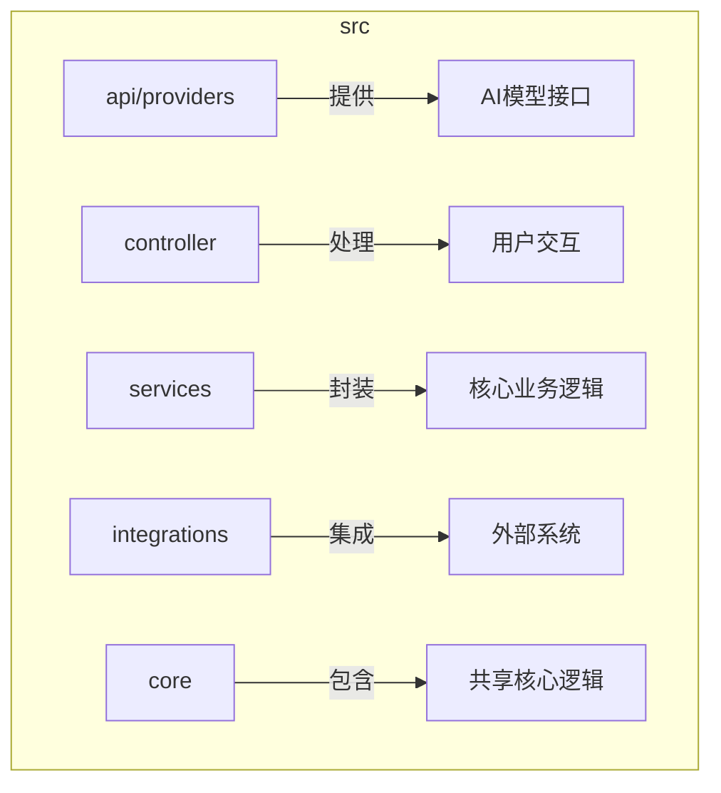
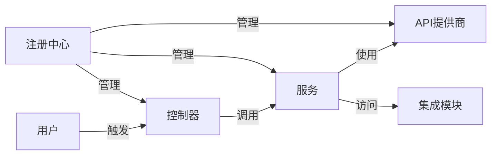
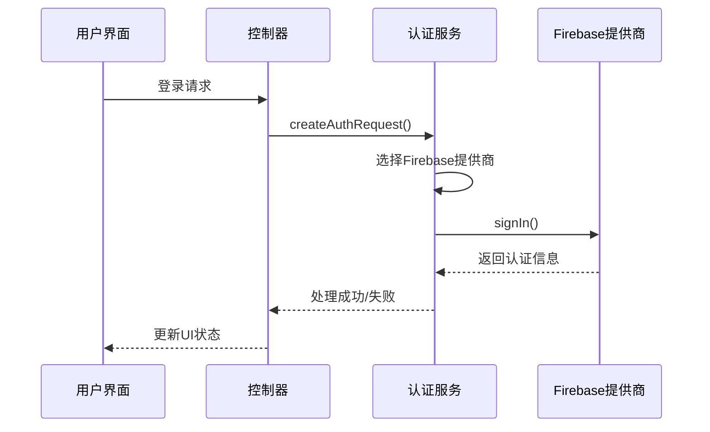
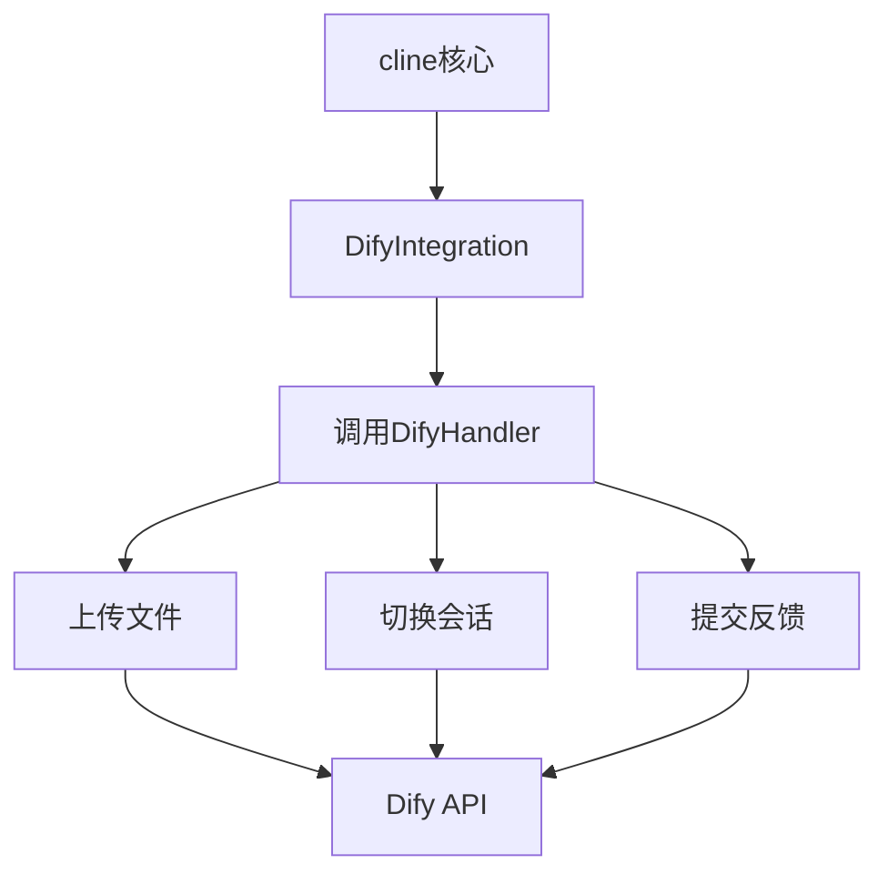
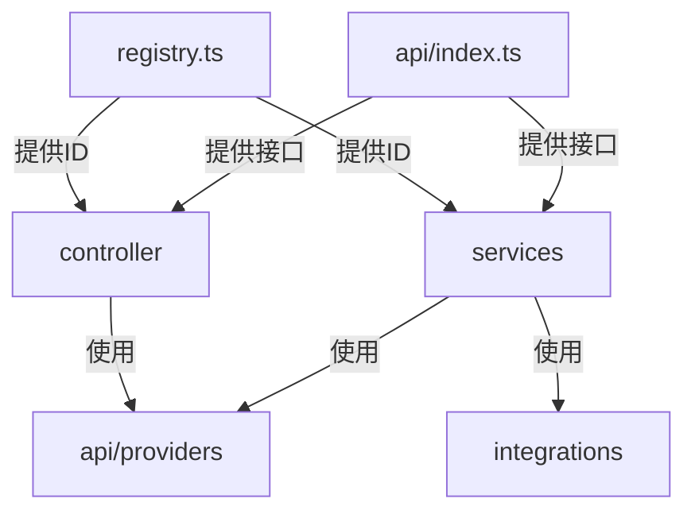

# 模块化设计

<cite>
**本文档中引用的文件**  
- [registry.ts](file://src/registry.ts)
- [anthropic.ts](file://src/core/api/providers/anthropic.ts)
- [openai.ts](file://src/core/api/providers/openai.ts)
- [ClineAccountService.ts](file://src/services/account/ClineAccountService.ts)
- [AuthService.ts](file://src/services/auth/AuthService.ts)
- [index.ts](file://src/integrations/checkpoints/index.ts)
- [dify-integration.ts](file://src/integrations/dify/dify-integration.ts)
</cite>

## 目录
1. [简介](#简介)
2. [项目结构](#项目结构)
3. [核心组件](#核心组件)
4. [架构概述](#架构概述)
5. [详细组件分析](#详细组件分析)
6. [依赖分析](#依赖分析)
7. [性能考虑](#性能考虑)
8. [故障排除指南](#故障排除指南)
9. [结论](#结论)
10. [附录](#附录)（如有必要）

## 简介
本文档旨在深入解析 `cline` 项目的模块化设计。该设计通过清晰的职责分离、按需加载机制和动态服务注册，实现了高度的可维护性、可测试性和可扩展性。文档将重点介绍 `index.ts` 文件在 `api/providers`、`controller`、`services` 和 `integrations` 等目录中的作用，阐述 `registry.ts` 作为服务注册中心的原理，并以添加新的 AI 模型提供商为例，说明系统的扩展流程。

## 项目结构
`cline` 项目采用分层和功能划分相结合的目录结构，确保了代码的高内聚和低耦合。



**图示来源**
- [anthropic.ts](file://src/core/api/providers/anthropic.ts)
- [ClineAccountService.ts](file://src/services/account/ClineAccountService.ts)
- [dify-integration.ts](file://src/integrations/dify/dify-integration.ts)

**章节来源**
- [anthropic.ts](file://src/core/api/providers/anthropic.ts)
- [ClineAccountService.ts](file://src/services/account/ClineAccountService.ts)
- [dify-integration.ts](file://src/integrations/dify/dify-integration.ts)

## 核心组件
`cline` 的核心组件包括 API 提供商、控制器、服务和集成模块。这些组件通过定义良好的接口进行通信，确保了系统的灵活性和可替换性。`index.ts` 文件在各个模块中充当了公共接口和聚合点的角色，使得外部模块可以方便地导入所需功能，而无需关心内部的具体实现文件。

**章节来源**
- [anthropic.ts](file://src/core/api/providers/anthropic.ts)
- [AuthService.ts](file://src/services/auth/AuthService.ts)

## 架构概述
`cline` 采用了一种基于依赖注入和动态注册的微内核架构。`registry.ts` 文件作为系统的“注册中心”，集中管理了所有扩展点和核心服务的标识符。各模块在初始化时，通过注册自己的服务或监听特定事件，实现了松耦合的连接。



**图示来源**
- [registry.ts](file://src/registry.ts)
- [AuthService.ts](file://src/services/auth/AuthService.ts)

## 详细组件分析
本节将深入分析 `cline` 中的关键组件，揭示其模块化设计的精髓。

### API 提供商模块分析
`api/providers` 目录下的每个文件（如 `anthropic.ts`, `openai.ts`）都实现了统一的 `ApiHandler` 接口。`index.ts` 文件在此处的作用是导出这个公共接口和相关的类型定义，使得 `controller` 或 `services` 可以通过 `import { ApiHandler } from "../api/index"` 的方式，以统一的抽象来使用任何具体的 AI 模型提供商，而无需直接依赖 `anthropic` 或 `openai` 的具体实现。

```mermaid
classDiagram
class ApiHandler {
<<interface>>
+createMessage(systemPrompt, messages) ApiStream
+getModel() { id, info }
}
class AnthropicHandler {
-options : AnthropicHandlerOptions
-client : Anthropic
+createMessage(systemPrompt, messages) ApiStream
+getModel() { id, info }
}
class OpenAiHandler {
-options : OpenAiHandlerOptions
-client : OpenAI
+createMessage(systemPrompt, messages) ApiStream
+getModel() { id, info }
}
ApiHandler <|-- AnthropicHandler
ApiHandler <|-- OpenAiHandler
```

**图示来源**
- [anthropic.ts](file://src/core/api/providers/anthropic.ts)
- [openai.ts](file://src/core/api/providers/openai.ts)

**章节来源**
- [anthropic.ts](file://src/core/api/providers/anthropic.ts)
- [openai.ts](file://src/core/api/providers/openai.ts)

### 服务模块分析
`services` 目录下的服务（如 `ClineAccountService`, `AuthService`）封装了与外部 API 交互的业务逻辑。`AuthService` 使用单例模式，并通过 `getInstance()` 方法提供全局访问点。它内部通过 `availableAuthProviders` 对象和配置来动态选择和初始化具体的认证提供商（如 `FirebaseAuthProvider`），这体现了依赖注入的思想。



**图示来源**
- [AuthService.ts](file://src/services/auth/AuthService.ts)
- [ClineAccountService.ts](file://src/services/account/ClineAccountService.ts)

**章节来源**
- [AuthService.ts](file://src/services/auth/AuthService.ts)
- [ClineAccountService.ts](file://src/services/account/ClineAccountService.ts)

### 集成模块分析
`integrations` 模块用于连接 `cline` 与外部系统，如 `dify`。`dify-integration.ts` 文件通过 `DifyIntegration` 类提供了一个高级的、易于使用的接口，封装了与 Dify API 交互的复杂性。`index.ts` 在此模块中可以用来聚合多个集成，提供统一的入口。



**图示来源**
- [dify-integration.ts](file://src/integrations/dify/dify-integration.ts)

**章节来源**
- [dify-integration.ts](file://src/integrations/dify/dify-integration.ts)

## 依赖分析
`cline` 的模块间依赖关系清晰，遵循了依赖倒置原则。高层模块（如 `controller`）依赖于抽象（如 `ApiHandler` 接口），而不是低层模块的具体实现。`registry.ts` 作为核心依赖，被多个模块引用以获取命令和视图的ID。



**图示来源**
- [registry.ts](file://src/registry.ts)
- [anthropic.ts](file://src/core/api/providers/anthropic.ts)
- [AuthService.ts](file://src/services/auth/AuthService.ts)

**章节来源**
- [registry.ts](file://src/registry.ts)
- [anthropic.ts](file://src/core/api/providers/anthropic.ts)
- [AuthService.ts](file://src/services/auth/AuthService.ts)

## 性能考虑
模块化设计本身有助于性能优化。按需加载可以减少启动时的内存占用。`withRetry` 装饰器的使用（如在 `AnthropicHandler` 中）增强了 API 调用的容错能力。然而，频繁的模块间调用和动态注册可能会引入微小的性能开销，但这种权衡在提升代码可维护性和可扩展性方面是值得的。

## 故障排除指南
- **问题：无法加载 AI 模型提供商。**
  **解决方案：** 检查 `api/providers` 目录下对应提供商的实现文件是否正确导出了 `ApiHandler` 的实现类，并确认其配置项（如 API Key）是否正确。
- **问题：认证失败。**
  **解决方案：** 检查 `AuthService` 的配置，确保 `availableAuthProviders` 中包含了正确的提供商，并且其配置（如 Firebase 配置）无误。
- **问题：新添加的集成模块未生效。**
  **解决方案：** 确保在使用该集成的地方正确导入了其实现类，并且其依赖的服务（如网络请求）已正确初始化。

**章节来源**
- [AuthService.ts](file://src/services/auth/AuthService.ts)
- [anthropic.ts](file://src/core/api/providers/anthropic.ts)

## 结论
`cline` 的模块化设计通过 `index.ts` 文件作为公共接口、`registry.ts` 作为服务注册中心，成功实现了功能的清晰分离和按需加载。这种设计极大地促进了代码的可维护性（易于修改和理解）、可测试性（可以轻松地对单个模块进行单元测试）和第三方扩展能力（通过遵循接口规范即可添加新功能）。该架构为 `cline` 的长期发展和生态建设奠定了坚实的基础。