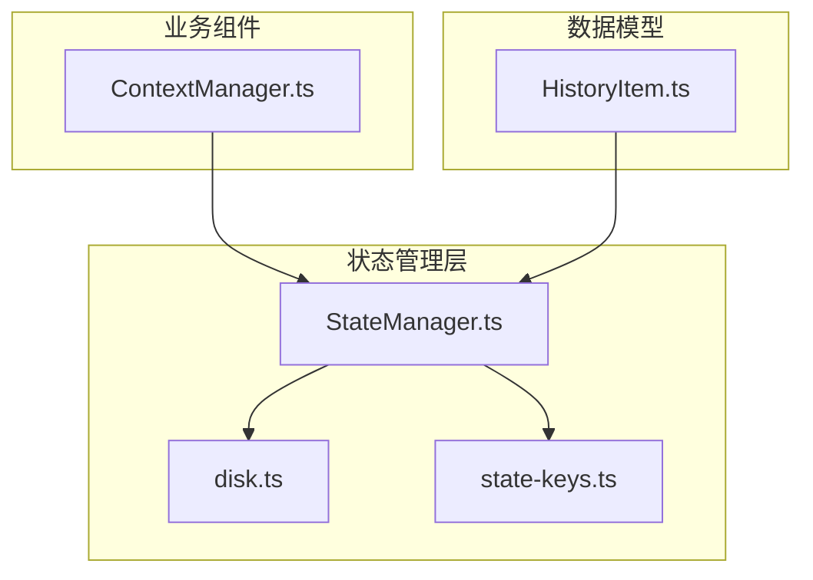
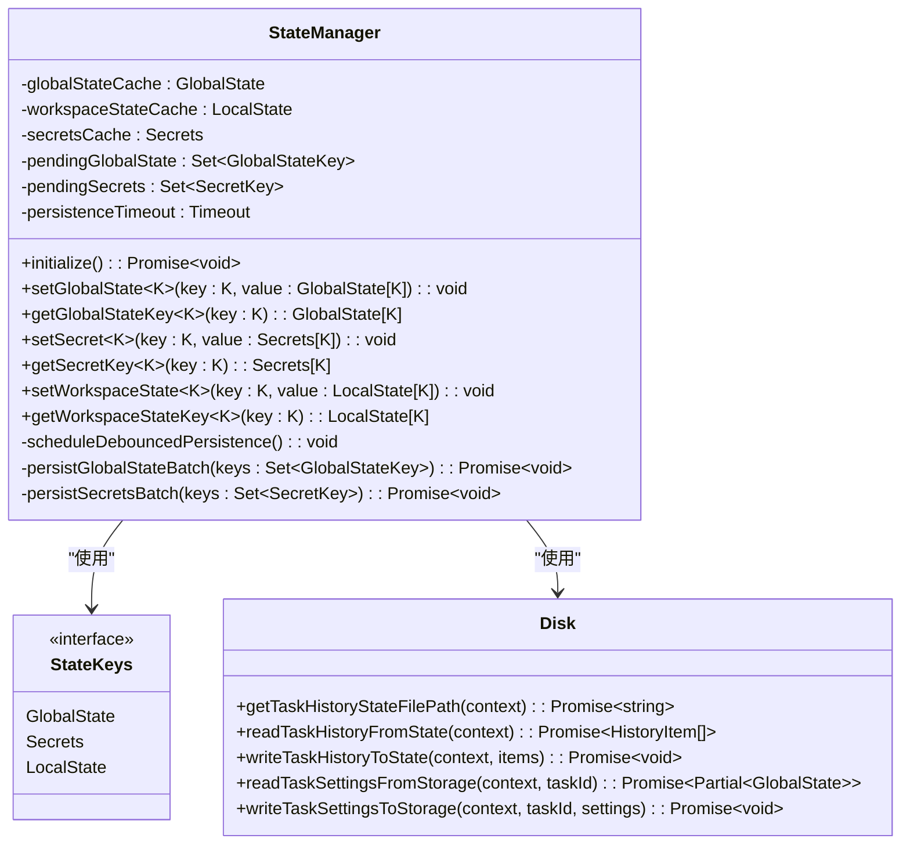
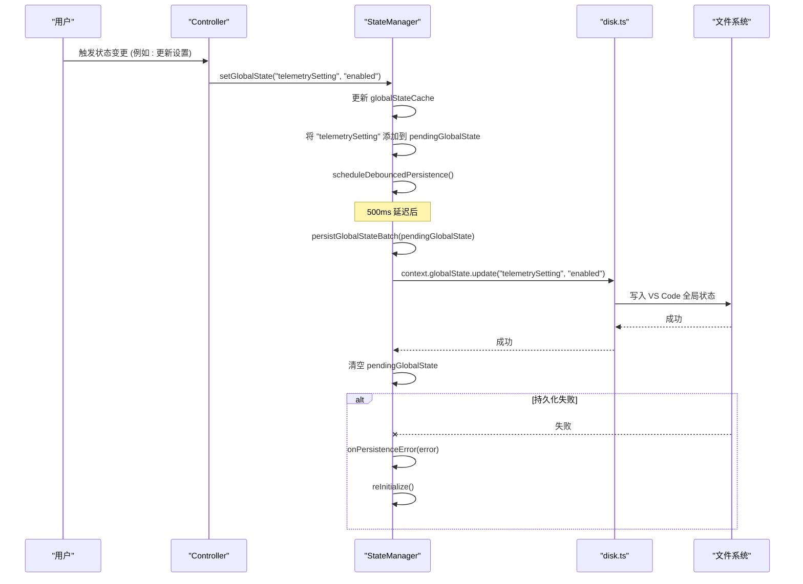
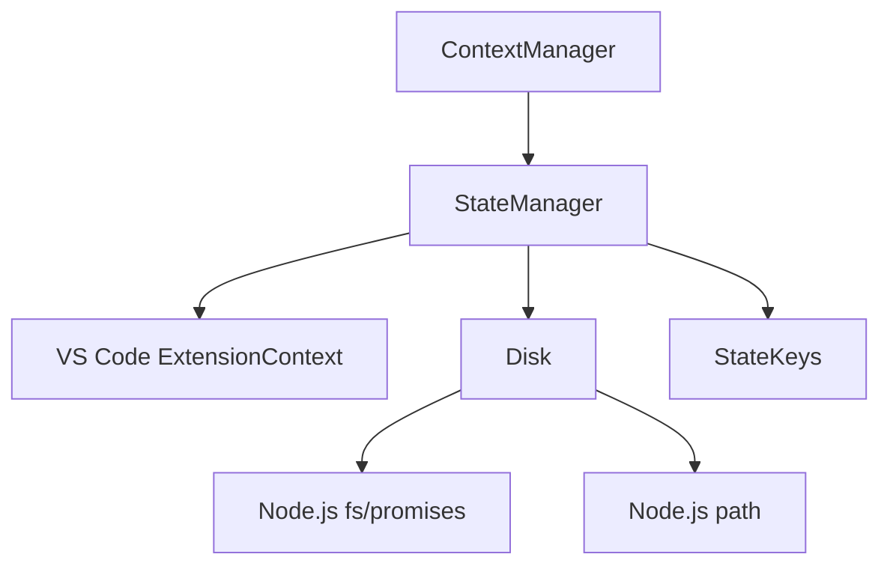

# 状态管理

<cite>
**本文档引用的文件**
- [StateManager.ts](file://src/core/storage/StateManager.ts)
- [disk.ts](file://src/core/storage/disk.ts)
- [state-keys.ts](file://src/core/storage/state-keys.ts)
- [HistoryItem.ts](file://src/shared/HistoryItem.ts)
- [ContextManager.ts](file://src/core/context/context-management/ContextManager.ts)
</cite>

## 目录
1. [简介](#简介)
2. [项目结构](#项目结构)
3. [核心组件](#核心组件)
4. [架构概述](#架构概述)
5. [详细组件分析](#详细组件分析)
6. [依赖分析](#依赖分析)
7. [性能考虑](#性能考虑)
8. [故障排除指南](#故障排除指南)
9. [结论](#结论)
10. [附录](#附录)（如有必要）

## 简介
本文档旨在创建关于 cline 状态管理的权威文档。详细阐述 `StateManager.ts` 的设计，包括其如何使用 `disk.ts` 进行持久化存储，以及 `state-keys.ts` 如何组织不同的状态域（如用户配置、任务历史、上下文管理）。解释状态管理器如何作为 Model 层的核心，为 Controller 和 UI 提供单一数据源。描述 `HistoryItem.ts` 和 `ContextManager.ts` 等组件如何利用状态管理器来存储和检索数据。提供状态变更流程图，说明从用户操作到状态更新再到 UI 刷新的完整生命周期。讨论状态迁移策略和错误恢复机制。

## 项目结构
cline 项目的状态管理核心位于 `src/core/storage` 目录下。该目录包含三个主要文件：`StateManager.ts` 负责内存中的状态管理和异步持久化，`disk.ts` 提供与文件系统交互的底层读写功能，`state-keys.ts` 定义了所有状态键的类型和结构。`HistoryItem.ts` 定义了任务历史记录的数据结构，而 `ContextManager.ts` 则是利用状态管理器来管理对话上下文的核心组件。这种分层设计将状态的定义、内存管理和持久化逻辑清晰地分离。



**Diagram sources**
- [StateManager.ts](file://src/core/storage/StateManager.ts)
- [disk.ts](file://src/core/storage/disk.ts)
- [state-keys.ts](file://src/core/storage/state-keys.ts)
- [HistoryItem.ts](file://src/shared/HistoryItem.ts)
- [ContextManager.ts](file://src/core/context/context-management/ContextManager.ts)

**Section sources**
- [StateManager.ts](file://src/core/storage/StateManager.ts)
- [disk.ts](file://src/core/storage/disk.ts)
- [state-keys.ts](file://src/core/storage/state-keys.ts)
- [HistoryItem.ts](file://src/shared/HistoryItem.ts)
- [ContextManager.ts](file://src/core/context/context-management/ContextManager.ts)

## 核心组件
`StateManager` 是整个应用状态管理的核心。它采用内存缓存与异步持久化相结合的策略，确保状态读取的即时性和写入的可靠性。`StateKeys` 接口定义了全局状态、工作区状态和密钥的类型，为状态管理提供了类型安全。`disk` 模块封装了所有与文件系统交互的逻辑，如读写任务历史和设置文件。`HistoryItem` 定义了任务历史条目的结构，而 `ContextManager` 则是状态管理器的主要消费者之一，它利用状态管理器来持久化和恢复对话上下文。

**Section sources**
- [StateManager.ts](file://src/core/storage/StateManager.ts)
- [state-keys.ts](file://src/core/storage/state-keys.ts)
- [disk.ts](file://src/core/storage/disk.ts)
- [HistoryItem.ts](file://src/shared/HistoryItem.ts)
- [ContextManager.ts](file://src/core/context/context-management/ContextManager.ts)

## 架构概述
cline 的状态管理架构采用分层模式。最上层是 `StateManager`，它作为单一数据源，为所有控制器和 UI 组件提供状态访问。`StateManager` 内部维护着内存缓存（`globalStateCache`, `workspaceStateCache`, `secretsCache`），所有读取操作都直接从内存中获取，保证了高性能。当状态发生变更时，`StateManager` 会立即更新内存缓存，并将变更标记为“待持久化”，然后通过一个防抖机制（debounced persistence）在延迟后批量写入磁盘。持久化操作由 `disk.ts` 模块完成，它负责与 VS Code 的 `globalState`、`workspaceState`、`secrets` API 以及文件系统进行交互。`state-keys.ts` 为整个系统提供了状态键的类型定义，确保了类型安全。

```mermaid
graph TD
UI[UI 组件] --> |读取/订阅| StateManager
Controller[Controller] --> |读取/修改| StateManager
subgraph "StateManager"
Cache[内存缓存]
Debouncer[防抖持久化]
end
StateManager --> |批量写入| VSCodeAPI[VS Code State API]
StateManager --> |写入文件| FileSystem[文件系统]
VSCodeAPI < --> |读取| disk
FileSystem < --> |读取/写入| disk
style StateManager fill:#f9f,stroke:#333,stroke-width:2px
```

**Diagram sources**
- [StateManager.ts](file://src/core/storage/StateManager.ts)
- [disk.ts](file://src/core/storage/disk.ts)

## 详细组件分析
### StateManager 分析
`StateManager` 类是状态管理的中枢。它通过构造函数接收 `ExtensionContext` 来访问 VS Code 的存储 API。在 `initialize` 方法中，它会从磁盘加载所有状态到内存缓存中，并为 `taskHistory.json` 文件设置一个文件系统监视器（chokidar watcher），以便在外部修改时自动同步内存状态。

#### 对象导向组件


**Diagram sources**
- [StateManager.ts](file://src/core/storage/StateManager.ts#L0-L1029)
- [state-keys.ts](file://src/core/storage/state-keys.ts#L0-L203)
- [disk.ts](file://src/core/storage/disk.ts#L0-L274)

#### API/服务组件


**Diagram sources**
- [StateManager.ts](file://src/core/storage/StateManager.ts#L0-L1029)
- [disk.ts](file://src/core/storage/disk.ts#L0-L274)

### ContextManager 如何利用状态管理器
`ContextManager` 是 `StateManager` 的一个关键使用者。它利用 `StateManager` 来持久化复杂的对话上下文历史。当用户进行长时间的对话时，`ContextManager` 会跟踪对对话历史的修改（例如，为了节省上下文窗口而进行的截断或摘要）。这些修改信息（`contextHistoryUpdates`）会被序列化并存储在磁盘上，其文件路径由 `StateManager` 通过 `ensureTaskDirectoryExists` 等辅助函数确定。当任务恢复时，`ContextManager` 会调用 `initializeContextHistory`，该方法会从磁盘读取这些更新，并应用到当前的对话历史中，从而精确地恢复之前的上下文状态。这确保了即使在重启后，用户也能获得连贯的体验。

**Section sources**
- [StateManager.ts](file://src/core/storage/StateManager.ts#L0-L1029)
- [ContextManager.ts](file://src/core/context/context-management/ContextManager.ts#L0-L959)
- [disk.ts](file://src/core/storage/disk.ts#L0-L274)

## 依赖分析
`StateManager` 的核心依赖是 VS Code 的 `ExtensionContext`，它提供了访问 `globalState`、`workspaceState` 和 `secrets` 的能力。`disk.ts` 模块依赖 Node.js 的 `fs/promises` 和 `path` 模块来处理文件系统操作。`state-keys.ts` 是一个纯类型定义文件，没有运行时依赖。`ContextManager` 依赖 `StateManager` 来获取任务目录路径和进行持久化操作。整个状态管理系统的依赖关系清晰，低耦合，高内聚。



**Diagram sources**
- [StateManager.ts](file://src/core/storage/StateManager.ts)
- [disk.ts](file://src/core/storage/disk.ts)
- [ContextManager.ts](file://src/core/context/context-management/ContextManager.ts)

**Section sources**
- [StateManager.ts](file://src/core/storage/StateManager.ts)
- [disk.ts](file://src/core/storage/disk.ts)
- [ContextManager.ts](file://src/core/context/context-management/ContextManager.ts)

## 性能考虑
`StateManager` 的设计充分考虑了性能。通过内存缓存，所有状态读取都是 O(1) 操作，非常快速。写入操作采用了防抖（debounce）和批处理（batching）策略，将短时间内发生的多次状态变更合并为一次或少数几次磁盘 I/O 操作，极大地减少了 I/O 开销。例如，如果用户在短时间内调整了多个设置，这些变更会被收集起来，在 500ms 的延迟后一次性写入。此外，`chokidar` 文件监视器的使用确保了外部状态变更（如手动编辑 `taskHistory.json`）能够被高效地检测到并同步到内存，而无需轮询。

## 故障排除指南
当状态管理出现问题时，可以参考以下步骤进行排查：
1.  **检查初始化**：确保 `StateManager.initialize()` 已被成功调用。未初始化的 `StateManager` 会抛出 `STATE_MANAGER_NOT_INITIALIZED` 错误。
2.  **查看持久化错误**：`StateManager` 提供了 `onPersistenceError` 回调。如果持久化失败（例如，磁盘空间不足或权限问题），此回调会被触发，可用于记录错误或触发恢复机制。
3.  **错误恢复**：`reInitialize` 方法是关键的错误恢复机制。当持久化失败时，可以调用此方法来清空内存缓存并从磁盘重新加载状态，以恢复一致性。
4.  **检查文件路径**：使用 `getTaskHistoryStateFilePath` 等函数来确认状态文件的预期路径，并检查该路径是否存在以及是否有读写权限。
5.  **日志审查**：代码中包含大量的 `console.error` 语句，用于记录初始化、持久化和文件操作中的错误，是排查问题的重要线索。

**Section sources**
- [StateManager.ts](file://src/core/storage/StateManager.ts#L0-L1029)
- [disk.ts](file://src/core/storage/disk.ts#L0-L274)
- [error-messages.ts](file://src/core/storage/error-messages.ts)

## 结论
cline 的状态管理系统是一个设计精良、健壮且高效的模块。它通过 `StateManager` 提供了一个单一、可靠的数据源，有效地分离了内存管理和持久化逻辑。`disk.ts` 模块抽象了底层存储细节，而 `state-keys.ts` 确保了类型安全。该系统通过防抖和批处理优化了性能，并通过文件监视器和错误恢复机制保证了数据的一致性和可靠性。`ContextManager` 等组件的成功集成证明了该设计的可扩展性，为整个应用的稳定运行奠定了坚实的基础。