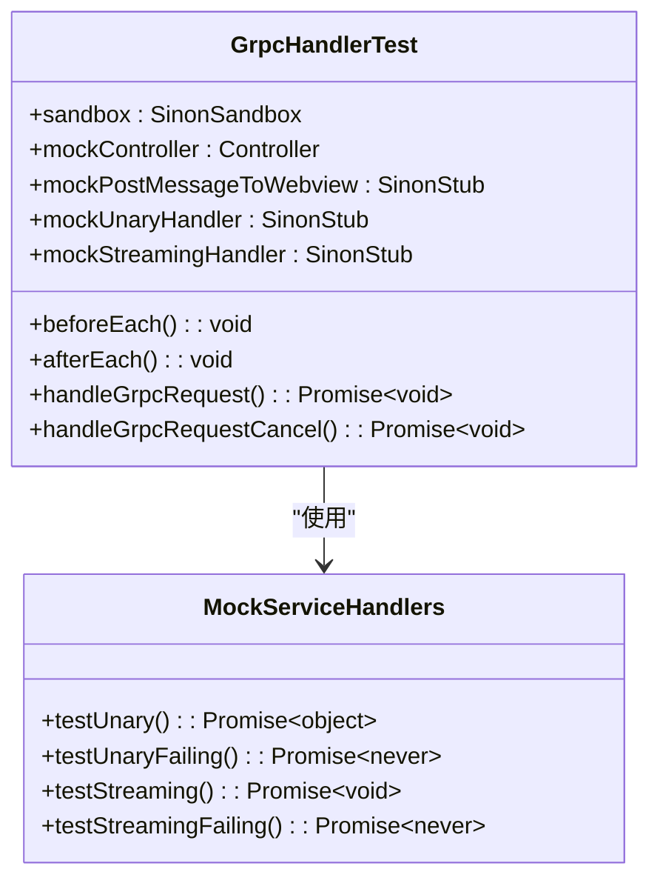
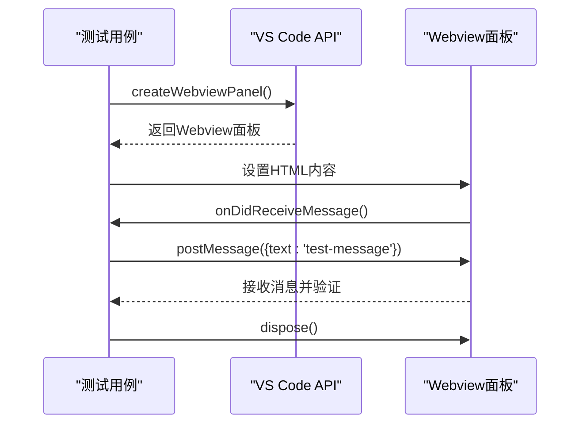
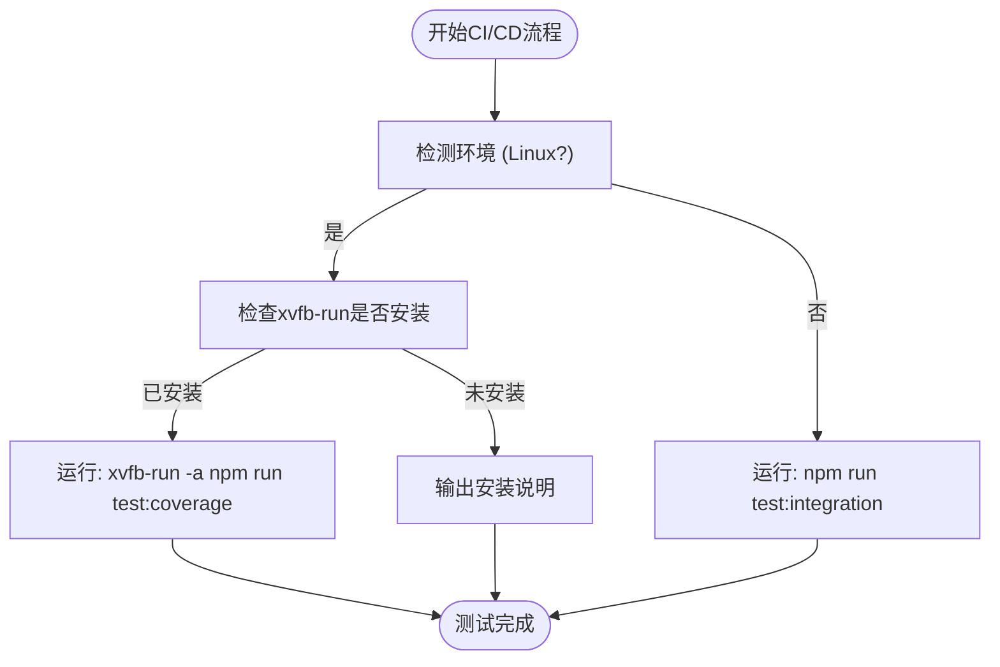

# 单元与集成测试

<cite>
**本文档中引用的文件**  
- [grpc-handler.test.ts](file://src/core/controller/grpc-handler.test.ts)
- [grpc-handler.ts](file://src/core/controller/grpc-handler.ts)
- [ToolExecutor.ts](file://src/core/task/ToolExecutor.ts)
- [ContextManager.ts](file://src/core/context/context-management/ContextManager.ts)
- [extension.test.ts](file://src/test/extension.test.ts)
</cite>

## 目录
1. [测试框架与配置](#测试框架与配置)  
2. [单元测试策略](#单元测试策略)  
3. [集成测试策略](#集成测试策略)  
4. [测试用例最佳实践](#测试用例最佳实践)  
5. [测试运行与CI/CD集成](#测试运行与cicd集成)

## 测试框架与配置

cline项目采用Mocha作为核心测试框架，结合Chai进行断言，Sinon用于模拟和桩函数。测试配置通过`tsconfig.test.json`文件定义，该文件继承自主`tsconfig.json`，但将模块系统覆盖为CommonJS，以兼容VS Code测试运行器。此配置确保测试文件能够正确编译，同时不影响主代码库的ES模块结构。

项目中的测试文件主要分布在`src/core`和`src/test`目录下的`__tests__`或`.test.ts`文件中。例如，`grpc-handler.test.ts`位于`src/core/controller/`目录下，专门用于测试gRPC请求处理逻辑。测试环境通过`playwright.config.ts`进行配置，支持端到端（E2E）测试，其中定义了工作进程、重试次数、超时设置以及报告生成器。

**Section sources**
- [tsconfig.test.json](file://tsconfig.test.json#L0-L32)
- [playwright.config.ts](file://playwright.config.ts#L0-L30)

## 单元测试策略

### `grpc-handler.test.ts` 分析

`grpc-handler.test.ts`文件是单元测试策略的典范。它使用Mocha的`describe`和`it`块来组织测试用例，并利用Sinon创建沙箱环境，以确保测试的隔离性。

**Diagram sources**
- [grpc-handler.test.ts](file://src/core/controller/grpc-handler.test.ts#L0-L417)

**Section sources**
- [grpc-handler.test.ts](file://src/core/controller/grpc-handler.test.ts#L0-L417)

#### 模拟依赖项

该测试文件的核心是模拟依赖项。`beforeEach`钩子中创建了一个Sinon沙箱，并模拟了`Controller`、`postMessageToWebview`函数以及gRPC服务处理器。通过`serviceHandlers`对象，测试可以定义虚拟服务（如`cline.TestService`）及其方法（如`testUnary`），这些方法返回预定义的响应或抛出错误，从而精确控制测试场景。

#### 测试用例

测试用例分为几个部分：
- **一元请求（Unary requests）**：测试成功和失败场景，验证处理器是否被正确调用，以及响应是否通过`postMessageToWebview`正确发送。
- **流式请求（Streaming requests）**：使用`callsFake`模拟流式处理器，验证多个响应消息是否按顺序发送，并测试流中发生错误时的行为。
- **请求取消（Request cancellation）**：测试`handleGrpcRequestCancel`函数，验证取消请求时，清理函数是否被调用，以及取消确认消息是否被发送。
- **并发请求（Concurrent requests）**：验证系统能否正确处理多个并发请求，确保每个请求的处理和响应都是独立的。

## 集成测试策略

集成测试旨在验证多个组件之间的交互。`extension.test.ts`文件提供了一个端到端测试的示例，它不仅测试了命令执行，还验证了Webview的创建和消息传递。

**Diagram sources**
- [extension.test.ts](file://src/test/extension.test.ts#L0-L92)

**Section sources**
- [extension.test.ts](file://src/test/extension.test.ts#L0-L92)

### 组件协作

该测试验证了`cline.plusButtonClicked`命令的执行，并创建了一个Webview面板来模拟用户界面交互。通过向Webview发送消息并监听其响应，测试确保了VS Code扩展的UI层和逻辑层能够正确通信。这模拟了真实用户场景，如点击按钮或在聊天界面中发送消息。

## 测试用例最佳实践

### 测试覆盖率目标

项目应追求高测试覆盖率，特别是对于核心逻辑，如`ContextManager`和`ToolExecutor`。`ContextManager`负责管理对话上下文，其`getNewContextMessagesAndMetadata`方法的复杂逻辑需要详尽的测试用例来覆盖各种边界情况，例如上下文窗口接近满载时的截断行为。

### 异步代码测试

所有涉及I/O操作或API调用的代码都是异步的。测试中必须使用`async/await`语法。例如，在`grpc-handler.test.ts`中，所有`handleGrpcRequest`的调用都使用`await`，以确保测试在异步操作完成后再进行断言。

### 错误处理验证

测试必须包含对错误路径的验证。`grpc-handler.test.ts`中的`handleUnaryRequest`测试了当处理器抛出错误时，系统是否能捕获错误并发送正确的错误响应。这确保了系统的健壮性。

### 状态管理测试

`ContextManager`类管理着对话历史的复杂状态。其`truncateContextHistory`方法需要测试在给定时间戳后，所有后续的上下文更新是否被正确移除。这需要模拟一个包含多个更新的`contextHistoryUpdates`映射，并验证截断后的状态。

## 测试运行与CI/CD集成

测试套件通过`package.json`中的脚本运行。CI/CD流程由`scripts/test-ci.js`脚本管理。该脚本检测运行环境，如果在Linux上，则使用`xvfb-run`来运行测试，以模拟图形显示服务器，这对于需要UI交互的测试至关重要。如果`xvfb-run`未安装，脚本会输出清晰的错误信息和安装命令。

**Diagram sources**
- [test-ci.js](file://scripts/test-ci.js#L0-L29)

**Section sources**
- [test-ci.js](file://scripts/test-ci.js#L0-L29)

在CI环境中，测试报告由Playwright生成，并配置为在GitHub Actions中显示。`playwright.config.ts`中的`reporter`设置确保了测试结果能被有效收集和展示。