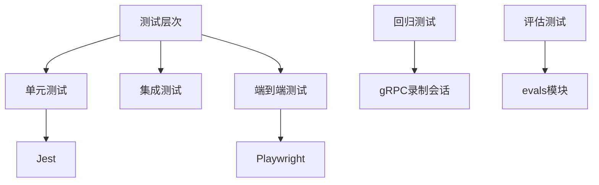
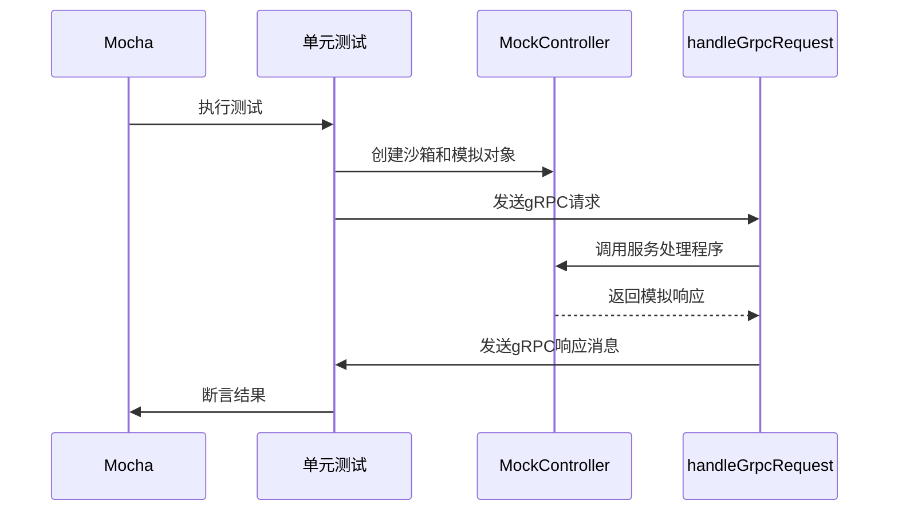
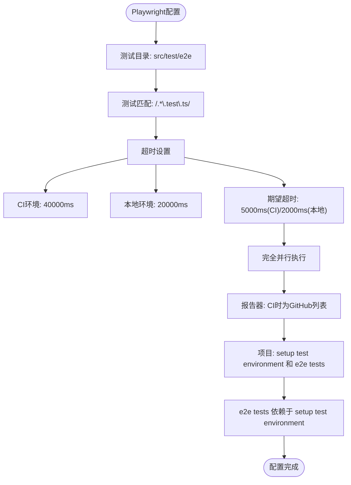
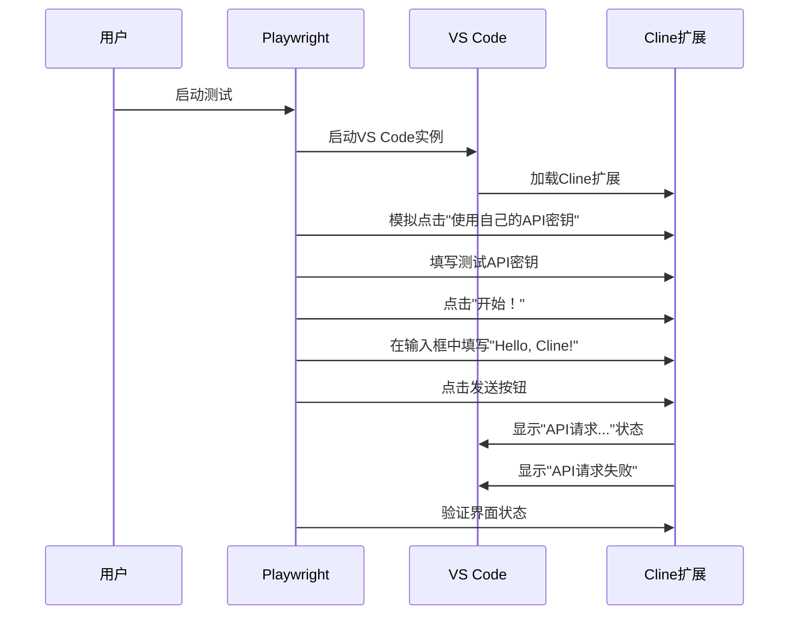
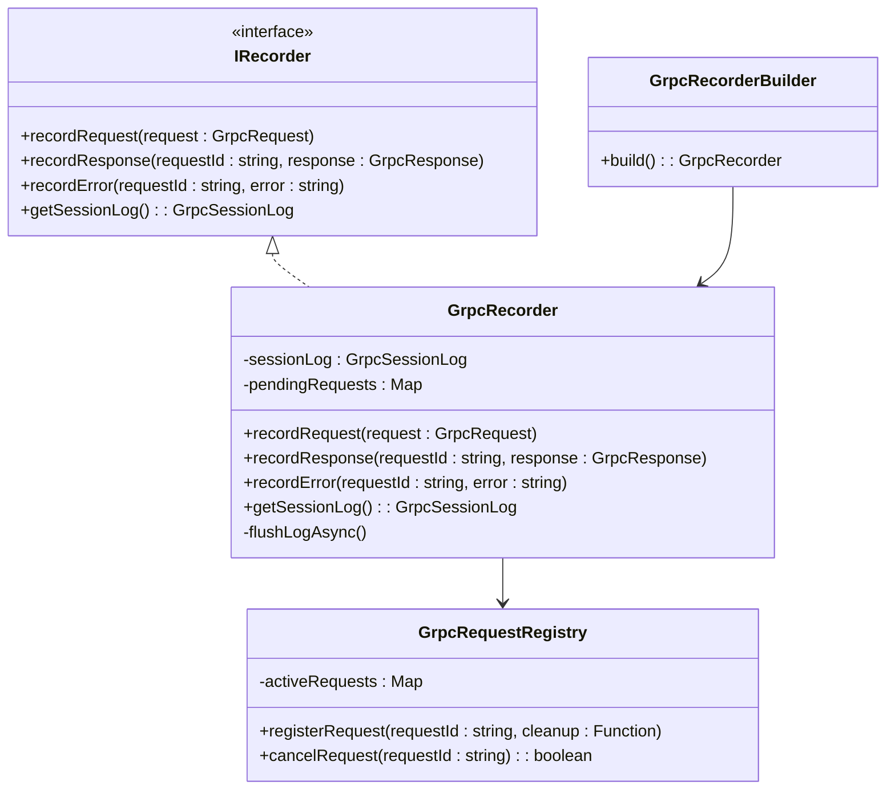
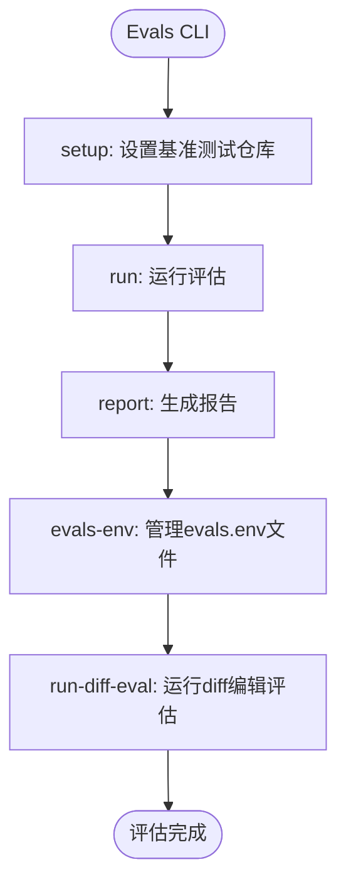

# 测试策略

<cite>
**本文档中引用的文件**  
- [playwright.config.ts](file://playwright.config.ts)
- [grpc-handler.test.ts](file://src/core/controller/grpc-handler.test.ts)
- [chat.test.ts](file://src/test/e2e/chat.test.ts)
- [diff.test.ts](file://src/test/e2e/diff.test.ts)
- [helpers.ts](file://src/test/e2e/utils/helpers.ts)
- [grpc-handler.ts](file://src/core/controller/grpc-handler.ts)
- [grpc-recorder.ts](file://src/core/controller/grpc-recorder/grpc-recorder.ts)
- [types.ts](file://src/core/controller/grpc-recorder/types.ts)
- [grpc-request-registry.ts](file://src/core/controller/grpc-request-registry.ts)
- [TestRunner.ts](file://evals/diff-edits/TestRunner.ts)
- [index.ts](file://evals/cli/src/index.ts)
- [specs](file://tests/specs)
</cite>

## 目录
1. [引言](#引言)
2. [测试层次结构](#测试层次结构)
3. [单元测试](#单元测试)
4. [集成测试](#集成测试)
5. [端到端测试](#端到端测试)
6. [gRPC录制会话与回归测试](#grpc录制会话与回归测试)
7. [为新控制器或服务编写测试](#为新控制器或服务编写测试)
8. [测试覆盖率与CI/CD](#测试覆盖率与cicd)
9. [evals模块的评估框架测试](#evals模块的评估框架测试)
10. [贡献者指南](#贡献者指南)

## 引言
cline项目采用多层次的测试策略，确保代码质量、功能正确性和系统稳定性。本测试策略文档详细阐述了项目的测试实践，涵盖从单元测试到端到端测试的完整体系。通过Jest进行单元测试，利用Playwright实现端到端的自动化测试，并通过gRPC录制会话支持回归测试。特别地，`evals`模块拥有独立的评估框架，用于对AI模型性能进行基准测试。本文档旨在为贡献者提供清晰的指导，帮助他们为代码贡献编写高质量的测试。

## 测试层次结构
cline的测试体系分为三个主要层次：单元测试、集成测试和端到端测试。这种分层方法确保了从最小代码单元到完整用户工作流的全面覆盖。

**Diagram sources**
- [playwright.config.ts](file://playwright.config.ts#L1-L32)
- [grpc-handler.test.ts](file://src/core/controller/grpc-handler.test.ts#L1-L417)

## 单元测试
单元测试是测试体系的基础，专注于验证单个函数、类或模块的正确性。在cline中，单元测试主要使用Mocha和Chai框架，辅以Sinon进行模拟和桩。

### grpc-handler单元测试分析
`grpc-handler.test.ts`文件提供了`grpc-handler.ts`模块的全面单元测试。该测试通过模拟`Controller`和`postMessageToWebview`等依赖项，验证了gRPC请求处理的核心逻辑。

**Diagram sources**
- [grpc-handler.test.ts](file://src/core/controller/grpc-handler.test.ts#L1-L417)
- [grpc-handler.ts](file://src/core/controller/grpc-handler.ts#L1-L203)

**Section sources**
- [grpc-handler.test.ts](file://src/core/controller/grpc-handler.test.ts#L1-L417)
- [grpc-handler.ts](file://src/core/controller/grpc-handler.ts#L1-L203)

### 单元测试实践
- **隔离性**: 使用Sinon沙箱创建独立的测试环境，确保测试之间无副作用。
- **覆盖率**: 测试覆盖了所有主要场景，包括成功的一元请求、流式请求、错误处理和请求取消。
- **断言**: 使用Chai的`expect`进行精确的断言，验证处理程序是否被调用、参数是否正确以及响应消息是否符合预期。

## 集成测试
集成测试验证多个模块或组件协同工作的正确性。虽然项目中没有明确的"集成测试"目录，但部分测试（如`grpc-handler`测试）已经具备了集成测试的特性，因为它测试了`grpc-handler`与底层服务处理程序的集成。

## 端到端测试
端到端测试模拟真实用户操作，从用户界面到后端服务进行全流程验证。cline使用Playwright框架进行端到端测试，确保在VS Code扩展环境中的功能完整性。

### Playwright配置
`playwright.config.ts`文件定义了端到端测试的全局配置。

**Diagram sources**
- [playwright.config.ts](file://playwright.config.ts#L1-L32)

**Section sources**
- [playwright.config.ts](file://playwright.config.ts#L1-L32)

### 端到端测试用例
`chat.test.ts`和`diff.test.ts`文件包含了具体的端到端测试用例。

#### 聊天功能测试
`chat.test.ts`测试了聊天界面的核心功能：
- 用户登录和消息发送
- 消息输入框的文本保留（斜杠命令和@提及）
- 模式切换（Act/Plan）

**Diagram sources**
- [chat.test.ts](file://src/test/e2e/chat.test.ts#L1-L130)
- [helpers.ts](file://src/test/e2e/utils/helpers.ts#L1-L328)

#### Diff编辑器测试
`diff.test.ts`测试了Diff编辑器的功能，验证了文件编辑请求的完整流程。

**Section sources**
- [chat.test.ts](file://src/test/e2e/chat.test.ts#L1-L130)
- [diff.test.ts](file://src/test/e2e/diff.test.ts#L1-L60)
- [helpers.ts](file://src/test/e2e/utils/helpers.ts#L1-L328)

## gRPC录制会话与回归测试
`tests/specs`目录下的gRPC录制会话是回归测试的核心。这些JSON文件记录了真实的gRPC请求和响应序列，可用于重放和验证系统行为。

### gRPC录制机制
`grpc-recorder`模块负责记录和回放gRPC会话。

**Diagram sources**
- [grpc-recorder.ts](file://src/core/controller/grpc-recorder/grpc-recorder.ts#L1-L226)
- [types.ts](file://src/core/controller/grpc-recorder/types.ts#L1-L38)
- [grpc-request-registry.ts](file://src/core/controller/grpc-request-registry.ts#L1-L125)

### 回归测试流程
1. **录制**: 在真实用户交互过程中，`GrpcRecorder`将所有gRPC请求和响应记录到`GrpcSessionLog`中。
2. **存储**: 会话日志通过`ILogFileHandler`异步写入JSON文件，保存在`tests/specs`目录下。
3. **重放**: 在测试中，可以加载这些JSON文件，模拟相同的请求序列，验证系统是否产生相同的响应。

**Section sources**
- [grpc-recorder.ts](file://src/core/controller/grpc-recorder/grpc-recorder.ts#L1-L226)
- [types.ts](file://src/core/controller/grpc-recorder/types.ts#L1-L38)
- [specs](file://tests/specs)

## 为新控制器或服务编写测试
为新的控制器或服务编写测试应遵循以下最佳实践：

### 单元测试
1. **模拟依赖**: 使用Sinon创建模拟对象，隔离被测单元。
2. **覆盖边界**: 测试成功路径、错误路径和边界条件。
3. **验证交互**: 断言服务处理程序是否被正确调用，参数是否匹配。

### 端到端测试
1. **使用e2e fixture**: 利用`e2e`和`e2eMultiRoot`测试夹具，它们已配置好VS Code环境和Cline扩展。
2. **模拟用户操作**: 通过Playwright API模拟点击、输入和导航。
3. **验证状态**: 断言UI元素的状态和可见性。

## 测试覆盖率与CI/CD
### 测试覆盖率目标
- **单元测试**: 核心模块的代码行覆盖率应达到80%以上。
- **端到端测试**: 覆盖所有主要用户工作流和关键功能路径。

### CI/CD流程
测试在CI/CD流程中自动运行：
1. **代码提交**: 触发GitHub Actions工作流。
2. **安装依赖**: 安装Node.js、VS Code和相关依赖。
3. **运行测试**: 并行执行单元测试和端到端测试。
4. **报告结果**: 使用Playwright的GitHub报告器将结果发布到Pull Request。

**Section sources**
- [playwright.config.ts](file://playwright.config.ts#L1-L32)

## evals模块的评估框架测试
`evals`模块提供了一个专门的评估框架，用于对AI模型进行基准测试。

### 评估框架结构
`evals/cli/src/index.ts`定义了CLI命令，用于管理评估流程。

**Diagram sources**
- [index.ts](file://evals/cli/src/index.ts#L1-L125)

### Diff编辑评估
`TestRunner.ts`是diff编辑评估的核心，它：
- 从JSON文件加载测试用例。
- 调用Cline API执行评估。
- 将结果存储到数据库。
- 支持重放模式，用于验证新的diff编辑算法。

**Section sources**
- [index.ts](file://evals/cli/src/index.ts#L1-L125)
- [TestRunner.ts](file://evals/diff-edits/TestRunner.ts#L1-L799)

## 贡献者指南
为确保代码质量和一致性，贡献者应遵循以下测试指南：
1. **先写测试**: 对于新功能，优先编写测试用例。
2. **遵循模式**: 参考现有测试的结构和风格。
3. **本地验证**: 在提交前，确保所有测试通过。
4. **覆盖率**: 努力提高测试覆盖率，特别是对于核心逻辑。
5. **文档**: 为复杂的测试用例添加注释，解释其目的和预期行为。

通过遵循本测试策略，贡献者可以确保他们的代码变更不会破坏现有功能，并且新功能得到了充分的验证。