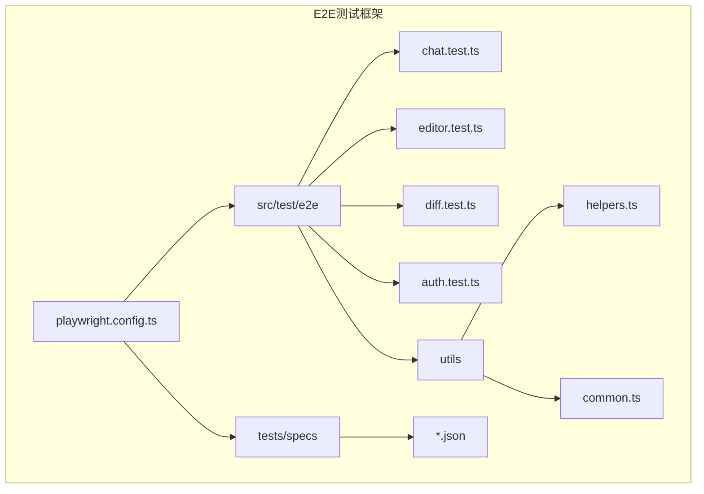
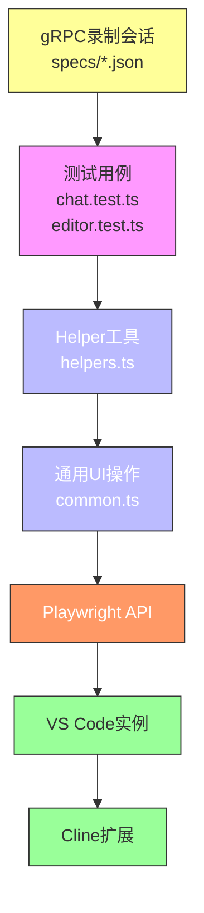
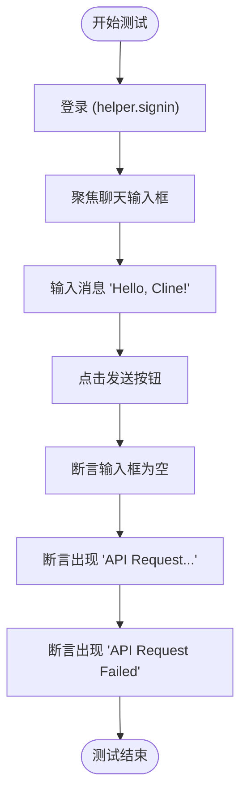
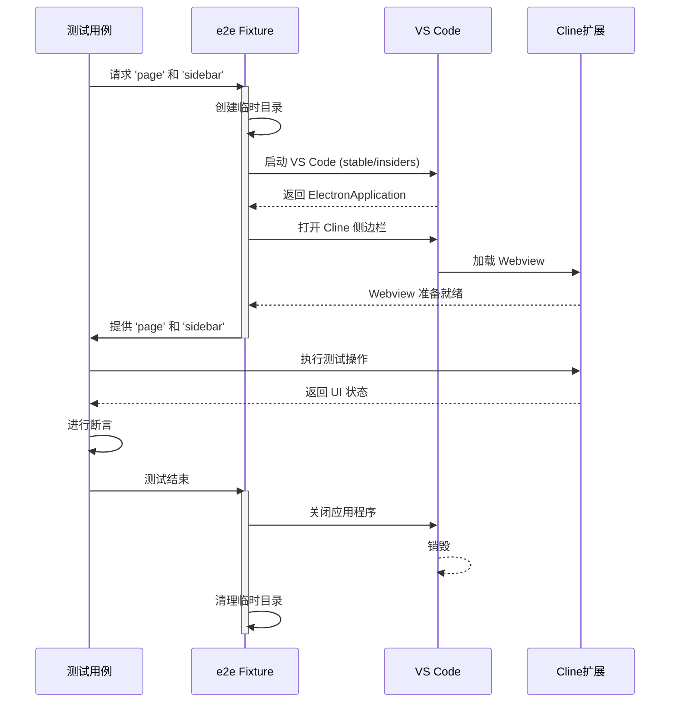
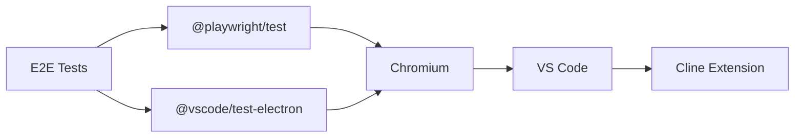

# 端到端测试

<cite>
**本文档中引用的文件**  
- [playwright.config.ts](file://playwright.config.ts)
- [chat.test.ts](file://src/test/e2e/chat.test.ts)
- [editor.test.ts](file://src/test/e2e/editor.test.ts)
- [diff.test.ts](file://src/test/e2e/diff.test.ts)
- [auth.test.ts](file://src/test/e2e/auth.test.ts)
- [helpers.ts](file://src/test/e2e/utils/helpers.ts)
- [common.ts](file://src/test/e2e/utils/common.ts)
- [tests/specs](file://tests/specs)
</cite>

## 目录
1. [简介](#简介)
2. [项目结构](#项目结构)
3. [核心组件](#核心组件)
4. [架构概述](#架构概述)
5. [详细组件分析](#详细组件分析)
6. [依赖分析](#依赖分析)
7. [性能考虑](#性能考虑)
8. [故障排除指南](#故障排除指南)
9. [结论](#结论)

## 简介
本文档全面介绍 `cline` 项目的端到端（E2E）测试框架。重点说明如何使用 Playwright 框架在 VS Code 环境中模拟真实用户交互，涵盖聊天、代码编辑、差异查看和身份验证等关键场景。文档详细解释了 `tests/specs` 目录中 gRPC 录制会话的作用，这些会话如何用于精确的回归测试和行为验证。同时，描述了从录制用户会话到将其转化为可维护自动化测试的完整流程，并提供调试 E2E 测试的实用指南和常见问题的解决方案。

## 项目结构
`cline` 项目的 E2E 测试框架主要位于 `src/test/e2e` 目录下，其结构清晰，便于组织和扩展。测试用例文件（如 `chat.test.ts`）与工具函数（位于 `utils` 子目录）分离，确保了代码的可维护性。`playwright.config.ts` 文件位于项目根目录，是整个测试框架的配置中心。`tests/specs` 目录则专门用于存放录制的 gRPC 会话数据，作为测试的基准。

**Diagram sources**
- [playwright.config.ts](file://playwright.config.ts#L1-L31)
- [src/test/e2e](file://src/test/e2e)

**Section sources**
- [playwright.config.ts](file://playwright.config.ts#L1-L31)
- [src/test/e2e](file://src/test/e2e)

## 核心组件
E2E 测试框架的核心组件包括 Playwright 测试配置、测试用例文件、工具函数和 gRPC 录制会话。`playwright.config.ts` 定义了测试的全局设置，如测试目录、超时时间和项目依赖。`helpers.ts` 中的 `e2e` 和 `e2eMultiRoot` fixture 提供了启动 VS Code 实例、加载 Cline 扩展并获取其侧边栏（Webview）的标准化方法。`tests/specs` 目录中的 JSON 文件是测试的“黄金标准”，用于验证功能的正确性。

**Section sources**
- [playwright.config.ts](file://playwright.config.ts#L1-L31)
- [src/test/e2e/utils/helpers.ts](file://src/test/e2e/utils/helpers.ts#L1-L327)
- [tests/specs](file://tests/specs)

## 架构概述
`cline` 的 E2E 测试采用分层架构。最上层是具体的测试用例（如 `chat.test.ts`），它们描述了用户的具体操作和期望结果。这些用例依赖于 `helpers.ts` 提供的 `e2e` fixture，该 fixture 负责管理 VS Code 应用程序的生命周期、创建临时工作区和用户数据目录。`common.ts` 则封装了在多个测试中复用的 UI 操作，如打开标签页或向 Cline 添加代码。整个流程由 Playwright 驱动，通过模拟用户在 VS Code 中的点击、输入等行为来验证扩展功能。

**Diagram sources**
- [src/test/e2e/chat.test.ts](file://src/test/e2e/chat.test.ts#L1-L129)
- [src/test/e2e/utils/helpers.ts](file://src/test/e2e/utils/helpers.ts#L1-L327)
- [src/test/e2e/utils/common.ts](file://src/test/e2e/utils/common.ts#L1-L63)
- [tests/specs](file://tests/specs)

## 详细组件分析

### 测试配置分析
`playwright.config.ts` 是测试的入口点。它配置了单个 worker 进程以避免并行问题，设置了适当的超时时间，并定义了两个项目：一个用于设置测试环境，另一个用于运行实际的 E2E 测试，后者依赖于前者。`use` 配置中的 `video: "retain-on-failure"` 确保了失败的测试会自动录制视频，极大地方便了调试。

**Section sources**
- [playwright.config.ts](file://playwright.config.ts#L1-L31)

### 测试用例分析
测试用例使用 `e2e` fixture 来获取 `page`（VS Code 主窗口）和 `sidebar`（Cline 扩展的 Webview 框架）。例如，在 `chat.test.ts` 中，测试首先调用 `helper.signin(sidebar)` 登录，然后通过 `getByTestId("chat-input")` 定位输入框，使用 `fill()` 和 `click()` 模拟用户输入和发送消息。`expect` 断言用于验证 UI 状态的变化，如消息发送后输入框是否清空，或是否出现了预期的错误提示。

#### 聊天功能测试流程

**Diagram sources**
- [src/test/e2e/chat.test.ts](file://src/test/e2e/chat.test.ts#L1-L129)

### 工具函数分析
`helpers.ts` 是框架的核心。`E2ETestHelper` 类提供了 `getSidebar()` 方法，通过遍历页面框架并检查标题来可靠地定位 Cline 的 Webview。`e2e` fixture 是一个强大的扩展，它自动处理了从下载 VS Code、启动 Electron 应用、安装扩展到清理临时目录的整个复杂流程。`openVSCode` 函数通过 `downloadAndUnzipVSCode` 下载 VS Code，并使用 `_electron.launch` 启动它，同时传递必要的环境变量和命令行参数。

#### E2E Fixture 生命周期

**Diagram sources**
- [src/test/e2e/utils/helpers.ts](file://src/test/e2e/utils/helpers.ts#L1-L327)

### gRPC 录制会话分析
`tests/specs` 目录中的 JSON 文件（如 `grpc_recorded_session__multi_roots__chat___partial___mention_completion_preserves_text.json`）是通过 gRPC 流量录制工具生成的。这些文件记录了在特定用户操作下，Cline 扩展与后端服务之间完整的 gRPC 请求和响应。在回归测试中，可以将当前会话的流量与这些“黄金标准”文件进行比较，从而精确验证功能是否按预期工作，确保任何代码变更都不会破坏现有行为。

**Section sources**
- [tests/specs](file://tests/specs)

## 依赖分析
E2E 测试框架依赖于多个关键的外部工具和库。`@playwright/test` 是核心测试运行器。`@vscode/test-electron` 用于下载和管理 VS Code 的 Electron 实例。`@playwright/test` 本身又依赖于 Chromium 浏览器引擎来驱动 VS Code。这些依赖关系在 `package.json` 中定义，并通过 `playwright.config.ts` 进行协调。

**Diagram sources**
- [playwright.config.ts](file://playwright.config.ts#L1-L31)
- [package.json](file://package.json)

**Section sources**
- [playwright.config.ts](file://playwright.config.ts#L1-L31)

## 性能考虑
为了优化测试性能，框架采取了多项措施。`fullyParallel: true` 允许多个测试文件并行运行。`workers: 1` 确保了单个测试文件内的测试用例是串行的，避免了状态冲突。测试超时时间根据环境（CI/本地）和操作系统（Windows/其他）进行了动态调整。此外，通过复用 `ClineApiServerMock` 实例和全局的 VS Code 下载，减少了重复的初始化开销。

## 故障排除指南
调试 E2E 测试时，首先应检查 Playwright 生成的视频（位于 `test-results/playwright/`），这能直观地看到测试失败时的 UI 状态。其次，查看控制台输出和日志，确认是否有未处理的异常。如果测试因元素未找到而失败，检查 `getByTestId` 或 `getByText` 的选择器是否正确，以及是否使用了足够的 `await` 来等待元素出现。对于 flaky（不稳定）测试，可以适当增加 `expect` 断言的超时时间。最后，确保 `GRPC_RECORDER_FILE_NAME` 环境变量正确设置，以便将录制的会话保存到 `tests/specs` 目录进行分析。

**Section sources**
- [playwright.config.ts](file://playwright.config.ts#L1-L31)
- [src/test/e2e/utils/helpers.ts](file://src/test/e2e/utils/helpers.ts#L1-L327)

## 结论
`cline` 的 E2E 测试框架是一个强大且结构良好的系统，它利用 Playwright 在真实的 VS Code 环境中对扩展进行全面验证。通过 `helpers.ts` 中精心设计的 fixture，测试编写变得简单而一致。`tests/specs` 目录中的 gRPC 录制会话为回归测试提供了精确的基准。该框架不仅能够验证核心功能（如聊天、编辑、身份验证），还通过自动化的视频录制和清晰的依赖管理，极大地提升了开发效率和软件质量。