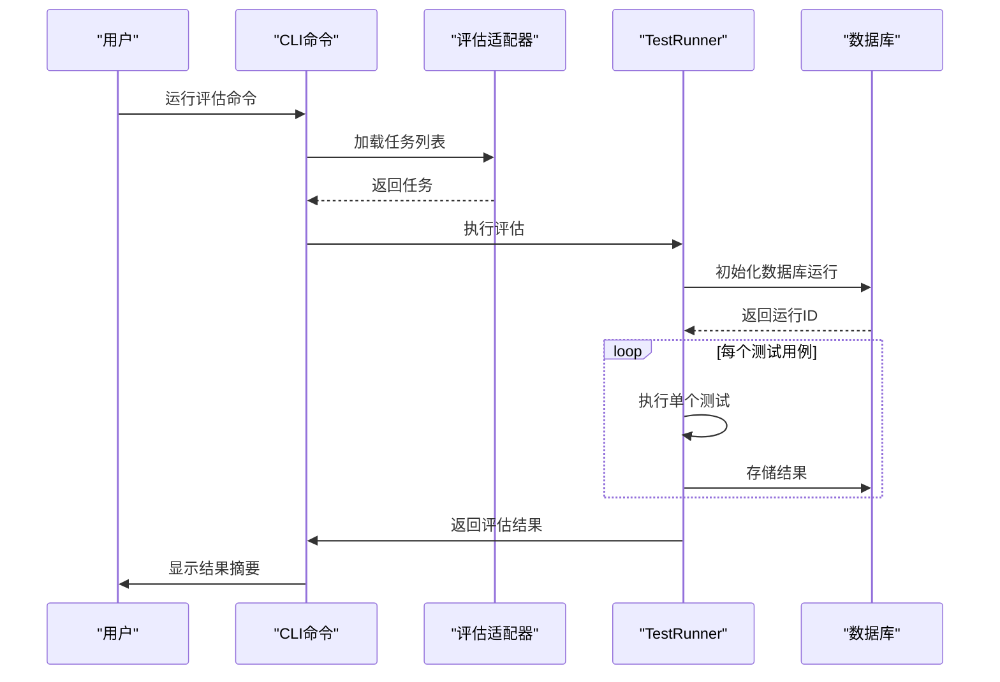

# 评估框架测试

<cite>
**本文档中引用的文件**   
- [exercism.ts](file://evals/cli/src/adapters/exercism.ts)
- [schema.ts](file://evals/cli/src/db/schema.ts)
- [index.ts](file://evals/cli/src/db/index.ts)
- [run.ts](file://evals/cli/src/commands/run.ts)
- [TestRunner.ts](file://evals/diff-edits/TestRunner.ts)
- [client.ts](file://evals/diff-edits/database/client.ts)
- [operations.ts](file://evals/diff-edits/database/operations.ts)
- [index.ts](file://testing-platform/index.ts)
- [grpcAdapter.ts](file://testing-platform/adapters/grpcAdapter.ts)
- [config.ts](file://testing-platform/harness/config.ts)
</cite>

## 目录
1. [简介](#简介)
2. [项目结构](#项目结构)
3. [核心组件](#核心组件)
4. [架构概述](#架构概述)
5. [详细组件分析](#详细组件分析)
6. [依赖分析](#依赖分析)
7. [性能考量](#性能考量)
8. [故障排除指南](#故障排除指南)
9. [结论](#结论)
10. [附录](#附录)（如有必要）

## 简介
本文档深入探讨了cline评估框架（evals）的测试和验证方法，重点介绍该框架如何用于评估AI模型在软件工程任务（如SWE-bench）上的性能。文档详细说明了`evals/db`模块的测试策略，包括数据库操作的验证机制。同时，阐述了`TestRunner.ts`如何执行评估任务并收集结果，以及如何为新的评估适配器（如`exercism.ts`）编写测试。此外，还介绍了`testing-platform`如何支持更广泛的测试场景，并提供了确保评估结果准确性和可靠性的最佳实践，涵盖基准测试、结果分析和报告生成等方面。

## 项目结构
cline评估框架的项目结构清晰地划分为多个功能模块，每个模块负责特定的评估任务和功能。核心评估逻辑位于`evals`目录下，其中包含CLI工具、差异编辑评估和数据库操作等关键组件。`evals/cli`目录实现了命令行接口，支持运行评估、生成报告和管理环境。`evals/diff-edits`目录则专注于基于差异的编辑任务评估，包含测试运行器、数据库客户端和各种辅助工具。

**Diagram sources**
- [exercism.ts](file://evals/cli/src/adapters/exercism.ts)
- [schema.ts](file://evals/cli/src/db/schema.ts)
- [TestRunner.ts](file://evals/diff-edits/TestRunner.ts)
- [index.ts](file://testing-platform/index.ts)

**Section sources**
- [exercism.ts](file://evals/cli/src/adapters/exercism.ts)
- [schema.ts](file://evals/cli/src/db/schema.ts)
- [TestRunner.ts](file://evals/diff-edits/TestRunner.ts)
- [index.ts](file://testing-platform/index.ts)

## 核心组件
评估框架的核心组件包括评估适配器、数据库管理模块、测试运行器和测试平台。评估适配器（如`exercism.ts`）负责与特定基准测试（如Exercism）进行交互，提供任务列表、准备任务环境和验证执行结果的功能。数据库管理模块（`evals/db`）使用SQLite数据库存储评估结果，确保数据的持久化和可追溯性。`TestRunner.ts`是差异编辑评估的核心执行引擎，负责初始化数据库运行、执行测试用例和存储结果。`testing-platform`则提供了一个更广泛的测试基础设施，支持gRPC接口的自动化测试。

**Section sources**
- [exercism.ts](file://evals/cli/src/adapters/exercism.ts)
- [index.ts](file://evals/cli/src/db/index.ts)
- [TestRunner.ts](file://evals/diff-edits/TestRunner.ts)
- [index.ts](file://testing-platform/index.ts)

## 架构概述
cline评估框架采用模块化架构设计，各组件之间通过清晰的接口进行通信。评估流程从CLI命令开始，通过适配器加载特定基准测试的任务，然后由测试运行器执行评估并将结果存储到数据库中。对于差异编辑评估，`TestRunner.ts`负责协调整个评估过程，包括初始化数据库、执行测试用例和生成报告。`testing-platform`则提供了一个独立的测试环境，用于验证gRPC服务的正确性。

**Diagram sources**
- [run.ts](file://evals/cli/src/commands/run.ts)
- [TestRunner.ts](file://evals/diff-edits/TestRunner.ts)
- [index.ts](file://evals/cli/src/db/index.ts)

## 详细组件分析

### 评估适配器分析
评估适配器是连接评估框架与具体基准测试的桥梁。以`ExercismAdapter`为例，它实现了`BenchmarkAdapter`接口，提供了`listTasks`、`prepareTask`和`verifyResult`等核心方法。`listTasks`方法扫描Exercism仓库中的练习题，为每个练习创建任务对象；`prepareTask`方法初始化Git仓库并创建初始提交，确保任务环境的一致性；`verifyResult`方法通过运行测试命令来验证AI模型的解决方案是否正确。

**Diagram sources**
- [exercism.ts](file://evals/cli/src/adapters/exercism.ts)

**Section sources**
- [exercism.ts](file://evals/cli/src/adapters/exercism.ts)

### 数据库模块分析
`evals/db`模块负责管理评估结果的持久化存储。它使用`better-sqlite3`库创建和操作SQLite数据库，定义了`ResultsDatabase`类来封装数据库操作。该模块的测试策略包括验证数据库连接、模式初始化和数据插入的正确性。通过`schema.ts`文件定义的SQL模式，确保了数据库结构的一致性和完整性。

**Diagram sources**
- [index.ts](file://evals/cli/src/db/index.ts)
- [schema.ts](file://evals/cli/src/db/schema.ts)

**Section sources**
- [index.ts](file://evals/cli/src/db/index.ts)
- [schema.ts](file://evals/cli/src/db/schema.ts)

### TestRunner分析
`TestRunner.ts`是差异编辑评估的核心组件，负责执行评估任务并收集结果。它通过`initializeDatabaseRun`方法初始化数据库运行，创建基准测试运行记录和用例记录。`runSingleTest`方法执行单个测试用例，调用AI模型并解析结果。`storeResultInDatabase`方法将测试结果存储到数据库中，包括成功状态、错误信息和性能指标。

**Diagram sources**
- [TestRunner.ts](file://evals/diff-edits/TestRunner.ts)

**Section sources**
- [TestRunner.ts](file://evals/diff-edits/TestRunner.ts)

### 测试平台分析
`testing-platform`是一个独立的测试基础设施，用于验证gRPC服务的正确性。它通过`GrpcAdapter`类与gRPC服务进行通信，支持调用各种服务方法并验证响应。`NON_DETERMINISTIC_FIELDS`配置定义了在比较响应时应忽略的非确定性字段，确保测试的稳定性。

**Diagram sources**
- [grpcAdapter.ts](file://testing-platform/adapters/grpcAdapter.ts)
- [config.ts](file://testing-platform/harness/config.ts)

**Section sources**
- [grpcAdapter.ts](file://testing-platform/adapters/grpcAdapter.ts)
- [config.ts](file://testing-platform/harness/config.ts)

## 依赖分析
评估框架的依赖关系清晰地反映了其模块化设计。`evals/cli`模块依赖于`evals/db`模块进行结果存储，同时通过适配器模式与各种基准测试进行交互。`evals/diff-edits`模块依赖于`evals/diff-edits/database`模块进行数据库操作，并通过`ClineWrapper.ts`与AI模型进行通信。`testing-platform`模块独立于主评估框架，但依赖于gRPC协议与cline核心服务进行交互。

**Diagram sources**
- [run.ts](file://evals/cli/src/commands/run.ts)
- [TestRunner.ts](file://evals/diff-edits/TestRunner.ts)
- [index.ts](file://testing-platform/index.ts)

**Section sources**
- [run.ts](file://evals/cli/src/commands/run.ts)
- [TestRunner.ts](file://evals/diff-edits/TestRunner.ts)
- [index.ts](file://testing-platform/index.ts)

## 性能考量
评估框架在设计时考虑了性能和可扩展性。`TestRunner.ts`支持并行执行测试用例，通过`maxConcurrency`参数控制并发度，以平衡执行速度和资源消耗。数据库操作经过优化，使用预编译语句和事务处理来提高性能。对于大规模评估，建议使用SSD存储和足够的内存来确保数据库性能。

## 故障排除指南
当评估框架出现问题时，可以按照以下步骤进行排查：首先检查环境变量（如API密钥）是否正确设置；其次验证数据库连接和模式初始化是否成功；然后检查测试用例文件是否完整且格式正确；最后查看日志输出以确定具体错误原因。对于gRPC相关问题，确保服务端口正确且服务正在运行。

**Section sources**
- [TestRunner.ts](file://evals/diff-edits/TestRunner.ts)
- [run.ts](file://evals/cli/src/commands/run.ts)

## 结论
cline评估框架提供了一套完整的工具和方法，用于评估AI模型在软件工程任务上的性能。通过模块化设计和清晰的接口，该框架支持多种基准测试和评估场景。`evals/db`模块确保了评估结果的可靠存储，`TestRunner.ts`提供了强大的测试执行能力，而`testing-platform`则扩展了框架的测试范围。遵循本文档中的最佳实践，可以确保评估结果的准确性和可靠性。

## 附录
### 评估结果指标
| 指标 | 描述 | 数据类型 |
|------|------|----------|
| success | 测试是否成功 | 布尔值 |
| error | 错误信息 | 字符串 |
| time_to_first_token_ms | 首个令牌的响应时间 | 数字 |
| time_to_first_edit_ms | 首次编辑的响应时间 | 数字 |
| time_round_trip_ms | 往返响应时间 | 数字 |
| cost_usd | 执行成本（美元） | 数字 |
| completion_tokens | 完成令牌数 | 数字 |
| num_edits | 编辑次数 | 数字 |
| num_lines_added | 添加的行数 | 数字 |
| num_lines_deleted | 删除的行数 | 数字 |

**Section sources**
- [TestRunner.ts](file://evals/diff-edits/TestRunner.ts)