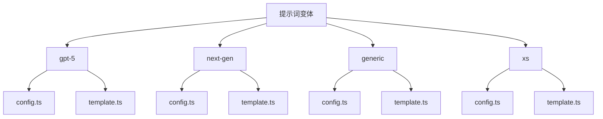
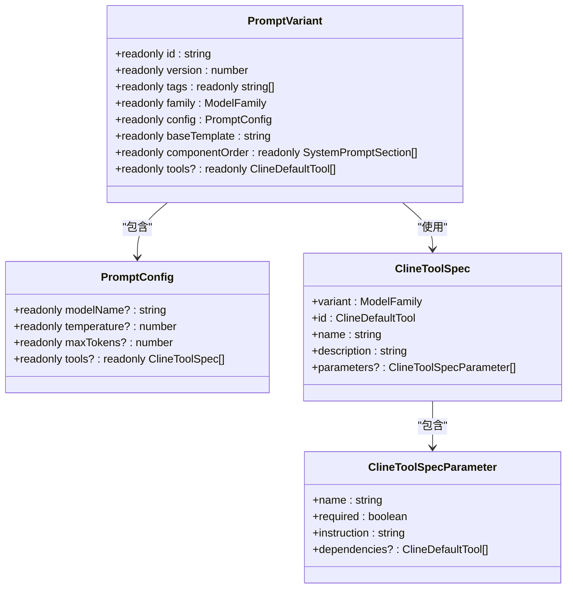
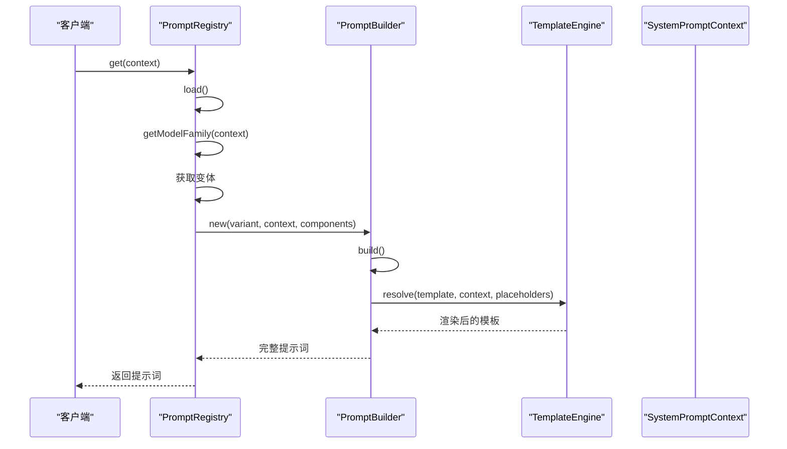

# AI模型与提示词配置

<cite>
**本文档中引用的文件**  
- [config.ts](file://src/core/prompts/system-prompt/variants/gpt-5/config.ts)
- [template.ts](file://src/core/prompts/system-prompt/variants/gpt-5/template.ts)
- [config.ts](file://src/core/prompts/system-prompt/variants/next-gen/config.ts)
- [template.ts](file://src/core/prompts/system-prompt/variants/next-gen/template.ts)
- [config.template.ts](file://src/core/prompts/system-prompt/variants/config.template.ts)
- [template.ts](file://src/core/prompts/system-prompt/variants/generic/template.ts)
- [PromptRegistry.ts](file://src/core/prompts/system-prompt/registry/PromptRegistry.ts)
- [TemplateEngine.ts](file://src/core/prompts/system-prompt/templates/TemplateEngine.ts)
- [types.ts](file://src/core/prompts/system-prompt/types.ts)
- [spec.ts](file://src/core/prompts/system-prompt/spec.ts)
</cite>

## 目录
1. [简介](#简介)
2. [提示词变体结构与用途](#提示词变体结构与用途)
3. [提示词配置模式定义](#提示词配置模式定义)
4. [系统提示模板构建](#系统提示模板构建)
5. [PromptRegistry 与 TemplateEngine 协同机制](#promptregistry-与-templateengine-协同机制)
6. [创建自定义提示词变体指南](#创建自定义提示词变体指南)
7. [提示词配置对AI行为的影响](#提示词配置对ai行为的影响)
8. [结论](#结论)

## 简介
本文档深入解析AI模型提示词系统的架构与实现机制，重点阐述`src/core/prompts/variants`目录下不同提示词变体的组织结构与应用场景。通过分析`config.template.ts`定义的配置模式、`template.ts`文件中的模板构建逻辑，以及`PromptRegistry`和`TemplateEngine`两大核心组件的协同工作原理，为开发者提供完整的提示词配置体系认知。同时，文档提供创建自定义提示词变体的详细指南，并展示不同配置对AI响应质量与任务执行效果的实际影响。

## 提示词变体结构与用途
`src/core/prompts/variants`目录下定义了多种提示词变体，每种变体针对特定模型家族或使用场景进行优化。这些变体通过独立的`config.ts`和`template.ts`文件实现配置与模板的分离。

### gpt-5 变体
专为GPT-5系列模型设计的提示词配置，包含针对该模型家族特性的优化参数和功能集。其配置文件定义了模型名称、温度系数、最大生成令牌数等核心参数，并指定适用于GPT-5的工具集。

**Section sources**
- [config.ts](file://src/core/prompts/system-prompt/variants/gpt-5/config.ts)
- [template.ts](file://src/core/prompts/system-prompt/variants/gpt-5/template.ts)

### next-gen 变体
面向下一代先进模型的提示词配置，支持更复杂的反馈循环和网络获取功能。该变体包含增强型工具集，适用于需要高级推理和外部信息检索能力的场景。

**Section sources**
- [config.ts](file://src/core/prompts/system-prompt/variants/next-gen/config.ts)
- [template.ts](file://src/core/prompts/system-prompt/variants/next-gen/template.ts)

### 通用变体结构
所有变体遵循统一的结构模式：
- `config.ts`：定义`PromptConfig`类型的配置对象，包含模型参数、工具规格和运行时设置
- `template.ts`：提供基础模板字符串，包含占位符用于动态内容注入
- 变体通过`VARIANT_CONFIGS`注册表集中管理，确保类型安全和动态加载能力



**Diagram sources**
- [index.ts](file://src/core/prompts/system-prompt/variants/index.ts)
- [types.ts](file://src/core/prompts/system-prompt/types.ts)

## 提示词配置模式定义
`config.template.ts`文件定义了提示词配置的类型模式，通过TypeScript接口确保配置的类型安全和结构完整性。

### 配置接口结构
核心配置接口`PromptVariant`定义了提示词变体的完整结构，包括：
- **基础元数据**：ID、版本号、标签、描述
- **模型配置**：`PromptConfig`类型，包含模型名称、温度、最大令牌数等
- **组件配置**：组件顺序、组件覆盖、占位符默认值
- **工具配置**：工具列表、工具覆盖设置

### 工具规格定义
`ClineToolSpec`接口定义了工具的规范结构，包含：
- 工具ID与名称
- 功能描述与使用说明
- 参数定义，包括名称、是否必需、使用说明、依赖关系
- 上下文需求函数，用于条件性启用工具



**Diagram sources**
- [config.template.ts](file://src/core/prompts/system-prompt/variants/config.template.ts)
- [types.ts](file://src/core/prompts/system-prompt/types.ts)
- [spec.ts](file://src/core/prompts/system-prompt/spec.ts)

## 系统提示模板构建
`template.ts`文件负责构建具体的系统提示模板，通过占位符机制实现动态内容注入。

### 模板结构
基础模板包含多个预定义的占位符，如`{{agent_role}}`、`{{capabilities}}`、`{{objective}}`等，这些占位符对应系统提示的不同组成部分。模板采用模块化设计，各组件按`componentOrder`数组定义的顺序排列。

### 组件函数
每个占位符由对应的组件函数生成内容，这些函数作为`ComponentFunction`类型注册到组件注册表中。组件函数接收`PromptVariant`和`SystemPromptContext`作为参数，根据当前配置和上下文动态生成文本内容。

**Section sources**
- [template.ts](file://src/core/prompts/system-prompt/variants/generic/template.ts)
- [types.ts](file://src/core/prompts/system-prompt/types.ts)

## PromptRegistry 与 TemplateEngine 协同机制
`PromptRegistry`和`TemplateEngine`是提示词系统的核心组件，二者协同完成提示词的加载与渲染。

### PromptRegistry 职责
`PromptRegistry`作为单例类，负责：
- 加载所有提示词变体配置
- 管理组件注册表
- 根据模型上下文选择合适的提示词变体
- 使用`PromptBuilder`构建最终提示词



**Diagram sources**
- [PromptRegistry.ts](file://src/core/prompts/system-prompt/registry/PromptRegistry.ts)
- [TemplateEngine.ts](file://src/core/prompts/system-prompt/templates/TemplateEngine.ts)

### TemplateEngine 职责
`TemplateEngine`负责模板的解析与渲染：
- 替换`{{PLACEHOLDER}}`格式的占位符
- 支持嵌套对象访问（点表示法）
- 验证必需占位符的完整性
- 提取模板中的所有占位符

### 协同工作流程
1. `PromptRegistry`根据模型上下文确定合适的提示词变体
2. 创建`PromptBuilder`实例，传入变体配置、上下文和组件注册表
3. `PromptBuilder`按`componentOrder`顺序调用各组件函数生成内容
4. `TemplateEngine`将生成的内容注入基础模板的相应占位符
5. 返回最终渲染完成的系统提示词

**Section sources**
- [PromptRegistry.ts](file://src/core/prompts/system-prompt/registry/PromptRegistry.ts)
- [TemplateEngine.ts](file://src/core/prompts/system-prompt/templates/TemplateEngine.ts)

## 创建自定义提示词变体指南
本节提供创建自定义提示词变体的分步指南，帮助开发者调整AI的语气、行为和能力。

### 步骤1：创建变体目录
在`src/core/prompts/variants`下创建新目录，如`my-custom-model`。

### 步骤2：定义配置文件
创建`config.ts`文件，导出符合`PromptVariant`接口的配置对象：
```typescript
export const config = {
  version: 1,
  tags: ["custom"],
  labels: { experimental: 1 },
  family: ModelFamily.CUSTOM,
  description: "自定义模型提示词配置",
  config: {
    modelName: "my-custom-model",
    temperature: 0.7,
    maxTokens: 2048,
  },
  baseTemplate: "...",
  componentOrder: [...],
  placeholders: {},
} as const
```

### 步骤3：创建模板文件
创建`template.ts`文件，定义基础模板字符串，使用`{{placeholder}}`语法定义可变部分。

### 步骤4：注册变体
在`variants/index.ts`的`VARIANT_CONFIGS`对象中添加新变体引用。

### 步骤5：调整AI行为
通过以下方式调整AI行为：
- **语气调整**：修改`agent_role`组件内容，改变AI的角色定位和语言风格
- **行为控制**：通过`componentOverrides`启用/禁用特定功能组件
- **能力扩展**：在`tools`数组中添加新工具，或通过`toolOverrides`修改现有工具行为

**Section sources**
- [config.template.ts](file://src/core/prompts/system-prompt/variants/config.template.ts)
- [types.ts](file://src/core/prompts/system-prompt/types.ts)
- [index.ts](file://src/core/prompts/system-prompt/variants/index.ts)

## 提示词配置对AI行为的影响
不同的提示词配置对AI的响应质量和任务执行效果有显著影响。

### 配置参数影响
- **温度系数**：较低值（0.2-0.5）产生更确定、保守的响应；较高值（0.7-1.0）增加创造性和多样性
- **最大令牌数**：限制响应长度，影响复杂任务的完成度
- **工具集配置**：决定AI可用的能力范围，直接影响任务执行能力

### 变体选择影响
- **generic变体**：提供稳定、兼容性强的基础行为
- **next-gen变体**：启用高级功能，提升复杂任务处理能力
- **xs变体**：优化资源使用，适合轻量级场景

### 实际效果对比
| 配置类型 | 响应准确性 | 创造性 | 任务完成率 | 资源消耗 |
|---------|-----------|--------|-----------|---------|
| generic | 高 | 中 | 高 | 低 |
| next-gen | 极高 | 高 | 极高 | 高 |
| xs | 中 | 低 | 中 | 极低 |
| gpt-5 | 高 | 高 | 高 | 中 |

**Section sources**
- [config.ts](file://src/core/prompts/system-prompt/variants/generic/config.ts)
- [config.ts](file://src/core/prompts/system-prompt/variants/next-gen/config.ts)
- [config.ts](file://src/core/prompts/system-prompt/variants/xs/config.ts)
- [config.ts](file://src/core/prompts/system-prompt/variants/gpt-5/config.ts)

## 结论
本文档全面解析了AI模型提示词配置系统的架构与实现。通过理解`src/core/prompts/variants`目录下不同变体的结构与用途，掌握`config.template.ts`定义的配置模式，以及`template.ts`文件的模板构建机制，开发者能够有效利用`PromptRegistry`和`TemplateEngine`的协同工作原理。创建自定义提示词变体的指南为个性化AI行为调整提供了实用路径。不同配置对AI响应质量和任务执行效果的影响分析，为优化AI性能提供了决策依据。该系统通过模块化、类型安全的设计，实现了提示词配置的灵活性与可靠性平衡。