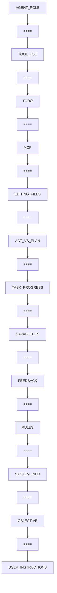
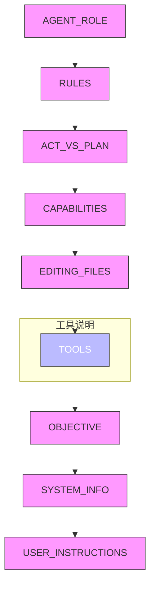
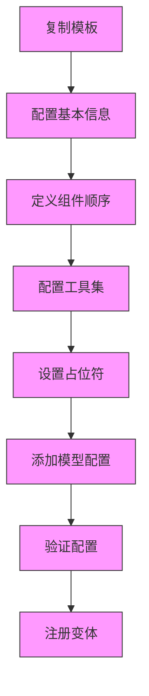
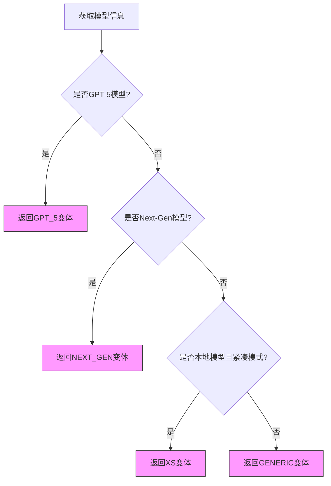
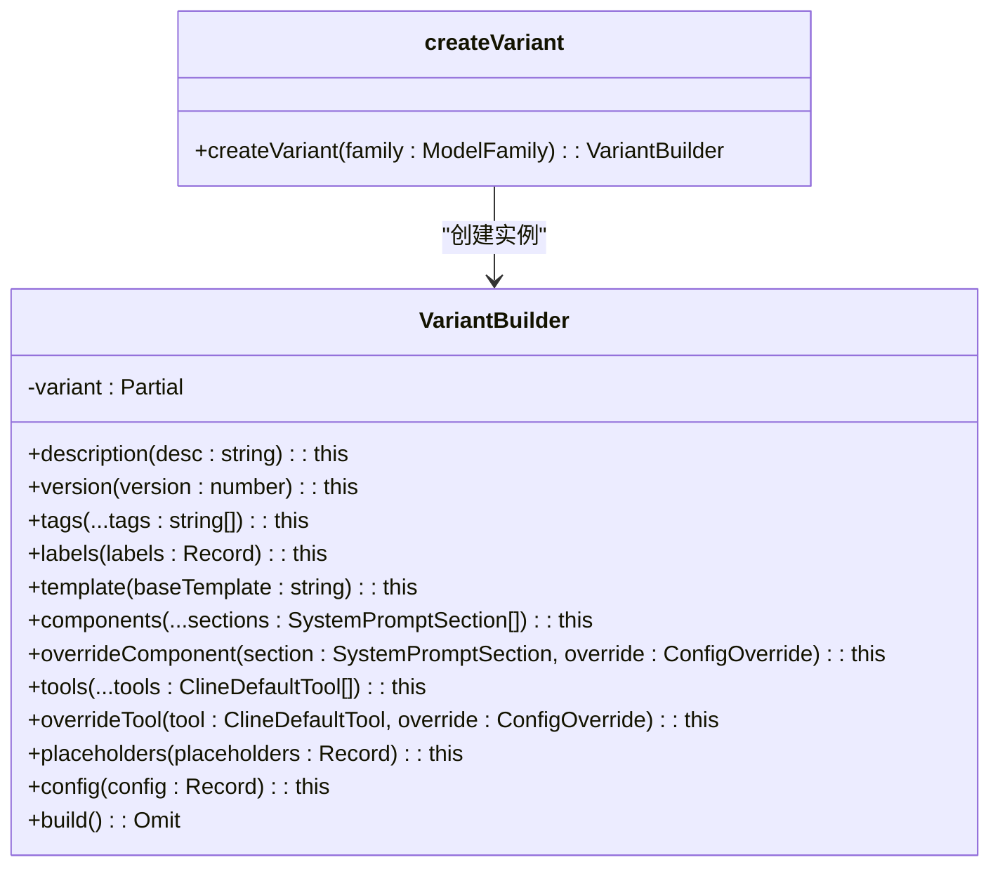
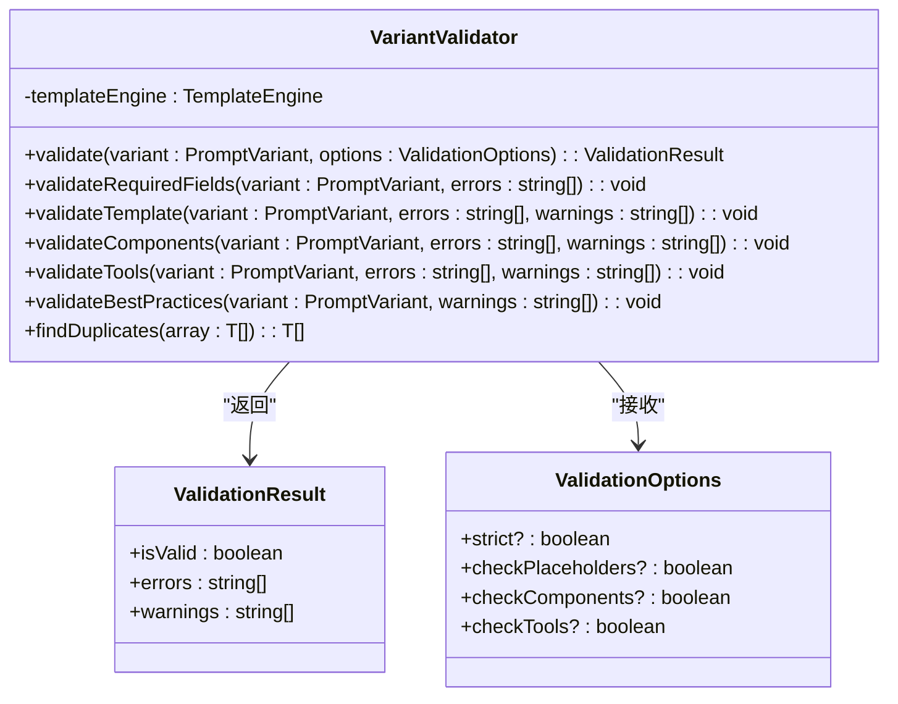

# 提示词变体管理

<cite>
**本文档中引用的文件**  
- [config.template.ts](file://src/core/prompts/system-prompt/variants/config.template.ts)
- [template.ts](file://src/core/prompts/system-prompt/variants/generic/template.ts)
- [template.ts](file://src/core/prompts/system-prompt/variants/gpt-5/template.ts)
- [template.ts](file://src/core/prompts/system-prompt/variants/next-gen/template.ts)
- [template.ts](file://src/core/prompts/system-prompt/variants/xs/template.ts)
- [variant-builder.ts](file://src/core/prompts/system-prompt/variants/variant-builder.ts)
- [variant-validator.ts](file://src/core/prompts/system-prompt/variants/variant-validator.ts)
- [index.ts](file://src/core/prompts/system-prompt/index.ts)
</cite>

## 目录
1. [简介](#简介)
2. [提示词变体架构设计](#提示词变体架构设计)
3. [配置模式详解](#配置模式详解)
4. [模板结构与动态构建](#模板结构与动态构建)
5. [创建新提示词变体的完整流程](#创建新提示词变体的完整流程)
6. [变体选择机制](#变体选择机制)
7. [核心组件分析](#核心组件分析)
8. [结论](#结论)

## 简介
本文档深入解析`src/core/prompts/variants`目录下的提示词变体管理系统，涵盖其架构设计、配置策略、模板结构、创建流程及自动匹配机制。系统通过类型安全的构建器模式和验证机制，为不同AI模型和使用场景提供高度优化的提示词模板。

## 提示词变体架构设计
提示词变体系统采用模块化设计，支持针对不同AI模型（如gpt-5、next-gen、xs）进行定制化优化。系统通过`ModelFamily`枚举定义模型家族，并为每个家族提供独立的配置和模板。

变体系统的核心设计原则包括：
- **类型安全**：使用TypeScript的类型系统确保配置的正确性
- **可扩展性**：通过组件化设计支持新变体的快速添加
- **可验证性**：内置验证机制确保配置的完整性和正确性
- **可复用性**：基础模板和组件可在不同变体间共享

不同变体针对特定场景进行优化：
- **gpt-5**：针对GPT-5系列模型优化，包含完整的规则集和工具说明
- **next-gen**：针对下一代AI模型优化，支持高级功能和复杂交互
- **xs**：针对轻量级模型优化，采用紧凑格式，减少token消耗
- **generic**：通用模板，作为其他变体的基础

**Section sources**
- [index.ts](file://src/core/prompts/system-prompt/index.ts#L1-L41)
- [config.template.ts](file://src/core/prompts/system-prompt/variants/config.template.ts#L1-L151)

## 配置模式详解
`config.template.ts`文件定义了类型安全的变体配置模式，采用构建器（Builder）模式实现配置的逐步构建和编译时验证。

### 配置参数说明
配置系统支持以下关键参数：

| 配置项 | 类型 | 说明 |
|--------|------|------|
| `family` | ModelFamily | 指定目标模型家族 |
| `description` | string | 变体的简要描述和使用场景 |
| `version` | number | 版本号，用于版本管理 |
| `tags` | string[] | 标签，用于分类和筛选 |
| `labels` | Record<string, number> | 版本标签映射 |
| `componentOrder` | SystemPromptSection[] | 组件顺序定义 |
| `tools` | ClineDefaultTool[] | 支持的工具列表 |
| `placeholders` | Record<string, string> | 占位符值映射 |
| `config` | Record<string, any> | 模型特定配置 |

### 参数设置策略
#### 温度（temperature）设置
温度参数控制生成文本的随机性：
- **高温度（>0.7）**：适用于创意性任务，生成更多样化的输出
- **中等温度（0.5-0.7）**：平衡创造性和一致性，适用于一般任务
- **低温度（<0.5）**：适用于需要精确和确定性输出的任务

#### 最大令牌数（max_tokens）设置
最大令牌数限制影响模型的上下文长度和输出长度：
- **长上下文模型**：可设置较高的max_tokens以支持复杂任务
- **短上下文模型**：需限制max_tokens以避免超出上下文窗口
- **流式输出场景**：适当降低max_tokens以减少延迟

配置系统还支持组件和工具的覆盖（override），允许对特定组件或工具进行定制化调整。

**Section sources**
- [config.template.ts](file://src/core/prompts/system-prompt/variants/config.template.ts#L1-L151)
- [variant-builder.ts](file://src/core/prompts/system-prompt/variants/variant-builder.ts#L1-L201)

## 模板结构与动态构建
`template.ts`文件定义了提示词模板的结构，通过占位符和条件逻辑实现动态系统提示的构建。

### 模板结构分析
不同变体采用不同的模板结构以适应其目标场景：

#### 通用模板（generic）
通用模板采用分隔符"===="清晰分隔各个组件，结构清晰，易于维护：


**Diagram sources**
- [template.ts](file://src/core/prompts/system-prompt/variants/generic/template.ts#L1-L50)

#### GPT-5和Next-Gen模板
GPT-5和Next-Gen模板共享相同的结构，但在规则部分包含条件逻辑，根据上下文动态调整行为：

```mermaid
classDiagram
class SystemPromptContext {
+yoloModeToggled : boolean
+otherContextFields : any
}
class RulesTemplate {
+rules_template(context : SystemPromptContext) : string
}
SystemPromptContext --> RulesTemplate : "作为参数传递"
note right of RulesTemplate
包含条件逻辑的规则模板
根据yoloModeToggled状态
动态调整提示内容
end note
```

**Diagram sources**
- [template.ts](file://src/core/prompts/system-prompt/variants/gpt-5/template.ts#L1-L79)
- [template.ts](file://src/core/prompts/system-prompt/variants/next-gen/template.ts#L1-L79)

#### XS模板
XS模板采用紧凑格式，减少分隔符使用，优化token效率，同时在工具说明部分提供详细的使用示例：



**Diagram sources**
- [template.ts](file://src/core/prompts/system-prompt/variants/xs/template.ts#L1-L73)

### 动态构建机制
系统通过`TemplateEngine`实现模板的动态构建，支持：
- **占位符替换**：将`{{PLACEHOLDER}}`替换为实际内容
- **条件逻辑**：根据上下文条件动态包含或排除内容
- **组件组合**：按`componentOrder`顺序组合各个组件
- **错误处理**：验证占位符的完整性和正确性

**Section sources**
- [template.ts](file://src/core/prompts/system-prompt/variants/generic/template.ts#L1-L50)
- [template.ts](file://src/core/prompts/system-prompt/variants/gpt-5/template.ts#L1-L79)
- [template.ts](file://src/core/prompts/system-prompt/variants/next-gen/template.ts#L1-L79)
- [template.ts](file://src/core/prompts/system-prompt/variants/xs/template.ts#L1-L73)

## 创建新提示词变体的完整流程
创建新的提示词变体遵循标准化流程，确保类型安全和配置正确性。

### 创建流程步骤


**Diagram sources**
- [config.template.ts](file://src/core/prompts/system-prompt/variants/config.template.ts#L1-L151)

### 详细步骤说明
1. **复制模板**：从`config.template.ts`复制模板文件到`variants/{variant-name}/config.ts`
2. **配置基本信息**：设置`description`、`version`、`tags`等基本信息
3. **定义组件顺序**：使用`components()`方法按逻辑顺序定义组件
4. **配置工具集**：使用`tools()`方法指定支持的工具
5. **设置占位符**：通过`placeholders()`方法定义占位符值
6. **添加模型配置**：在`config()`中设置`temperature`、`maxTokens`等参数
7. **验证配置**：运行验证确保配置的正确性
8. **注册变体**：将新变体注册到系统中

系统提供`createMinimalVariant`和`createAdvancedVariant`等辅助函数，简化常见变体的创建。

**Section sources**
- [config.template.ts](file://src/core/prompts/system-prompt/variants/config.template.ts#L1-L151)
- [variant-builder.ts](file://src/core/prompts/system-prompt/variants/variant-builder.ts#L1-L201)

## 变体选择机制
系统根据用户配置和AI模型类型自动匹配最合适的提示词模板。

### 选择逻辑流程


**Diagram sources**
- [index.ts](file://src/core/prompts/system-prompt/index.ts#L1-L41)

### 选择机制实现
选择机制在`getModelFamily`函数中实现，通过以下步骤确定模型家族：
1. 检查是否为GPT-5模型家族
2. 检查是否为下一代模型家族
3. 检查是否为本地模型且使用紧凑模式
4. 默认返回通用家族

`getSystemPrompt`函数使用`PromptRegistry`根据上下文获取相应的系统提示，实现变体的动态加载和使用。

**Section sources**
- [index.ts](file://src/core/prompts/system-prompt/index.ts#L1-L41)

## 核心组件分析
提示词变体系统由多个核心组件构成，每个组件承担特定职责。

### 变体构建器（VariantBuilder）
`variant-builder.ts`实现类型安全的构建器模式，提供流畅的API用于创建变体配置：



**Diagram sources**
- [variant-builder.ts](file://src/core/prompts/system-prompt/variants/variant-builder.ts#L1-L201)

### 变体验证器（VariantValidator）
`variant-validator.ts`提供全面的验证功能，确保变体配置的正确性：



**Diagram sources**
- [variant-validator.ts](file://src/core/prompts/system-prompt/variants/variant-validator.ts#L1-L223)

### 模板引擎（TemplateEngine）
虽然未直接提供源码，但系统通过`TemplateEngine`实现模板的动态处理，支持占位符替换和条件逻辑。

**Section sources**
- [variant-builder.ts](file://src/core/prompts/system-prompt/variants/variant-builder.ts#L1-L201)
- [variant-validator.ts](file://src/core/prompts/system-prompt/variants/variant-validator.ts#L1-L223)

## 结论
提示词变体管理系统通过类型安全的设计、灵活的配置模式和自动化的选择机制，为不同AI模型和使用场景提供了高度优化的提示词模板。系统采用构建器模式和验证机制确保配置的正确性，通过动态模板构建支持复杂的条件逻辑，实现了提示词管理的可扩展性和可维护性。开发者可以遵循标准化流程创建新的提示词变体，系统将根据模型类型自动选择最合适的模板，确保最佳的交互效果。