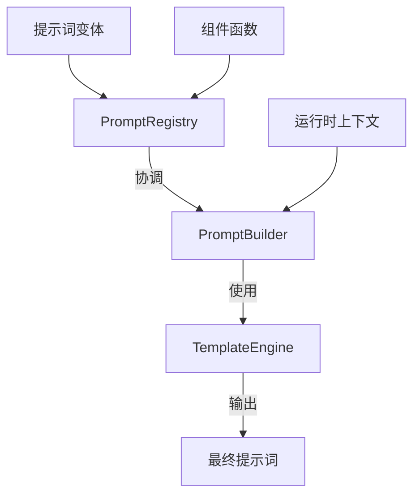
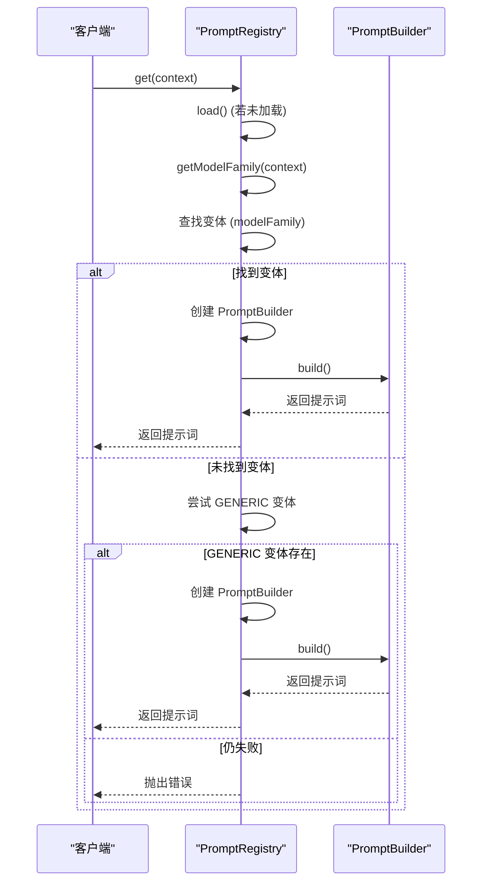
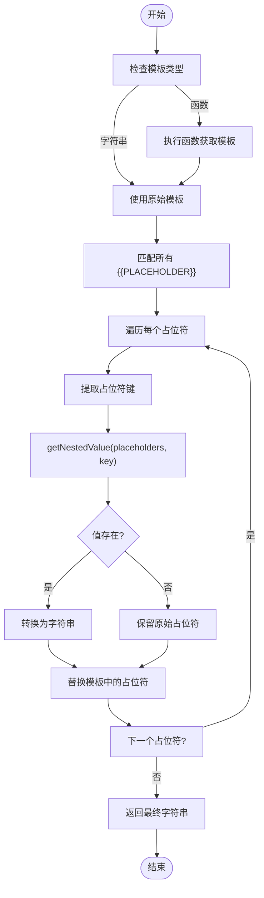

# 提示词引擎与注册表

<cite>
**本文档中引用的文件**   
- [PromptRegistry.ts](file://src/core/prompts/system-prompt/registry/PromptRegistry.ts)
- [PromptBuilder.ts](file://src/core/prompts/system-prompt/registry/PromptBuilder.ts)
- [TemplateEngine.ts](file://src/core/prompts/system-prompt/templates/TemplateEngine.ts)
- [spec.ts](file://src/core/prompts/system-prompt/spec.ts)
- [types.ts](file://src/core/prompts/system-prompt/types.ts)
- [placeholders.ts](file://src/core/prompts/system-prompt/templates/placeholders.ts)
</cite>

## 目录
1. [简介](#简介)
2. [核心架构概览](#核心架构概览)
3. [提示词注册表 (PromptRegistry)](#提示词注册表-promptregistry)
4. [提示词构建器 (PromptBuilder)](#提示词构建器-promptbuilder)
5. [模板引擎 (TemplateEngine)](#模板引擎-templateengine)
6. [提示词规范结构 (spec.ts)](#提示词规范结构-spects)
7. [完整工作流程示例](#完整工作流程示例)
8. [错误处理机制](#错误处理机制)
9. [性能优化策略](#性能优化策略)
10. [结论](#结论)

## 简介
本文档全面阐述了提示词引擎与注册表系统的设计与实现。该系统是AI指令生成的核心，负责管理、构建和渲染针对不同模型的系统提示词。文档将深入解析`PromptRegistry`的设计模式与核心功能，详细说明`TemplateEngine`的工作原理，并解释`spec.ts`中定义的提示词规范结构。通过实际代码示例，展示从获取模板到最终渲染为AI可理解指令的完整流程。

## 核心架构概览
提示词引擎系统由三个核心组件构成：`PromptRegistry`（注册表）、`PromptBuilder`（构建器）和`TemplateEngine`（模板引擎）。`PromptRegistry`作为单例中心，负责管理所有提示词变体和组件的生命周期。`PromptBuilder`作为协调者，利用`TemplateEngine`将模板、组件和运行时数据结合，最终生成完整的提示词。

**Diagram sources**
- [PromptRegistry.ts](file://src/core/prompts/system-prompt/registry/PromptRegistry.ts)
- [PromptBuilder.ts](file://src/core/prompts/system-prompt/registry/PromptBuilder.ts)
- [TemplateEngine.ts](file://src/core/prompts/system-prompt/templates/TemplateEngine.ts)

**Section sources**
- [PromptRegistry.ts](file://src/core/prompts/system-prompt/registry/PromptRegistry.ts#L9-L312)
- [PromptBuilder.ts](file://src/core/prompts/system-prompt/registry/PromptBuilder.ts#L0-L236)

## 提示词注册表 (PromptRegistry)

`PromptRegistry` 是一个单例类，作为整个提示词系统的中央枢纽。它采用注册表模式，负责加载、管理和提供不同模型家族的提示词变体。

### 设计模式与核心功能
`PromptRegistry` 采用单例模式确保全局唯一实例，防止资源浪费和状态不一致。其核心功能包括：
- **懒加载 (Lazy Loading)**：通过 `load()` 方法在首次请求时异步加载所有变体和组件，优化启动性能。
- **健康检查 (Health Check)**：在加载完成后执行 `performHealthCheck()`，验证关键变体（如 `GENERIC`）是否存在，确保系统处于有效状态。
- **多级查找 (Multi-level Lookup)**：提供 `get()`、`getVersion()` 和 `getByTag()` 等方法，支持基于模型ID、版本号或标签/标签的灵活查找。

### 注册与查找机制
系统通过 `registerComponent()` 方法将功能组件（如工具使用、能力说明）注册到内部的 `components` 映射中。当通过 `get()` 方法请求提示词时，注册表首先根据 `context.providerInfo` 确定模型家族，尝试加载对应变体。若未找到，则自动回退到 `GENERIC` 变体，保证了系统的健壮性。

**Diagram sources**
- [PromptRegistry.ts](file://src/core/prompts/system-prompt/registry/PromptRegistry.ts#L9-L312)

**Section sources**
- [PromptRegistry.ts](file://src/core/prompts/system-prompt/registry/PromptRegistry.ts#L9-L312)

## 提示词构建器 (PromptBuilder)

`PromptBuilder` 是提示词生成流程的执行者，它协调模板引擎、组件函数和占位符数据，最终构建出完整的提示词。

### 工作原理
`PromptBuilder` 的 `build()` 方法遵循一个清晰的四步流程：
1.  **构建组件 (buildComponents)**：按照 `variant.componentOrder` 中定义的顺序，依次调用注册的组件函数。每个组件函数接收 `variant` 和 `context` 作为参数，返回一个字符串形式的组件内容（如工具列表、用户指令）。
2.  **准备占位符 (preparePlaceholders)**：收集所有需要注入模板的数据，包括变体自带的占位符、标准系统占位符（如当前工作目录 `CWD`、模型家族 `MODEL_FAMILY`）、上一步生成的组件内容，以及来自 `context` 的运行时占位符。
3.  **解析模板 (resolve)**：将准备好的占位符数据传递给 `TemplateEngine`，由其负责替换模板中的 `{{PLACEHOLDER}}`。
4.  **后处理 (postProcess)**：对生成的提示词进行清理，移除多余的空行和分隔符，确保输出格式整洁。

### 错误处理与元数据
在构建组件时，`PromptBuilder` 使用 `try-catch` 块捕获单个组件的错误，记录警告但不中断整个流程，保证了部分失败下的可用性。此外，`getBuildMetadata()` 方法提供了构建过程的元数据，可用于调试和监控。

**Section sources**
- [PromptBuilder.ts](file://src/core/prompts/system-prompt/registry/PromptBuilder.ts#L0-L236)

## 模板引擎 (TemplateEngine)

`TemplateEngine` 是一个轻量级的字符串模板解析器，负责将动态数据注入到静态模板中。

### 核心功能
- **占位符解析 (resolve)**：使用正则表达式 `\{\{([^}]+)\}\}` 匹配模板中的占位符。它支持点符号（dot notation）来访问嵌套对象的属性（如 `user.name`）。
- **嵌套值获取 (getNestedValue)**：通过 `split('.')` 和 `reduce()` 方法递归地从对象中提取嵌套值。
- **占位符提取 (extractPlaceholders)**：扫描模板并返回所有唯一占位符名称的数组，可用于验证或调试。
- **占位符转义 (escape/unescape)**：提供方法来转义 `{{` 和 `}}`，防止它们被意外解析。

### 工作流程
当 `resolve()` 方法被调用时，它首先检查模板是否为函数，如果是则执行以获取字符串。然后，它遍历所有匹配的占位符，通过 `getNestedValue()` 从 `placeholders` 对象中查找对应的值。如果值存在，则将其转换为字符串（非字符串值会 `JSON.stringify`）；如果值不存在，则保留原始占位符（允许部分解析）。

**Diagram sources**
- [TemplateEngine.ts](file://src/core/prompts/system-prompt/templates/TemplateEngine.ts#L0-L91)

**Section sources**
- [TemplateEngine.ts](file://src/core/prompts/system-prompt/templates/TemplateEngine.ts#L0-L91)

## 提示词规范结构 (spec.ts)

`spec.ts` 文件定义了提示词系统中工具（Tool）的规范接口，确保了工具定义的统一性和可扩展性。

### 核心接口
- **ClineToolSpec**: 定义了单个工具的规范，包含 `id`、`name`、`description` 等基本信息。
- **contextRequirements**: 一个函数类型，允许工具根据当前上下文（`SystemPromptContext`）动态决定是否启用。例如，一个浏览器操作工具可能只在 `supportsBrowserUse` 为 `true` 时才显示。
- **ClineToolSpecParameter**: 定义了工具参数的规范，支持 `dependencies`（依赖其他工具）和 `contextRequirements`，实现了复杂的条件逻辑。

### 组织方式
`sections`、`placeholders` 和 `context` 在代码中是通过不同的模块和对象来组织的：
- **sections**: 由 `components` 目录下的函数生成，每个函数返回一个字符串形式的文本块。
- **placeholders**: 分为三类：变体配置中的静态占位符、`placeholders.ts` 中定义的标准占位符（如 `CWD`）、以及运行时动态生成的占位符。
- **context**: 由 `SystemPromptContext` 类型定义，包含了构建提示词所需的所有运行时信息，如当前工作目录、模型信息、任务状态等。

**Section sources**
- [spec.ts](file://src/core/prompts/system-prompt/spec.ts#L0-L24)

## 完整工作流程示例

以下是从获取提示词模板到最终渲染的完整流程：

1.  **初始化**: 客户端获取 `PromptRegistry` 的单例实例。
2.  **请求提示词**: 调用 `registry.get(context)`，传入包含模型信息和任务上下文的 `context` 对象。
3.  **加载与查找**: `PromptRegistry` 加载所有变体和组件，根据 `context` 中的模型ID确定家族，并查找或回退到合适的 `PromptVariant`。
4.  **构建组件**: `PromptBuilder` 按顺序执行 `componentOrder` 中列出的组件函数（如 `TOOL_USE_SECTION`, `RULES_SECTION`），生成各个部分的文本内容。
5.  **准备数据**: 收集所有占位符值，包括组件内容、标准占位符（`CWD`, `CURRENT_DATE`）和运行时数据。
6.  **渲染模板**: `TemplateEngine` 将 `baseTemplate` 中的 `{{PLACEHOLDER}}` 替换为准备好的数据。
7.  **后处理**: 清理生成的文本，移除多余空行和分隔符。
8.  **返回结果**: 最终的、格式化的提示词字符串被返回给客户端，用于发送给AI模型。

**Section sources**
- [PromptRegistry.ts](file://src/core/prompts/system-prompt/registry/PromptRegistry.ts#L9-L312)
- [PromptBuilder.ts](file://src/core/prompts/system-prompt/registry/PromptBuilder.ts#L0-L236)
- [TemplateEngine.ts](file://src/core/prompts/system-prompt/templates/TemplateEngine.ts#L0-L91)

## 错误处理机制

系统在多个层面实现了健壮的错误处理：
- **注册表层**: `loadVariants()` 和 `loadComponents()` 使用 `try-catch` 捕获加载错误，并创建最小化的 `GENERIC` 变体作为最终回退，确保系统永不崩溃。
- **构建器层**: `buildComponents()` 对每个组件调用进行 `try-catch`，单个组件的失败不会导致整个提示词生成失败。
- **查找层**: `get()` 方法在查找失败时，会抛出包含详细调试信息（如请求的模型、可用变体列表）的错误，便于问题排查。
- **健康检查**: 启动时的 `performHealthCheck()` 主动报告缺失的关键变体或组件，帮助开发者及时发现配置问题。

## 性能优化策略

系统通过多种策略确保提示词生成的高效性：
- **懒加载与单例**: `PromptRegistry` 的懒加载避免了启动时的性能开销，单例模式避免了重复实例化。
- **并行加载**: `load()` 方法使用 `Promise.all()` 并行加载变体和组件，缩短初始化时间。
- **缓存**: `PromptRegistry` 实例和加载的变体/组件在内存中被缓存，后续请求无需重新加载。
- **高效字符串操作**: `postProcess()` 方法将多个正则表达式操作合并，减少字符串遍历次数。
- **预定义常量**: 使用 `STANDARD_PLACEHOLDER_KEYS` 等预定义常量，避免运行时重复创建对象。

## 结论

提示词引擎与注册表系统通过 `PromptRegistry`、`PromptBuilder` 和 `TemplateEngine` 三个核心组件的协同工作，实现了灵活、健壮且高效的提示词管理与生成。其设计模式（单例、注册表）和分层架构确保了系统的可维护性和可扩展性。通过详细的错误处理和性能优化，该系统能够可靠地为不同AI模型生成高质量的指令，是整个应用与AI交互的基础。