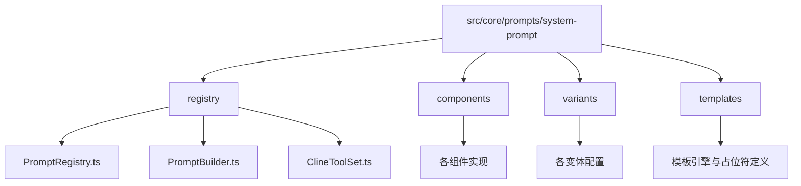
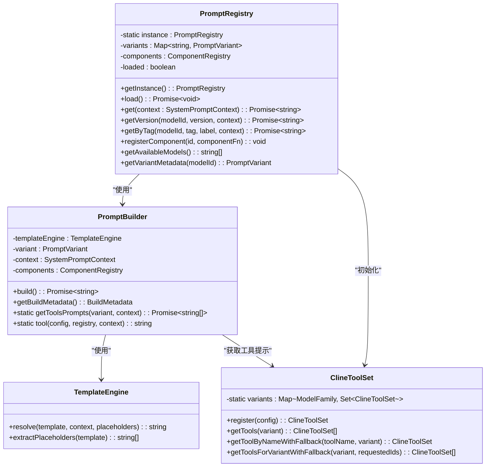
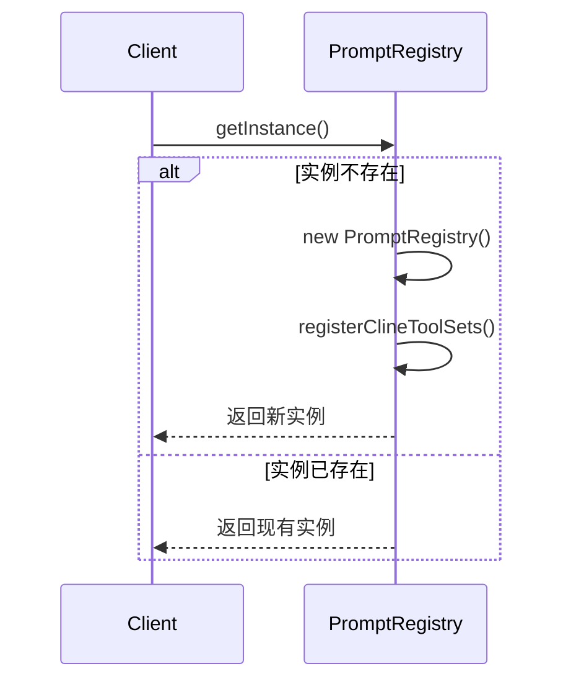
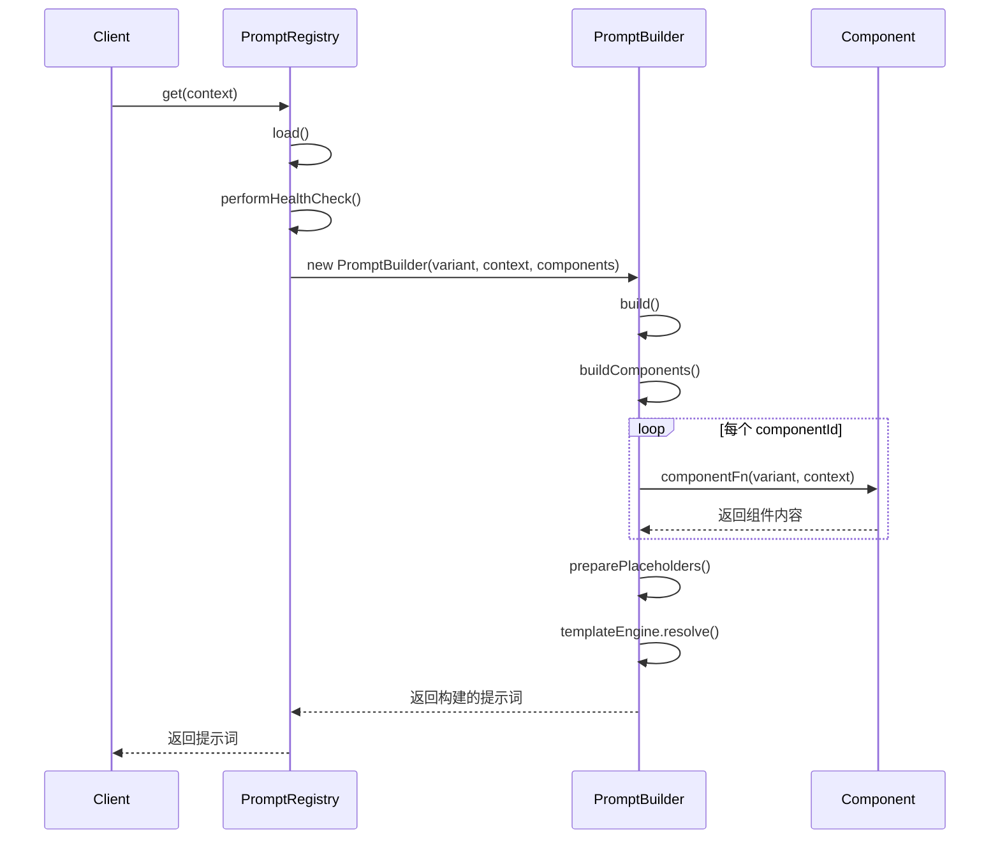
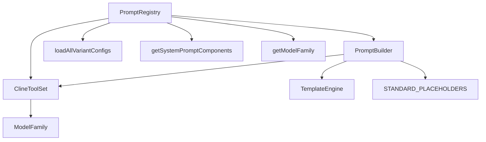

# 提示词注册表

<cite>
**本文档中引用的文件**  
- [PromptRegistry.ts](file://src/core/prompts/system-prompt/registry/PromptRegistry.ts)
- [PromptBuilder.ts](file://src/core/prompts/system-prompt/registry/PromptBuilder.ts)
- [ClineToolSet.ts](file://src/core/prompts/system-prompt/registry/ClineToolSet.ts)
- [types.ts](file://src/core/prompts/system-prompt/types.ts)
</cite>

## 目录
1. [简介](#简介)
2. [项目结构](#项目结构)
3. [核心组件](#核心组件)
4. [架构概述](#架构概述)
5. [详细组件分析](#详细组件分析)
6. [依赖分析](#依赖分析)
7. [性能考虑](#性能考虑)
8. [故障排除指南](#故障排除指南)
9. [结论](#结论)

## 简介
`PromptRegistry` 是一个用于管理提示词模板的核心类，采用单例模式实现，确保在整个应用生命周期中仅存在一个实例。它负责注册、存储和检索不同模型家族的提示词变体，并通过 `PromptBuilder` 动态构建最终的系统提示。该注册表支持基于模型家族、版本号、标签和标签的灵活检索机制，并具备健康检查、错误回退和组件化扩展能力，适用于大型应用中的提示词管理。

## 项目结构
提示词注册表相关代码位于 `src/core/prompts/system-prompt/registry` 目录下，采用模块化设计，分离了变体管理、组件注册和提示构建逻辑。



**图示来源**  
- [PromptRegistry.ts](file://src/core/prompts/system-prompt/registry/PromptRegistry.ts)
- [PromptBuilder.ts](file://src/core/prompts/system-prompt/registry/PromptBuilder.ts)

**本节来源**  
- [PromptRegistry.ts](file://src/core/prompts/system-prompt/registry/PromptRegistry.ts)
- [PromptBuilder.ts](file://src/core/prompts/system-prompt/registry/PromptBuilder.ts)

## 核心组件
`PromptRegistry` 类是提示词管理系统的核心，封装了提示词变体的加载、缓存和检索逻辑。它通过单例模式保证全局唯一性，并在首次访问时惰性初始化所有提示词和组件。`PromptBuilder` 负责根据上下文动态组合组件并填充模板，实现高度可配置的提示生成。

**本节来源**  
- [PromptRegistry.ts](file://src/core/prompts/system-prompt/registry/PromptRegistry.ts#L9-L312)
- [PromptBuilder.ts](file://src/core/prompts/system-prompt/registry/PromptBuilder.ts#L11-L235)

## 架构概述
`PromptRegistry` 采用分层架构，将提示词管理划分为变体（Variants）、组件（Components）和工具（Tools）三个层次。变体代表不同模型家族的提示模板，组件是可复用的功能模块，工具则定义了可用的操作接口。`PromptBuilder` 作为构建引擎，协调三者关系，最终生成完整的系统提示。



**图示来源**  
- [PromptRegistry.ts](file://src/core/prompts/system-prompt/registry/PromptRegistry.ts#L9-L312)
- [PromptBuilder.ts](file://src/core/prompts/system-prompt/registry/PromptBuilder.ts#L11-L235)
- [ClineToolSet.ts](file://src/core/prompts/system-prompt/registry/ClineToolSet.ts#L1-L82)

## 详细组件分析

### PromptRegistry 分析
`PromptRegistry` 实现了单例模式，通过私有静态实例和 `getInstance()` 方法确保全局唯一性。其内部使用 `Map` 存储提示词变体，使用普通对象存储组件函数，提供高效的查找性能。

#### 单例模式实现


**图示来源**  
- [PromptRegistry.ts](file://src/core/prompts/system-prompt/registry/PromptRegistry.ts#L15-L25)

#### 核心方法工作流程
##### registerPrompt（通过 registerComponent 实现）
该方法允许注册新的组件函数，这些函数可以动态生成提示词的某一部分。组件按名称存储在 `components` 对象中，在构建时按 `componentOrder` 指定的顺序执行。

**本节来源**  
- [PromptRegistry.ts](file://src/core/prompts/system-prompt/registry/PromptRegistry.ts#L145-L150)

##### getPrompt（通过 get 方法实现）
`get` 方法是主要的提示词检索入口。它首先确保注册表已加载，然后根据模型家族进行查找，支持回退到通用（generic）变体。如果未找到匹配项，则抛出包含详细调试信息的异常。

```mermaid
flowchart TD
Start([get(context)]) --> Load["await this.load()"]
Load --> DetectFamily["getModelFamily(context.providerInfo)"]
DetectFamily --> Lookup["variants.get(modelFamily)"]
Lookup --> Found{找到变体?}
Found --> |是| Build["new PromptBuilder().build()"]
Found --> |否| TryGeneric["variants.get(GENERIC)"]
TryGeneric --> GenericFound{找到通用变体?}
GenericFound --> |是| Build
GenericFound --> |否| ThrowError["抛出错误含调试信息"]
Build --> Return["返回构建的提示词"]
Return --> End([完成])
```

**图示来源**  
- [PromptRegistry.ts](file://src/core/prompts/system-prompt/registry/PromptRegistry.ts#L65-L107)

##### listPrompts（通过 getAvailableModels 实现）
此方法返回所有已注册模型ID的列表，通过遍历 `variants` Map 的值并收集唯一ID实现。

**本节来源**  
- [PromptRegistry.ts](file://src/core/prompts/system-prompt/registry/PromptRegistry.ts#L153-L161)

### PromptBuilder 与 PromptRegistry 协同工作
`PromptBuilder` 与 `PromptRegistry` 紧密协作，实现提示词的动态构建与版本管理。`PromptRegistry` 负责提供变体和组件，`PromptBuilder` 负责执行构建逻辑。



**图示来源**  
- [PromptRegistry.ts](file://src/core/prompts/system-prompt/registry/PromptRegistry.ts#L65-L107)
- [PromptBuilder.ts](file://src/core/prompts/system-prompt/registry/PromptBuilder.ts#L20-L40)

## 依赖分析
`PromptRegistry` 依赖于多个外部模块和内部组件，形成清晰的依赖关系网。



**图示来源**  
- [PromptRegistry.ts](file://src/core/prompts/system-prompt/registry/PromptRegistry.ts)
- [PromptBuilder.ts](file://src/core/prompts/system-prompt/registry/PromptBuilder.ts)
- [ClineToolSet.ts](file://src/core/prompts/system-prompt/registry/ClineToolSet.ts)

**本节来源**  
- [PromptRegistry.ts](file://src/core/prompts/system-prompt/registry/PromptRegistry.ts)
- [PromptBuilder.ts](file://src/core/prompts/system-prompt/registry/PromptBuilder.ts)

## 性能考虑
`PromptRegistry` 在设计上考虑了性能优化：
- **惰性加载**：提示词和组件在首次调用 `get` 方法时才加载，避免启动时的性能开销。
- **内存缓存**：所有变体和组件在加载后常驻内存，后续请求无需重复读取文件。
- **并发加载**：`load` 方法使用 `Promise.all` 并发加载变体和组件，减少总加载时间。
- **Map 查找**：使用 `Map` 存储变体，保证 O(1) 的查找复杂度。
- **健康检查**：启动时进行健康检查，确保关键变体可用，避免运行时错误。

在大型应用中，该注册表表现出良好的扩展性，能够管理数百个提示词变体和组件，且每次提示生成的延迟主要取决于组件函数的执行时间。

## 故障排除指南
`PromptRegistry` 实现了完善的错误处理策略，以应对各种异常情况。

### 错误处理策略
- **重复注册**：`registerComponent` 直接覆盖同名组件，无重复检测。若需避免覆盖，应在调用前检查。
- **缺失模板**：`get` 方法在找不到匹配变体时会尝试回退到通用模板，若仍失败则抛出包含详细调试信息的错误，便于诊断。
- **组件加载失败**：`loadComponents` 和 `loadVariants` 方法使用 try-catch 包裹，仅记录警告而不中断主流程。
- **健康检查**：启动时检查关键变体是否存在，若缺失则创建最小化的通用回退模板。

### 常见问题
- **问题**：`get` 方法抛出 "No prompt variant found" 错误  
  **解决方案**：检查 `context.providerInfo.model.id` 是否正确，确认对应的变体配置文件已存在并正确加载。
- **问题**：组件未生效  
  **解决方案**：确认组件ID在 `componentOrder` 中定义，且 `registerComponent` 已正确调用。
- **问题**：提示词格式混乱  
  **解决方案**：检查 `postProcess` 方法的正则表达式是否意外修改了有效内容，特别是涉及 "====" 的部分。

**本节来源**  
- [PromptRegistry.ts](file://src/core/prompts/system-prompt/registry/PromptRegistry.ts#L65-L107)
- [PromptRegistry.ts](file://src/core/prompts/system-prompt/registry/PromptRegistry.ts#L110-L143)
- [PromptBuilder.ts](file://src/core/prompts/system-prompt/registry/PromptBuilder.ts#L80-L115)

## 结论
`PromptRegistry` 是一个设计精良的提示词管理系统，通过单例模式、组件化架构和灵活的检索机制，实现了高效、可扩展的提示词管理。它与 `PromptBuilder` 紧密协作，支持动态构建和版本管理，适用于复杂的AI应用环境。其健壮的错误处理和性能优化策略确保了在大型应用中的稳定运行。开发者可以基于此框架轻松扩展新的提示词变体和功能组件，满足不断变化的业务需求。