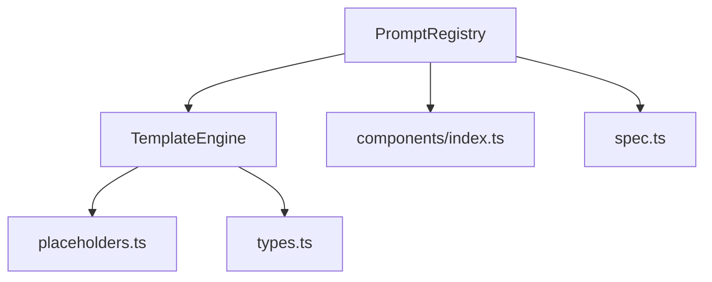
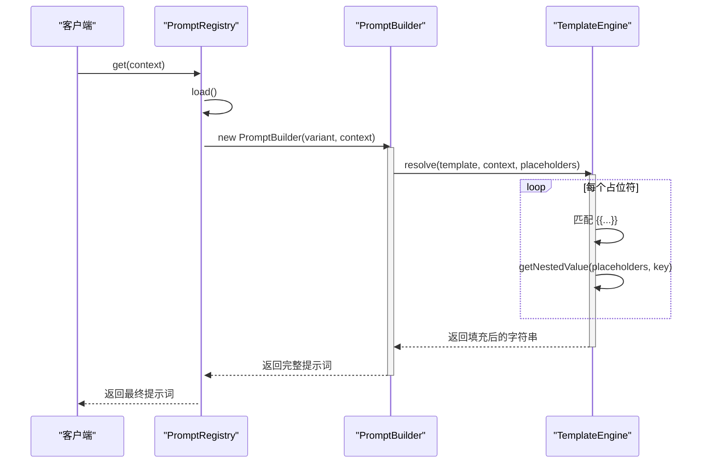
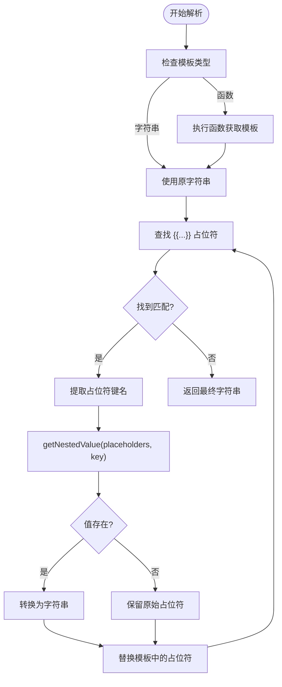
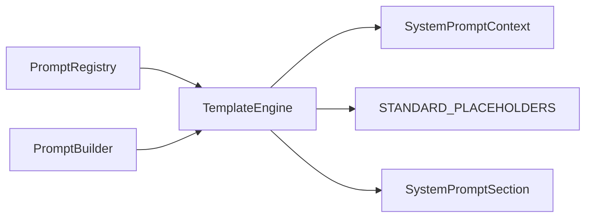

# 模板引擎

<cite>
**本文档中引用的文件**  
- [TemplateEngine.ts](file://src/core/prompts/system-prompt/templates/TemplateEngine.ts)
- [spec.ts](file://src/core/prompts/system-prompt/spec.ts)
- [placeholders.ts](file://src/core/prompts/system-prompt/templates/placeholders.ts)
- [types.ts](file://src/core/prompts/system-prompt/types.ts)
- [PromptRegistry.ts](file://src/core/prompts/system-prompt/registry/PromptRegistry.ts)
- [index.ts](file://src/core/prompts/system-prompt/index.ts)
- [components/index.ts](file://src/core/prompts/system-prompt/components/index.ts)
</cite>

## 目录
1. [简介](#简介)
2. [项目结构](#项目结构)
3. [核心组件](#核心组件)
4. [架构概述](#架构概述)
5. [详细组件分析](#详细组件分析)
6. [依赖分析](#依赖分析)
7. [性能考虑](#性能考虑)
8. [故障排除指南](#故障排除指南)
9. [结论](#结论)

## 简介
本文档深入解析 `TemplateEngine` 的实现原理，重点描述其如何解析模板字符串中的占位符并安全地注入运行时上下文数据。文档详细说明了与 `spec.ts` 中定义的提示词规范的集成方式，包括 sections 的条件渲染、context 数据的映射规则以及嵌套模板的处理逻辑。通过实际示例展示复杂提示词（如包含工具使用指南、系统信息和用户指令）的渲染过程。同时探讨引擎的性能优化措施，如模板缓存和惰性求值，并记录在处理大规模或深层嵌套模板时的已知限制和最佳实践。

## 项目结构
`TemplateEngine` 是 `cline` 项目中提示词系统的核心组件，位于 `src/core/prompts/system-prompt` 目录下。该引擎负责将结构化的提示词配置和上下文数据动态地组合成最终发送给语言模型的文本。

**Diagram sources**
- [TemplateEngine.ts](file://src/core/prompts/system-prompt/templates/TemplateEngine.ts)
- [placeholders.ts](file://src/core/prompts/system-prompt/templates/placeholders.ts)
- [types.ts](file://src/core/prompts/system-prompt/types.ts)
- [PromptRegistry.ts](file://src/core/prompts/system-prompt/registry/PromptRegistry.ts)
- [components/index.ts](file://src/core/prompts/system-prompt/components/index.ts)

**Section sources**
- [TemplateEngine.ts](file://src/core/prompts/system-prompt/templates/TemplateEngine.ts)
- [PromptRegistry.ts](file://src/core/prompts/system-prompt/registry/PromptRegistry.ts)

## 核心组件
`TemplateEngine` 的核心功能是解析和填充模板。它通过正则表达式识别 `{{PLACEHOLDER}}` 格式的占位符，并利用 `getNestedValue` 方法支持通过点符号（dot notation）访问嵌套对象属性。引擎允许模板为函数，从而实现动态模板生成。如果占位符未找到对应值，原始占位符会被保留，这支持了部分解析的场景。

**Section sources**
- [TemplateEngine.ts](file://src/core/prompts/system-prompt/templates/TemplateEngine.ts#L1-L92)

## 架构概述
`TemplateEngine` 并非孤立工作，而是 `PromptRegistry` 和 `PromptBuilder` 架构中的关键一环。`PromptRegistry` 负责管理不同模型家族的提示词变体（`PromptVariant`），而 `PromptBuilder` 则利用 `TemplateEngine` 将这些变体与运行时上下文（`SystemPromptContext`）结合，生成最终的提示词。

**Diagram sources**
- [PromptRegistry.ts](file://src/core/prompts/system-prompt/registry/PromptRegistry.ts#L150-L180)
- [TemplateEngine.ts](file://src/core/prompts/system-prompt/templates/TemplateEngine.ts#L10-L30)

## 详细组件分析

### 模板解析与占位符处理
`TemplateEngine` 的 `resolve` 方法是其核心。它首先检查模板是否为函数，如果是，则执行该函数以获取字符串模板。然后，它使用正则表达式 `/\\{\\{([^}]+)\\}\\}/g` 全局匹配所有占位符。对于每个匹配项，它会提取键名，通过 `getNestedValue` 方法在 `placeholders` 对象中查找对应的值。如果值存在，则将其转换为字符串（非字符串值会使用 `JSON.stringify`）；否则，保留原始占位符。

**Diagram sources**
- [TemplateEngine.ts](file://src/core/prompts/system-prompt/templates/TemplateEngine.ts#L10-L30)
- [TemplateEngine.ts](file://src/core/prompts/system-prompt/templates/TemplateEngine.ts#L75-L85)

**Section sources**
- [TemplateEngine.ts](file://src/core/prompts/system-prompt/templates/TemplateEngine.ts#L1-L92)

### 与提示词规范的集成
`TemplateEngine` 与 `spec.ts` 中定义的 `ClineToolSpec` 和 `SystemPromptContext` 紧密集成。`SystemPromptContext` 接口定义了构建提示词所需的所有运行时数据，如 `providerInfo`、`cwd`、`ide` 和 `mcpHub`。`TemplateEngine` 使用这些数据作为 `placeholders` 的一部分。`spec.ts` 定义了工具规范，这些规范中的 `instruction` 字段可以包含占位符，这些占位符同样由 `TemplateEngine` 在最终渲染时填充。

**Section sources**
- [spec.ts](file://src/core/prompts/system-prompt/spec.ts#L1-L24)
- [types.ts](file://src/core/prompts/system-prompt/types.ts#L1-L257)

### 条件渲染与上下文映射
条件渲染是通过 `PromptRegistry` 和 `PromptBuilder` 实现的，而非 `TemplateEngine` 本身。`PromptVariant` 定义了 `componentOrder` 数组，指定了哪些 `SystemPromptSection` 应该被包含。`PromptBuilder` 会根据这个顺序，调用注册在 `PromptRegistry` 中的 `ComponentFunction`。这些组件函数（如 `getAgentRoleSection`）会检查 `SystemPromptContext` 中的条件（例如 `context.supportsBrowserUse`），并决定返回相应的文本或 `undefined`。`TemplateEngine` 只负责填充那些最终被包含的、包含占位符的文本。

**Section sources**
- [PromptRegistry.ts](file://src/core/prompts/system-prompt/registry/PromptRegistry.ts#L200-L250)
- [components/index.ts](file://src/core/prompts/system-prompt/components/index.ts#L1-L53)
- [types.ts](file://src/core/prompts/system-prompt/types.ts#L200-L257)

## 依赖分析
`TemplateEngine` 的主要依赖是 `SystemPromptContext` 类型和 `placeholders` 对象的结构。它与 `PromptRegistry` 形成强依赖，因为 `PromptRegistry` 是其主要的调用者。`TemplateEngine` 还依赖于 `types.ts` 中定义的枚举 `SystemPromptSection` 和常量 `STANDARD_PLACEHOLDERS`，以确保占位符名称的一致性。

**Diagram sources**
- [TemplateEngine.ts](file://src/core/prompts/system-prompt/templates/TemplateEngine.ts)
- [types.ts](file://src/core/prompts/system-prompt/types.ts)
- [PromptRegistry.ts](file://src/core/prompts/system-prompt/registry/PromptRegistry.ts)

**Section sources**
- [TemplateEngine.ts](file://src/core/prompts/system-prompt/templates/TemplateEngine.ts)
- [types.ts](file://src/core/prompts/system-prompt/types.ts)
- [PromptRegistry.ts](file://src/core/prompts/system-prompt/registry/PromptRegistry.ts)

## 性能考虑
`TemplateEngine` 的设计相对简单，主要开销在于正则表达式的全局匹配和字符串替换。对于大型模板，这可能会成为性能瓶颈。目前的实现没有内置的模板缓存机制，这意味着相同的模板在不同上下文中每次都会被重新解析。一个潜在的优化是引入缓存，将解析后的模板（例如，已分解的 token 流）存储起来，以便在占位符集合相同时快速重建。此外，`getNestedValue` 方法在处理深层嵌套的对象时，其性能为 O(n)，其中 n 是路径的深度。

## 故障排除指南
当提示词中出现未解析的占位符（如 `{{USER_INSTRUCTIONS}}`）时，应首先检查 `SystemPromptContext` 是否提供了相应的字段。其次，检查 `REQUIRED_PLACEHOLDERS` 常量，确保所有必需的占位符都已提供。如果问题出在特定组件（如 MCP 或浏览器功能）未渲染，应检查 `PromptBuilder` 是否正确地根据 `context` 调用了相应的 `ComponentFunction`，并确认 `context` 中的条件字段（如 `supportsBrowserUse`）是否正确设置。

**Section sources**
- [placeholders.ts](file://src/core/prompts/system-prompt/templates/placeholders.ts#L60-L70)
- [types.ts](file://src/core/prompts/system-prompt/types.ts#L150-L200)

## 结论
`TemplateEngine` 是一个轻量级但功能强大的模板解析器，它通过简单的占位符替换机制，为 `cline` 的提示词系统提供了灵活性和动态性。它与 `PromptRegistry` 和 `SystemPromptContext` 紧密协作，实现了基于上下文的条件渲染和数据注入。尽管当前实现没有复杂的性能优化，但其清晰的接口和可预测的行为使其易于维护和扩展。未来的改进可以集中在模板缓存和更高效的解析算法上，以应对更复杂的使用场景。