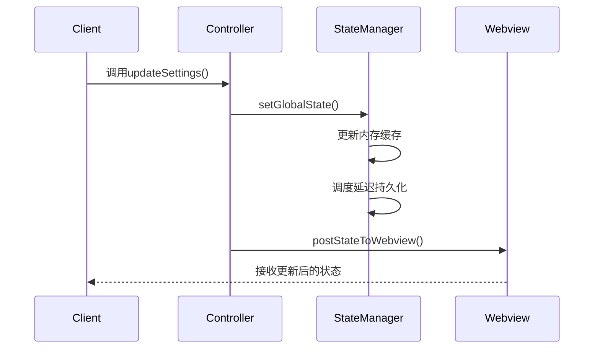
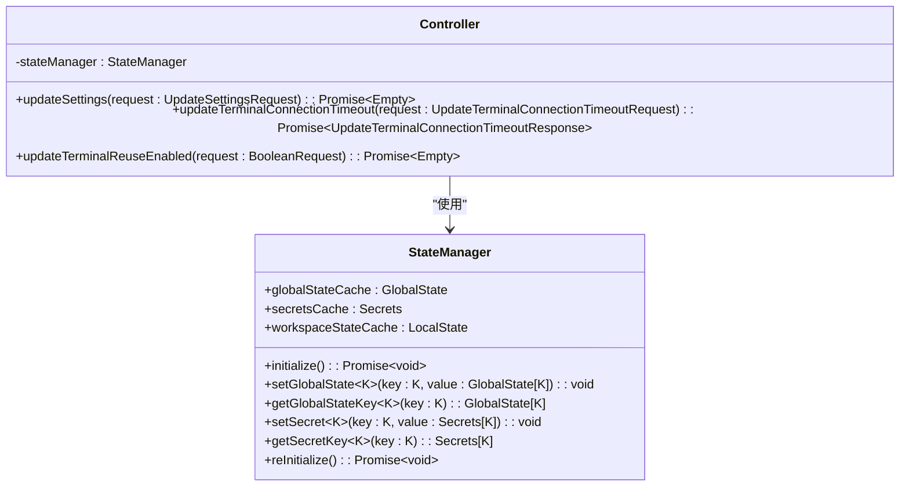

# 基础设置

<cite>
**本文档中引用的文件**  
- [config.ts](file://src/config.ts)
- [updateSettings.ts](file://src/core/controller/state/updateSettings.ts)
- [updateTerminalConnectionTimeout.ts](file://src/core/controller/state/updateTerminalConnectionTimeout.ts)
- [updateTerminalReuseEnabled.ts](file://src/core/controller/state/updateTerminalReuseEnabled.ts)
- [StateManager.ts](file://src/core/storage/StateManager.ts)
</cite>

## 目录
1. [简介](#简介)
2. [全局配置常量](#全局配置常量)
3. [核心状态修改函数](#核心状态修改函数)
4. [配置文件结构与最佳实践](#配置文件结构与最佳实践)
5. [基础设置对Cline行为的影响](#基础设置对cline行为的影响)
6. [总结](#总结)

## 简介
本文档详细介绍了Cline项目中的基础设置机制，涵盖全局配置常量的定义、核心状态的动态修改方法、配置文件结构的最佳实践，以及这些设置如何影响系统的整体行为和性能。通过本指南，开发者可以全面理解Cline的配置体系并进行有效管理。

## 全局配置常量
在 `src/config.ts` 文件中定义了环境相关的全局配置常量，主要包括应用基础URL、API基础URL、MCP基础URL以及Firebase认证信息。这些配置根据运行环境（生产、预发布或本地）自动切换。

### 环境枚举
```typescript
export enum Environment {
	production = "production",
	staging = "staging",
	local = "local",
}
```

### 环境配置接口
```typescript
interface EnvironmentConfig {
	appBaseUrl: string
	apiBaseUrl: string
	mcpBaseUrl: string
	firebase: {
		apiKey: string
		authDomain: string
		projectId: string
		storageBucket?: string
		messagingSenderId?: string
		appId?: string
	}
}
```

### 配置获取逻辑
系统通过 `getClineEnv()` 函数读取 `CLINE_ENVIRONMENT` 环境变量来确定当前运行环境，并据此返回相应的配置对象。若未指定环境变量，则默认使用生产环境配置。

**Section sources**
- [config.ts](file://src/config.ts#L1-L80)

## 核心状态修改函数
Cline提供了多个控制器函数用于动态修改核心状态，这些函数通过 `StateManager` 实现状态的持久化存储和同步。

### updateSettings 函数
该函数允许一次性更新多个设置项，包括：
- API配置
- 遥测设置
- 计划/执行模式设置
- 检查点设置
- MCP市场启用状态
- 终端超时和复用设置
- 浏览器设置等

函数通过 `controller.stateManager.setGlobalState()` 方法更新状态，并广播到所有Webview界面。

### updateTerminalConnectionTimeout 函数
此函数专门用于更新终端连接超时设置。它接收以毫秒为单位的超时值，并将其存储在全局状态中键名为 `shellIntegrationTimeout` 的位置。如果未提供值，则使用默认的4000毫秒。

### updateTerminalReuseEnabled 函数
该函数用于控制终端复用功能的启用状态。接收一个布尔值请求参数，更新 `terminalReuseEnabled` 状态键的值，并向所有Webview广播状态变更。



**Diagram sources**
- [updateSettings.ts](file://src/core/controller/state/updateSettings.ts#L25-L283)
- [StateManager.ts](file://src/core/storage/StateManager.ts#L150-L170)

**Section sources**
- [updateSettings.ts](file://src/core/controller/state/updateSettings.ts#L1-L284)
- [updateTerminalConnectionTimeout.ts](file://src/core/controller/state/updateTerminalConnectionTimeout.ts#L3-L16)
- [updateTerminalReuseEnabled.ts](file://src/core/controller/state/updateTerminalReuseEnabled.ts#L3-L16)

## 配置文件结构与最佳实践
Cline的配置系统采用分层结构，结合内存缓存与磁盘持久化机制，确保高效且可靠的状态管理。

### 配置结构示例
```json
{
  "apiConfiguration": {
    "requestTimeoutMs": 30000,
    "openAiBaseUrl": "https://api.openai.com"
  },
  "telemetrySetting": "enabled",
  "terminalReuseEnabled": true,
  "shellIntegrationTimeout": 4000,
  "browserSettings": {
    "viewport": {
      "width": 1920,
      "height": 1080
    }
  }
}
```

### 最佳实践
1. **敏感信息安全存储**：所有密钥类信息（如API密钥）应存储在VS Code的加密密钥环中，而非普通全局状态。
2. **批量更新**：使用 `setGlobalStateBatch()` 方法进行多状态批量更新，减少持久化操作次数。
3. **延迟持久化**：系统采用500ms延迟的防抖机制进行状态持久化，避免频繁写入。
4. **错误恢复**：当持久化失败时，可通过 `reInitialize()` 方法重新从磁盘加载状态。



**Diagram sources**
- [StateManager.ts](file://src/core/storage/StateManager.ts#L0-L799)
- [updateSettings.ts](file://src/core/controller/state/updateSettings.ts#L1-L284)

**Section sources**
- [StateManager.ts](file://src/core/storage/StateManager.ts#L0-L799)

## 基础设置对Cline行为的影响
基础设置直接影响Cline的各项功能表现和用户体验：

### 性能影响
- **超时设置**：`shellIntegrationTimeout` 直接影响终端命令的响应时间，过短可能导致正常操作被中断，过长则影响用户体验。
- **请求超时**：API请求超时设置影响与外部服务的通信效率和稳定性。

### 功能行为
- **终端复用**：启用 `terminalReuseEnabled` 可提高命令执行效率，减少资源消耗。
- **检查点功能**：`enableCheckpointsSetting` 控制是否自动保存任务进度，影响数据安全性和恢复能力。

### 用户体验
- **遥测设置**：`telemetrySetting` 决定是否收集使用数据，影响用户隐私和产品改进。
- **MCP显示模式**：`mcpDisplayMode` 设置影响工具调用结果的展示方式，提供丰富的交互体验。

这些设置共同构成了Cline的可配置性基础，使系统能够适应不同用户需求和使用场景。

**Section sources**
- [updateSettings.ts](file://src/core/controller/state/updateSettings.ts#L25-L283)
- [config.ts](file://src/config.ts#L1-L80)

## 总结
Cline的基础设置系统通过清晰的配置分离、灵活的状态管理机制和安全的敏感信息处理，为用户提供了一个高度可定制且稳定的开发环境。理解这些核心配置和状态管理机制对于有效使用和扩展Cline至关重要。

**Section sources**
- [config.ts](file://src/config.ts#L1-L80)
- [updateSettings.ts](file://src/core/controller/state/updateSettings.ts#L1-L284)