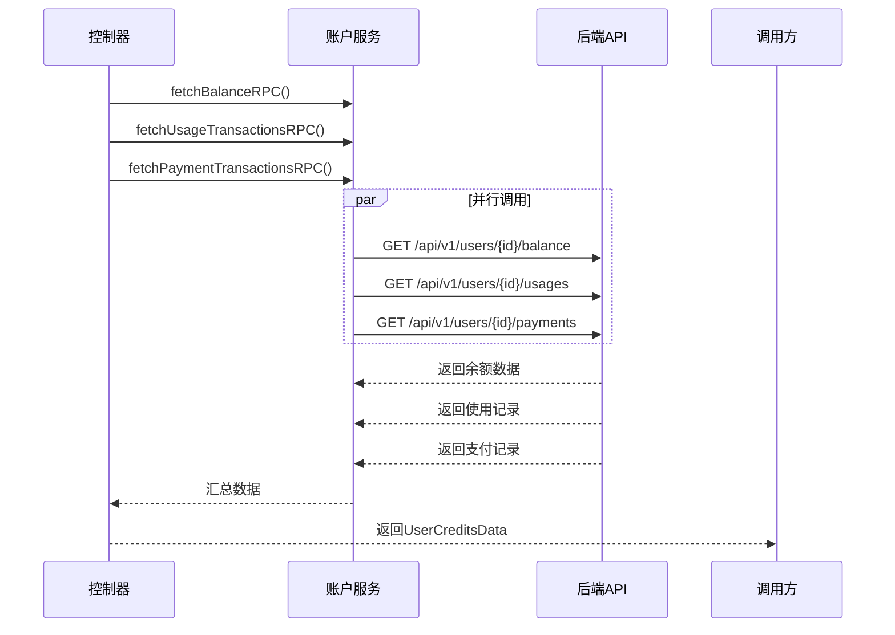
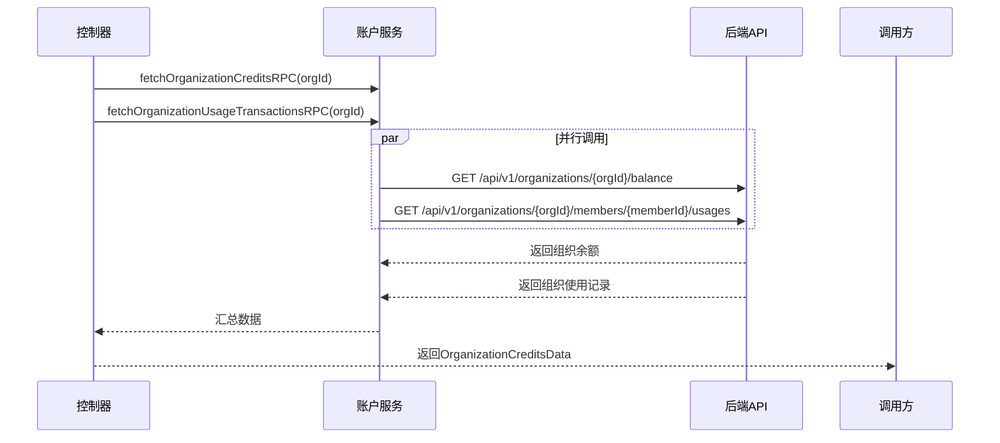
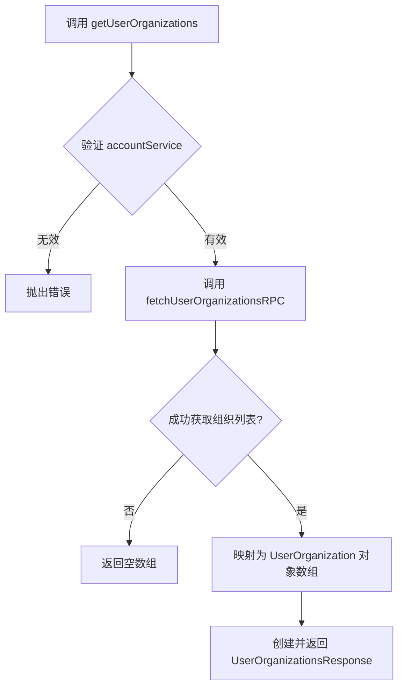
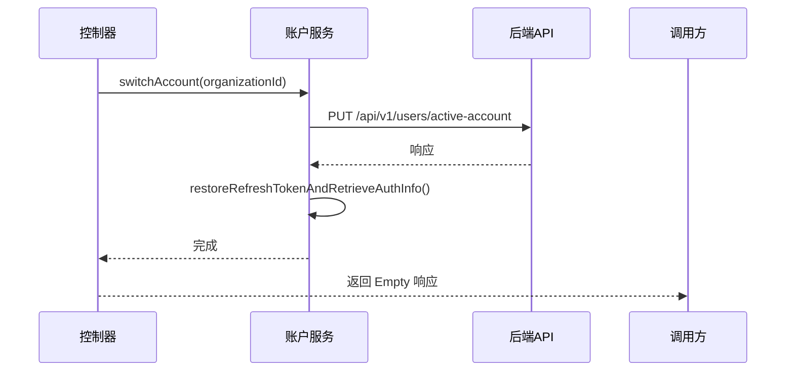

# 账户与信用额度管理

<cite>
**本文档中引用的文件**  
- [ClineAccount.ts](file://src/shared/ClineAccount.ts)
- [getUserCredits.ts](file://src/core/controller/account/getUserCredits.ts)
- [getOrganizationCredits.ts](file://src/core/controller/account/getOrganizationCredits.ts)
- [getUserOrganizations.ts](file://src/core/controller/account/getUserOrganizations.ts)
- [setUserOrganization.ts](file://src/core/controller/account/setUserOrganization.ts)
- [ClineAccountService.ts](file://src/services/account/ClineAccountService.ts)
</cite>

## 目录
1. [介绍](#介绍)
2. [账户数据模型](#账户数据模型)
3. [信用额度查询逻辑](#信用额度查询逻辑)
4. [组织管理功能](#组织管理功能)
5. [API调用流程与错误处理](#api调用流程与错误处理)
6. [最佳实践](#最佳实践)
7. [结论](#结论)

## 介绍
本文档详细说明了Cline平台中账户与信用额度管理的核心机制。基于`src/shared/ClineAccount.ts`中的数据模型定义，结合`src/core/controller/account`目录下的控制器函数实现，全面解析用户信用余额、组织信用额度、多组织账户切换等功能的设计与实现逻辑。文档旨在为开发者提供清晰的技术参考，帮助理解账户系统的架构设计、API调用方式及最佳实践。

## 账户数据模型

`src/shared/ClineAccount.ts`文件定义了账户系统的核心数据结构，包括用户信息、个人信用、组织信息及组织信用等关键接口。

### 用户信息模型
`UserResponse`接口描述了用户的基本信息和所属组织列表：
- **id**: 用户唯一标识
- **email**: 用户邮箱
- **displayName**: 显示名称
- **photoUrl**: 头像URL
- **createdAt/updatedAt**: 创建/更新时间戳
- **organizations**: 组织列表，包含成员ID、组织ID、名称、角色（admin/member/owner）和激活状态

### 个人信用模型
`BalanceResponse`表示用户的个人信用余额：
- **balance**: 当前信用额度（单位：分）
- **userId**: 关联用户ID

`UsageTransaction`记录了用户的每次使用交易详情：
- **creditsUsed**: 消耗的信用点数
- **costUsd**: 成本（美元）
- **promptTokens/completionTokens/totalTokens**: 提示/完成/总token数
- **aiModelName/aiInferenceProviderName**: 使用的AI模型及提供商
- **createdAt**: 交易时间

### 组织信用模型
`OrganizationBalanceResponse`表示组织的信用余额：
- **balance**: 组织当前信用额度（单位：分）
- **organizationId**: 组织唯一标识

`OrganizationUsageTransaction`记录组织内的使用交易，与个人交易类似，但增加了成员信息（memberDisplayName, memberEmail）以追踪具体使用者。

**Section sources**
- [ClineAccount.ts](file://src/shared/ClineAccount.ts#L1-L81)

## 信用额度查询逻辑

系统通过控制器函数与账户服务协同工作，实现个人和组织信用额度的高效查询。

### 个人信用查询
`getUserCredits`控制器函数负责获取用户的完整信用信息。

**Diagram sources**
- [getUserCredits.ts](file://src/core/controller/account/getUserCredits.ts#L1-L38)
- [ClineAccountService.ts](file://src/services/account/ClineAccountService.ts#L12-L242)

该函数的核心逻辑：
1. 验证`accountService`实例是否可用
2. 使用`Promise.all`并行调用三个RPC方法：`fetchBalanceRPC`、`fetchUsageTransactionsRPC`、`fetchPaymentTransactionsRPC`
3. 将返回的原始数据（单位为分）转换为美元（除以100）后封装成`UserCreditsData`对象返回
4. 任何步骤失败均会捕获错误并重新抛出

**Section sources**
- [getUserCredits.ts](file://src/core/controller/account/getUserCredits.ts#L1-L38)

### 组织信用查询
`getOrganizationCredits`控制器函数用于获取特定组织的信用信息。

**Diagram sources**
- [getOrganizationCredits.ts](file://src/core/controller/account/getOrganizationCredits.ts#L1-L55)
- [ClineAccountService.ts](file://src/services/account/ClineAccountService.ts#L12-L242)

该函数的实现特点：
1. 接收包含`organizationId`的请求对象
2. 并行调用`fetchOrganizationCreditsRPC`和`fetchOrganizationUsageTransactionsRPC`
3. 在获取组织使用记录时，需先通过`fetchMe`获取当前用户信息，再根据`organizationId`查找对应的`memberId`
4. 将原始数据转换后封装成`OrganizationCreditsData`对象返回

**Section sources**
- [getOrganizationCredits.ts](file://src/core/controller/account/getOrganizationCredits.ts#L1-L55)

## 组织管理功能

系统支持用户在个人账户和多个组织账户之间进行切换，相关功能由两个核心函数实现。

### 获取用户组织列表
`getUserOrganizations`函数用于获取当前用户所属的所有组织。

**Diagram sources**
- [getUserOrganizations.ts](file://src/core/controller/account/getUserOrganizations.ts#L1-L35)
- [ClineAccountService.ts](file://src/services/account/ClineAccountService.ts#L12-L242)

该函数通过`accountService.fetchUserOrganizationsRPC()`获取原始组织数据，并将其转换为协议缓冲区（protobuf）定义的`UserOrganizationsResponse`格式。

**Section sources**
- [getUserOrganizations.ts](file://src/core/controller/account/getUserOrganizations.ts#L1-L35)

### 切换活跃组织
`setUserOrganization`函数用于将指定组织设置为用户的当前活跃账户。

**Diagram sources**
- [setUserOrganization.ts](file://src/core/controller/account/setUserOrganization.ts#L1-L24)
- [ClineAccountService.ts](file://src/services/account/ClineAccountService.ts#L12-L242)

该函数的核心流程：
1. 调用`accountService.switchAccount(organizationId)`发起账户切换
2. 后端API接收`PUT`请求，更新用户的`active-account`
3. 切换成功后，强制刷新身份验证令牌（`restoreRefreshTokenAndRetrieveAuthInfo`），确保后续请求使用新的上下文
4. 返回空响应（`Empty`）表示操作成功

**Section sources**
- [setUserOrganization.ts](file://src/core/controller/account/setUserOrganization.ts#L1-L24)

## API调用流程与错误处理

### API调用流程
整个账户系统遵循统一的调用模式：
1. **控制器层**：接收前端请求，调用服务层方法。
2. **服务层**：`ClineAccountService`提供具体的业务逻辑和API调用。
3. **认证请求**：所有API调用均通过`authenticatedRequest<T>`方法进行，该方法自动添加Bearer Token认证头。
4. **数据转换**：服务层返回原始数据，控制器层负责将其转换为前端所需的格式。

### 错误处理策略
系统采用了分层的错误处理机制：
- **服务层**：`authenticatedRequest`捕获HTTP状态码异常和API业务错误，返回`undefined`或抛出错误。
- **控制器层**：检查服务层返回值，若为`undefined`则抛出明确的错误信息（如"Failed to fetch user credits data"）。
- **日志记录**：关键操作均使用`console.error`记录错误详情，便于问题排查。
- **异常传播**：控制器函数不吞掉异常，而是将其抛给上层调用者，由上层决定如何处理（如显示错误提示）。

## 最佳实践

### 信用监控
- **定期轮询**：客户端可定期调用`getUserCredits`或`getOrganizationCredits`以获取最新的信用余额。
- **缓存策略**：对信用数据进行合理缓存，避免频繁调用API，同时在关键操作（如发起AI请求）前进行实时查询。
- **余额预警**：当余额低于阈值时，主动提示用户充值。

### 组织管理
- **组织切换确认**：在调用`setUserOrganization`前，应向用户确认操作，避免误切换。
- **权限检查**：在访问组织特定功能前，通过`getUserOrganizations`验证用户是否属于该组织及其角色。
- **状态同步**：组织切换后，应刷新相关UI组件（如信用显示、项目列表）以反映新上下文。

### API使用
- **并行请求**：对于独立的数据查询（如余额和交易记录），使用`Promise.all`并行调用以提高效率。
- **错误处理**：始终为API调用添加`try-catch`块，优雅地处理网络错误或服务不可用的情况。
- **空值检查**：在处理服务层返回数据前，检查其是否为`undefined`，防止空指针异常。

## 结论
Cline的账户与信用额度管理系统通过清晰的分层架构（控制器-服务-数据模型）实现了高内聚、低耦合的设计。系统利用并行请求优化性能，通过统一的认证机制保障安全，并提供了完整的个人与组织信用管理功能。开发者在使用时应遵循最佳实践，合理处理错误和状态同步，以构建稳定可靠的用户体验。