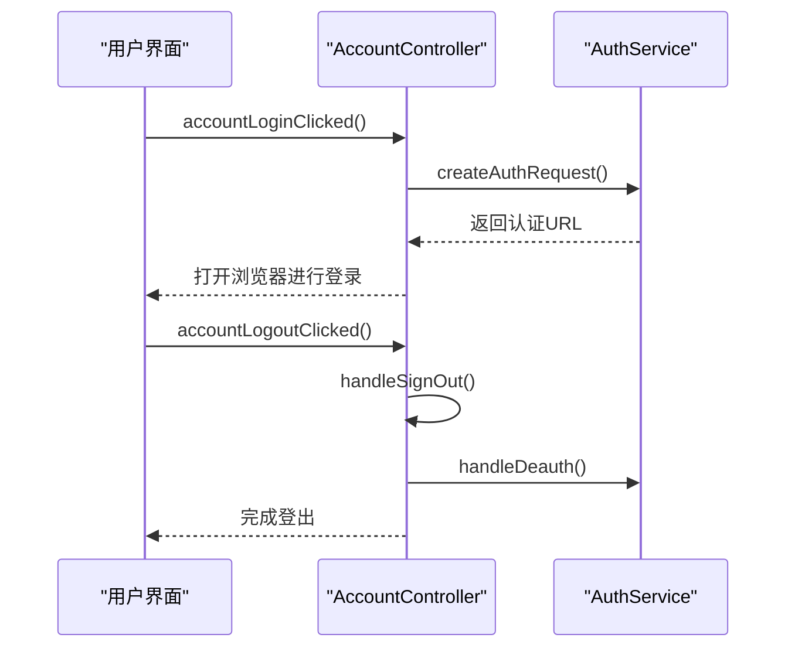
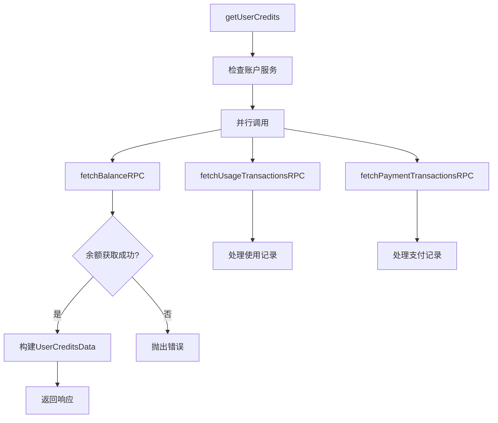
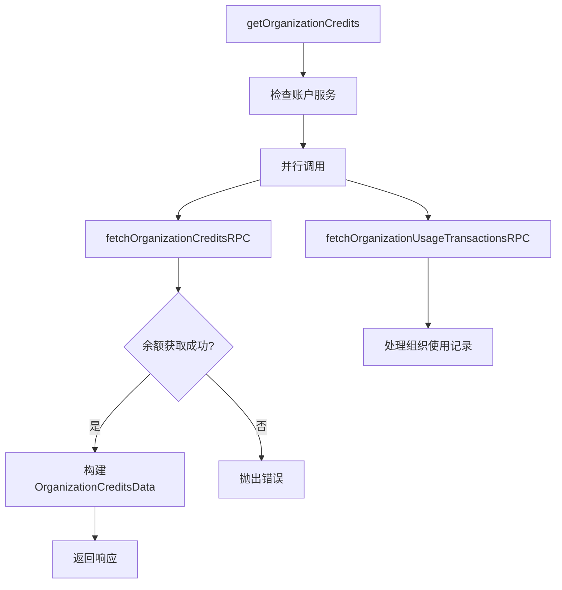
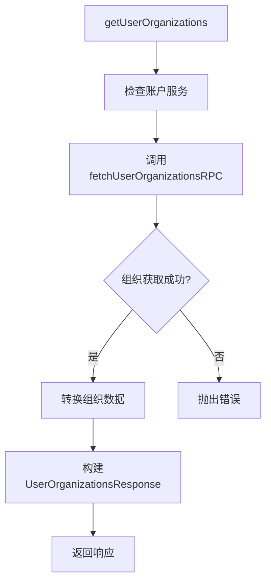
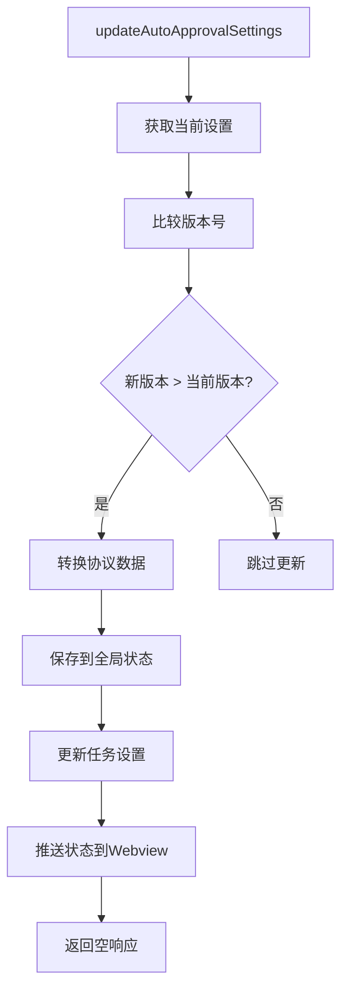
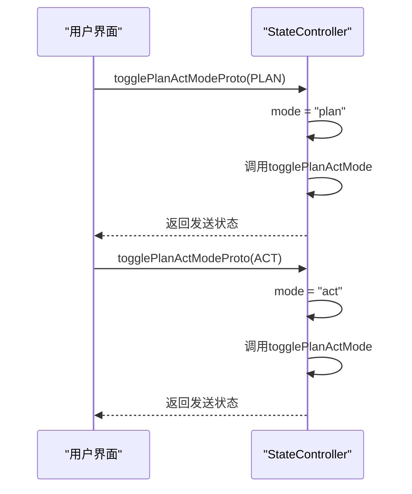
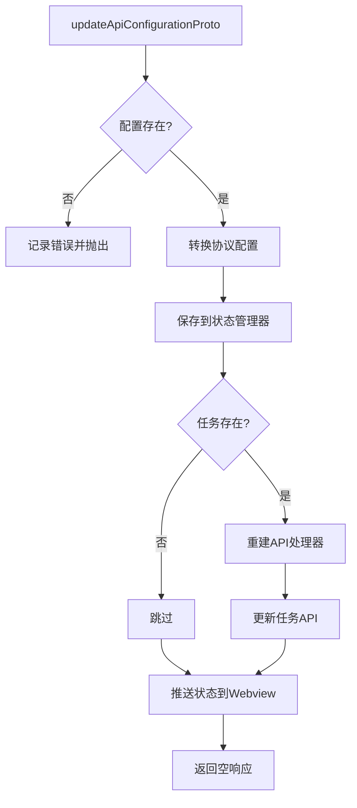

# 账户与高级设置

<cite>
**本文档中引用的文件**  
- [ClineAccount.ts](file://src/shared/ClineAccount.ts)
- [getUserOrganizations.ts](file://src/core/controller/account/getUserOrganizations.ts)
- [getUserCredits.ts](file://src/core/controller/account/getUserCredits.ts)
- [getOrganizationCredits.ts](file://src/core/controller/account/getOrganizationCredits.ts)
- [accountLoginClicked.ts](file://src/core/controller/account/accountLoginClicked.ts)
- [accountLogoutClicked.ts](file://src/core/controller/account/accountLogoutClicked.ts)
- [updateAutoApprovalSettings.ts](file://src/core/controller/state/updateAutoApprovalSettings.ts)
- [togglePlanActModeProto.ts](file://src/core/controller/state/togglePlanActModeProto.ts)
- [updateApiConfigurationProto.ts](file://src/core/controller/models/updateApiConfigurationProto.ts)
- [AutoApprovalSettings.ts](file://src/shared/AutoApprovalSettings.ts)
</cite>

## 目录
1. [简介](#简介)
2. [账户数据模型](#账户数据模型)
3. [账户管理控制器](#账户管理控制器)
4. [高级设置配置](#高级设置配置)
5. [多组织账户与信用额度管理](#多组织账户与信用额度管理)
6. [结论](#结论)

## 简介
本文档全面介绍 Cline 系统中的账户管理机制与高级设置功能。基于 `src/shared/ClineAccount.ts` 中定义的数据模型，详细说明用户信息、组织成员关系和信用额度结构。文档涵盖账户登录、登出、信用额度查询等核心控制器逻辑，并深入解析自动审批规则、计划/执行模式切换以及 AI 模型提供商配置等高级功能。最后提供多组织账户管理和信用额度监控的最佳实践建议。

## 账户数据模型

`src/shared/ClineAccount.ts` 定义了账户系统的核心数据结构，包括用户信息、余额、使用记录和组织关系。

### 用户信息模型
`UserResponse` 接口描述了用户的基本信息及其所属组织：
- `id`: 用户唯一标识符
- `email`: 用户邮箱
- `displayName`: 显示名称
- `photoUrl`: 头像链接
- `organizations`: 组织成员关系数组，包含组织ID、名称、角色（admin/member/owner）和激活状态

### 信用额度模型
系统通过多个接口管理信用额度：
- `BalanceResponse`: 用户余额，以分为单位存储
- `OrganizationBalanceResponse`: 组织余额，支持多组织信用管理
- `UsageTransaction`: 用户级别的使用记录，包含模型调用的详细信息（如token消耗、成本）
- `OrganizationUsageTransaction`: 组织级别的使用记录，额外包含成员信息

所有金额字段在传输时以分为单位，接收后除以100转换为美元显示。

**Section sources**
- [ClineAccount.ts](file://src/shared/ClineAccount.ts#L1-L81)

## 账户管理控制器

账户管理控制器位于 `src/core/controller/account` 目录，负责处理所有账户相关操作。

### 登录与登出流程

**Diagram sources**
- [accountLoginClicked.ts](file://src/core/controller/account/accountLoginClicked.ts#L1-L15)
- [accountLogoutClicked.ts](file://src/core/controller/account/accountLogoutClicked.ts#L1-L16)

### 信用额度查询
系统提供三个层级的信用额度查询：

#### 用户信用额度查询

**Diagram sources**
- [getUserCredits.ts](file://src/core/controller/account/getUserCredits.ts#L1-L38)

#### 组织信用额度查询

**Diagram sources**
- [getOrganizationCredits.ts](file://src/core/controller/account/getOrganizationCredits.ts#L1-L55)

#### 用户组织查询

**Diagram sources**
- [getUserOrganizations.ts](file://src/core/controller/account/getUserOrganizations.ts#L1-L35)

**Section sources**
- [getUserOrganizations.ts](file://src/core/controller/account/getUserOrganizations.ts#L1-L35)
- [getUserCredits.ts](file://src/core/controller/account/getUserCredits.ts#L1-L38)
- [getOrganizationCredits.ts](file://src/core/controller/account/getOrganizationCredits.ts#L1-L55)

## 高级设置配置

高级设置功能允许用户自定义系统行为，主要通过 `src/core/controller/state` 和 `src/core/controller/models` 中的控制器实现。

### 自动审批规则管理
`updateAutoApprovalSettings` 函数处理自动审批设置的更新，确保版本控制以避免竞争条件。

**Diagram sources**
- [updateAutoApprovalSettings.ts](file://src/core/controller/state/updateAutoApprovalSettings.ts#L1-L31)

#### 自动审批设置结构
`AutoApprovalSettings` 接口定义了详细的权限控制：
- `version`: 版本号，用于防止竞争条件
- `enabled`: 是否启用自动审批
- `actions`: 各类操作的权限设置
  - `readFiles`: 读取工作目录内文件
  - `editFiles`: 编辑工作目录内文件
  - `executeSafeCommands`: 执行安全命令
  - `useBrowser`: 使用浏览器功能
- `maxRequests`: 最大自动审批请求数
- `enableNotifications`: 是否启用通知
- `favorites`: 用户收藏的操作ID列表

默认设置存储在 `DEFAULT_AUTO_APPROVAL_SETTINGS` 常量中。

**Section sources**
- [updateAutoApprovalSettings.ts](file://src/core/controller/state/updateAutoApprovalSettings.ts#L1-L31)
- [AutoApprovalSettings.ts](file://src/shared/AutoApprovalSettings.ts#L1-L39)

### 计划/执行模式切换
`togglePlanActModeProto` 控制器处理计划（Plan）和执行（Act）模式之间的切换。

**Diagram sources**
- [togglePlanActModeProto.ts](file://src/core/controller/state/togglePlanActModeProto.ts#L1-L34)

**Section sources**
- [togglePlanActModeProto.ts](file://src/core/controller/state/togglePlanActModeProto.ts#L1-L34)

### AI提供商配置管理
`updateApiConfigurationProto` 函数管理不同AI提供商的API配置。

**Diagram sources**
- [updateApiConfigurationProto.ts](file://src/core/controller/models/updateApiConfigurationProto.ts#L1-L43)

**Section sources**
- [updateApiConfigurationProto.ts](file://src/core/controller/models/updateApiConfigurationProto.ts#L1-L43)

## 多组织账户与信用额度管理

### 多组织账户管理实践
1. **组织切换**: 使用 `setUserOrganization` 控制器函数切换当前活动组织
2. **权限管理**: 基于角色（admin/member/owner）实施细粒度访问控制
3. **数据隔离**: 不同组织的信用额度和使用记录完全隔离

### 信用额度监控建议
1. **定期查询**: 使用 `getUserCredits` 和 `getOrganizationCredits` 定期获取最新信用信息
2. **使用分析**: 分析 `UsageTransaction` 记录，识别高成本操作
3. **预算设置**: 基于历史使用数据设置合理的信用额度预算
4. **告警机制**: 当信用余额低于阈值时触发通知

### 最佳实践
- **版本控制**: 在更新设置时始终检查版本号，避免并发修改冲突
- **错误处理**: 所有账户操作都应包含完善的错误处理和日志记录
- **状态同步**: 更新设置后及时调用 `postStateToWebview` 保持UI同步
- **安全验证**: 敏感操作（如登出）需要二次确认

**Section sources**
- [getUserOrganizations.ts](file://src/core/controller/account/getUserOrganizations.ts#L1-L35)
- [getOrganizationCredits.ts](file://src/core/controller/account/getOrganizationCredits.ts#L1-L55)
- [updateAutoApprovalSettings.ts](file://src/core/controller/state/updateAutoApprovalSettings.ts#L1-L31)

## 结论
Cline 系统提供了全面的账户管理和高级设置功能。通过清晰的数据模型和模块化的控制器设计，系统实现了用户身份验证、多组织管理、信用额度监控和高级行为配置。自动审批规则、模式切换和AI提供商配置等功能为用户提供了高度的自定义能力。建议在使用时遵循最佳实践，确保账户安全和资源合理使用。