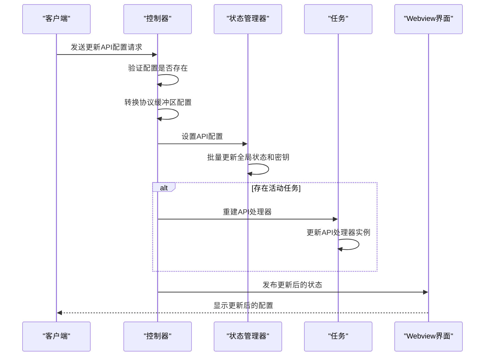
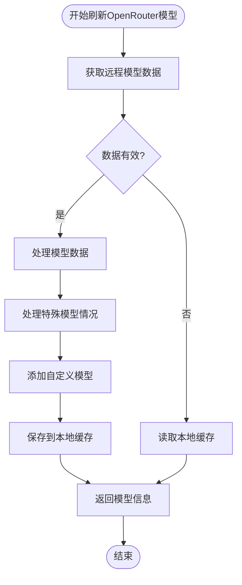
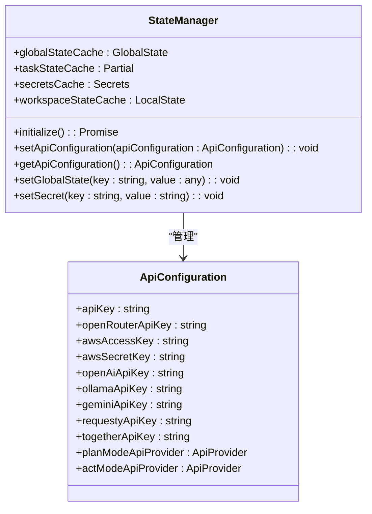

# AI模型与API配置

<cite>
**本文档引用的文件**  
- [updateApiConfigurationProto.ts](file://src/core/controller/models/updateApiConfigurationProto.ts)
- [refreshOpenRouterModels.ts](file://src/core/controller/models/refreshOpenRouterModels.ts)
- [StateManager.ts](file://src/core/storage/StateManager.ts)
- [api-configuration-conversion.ts](file://src/shared/proto-conversions/models/api-configuration-conversion.ts)
- [index.ts](file://src/core/api/index.ts)
</cite>

## 目录
1. [简介](#简介)
2. [API配置更新机制](#api配置更新机制)
3. [OpenRouter模型同步](#openrouter模型同步)
4. [API配置存储与管理](#api配置存储与管理)
5. [多提供商配置差异](#多提供商配置差异)
6. [配置示例与最佳实践](#配置示例与最佳实践)

## 简介
本文档详细解析AI模型与API配置的核心机制，重点阐述`updateApiConfigurationProto`如何更新不同AI提供商（如OpenRouter、Anthropic、OpenAI等）的API配置，包括API密钥、基础URL和模型参数的管理。同时，深入说明`refreshOpenRouterModels`等函数如何从远程服务获取最新的可用模型列表并同步到本地状态。文档还解释了API配置如何通过`StateManager`进行安全存储，以及不同提供商的配置差异，并提供配置示例和最佳实践指导。

## API配置更新机制

`updateApiConfigurationProto`函数负责处理API配置的更新请求。该函数接收控制器实例和更新请求作为参数，首先验证请求中是否包含API配置，然后将协议缓冲区格式的API配置转换为应用程序内部使用的`ApiConfiguration`对象。

配置更新后，通过`StateManager`的`setApiConfiguration`方法将新配置持久化到存储中。如果当前存在活动任务，该函数会根据当前模式（计划模式或执行模式）重建API处理器，并更新任务的API处理器实例。最后，将更新后的状态发布到Webview界面，确保UI与最新配置保持同步。

**Diagram sources**  
- [updateApiConfigurationProto.ts](file://src/core/controller/models/updateApiConfigurationProto.ts#L12-L42)
- [StateManager.ts](file://src/core/storage/StateManager.ts#L1000-L1027)
- [index.ts](file://src/core/api/index.ts#L390-L419)

**Section sources**  
- [updateApiConfigurationProto.ts](file://src/core/controller/models/updateApiConfigurationProto.ts#L12-L42)
- [api-configuration-conversion.ts](file://src/shared/proto-conversions/models/api-configuration-conversion.ts#L489-L638)

## OpenRouter模型同步

`refreshOpenRouterModels`函数负责从OpenRouter API获取最新的模型列表并同步到本地。该函数首先向`https://openrouter.ai/api/v1/models`发起HTTP GET请求获取远程模型数据。成功获取数据后，对每个模型进行解析和转换，提取关键信息如最大令牌数、上下文窗口大小、图像支持、价格等。

在处理过程中，该函数会对特定模型进行特殊处理，例如对Anthropic的Claude系列模型设置提示缓存支持和价格，对DeepSeek模型设置零输入价格等。对于Claude Sonnet 4模型，还会创建一个上下文窗口为100万的特殊变体。此外，还会添加一个硬编码的`cline/sonic`模型。

如果网络请求失败，函数会尝试从本地缓存读取模型数据作为备用方案。获取的模型数据会被保存到本地缓存文件中，以便在离线时使用。

**Diagram sources**  
- [refreshOpenRouterModels.ts](file://src/core/controller/models/refreshOpenRouterModels.ts#L75-L255)

**Section sources**  
- [refreshOpenRouterModels.ts](file://src/core/controller/models/refreshOpenRouterModels.ts#L75-L255)

## API配置存储与管理

`StateManager`类负责管理所有应用状态的存储和访问。它采用内存缓存与异步持久化相结合的策略，提供快速的状态访问同时确保数据安全。状态管理器维护多个缓存：全局状态缓存、任务状态缓存、密钥缓存和工作区状态缓存。

当配置更新时，`StateManager`会立即更新内存中的缓存，然后安排一个防抖的持久化操作，延迟500毫秒后批量写入磁盘。这种设计避免了频繁的磁盘I/O操作，提高了性能。对于敏感信息如API密钥，存储在VS Code的密钥存储中，确保安全性。

`setApiConfiguration`方法将API配置分解为多个部分，批量更新全局状态和密钥。`getApiConfiguration`方法则从缓存中重构完整的API配置对象，优先使用任务特定的配置，然后回退到全局配置。

**Diagram sources**  
- [StateManager.ts](file://src/core/storage/StateManager.ts#L24-L1027)

**Section sources**  
- [StateManager.ts](file://src/core/storage/StateManager.ts#L24-L1027)

## 多提供商配置差异

不同AI提供商的配置存在显著差异，主要体现在API密钥、基础URL、模型参数和特定功能支持上。OpenRouter作为聚合平台，支持多种模型提供商，其配置包括API密钥和提供商排序规则。Anthropic提供商需要API密钥和自定义基础URL。OpenAI提供商同样需要API密钥和基础URL，还支持自定义请求头。

AWS Bedrock提供商配置最为复杂，包括访问密钥、密钥、区域、会话令牌、认证方式等多种选项。Google Vertex AI需要项目ID和区域。本地运行的Ollama和LM Studio需要基础URL和上下文大小配置。其他提供商如Together、Fireworks、Groq等都有各自的API密钥要求。

配置还区分计划模式和执行模式，允许为不同任务阶段选择不同的AI提供商和模型。每个模式都有独立的提供商、模型ID、思考预算令牌和推理努力程度设置，提供了灵活的配置选项。

## 配置示例与最佳实践

### 配置切换示例
要切换到OpenRouter的Claude Sonnet 4模型，需要设置`openRouterApiKey`，并将计划模式和执行模式的提供商都设置为`openrouter`，模型ID设置为`anthropic/claude-sonnet-4`。对于需要长上下文的任务，可以使用`anthropic/claude-sonnet-4:extended`模型。

### 最优模型选择实践
- **通用任务**：使用OpenRouter聚合平台，利用其提供商排序功能自动选择性价比最高的模型
- **长上下文任务**：选择支持大上下文窗口的模型，如Claude Sonnet 4（200K）或其1M变体
- **成本敏感任务**：选择价格较低的模型，如Claude Haiku系列
- **图像处理任务**：选择支持图像输入的模型，如GPT-4V或Claude 3系列
- **本地运行任务**：配置Ollama或LM Studio基础URL，使用本地部署的模型

通过合理配置和选择，可以为不同任务找到最优的AI模型解决方案，平衡性能、成本和功能需求。