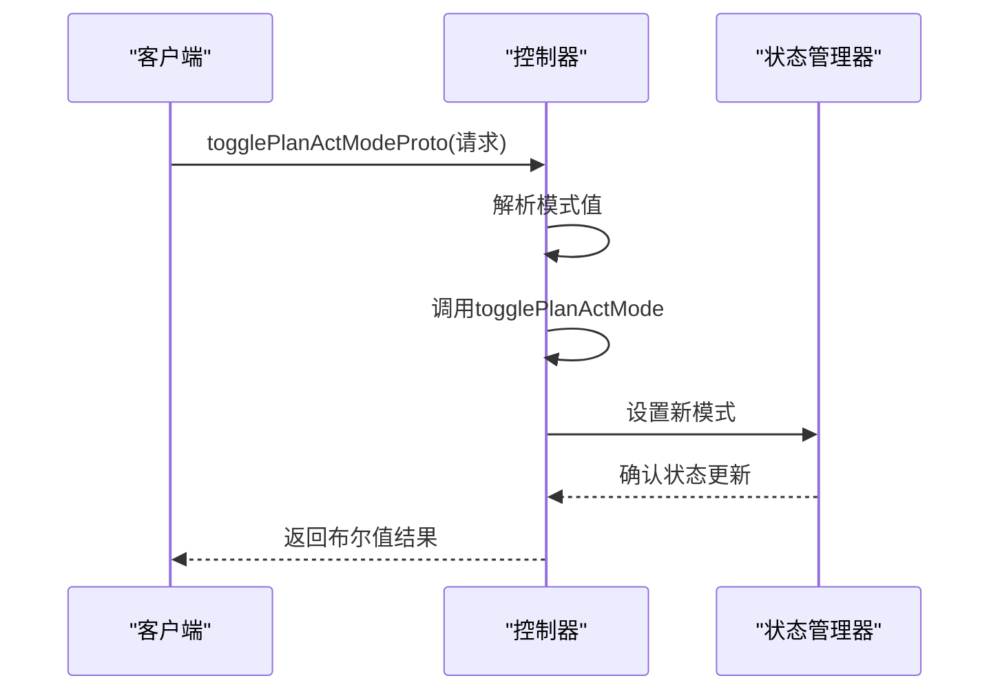
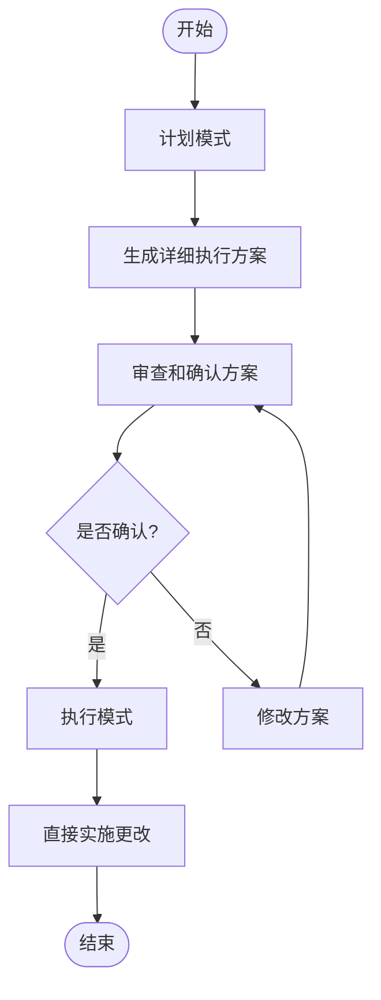
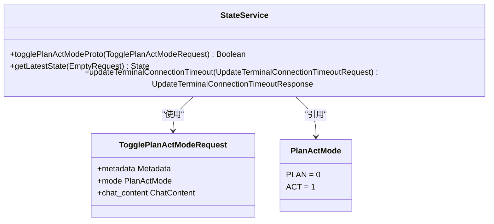
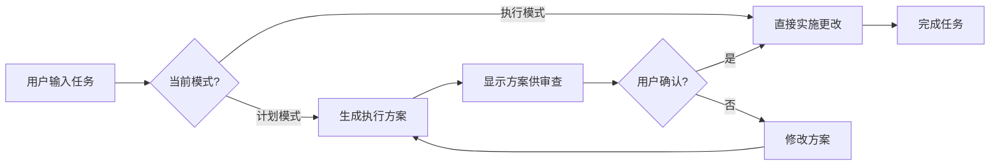
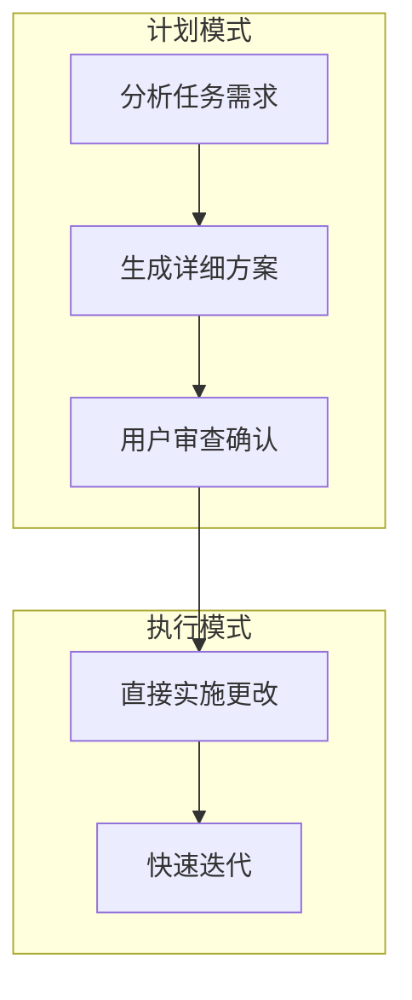

# 模式切换配置

<cite>
**本文档引用的文件**   
- [togglePlanActModeProto.ts](file://src/core/controller/state/togglePlanActModeProto.ts)
- [state.proto](file://proto/cline/state.proto)
- [state-keys.ts](file://src/core/storage/state-keys.ts)
- [index.ts](file://src/core/controller/index.ts)
- [index.ts](file://src/core/task/index.ts)
</cite>

## 目录
1. [简介](#简介)
2. [模式切换机制](#模式切换机制)
3. [计划模式与执行模式的行为差异](#计划模式与执行模式的行为差异)
4. [状态管理与gRPC通信](#状态管理与grpc通信)
5. [用户交互流程与任务执行策略](#用户交互流程与任务执行策略)
6. [使用场景示例](#使用场景示例)
7. [结论](#结论)

## 简介
本文档详细解析`togglePlanActModeProto`函数如何实现计划模式与执行模式之间的切换。计划模式侧重于生成详细的执行方案而不直接修改代码，而执行模式则可以直接实施更改。文档将深入探讨两种模式的行为差异、状态变更的gRPC通信机制以及模式切换对用户交互流程和任务执行策略的影响。

**Section sources**
- [togglePlanActModeProto.ts](file://src/core/controller/state/togglePlanActModeProto.ts#L1-L35)
- [state.proto](file://proto/cline/state.proto#L1-L292)

## 模式切换机制
`togglePlanActModeProto`函数负责在计划模式和执行模式之间进行切换。该函数接收一个`TogglePlanActModeRequest`对象作为参数，其中包含要切换到的模式（`PLAN`或`ACT`）以及可选的聊天内容。函数首先将请求中的模式值转换为内部使用的字符串表示形式（"plan"或"act"），然后调用控制器的`togglePlanActMode`方法来完成实际的模式切换操作。

**Diagram sources **
- [togglePlanActModeProto.ts](file://src/core/controller/state/togglePlanActModeProto.ts#L11-L33)
- [index.ts](file://src/core/controller/index.ts#L600-L630)

**Section sources**
- [togglePlanActModeProto.ts](file://src/core/controller/state/togglePlanActModeProto.ts#L11-L33)
- [index.ts](file://src/core/controller/index.ts#L600-L630)

## 计划模式与执行模式的行为差异
### 计划模式
计划模式的主要特点是生成详细的执行方案而不直接修改代码。在这种模式下，系统会专注于分析任务需求并制定出最优的解决方案步骤。用户可以在确认方案后再决定是否进入执行模式。

### 执行模式
执行模式允许系统直接实施更改。一旦用户确认了计划模式生成的方案，就可以切换到执行模式，让系统自动执行之前制定的步骤，从而提高工作效率。

**Diagram sources **
- [index.ts](file://src/core/task/index.ts#L91-L2631)
- [state-keys.ts](file://src/core/storage/state-keys.ts#L1-L203)

**Section sources**
- [index.ts](file://src/core/task/index.ts#L91-L2631)
- [state-keys.ts](file://src/core/storage/state-keys.ts#L1-L203)

## 状态管理与gRPC通信
### 状态管理
系统通过`state-keys.ts`文件中的`GlobalState`接口来管理全局状态。其中`mode`字段用于存储当前的模式（"plan"或"act"）。当模式切换时，这个字段会被更新，并且相关的配置也会随之改变。

### gRPC通信
gRPC通信机制通过`state.proto`文件定义的服务接口实现。`StateService`服务提供了`togglePlanActModeProto`方法，用于处理模式切换请求。客户端发送请求后，服务器端会根据请求内容更新状态并返回响应。

**Diagram sources **
- [state.proto](file://proto/cline/state.proto#L1-L292)
- [state-keys.ts](file://src/core/storage/state-keys.ts#L1-L203)

**Section sources**
- [state.proto](file://proto/cline/state.proto#L1-L292)
- [state-keys.ts](file://src/core/storage/state-keys.ts#L1-L203)

## 用户交互流程与任务执行策略
### 用户交互流程
用户可以通过界面按钮或命令行指令触发模式切换。系统会在后台处理切换逻辑，并实时更新UI以反映当前模式。用户可以随时查看当前模式的状态，并根据需要进行调整。

### 任务执行策略
在计划模式下，系统会优先考虑安全性和准确性，避免对代码库造成不必要的影响。而在执行模式下，系统则更加注重效率和速度，尽可能快速地完成任务。

**Diagram sources **
- [index.ts](file://src/core/controller/index.ts#L600-L630)
- [index.ts](file://src/core/task/index.ts#L91-L2631)

**Section sources**
- [index.ts](file://src/core/controller/index.ts#L600-L630)
- [index.ts](file://src/core/task/index.ts#L91-L2631)

## 使用场景示例
### 复杂任务的审查与确认
对于复杂的开发任务，建议先使用计划模式生成详细的执行方案。例如，在重构大型模块时，系统可以先分析所有相关文件，列出需要修改的地方，并提供每一步的具体操作说明。用户可以仔细审查这些方案，确保没有遗漏或错误，然后再切换到执行模式让系统自动完成修改。

### 快速原型开发
在快速原型开发过程中，可以直接使用执行模式加快迭代速度。系统会立即应用更改，帮助开发者快速验证想法。但需要注意的是，这种方式可能会带来一定的风险，因此只适用于非生产环境。

**Diagram sources **
- [index.ts](file://src/core/task/index.ts#L91-L2631)
- [state-keys.ts](file://src/core/storage/state-keys.ts#L1-L203)

**Section sources**
- [index.ts](file://src/core/task/index.ts#L91-L2631)
- [state-keys.ts](file://src/core/storage/state-keys.ts#L1-L203)

## 结论
通过深入解析`togglePlanActModeProto`函数及其相关组件，我们了解了如何有效地利用模式切换功能来优化开发工作流。计划模式和执行模式各有优势，合理选择和使用这两种模式可以帮助开发者更好地管理复杂任务，提高开发效率。

[无来源，因为此部分总结而不分析特定文件]