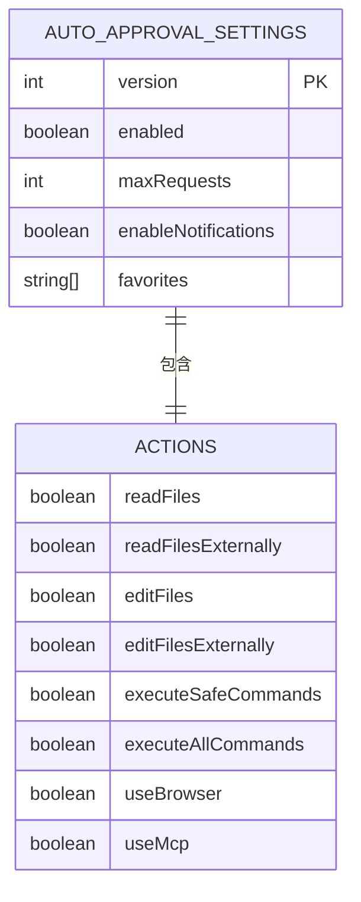
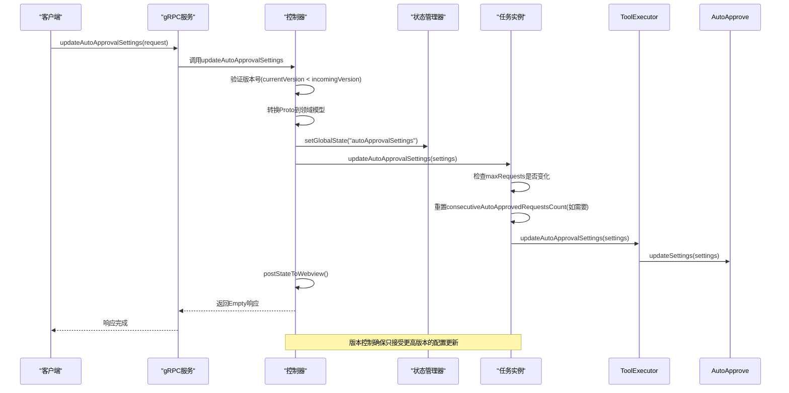
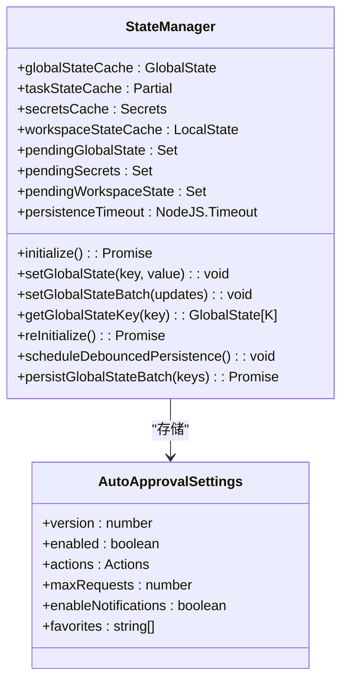
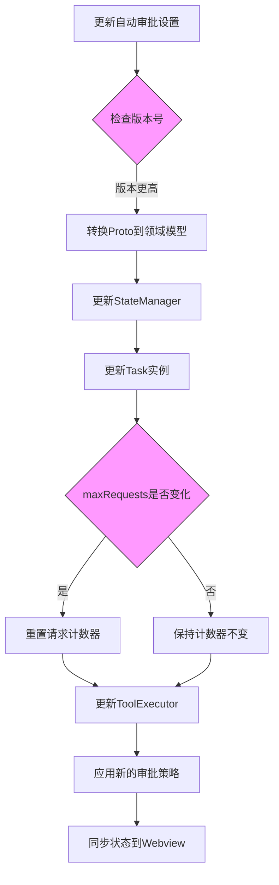

# 自动审批设置

<cite>
**本文档中引用的文件**  
- [updateAutoApprovalSettings.ts](file://src/core/controller/state/updateAutoApprovalSettings.ts)
- [AutoApprovalSettings.ts](file://src/shared/AutoApprovalSettings.ts)
- [StateManager.ts](file://src/core/storage/StateManager.ts)
- [task/index.ts](file://src/core/task/index.ts)
- [ToolExecutor.ts](file://src/core/task/ToolExecutor.ts)
- [auto-approval-settings-conversion.ts](file://src/shared/proto-conversions/models/auto-approval-settings-conversion.ts)
- [state.proto](file://proto/cline/state.proto)
</cite>

## 目录
1. [简介](#简介)
2. [核心组件](#核心组件)
3. [数据模型结构](#数据模型结构)
4. [gRPC协议更新机制](#grpc协议更新机制)
5. [状态管理与持久化](#状态管理与持久化)
6. [任务执行流程集成](#任务执行流程集成)
7. [配置示例与实践建议](#配置示例与实践建议)

## 简介
本文档详细阐述了自动审批设置的功能实现机制，重点分析`updateAutoApprovalSettings`函数的执行流程。文档深入解析了`AutoApprovalSettings`数据模型的结构设计，涵盖文件操作、命令执行、浏览器访问等不同操作类型的审批策略配置。同时说明了这些设置如何通过`StateManager`进行持久化存储，并与任务执行流程深度集成。通过配置示例展示了如何根据安全需求设置不同的审批级别，并提供了在团队协作环境中合理配置自动审批的实践建议。

## 核心组件

`updateAutoApprovalSettings`函数是自动审批系统的核心入口，负责处理来自gRPC协议的配置更新请求。该函数首先检查传入配置的版本号，确保只接受更高版本的配置更新，从而避免竞态条件。更新后的设置会通过`StateManager`持久化存储，并同步更新到当前任务实例和工具执行器中。当最大请求数限制发生变化时，系统会重置连续自动审批请求计数器，确保审批策略的正确执行。

**Section sources**
- [updateAutoApprovalSettings.ts](file://src/core/controller/state/updateAutoApprovalSettings.ts#L11-L30)
- [task/index.ts](file://src/core/task/index.ts#L470-L482)
- [ToolExecutor.ts](file://src/core/task/ToolExecutor.ts#L221-L223)

## 数据模型结构

`AutoApprovalSettings`数据模型定义了自动审批系统的完整配置结构，包含版本控制、启用状态、操作权限、全局设置和用户偏好等关键属性。



**Diagram sources**
- [AutoApprovalSettings.ts](file://src/shared/AutoApprovalSettings.ts#L0-L20)

### 版本与启用状态
- **version**: 整数类型，用于防止竞态条件，每次更改时递增
- **enabled**: 布尔类型，控制自动审批功能的总体启用状态

### 操作权限配置
操作权限通过`actions`对象进行细粒度控制，支持以下操作类型：
- **readFiles**: 读取工作目录内的文件和目录
- **readFilesExternally**: 读取工作目录外的文件和目录
- **editFiles**: 编辑工作目录内的文件
- **editFilesExternally**: 编辑工作目录外的文件
- **executeSafeCommands**: 执行安全命令
- **executeAllCommands**: 执行所有命令
- **useBrowser**: 使用浏览器功能
- **useMcp**: 使用MCP服务器

### 全局设置
- **maxRequests**: 整数类型，定义最大自动审批请求数
- **enableNotifications**: 布尔类型，控制是否显示审批和任务完成通知
- **favorites**: 字符串数组，存储用户收藏的操作ID，便于快速访问

**Section sources**
- [AutoApprovalSettings.ts](file://src/shared/AutoApprovalSettings.ts#L0-L20)

## gRPC协议更新机制

自动审批设置通过gRPC协议进行更新，实现了客户端与服务端之间的高效通信。`StateService`服务在`state.proto`文件中定义了`updateAutoApprovalSettings`方法，接收`AutoApprovalSettingsRequest`消息并返回空响应。



**Diagram sources**
- [state.proto](file://proto/cline/state.proto#L0-L291)
- [updateAutoApprovalSettings.ts](file://src/core/controller/state/updateAutoApprovalSettings.ts#L11-L30)
- [auto-approval-settings-conversion.ts](file://src/shared/proto-conversions/models/auto-approval-settings-conversion.ts#L0-L45)

### 协议转换
系统通过`convertProtoToAutoApprovalSettings`函数将gRPC协议中的`AutoApprovalSettingsRequest`消息转换为领域模型`AutoApprovalSettings`，确保数据格式的正确映射。转换过程中会处理默认值，如未指定的布尔值默认为`false`，数值默认为`20`。

**Section sources**
- [auto-approval-settings-conversion.ts](file://src/shared/proto-conversions/models/auto-approval-settings-conversion.ts#L24-L45)

## 状态管理与持久化

`StateManager`是系统状态管理的核心组件，负责自动审批设置的持久化存储。该组件采用内存缓存与异步持久化相结合的策略，确保快速访问的同时保证数据的持久性。



**Diagram sources**
- [StateManager.ts](file://src/core/storage/StateManager.ts#L24-L1027)

### 持久化策略
- **内存缓存**: 所有状态首先存储在内存缓存中，实现即时访问
- **异步持久化**: 通过`scheduleDebouncedPersistence`方法实现防抖持久化，减少磁盘I/O操作
- **批量更新**: 支持批量设置状态，提高性能
- **错误恢复**: 提供`reInitialize`方法，在写入失败时重新初始化状态管理器

当自动审批设置更新时，`setGlobalState`方法会立即更新内存缓存，并将更改加入待持久化队列，随后在500毫秒的防抖延迟后批量写入磁盘。

**Section sources**
- [StateManager.ts](file://src/core/storage/StateManager.ts#L24-L1027)

## 任务执行流程集成

自动审批设置与任务执行流程深度集成，确保审批策略在任务执行过程中得到正确应用。`Task`类和`ToolExecutor`共同协作，实现审批策略的动态应用。



**Diagram sources**
- [task/index.ts](file://src/core/task/index.ts#L470-L482)
- [ToolExecutor.ts](file://src/core/task/ToolExecutor.ts#L221-L223)

### 集成流程
1. **版本检查**: 确保只接受更高版本的配置更新
2. **状态更新**: 通过`StateManager`持久化新设置
3. **任务同步**: 更新当前任务实例的`autoApprovalSettings`
4. **计数器管理**: 如果`maxRequests`发生变化，重置连续自动审批请求计数器
5. **工具执行器更新**: 将新设置传递给`ToolExecutor`，确保工具执行时应用最新的审批策略

这种集成机制确保了审批策略的变更能够立即生效，并在整个任务执行流程中保持一致。

**Section sources**
- [task/index.ts](file://src/core/task/index.ts#L470-L482)
- [ToolExecutor.ts](file://src/core/task/ToolExecutor.ts#L221-L223)

## 配置示例与实践建议

### 配置示例

以下是一些典型的自动审批设置配置示例：

```typescript
// 开发环境宽松配置
const devSettings: AutoApprovalSettings = {
  version: 2,
  enabled: true,
  actions: {
    readFiles: true,
    readFilesExternally: true,
    editFiles: true,
    editFilesExternally: true,
    executeSafeCommands: true,
    executeAllCommands: true,
    useBrowser: true,
    useMcp: true,
  },
  maxRequests: 100,
  enableNotifications: true,
  favorites: ["readFiles", "editFiles", "executeSafeCommands"]
}

// 生产环境严格配置
const prodSettings: AutoApprovalSettings = {
  version: 2,
  enabled: true,
  actions: {
    readFiles: true,
    readFilesExternally: false,
    editFiles: false,
    editFilesExternally: false,
    executeSafeCommands: true,
    executeAllCommands: false,
    useBrowser: false,
    useMcp: false,
  },
  maxRequests: 10,
  enableNotifications: true,
  favorites: ["readFiles", "executeSafeCommands"]
}
```

### 实践建议

在团队协作环境中配置自动审批时，建议遵循以下最佳实践：

1. **分环境配置**: 为开发、测试和生产环境设置不同的审批级别，开发环境可以更宽松，生产环境应更严格
2. **最小权限原则**: 只授予必要的操作权限，特别是对外部文件访问和命令执行等高风险操作
3. **定期审查**: 定期审查和更新审批设置，确保符合当前的安全策略
4. **版本控制**: 利用`version`字段管理配置变更，避免配置冲突
5. **通知机制**: 启用通知功能，让团队成员了解自动审批的执行情况
6. **请求限制**: 设置合理的`maxRequests`值，防止滥用自动审批功能
7. **收藏常用操作**: 将团队常用的审批操作添加到`favorites`列表，提高工作效率

通过合理配置自动审批设置，可以在保证安全性的同时提高开发效率，实现安全与效率的平衡。

**Section sources**
- [AutoApprovalSettings.ts](file://src/shared/AutoApprovalSettings.ts#L22-L39)
- [TestServer.ts](file://src/services/test/TestServer.ts#L49-L80)