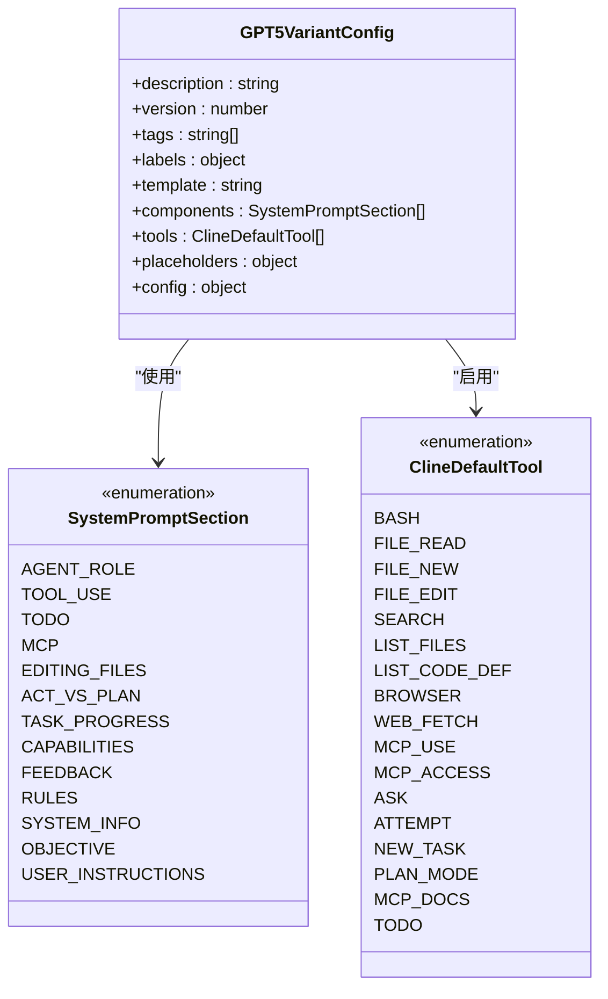
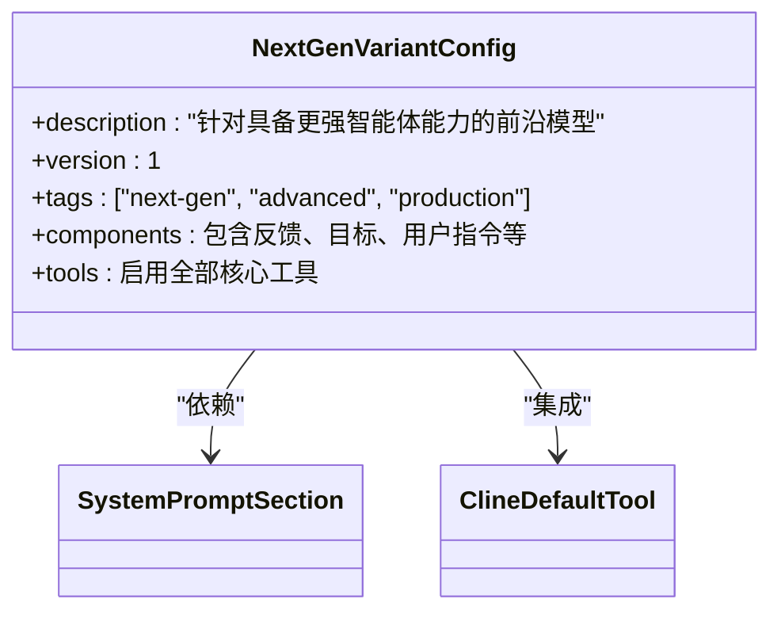
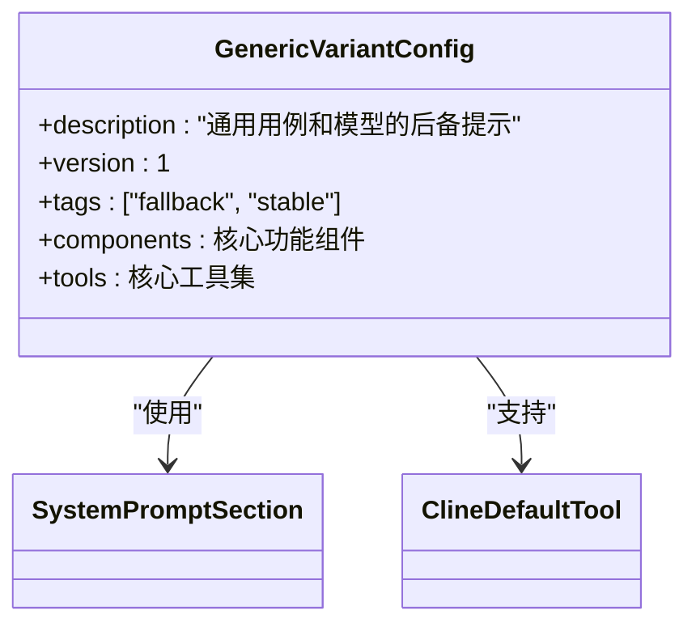
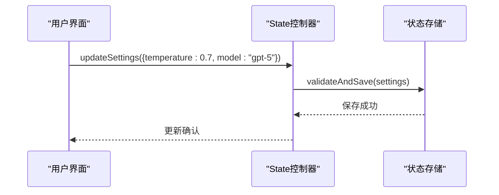

# 配置与定制

<cite>
**本文档中引用的文件**  
- [config.ts](file://src/config.ts)
- [system-prompt/variants/index.ts](file://src/core/prompts/system-prompt/variants/index.ts)
- [system-prompt/variants/gpt-5/config.ts](file://src/core/prompts/system-prompt/variants/gpt-5/config.ts)
- [system-prompt/variants/next-gen/config.ts](file://src/core/prompts/system-prompt/variants/next-gen/config.ts)
- [system-prompt/variants/generic/config.ts](file://src/core/prompts/system-prompt/variants/generic/config.ts)
- [controller/state/updateSettings.ts](file://src/core/controller/state/updateSettings.ts)
- [controller/state/updateTerminalConnectionTimeout.ts](file://src/core/controller/state/updateTerminalConnectionTimeout.ts)
- [controller/state/updateAutoApprovalSettings.ts](file://src/core/controller/state/updateAutoApprovalSettings.ts)
- [controller/account/getUserCredits.ts](file://src/core/controller/account/getUserCredits.ts)
- [controller/account/getOrganizationCredits.ts](file://src/core/controller/account/getOrganizationCredits.ts)
</cite>

## 目录
1. [简介](#简介)
2. [全局配置选项](#全局配置选项)
3. [AI模型与系统提示词定制](#ai模型与系统提示词定制)
4. [提示词模板与行为控制](#提示词模板与行为控制)
5. [账户与信用额度管理](#账户与信用额度管理)
6. [高级设置与控制器配置](#高级设置与控制器配置)
7. [自定义系统提示词（system-prompt）](#自定义系统提示词system-prompt)
8. [总结](#总结)

## 简介
本文档旨在为用户提供全面的配置与定制指南，涵盖从基础设置到高级行为控制的各个方面。您将学习如何通过界面配置API密钥、选择默认AI模型、调整生成参数（如温度），以及如何通过`config.ts`中的全局配置影响系统行为。此外，本文还将深入解析`prompts/variants`目录下的提示词模板如何影响AI的行为模式，并介绍如何通过`controller/state`模块修改终端连接超时、自动审批规则等运行时设置。

**Section sources**
- [config.ts](file://src/config.ts#L0-L80)
- [controller/state/updateSettings.ts](file://src/core/controller/state/updateSettings.ts#L1-L20)

## 全局配置选项
`config.ts` 文件定义了应用的环境配置，包括生产、预发布和本地开发环境的API基础地址、Firebase认证信息等。该文件通过 `getClineEnv()` 函数读取环境变量 `CLINE_ENVIRONMENT` 来确定当前运行环境，并加载对应的配置。

主要配置项包括：
- `appBaseUrl`: 前端应用的根URL
- `apiBaseUrl`: 核心API服务的地址
- `mcpBaseUrl`: MCP（Model Control Plane）服务的地址
- `firebase`: Firebase项目的认证配置，用于用户身份验证

这些配置在应用启动时被加载到内存中，并通过 `clineEnvConfig` 常量导出供全局使用。此机制确保了环境切换的灵活性和安全性。

**Section sources**
- [config.ts](file://src/config.ts#L0-L80)

## AI模型与系统提示词定制
系统支持根据不同的AI模型家族（Model Family）加载相应的提示词变体（Prompt Variant）。这些变体通过 `ModelFamily` 枚举进行标识，并在 `system-prompt/variants` 目录下进行组织。

用户可以通过设置界面选择默认的AI模型，系统将根据所选模型自动加载对应的提示词配置。例如，选择GPT-5模型将触发加载 `gpt-5` 变体，而选择下一代模型则加载 `next-gen` 变体。

**Section sources**
- [system-prompt/variants/index.ts](file://src/core/prompts/system-prompt/variants/index.ts#L0-L82)

## 提示词模板与行为控制
提示词模板位于 `src/core/prompts/system-prompt/variants` 目录下，每个子目录（如 `gpt-5`, `next-gen`, `generic`）包含一个 `config.ts` 和 `template.ts` 文件，分别定义配置和模板内容。

### GPT-5 变体
`gpt-5` 变体专为GPT-5系列模型优化，启用了完整的工具集，包括：
- 命令行执行（BASH）
- 文件读写与编辑
- 代码定义搜索
- 浏览器与网页内容获取
- MCP（Model Control Plane）工具调用

其配置通过 `createVariant` 构建器模式定义，并通过 `overrideComponent` 方法对特定组件（如RULES）进行模板覆盖。

**Diagram sources**
- [system-prompt/variants/gpt-5/config.ts](file://src/core/prompts/system-prompt/variants/gpt-5/config.ts#L0-L75)

### 下一代模型变体
`next-gen` 变体针对具备更强智能体能力的前沿模型设计，其配置与GPT-5类似，但描述中强调了“更智能的智能体能力”。该变体同样启用了完整的工具集，并通过自定义规则模板进行行为约束。

**Diagram sources**
- [system-prompt/variants/next-gen/config.ts](file://src/core/prompts/system-prompt/variants/next-gen/config.ts#L0-L75)

### 通用变体
`generic` 变体作为所有模型类型的后备选项，设计目标是广泛的兼容性和稳定的性能。它启用了核心工具集，但不包含特定于高级模型的功能。

**Diagram sources**
- [system-prompt/variants/generic/config.ts](file://src/core/prompts/system-prompt/variants/generic/config.ts#L0-L67)

## 账户与信用额度管理
系统通过 `controller/account` 模块提供账户信息和信用额度管理功能。用户可以通过界面查看个人信用额度和所属组织的信用额度。

关键控制器函数包括：
- `getUserCredits()`: 获取当前用户的信用额度
- `getOrganizationCredits()`: 获取用户所在组织的总信用额度
- `getUserOrganizations()`: 获取用户所属的所有组织列表
- `setUserOrganization()`: 切换当前操作的组织

这些功能通过Firebase身份验证集成，确保了账户信息的安全访问。

**Section sources**
- [controller/account/getUserCredits.ts](file://src/core/controller/account/getUserCredits.ts#L1-L15)
- [controller/account/getOrganizationCredits.ts](file://src/core/controller/account/getOrganizationCredits.ts#L1-L15)

## 高级设置与控制器配置
系统允许通过 `controller/state` 模块修改多种运行时设置，这些设置直接影响AI助手的行为和系统性能。

### 终端连接超时
`updateTerminalConnectionTimeout()` 函数允许用户设置终端连接的最大等待时间。此设置对于在远程开发或网络不稳定环境下工作的用户尤为重要。

**Section sources**
- [controller/state/updateTerminalConnectionTimeout.ts](file://src/core/controller/state/updateTerminalConnectionTimeout.ts#L1-L10)

### 自动审批规则
`updateAutoApprovalSettings()` 函数用于配置自动审批规则，控制AI在执行特定操作（如文件修改、命令执行）时是否需要用户确认。用户可以根据信任级别和安全需求进行调整。

**Section sources**
- [controller/state/updateAutoApprovalSettings.ts](file://src/core/controller/state/updateAutoApprovalSettings.ts#L1-L15)

### 通用设置更新
`updateSettings()` 函数是更新用户偏好设置的通用入口，支持修改包括默认模型、温度、最大上下文长度等在内的多种参数。

**Diagram sources**
- [controller/state/updateSettings.ts](file://src/core/controller/state/updateSettings.ts#L1-L20)

## 自定义系统提示词（system-prompt）
用户可以通过修改 `system-prompt/variants` 目录下的模板文件来自定义AI的默认行为。每个变体的 `config.ts` 文件使用构建器模式（Builder Pattern）来定义提示词结构。

自定义步骤：
1. 在 `variants` 目录下创建新的子目录（如 `my-custom-model`）
2. 添加 `config.ts` 和 `template.ts` 文件
3. 在 `config.ts` 中使用 `createVariant()` 定义配置
4. 通过 `.components()` 选择启用的提示组件
5. 通过 `.tools()` 指定可用工具
6. 使用 `.overrideComponent()` 对特定部分进行定制

系统在编译时会对所有变体配置进行验证，确保其结构正确性。任何验证失败都将导致构建错误，从而保证了配置的可靠性。

**Section sources**
- [system-prompt/variants/variant-builder.ts](file://src/core/prompts/system-prompt/variants/variant-builder.ts#L1-L50)
- [system-prompt/variants/variant-validator.ts](file://src/core/prompts/system-prompt/variants/variant-validator.ts#L1-L30)

## 总结
本文档全面介绍了系统的配置与定制能力。从全局环境配置到细粒度的提示词模板控制，用户可以根据具体需求灵活调整AI助手的行为。通过理解 `config.ts` 的环境管理机制、`variants` 目录的提示词架构以及 `controller/state` 模块的运行时设置，用户能够充分发挥系统的潜力，实现个性化的AI开发体验。