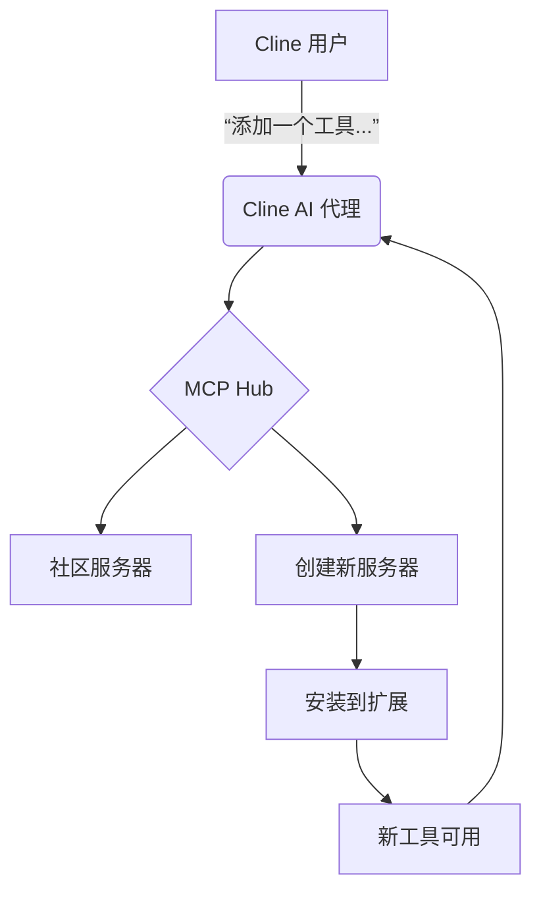
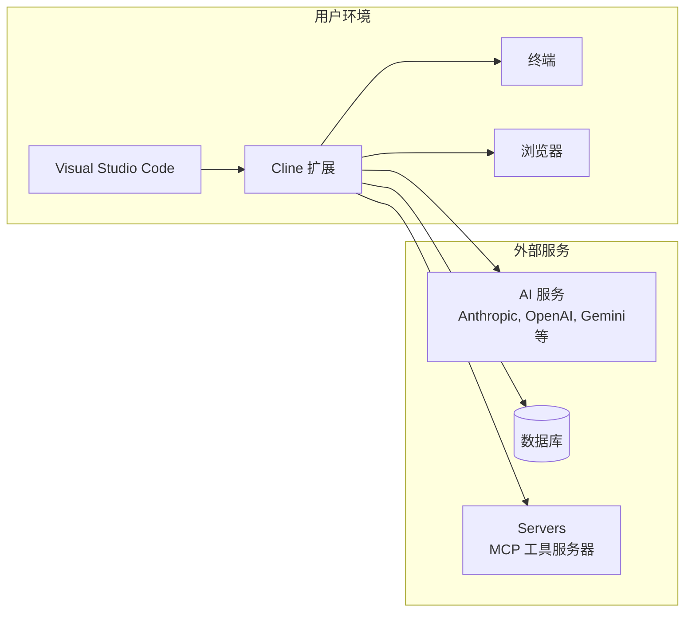

# 项目概述

<cite>
**本文档中引用的文件**   
- [README.md](file://README.md)
- [src/core/README.md](file://src/core/README.md)
- [src/core/controller/index.ts](file://src/core/controller/index.ts)
- [src/core/api/index.ts](file://src/core/api/index.ts)
- [src/core/task/index.ts](file://src/core/task/index.ts)
- [src/core/prompts/system-prompt/README.md](file://src/core/prompts/system-prompt/README.md)
- [src/core/prompts/system-prompt/tools/use_mcp_tool.ts](file://src/core/prompts/system-prompt/tools/use_mcp_tool.ts)
- [src/core/prompts/system-prompt/tools/load_mcp_documentation.ts](file://src/core/prompts/system-prompt/tools/load_mcp_documentation.ts)
- [src/core/controller/mcp/openMcpSettings.ts](file://src/core/controller/mcp/openMcpSettings.ts)
- [webview-ui/src/components/mcp/configuration/tabs/installed/InstalledServersView.tsx](file://webview-ui/src/components/mcp/configuration/tabs/installed/InstalledServersView.tsx)
- [webview-ui/src/components/mcp/configuration/tabs/add-server/AddLocalServerForm.tsx](file://webview-ui/src/components/mcp/configuration/tabs/add-server/AddLocalServerForm.tsx)
- [src/core/controller/state/updateTerminalReuseEnabled.ts](file://src/core/controller/state/updateTerminalReuseEnabled.ts)
- [src/core/controller/state/getAvailableTerminalProfiles.ts](file://src/core/controller/state/getAvailableTerminalProfiles.ts)
- [src/core/task/message-state.ts](file://src/core/task/message-state.ts)
- [src/config.ts](file://src/config.ts)
- [src/core/controller/ui/scrollToSettings.ts](file://src/core/controller/ui/scrollToSettings.ts)
- [webview-ui/src/components/settings/SettingsView.tsx](file://webview-ui/src/components/settings/SettingsView.tsx)
</cite>

## 目录
1. [引言](#引言)
2. [核心定位与价值主张](#核心定位与价值主张)
3. [主要功能](#主要功能)
4. [技术愿景与设计哲学](#技术愿景与设计哲学)
5. [系统上下文图](#系统上下文图)
6. [发展历程与未来路线图](#发展历程与未来路线图)
7. [总结](#总结)

## 引言

Cline 是一个集成在 Visual Studio Code (VS Code) 中的自主编码代理（Autonomous Coding Agent），旨在通过人工智能技术彻底改变软件开发流程。它不仅仅是一个代码补全工具，而是一个能够理解、规划并执行复杂开发任务的智能助手。得益于 [Claude Sonnet 的代理式编码能力](https://www.anthropic.com/claude/sonnet)，Cline 能够像人类开发者一样，分析需求、探索代码库、制定计划，并在获得用户许可后执行文件修改和终端命令。

本概述文档旨在为新手和资深开发者提供一个全面的视角，深入理解 Cline 的核心定位、功能、技术架构和未来发展方向。

**Section sources**
- [README.md](file://README.md)

## 核心定位与价值主张

Cline 的核心定位是成为开发者在 VS Code 环境中的“智能副驾驶”。它超越了传统 AI 辅助工具的范畴，从被动的代码建议者转变为一个主动的、能够执行端到端任务的代理。

其核心价值主张体现在以下几个方面：
1.  **任务自动化**：Cline 能够处理从“创建一个登录页面”到“修复这个运行时错误”等复杂的、多步骤的开发任务。
2.  **深度上下文理解**：它通过分析文件结构、源代码抽象语法树（AST）和运行正则表达式搜索来深入理解项目上下文，确保其建议和修改与现有架构保持一致。
3.  **安全的人机协作模式**：与在沙盒环境中运行的纯自动化脚本不同，Cline 采用“人在环路”（human-in-the-loop）的 GUI 模式。每一次文件变更和终端命令都需要用户的明确批准，这在探索 AI 代理潜力的同时，提供了极高的安全性和可控性。
4.  **无缝集成**：作为 VS Code 扩展，Cline 与开发者的日常工作流无缝集成，无需切换工具或环境。

**Section sources**
- [README.md](file://README.md)

## 主要功能

### 智能代码生成

Cline 的核心功能是智能代码生成。它不仅能创建和编辑文件，还能在过程中监控代码检查工具（linter）和编译器的错误。这意味着它可以主动修复诸如缺少导入、语法错误等问题，实现更流畅的开发体验。所有由 Cline 做出的修改都会记录在文件的“时间轴”（Timeline）中，方便用户随时追踪和回滚。

### 多模型AI支持

Cline 支持广泛的 AI 模型提供商，包括 OpenRouter、Anthropic、OpenAI、Google Gemini、AWS Bedrock、Azure 和 GCP Vertex。用户还可以配置任何兼容 OpenAI 的 API，或通过 LM Studio/Ollama 使用本地模型。这种灵活性允许用户根据任务需求、成本和性能选择最合适的模型。扩展程序会自动追踪整个任务循环和单个请求的总 token 数及 API 使用成本，确保用户对支出有清晰的了解。

**Section sources**
- [README.md](file://README.md)
- [src/core/api/index.ts](file://src/core/api/index.ts)

### MCP工具扩展

Cline 的能力可以通过 **Model Context Protocol (MCP)** 进行扩展。MCP 允许 Cline 连接并使用由社区创建或用户自定义的工具服务器。用户只需简单地对 Cline 说“添加一个工具……”，例如“添加一个获取 Jira 工单的工具”，Cline 就能自动处理从创建新的 MCP 服务器到将其安装到扩展中的所有过程。这些自定义工具随后会成为 Cline 工具包的一部分，用于未来的任务。

**Diagram sources**
- [src/core/controller/mcp/openMcpSettings.ts](file://src/core/controller/mcp/openMcpSettings.ts)
- [src/core/prompts/system-prompt/tools/use_mcp_tool.ts](file://src/core/prompts/system-prompt/tools/use_mcp_tool.ts)
- [src/core/prompts/system-prompt/tools/load_mcp_documentation.ts](file://src/core/prompts/system-prompt/tools/load_mcp_documentation.ts)
- [webview-ui/src/components/mcp/configuration/tabs/installed/InstalledServersView.tsx](file://webview-ui/src/components/mcp/configuration/tabs/installed/InstalledServersView.tsx)
- [webview-ui/src/components/mcp/configuration/tabs/add-server/AddLocalServerForm.tsx](file://webview-ui/src/components/mcp/configuration/tabs/add-server/AddLocalServerForm.tsx)

### 用户控制机制

Cline 的设计哲学强调用户始终掌控。其控制机制体现在多个层面：
-   **显式批准**：所有文件修改和终端命令都必须经过用户点击确认。
-   **检查点（Checkpoints）**：在任务执行过程中，扩展会定期创建工作区的快照。用户可以使用“比较”功能查看与当前状态的差异，或使用“恢复”功能回滚到之前的快照，这为探索不同解决方案提供了安全网。
-   **终端集成**：得益于 VS Code v1.93 的 Shell 集成 API，Cline 可以在终端中直接执行命令并接收输出。对于长时间运行的进程（如开发服务器），用户可以使用“在运行时继续”按钮，让 Cline 在后台运行命令的同时继续处理任务。
-   **全面的设置**：用户可以通过详细的设置面板（包含 API 配置、通用、功能、浏览器、终端等多个选项卡）来精细地控制 Cline 的行为。

**Section sources**
- [README.md](file://README.md)
- [src/core/controller/state/updateTerminalReuseEnabled.ts](file://src/core/controller/state/updateTerminalReuseEnabled.ts)
- [src/core/controller/state/getAvailableTerminalProfiles.ts](file://src/core/controller/state/getAvailableTerminalProfiles.ts)
- [webview-ui/src/components/settings/SettingsView.tsx](file://webview-ui/src/components/settings/SettingsView.tsx)
- [src/core/controller/ui/scrollToSettings.ts](file://src/core/controller/ui/scrollToSettings.ts)

## 技术愿景与设计哲学

Cline 的技术架构遵循清晰的分层设计，其核心流程为：**扩展入口点 (extension.ts) -> Webview -> 控制器 (controller) -> 任务 (task)**。

*   **控制器 (Controller)**：作为核心协调者，负责管理 Webview 消息、任务生命周期和状态管理。它持有对 `StateManager` 的引用，用于持久化用户设置和任务历史。
*   **任务 (Task)**：代表一个具体的开发任务。它包含执行 API 请求和工具操作所需的所有服务，如 `ApiHandler`（用于与 AI 模型通信）、`ToolExecutor`（用于执行各种工具）和 `CheckpointManager`（用于管理检查点）。
*   **上下文管理 (Context Management)**：`ContextManager` 和 `ContextTracker` 组件负责智能地管理发送给 AI 模型的上下文信息，确保在不超出上下文窗口限制的情况下提供最相关的信息。
*   **API 抽象层**：`buildApiHandler` 函数根据用户的配置（如 API 提供商、模型 ID）动态创建相应的 `ApiHandler` 实例（如 `AnthropicHandler`, `OpenRouterHandler`），实现了对多种 AI 服务的统一接口。

其设计哲学的核心是 **“用户始终掌控”**。所有强大的自动化功能都建立在用户明确授权的基础上。通过检查点、显式批准和透明的日志记录，Cline 力求在提供强大生产力的同时，最大限度地降低风险，让用户能够安全、自信地使用 AI 代理。

**Section sources**
- [src/core/README.md](file://src/core/README.md)
- [src/core/controller/index.ts](file://src/core/controller/index.ts)
- [src/core/task/index.ts](file://src/core/task/index.ts)
- [src/core/api/index.ts](file://src/core/api/index.ts)
- [src/core/task/message-state.ts](file://src/core/task/message-state.ts)

## 系统上下文图

**Diagram sources**
- [README.md](file://README.md)
- [src/config.ts](file://src/config.ts)

## 发展历程与未来路线图

### 发展历程
-   **初始发布**：Cline 作为 VS Code 扩展发布，支持基础的文件创建、编辑和终端命令执行。
-   **MCP 集成**：引入 Model Context Protocol，极大地扩展了 Cline 的能力边界，使其能够连接外部工具和服务。
-   **多根工作区支持**：增强了对复杂项目结构的支持。
-   **检查点功能**：增加了工作区快照和恢复功能，提升了任务执行的安全性。

### 未来路线图摘要
-   **更智能的上下文管理**：进一步优化上下文选择算法，提高信息的相关性和效率。
-   **增强的 MCP 生态**：简化 MCP 服务器的创建和共享流程，构建更繁荣的工具市场。
-   **更深入的 IDE 集成**：探索与更多 IDE 功能（如调试器、版本控制）的深度集成。
-   **多代理协作**：研究多个 AI 代理协同工作的可能性，以处理更复杂的系统级任务。

**Section sources**
- [README.md](file://README.md)

## 总结

Cline 代表了 AI 辅助开发的下一个前沿。它不仅仅是一个工具，更是一个能够理解上下文、自主规划并安全执行任务的智能伙伴。通过其强大的功能、灵活的多模型支持、可扩展的 MCP 架构以及以用户控制为核心的设计哲学，Cline 为开发者提供了一种全新的、高效且安全的方式来完成软件开发任务。随着技术的不断演进，Cline 有望在提升开发效率和降低开发门槛方面发挥越来越重要的作用。