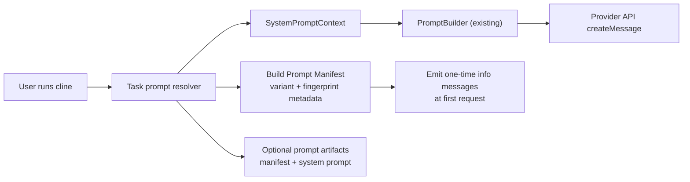

# Prompt Artifact Changes

## Goal
Make it easy to:
1. Know exactly which prompt was used for a run.
2. Keep run-to-run comparisons reproducible.

## High-Level Flow


## What Changed

### 1) Task runtime: one-time prompt identity signal
File: `src/core/task/index.ts`

- At first API request only, emits info messages with:
  - selected prompt variant family
  - final system prompt fingerprint
  - provider and model

### 2) Optional prompt artifact dump (exact prompt capture)
File: `src/core/task/index.ts`

- Added optional artifact writing to persist exactly what prompt was sent.
- Guarded by env flag:
  - `CLINE_WRITE_PROMPT_ARTIFACTS=1` (also accepts `true`/`yes`)
- Optional output dir:
  - `CLINE_PROMPT_ARTIFACT_DIR=/path/to/dir`
  - defaults to `<cwd>/.cline-prompt-artifacts`
- On first request of a task run, writes:
  - `<basename>.manifest.json`
  - `<basename>.system_prompt.md`

## Practical Usage

### Persist exact prompts as artifacts
```bash
CLINE_WRITE_PROMPT_ARTIFACTS=1 \
CLINE_PROMPT_ARTIFACT_DIR=./prompt-artifacts \
cline task "Fix failing tests"
```

## Reproducibility Impact

For each run, you now get an explicit runtime identity signal that can be logged with your eval/benchmark metadata:
- System prompt fingerprint
- Variant family
- Provider/model

And with artifact dumping enabled, you can inspect the exact rendered prompt text for audit/debugging.

## Validation
- Type-check passed: `npm run -s check-types`
- CLI build passed: `npm run -s cli:build`
- Manual E2E against OpenRouter (`anthropic/claude-opus-4.5`) verified:
  - profile-v1 and profile-v2 runs produce distinct output files
  - manifest/profile/system prompt artifact files are written
