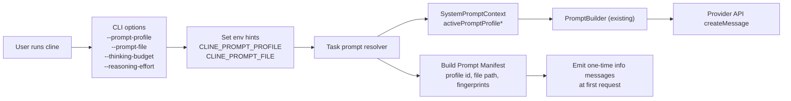

# Prompt Manifest + Prompt Override Changes

## Goal
Make it easy to:
1. Know exactly which prompt was used for a run.
2. Switch prompt variants/profiles without changing model/provider settings.
3. Keep run-to-run comparisons reproducible.

## High-Level Flow


## What Changed

### 1) CLI: new runtime controls
File: `cli/src/index.ts`

- Added optional flags on both `cline task` and default interactive command:
  - `--prompt-profile <id>`
  - `--prompt-file <path>`
  - `--thinking-budget <tokens>`
  - `--reasoning-effort <minimal|low|medium|high>`
- Added validation for `--thinking-budget` and `--reasoning-effort`.
- Added prompt override preparation that sets:
  - `CLINE_PROMPT_PROFILE`
  - `CLINE_PROMPT_FILE`
- Preserved piping behavior by avoiding extra stdout logs from this step.

### 2) Task runtime: prompt manifest resolution + one-time identity signal
File: `src/core/task/index.ts`

- Added prompt override metadata resolver that:
  - reads `CLINE_PROMPT_PROFILE` and `CLINE_PROMPT_FILE`
  - loads prompt file contents when provided
  - computes a profile fingerprint (`sha256`, short)
  - creates an instruction block for prompt injection
- At first API request only, emits info messages with:
  - active prompt profile id
  - prompt source file (if set)
  - prompt profile fingerprint
  - selected prompt variant family
  - final system prompt fingerprint
  - provider and model

### 3) Prompt context: carry active profile metadata
File: `src/core/prompts/system-prompt/types.ts`

- Extended `SystemPromptContext` with:
  - `activePromptProfileId`
  - `activePromptProfileFilePath`
  - `activePromptProfileFingerprint`
  - `activePromptProfileInstructions`

### 4) Prompt assembly: inject profile instructions
File: `src/core/prompts/system-prompt/components/user_instructions.ts`

- Extended `buildUserInstructions(...)` to include `activePromptProfileInstructions`.
- This means prompt-file content is included via existing user-instructions composition path.

## Practical Usage

### Override prompt profile label only
```bash
cline task "Fix failing tests" --prompt-profile exp-v1
```

### Override with a prompt file
```bash
cline task "Fix failing tests" --prompt-profile exp-v2 --prompt-file ./prompts/exp-v2.md
```

### Keep same model/provider but change thinking budget
```bash
cline task "Fix failing tests" --thinking-budget 2048
```

### Set reasoning effort explicitly
```bash
cline task "Fix failing tests" --reasoning-effort high
```

## Reproducibility Impact

For each run, you now get an explicit runtime identity signal that can be logged with your eval/benchmark metadata:
- Prompt profile id
- Prompt source path (if used)
- Prompt profile fingerprint
- System prompt fingerprint
- Variant family
- Provider/model

This removes ambiguity about whether you were tweaking the intended prompt.

## Validation
- Type-check passed: `npm run -s check-types`
- No test changes were added in this pass.
