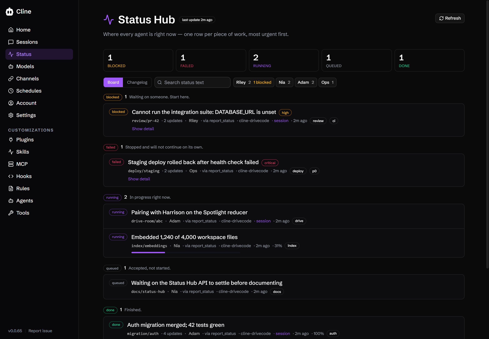
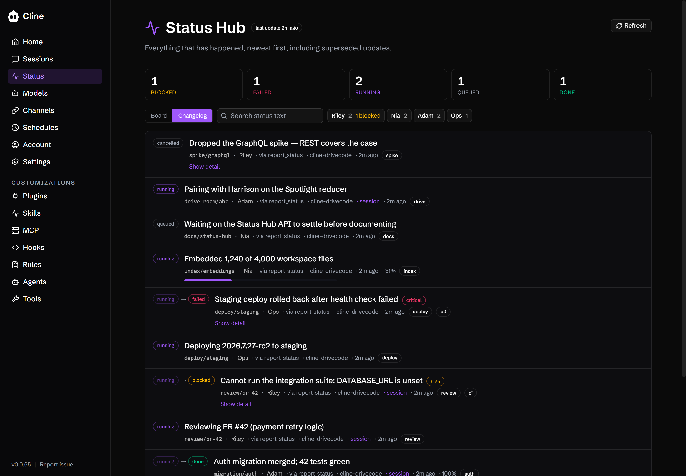
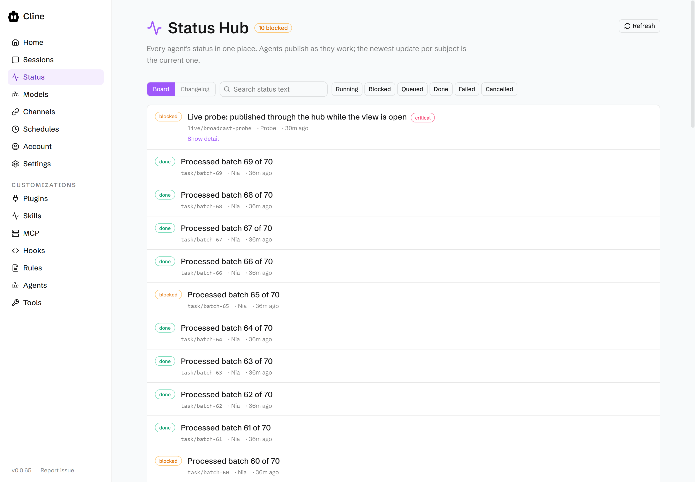
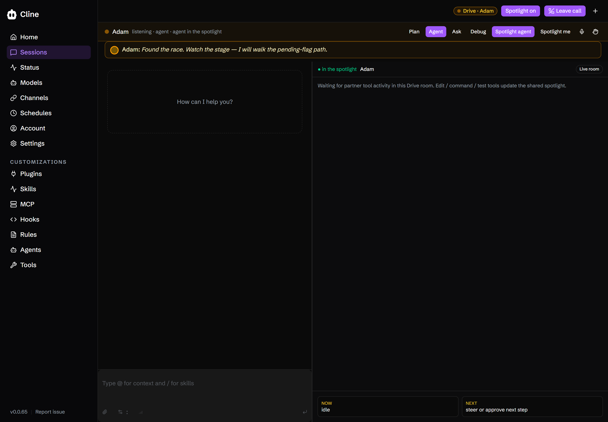
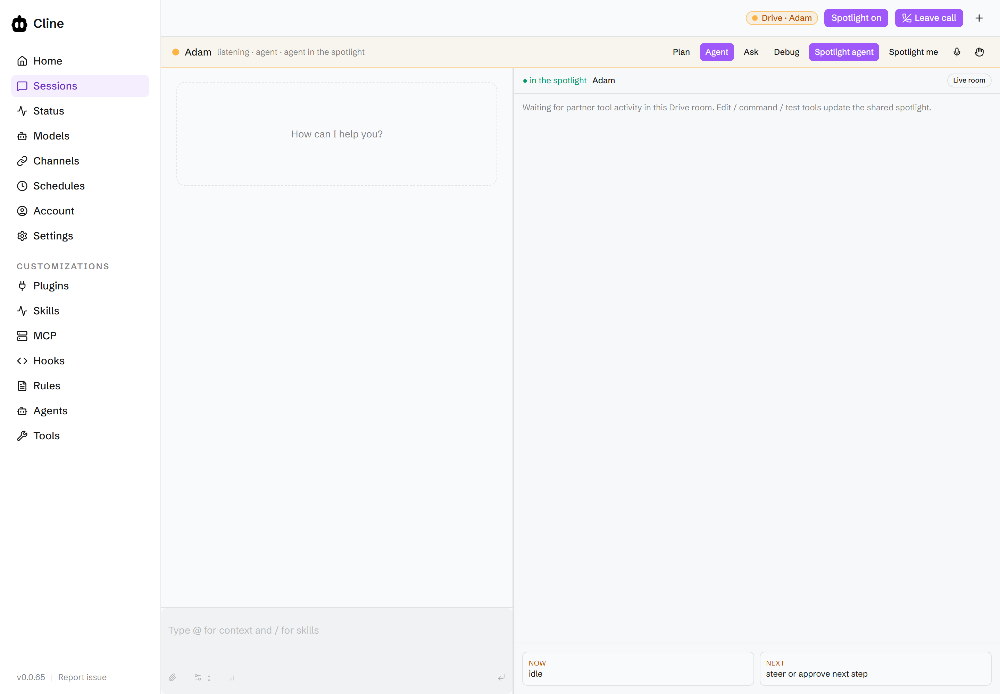
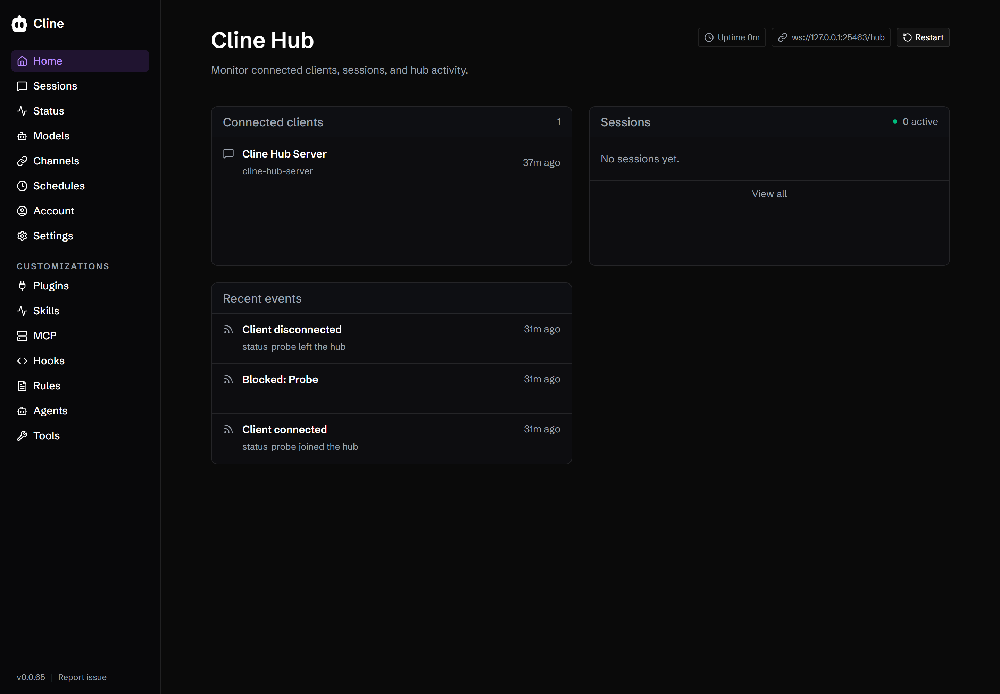
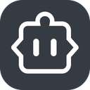

# cline-drivecode

A fork of [Cline](https://github.com/cline/cline). Everything upstream Cline does
still works and is documented [below](#cline-upstream). This section covers only
what the fork adds.

The fork exists to answer two questions upstream leaves open once more than one
agent is running: **what is every agent doing right now**, and **what does it look
like to sit on a call with one while it works**. The first is the Status Hub. The
second is Drive Mode.

`cline-drivecode` is the repo name. **Drive** is the product; **drive coding** is
the practice it names, the way "vibe coding" names one.

## What's different from upstream Cline

| Feature | Upstream Cline | cline-drivecode adds |
|---|---|---|
| **Drive Mode** | No call surface. One human, one agent, a chat transcript. | A hub-owned call room. Human and one or more agents are `participants[]` with a shared roster, a Spotlight, and an address set. Entered from Chat → **Join call**. |
| **Spotlight** | None. Tool output is inline transcript text. | A shared surface every participant sees: agent work cards (edit / command / test / plan / decision) or a human pin. Bidirectional — `sharer: human \| agent`. |
| **Agent status** | Transient hub events (`run.heartbeat`, `team.progress`) broadcast over WebSocket and never persisted. Nothing to query; a client that was offline cannot recover them. | **Status Hub** — a durable, SQLite-backed, append-only changelog for every agent, queryable by subject, state, agent, and free text, with a monotonic `seq` cursor so a reconnecting client fetches exactly what it missed. |
| **Reporting status** | No tool. Status is whatever the agent happens to say in the transcript. | `report_status`, a default-on tool. Priority decides who gets interrupted: `high` / `critical` raise `ui.notify`; everything else is found on demand. |
| **Hub dashboard theme** | Default shadcn tokens. | Cline brand palette applied across the webview in light and dark. |

Deeper reference, including the full status schema and the hub op list:
[docs/drivecode/README.md](docs/drivecode/README.md).

## Status Hub

A changelog for every agent. Humans want status often; agents should volunteer it
rather than being asked. Most updates land quietly in the Hub where they are found
on demand and where *other agents* read them to understand project state. Only
genuinely urgent updates interrupt the human.



Two genuinely different lenses over one log:

- **Board** (above) — "where is everything, and what needs me?" One row per
  subject, grouped under state headings in **attention order** (blocked, then
  failed, then running, then the rest) rather than by recency. Stat tiles and
  per-agent chips come from a server-side aggregate over every live row, not
  from the rows on screen — a board that says "3 blocked" when 40 are blocked is
  worse than no board.
- **Changelog** (below) — "what happened?" Flat and chronological, including
  superseded rows, and showing state transitions (`running → blocked`) rather
  than a bare current state.



Both page server-side with a keyset cursor, so opening the view never
materializes the whole log.



Every row carries a provenance line — subject, how many updates that subject
has, the agent, the publisher it came through, workspace, a link to the
originating session, and relative time with the absolute instant on hover. A
`running` item with no update in 30 minutes is flagged **stale**.

**How it works**

- **Storage.** `~/.cline/db/status.db` — its own SQLite file, separate from
  `sessions.db` and `cron.db`, so a hot append path does not contend on session
  storage. Override with `CLINE_STATUS_DB_PATH`.
- **Append-only, one current row per subject.** History is never mutated except
  to stamp `superseded_at`. A partial unique index makes "two current rows for one
  subject" unrepresentable rather than something the service has to police.
- **`subject` is free-form**, `/`-delimited by convention (`drive-room/abc`,
  `migration/auth/step-3`), so prefix queries work. Session, agent, and workspace
  are attribution columns, not the key — work that spans sessions, or that is not
  a Cline session at all, still gets a subject.
- **Keyset pagination.** `cursor` is the `seq` of the last row you have;
  `direction` is `older` or `newer`. Not `OFFSET` — offset paging rescans skipped
  rows, so deep pages of a long changelog get slower the further you scroll.
  Default page 50, hard cap 200.
- **`seq` is a monotonic cursor, not a timestamp.** A consumer that disconnects
  resumes with `since: seq` and gets exactly what it missed, with no clock skew
  and no duplicate delivery.
- **Priority routes attention.** Every update carries `low | normal | high |
  critical`, defaulting to `normal`. `high` and `critical` additionally raise
  `ui.notify` from the hub, which is how a status reaches the human directly.
  Everything else is found rather than pushed. The tool description tells the
  model explicitly that over-using the loud levels makes the signal worthless.
- **Search** is indexed `LIKE` over `headline` and `detail` everywhere, upgraded
  to FTS5 `MATCH` where the runtime has it. `bun:sqlite` has FTS5; `node:sqlite`
  on Node 22 does not, so the published SDK consumer on Node gets `LIKE`-grade
  search. No API returns an FTS5-only construct.
- **Retention is explicit.** `prune({ before, keepPerSubject })` exists from day
  one and the default is keep-everything. No silent deletion.

**The `report_status` tool.** Agents publish through a normal tool, not a side
channel, so status flows through the usual model → tool → hub path and appears in
the transcript. Input is `subject`, `state`
(`queued | running | blocked | done | failed | cancelled`), `headline`, and
optional `detail`, `priority`, `progress`. Attribution is filled from the tool
context, never from model output — an agent cannot file a status as some other
agent. A failed publish returns a tool-level message rather than throwing:
reporting on work must never break the work.

Design: [ARD-0005](docs/plans/cline-drivemode/ard/ARD-0005-status-hub.md).
Implementation: [`sdk/packages/shared/src/status/`](sdk/packages/shared/src/status/),
[`sdk/packages/core/src/status/`](sdk/packages/core/src/status/),
[`status-view.tsx`](apps/cline-hub/src/webview/src/components/views/status-view.tsx).

## Drive Mode

A call room where a human and one or more agents pair-program. You **drive-code**
when you steer an agent that is doing the work in front of you, in real time —
narrating, sharing, and interrupting rather than prompting and waiting.



The hub daemon on `ws://127.0.0.1:25463` is the single writer of room state —
roster, Spotlight sharer, pin, cards, mute flags, sub-mode, address set. Clients
hold read-only projections and mutate only through hub ops (`call_join`,
`call_leave`, `call_mute`, `call_set_stage`, `call_set_mode`, `call_record_work`,
`call_get_room`), receiving `room.snapshot` and `room.event` back. One writer
means no lock and no CRDT anywhere in the room.



### Spotlight

The shared surface showing who is currently sharing. It is a projection over
typed events, not a video feed:

- **Agent share** — work cards derived last-event-wins from session events, each
  categorized `edit | command | test | plan | decision | other`. Completed agent
  tools bridge to `call_record_work`, and the new snapshot fans out to every
  participant.
- **Human share** — a structured pin: a **selection**, a **file**, or **terminal**
  output. That is the whole of human share.

> **Naming.** The UI says **Spotlight**. The hub wire protocol still says
> `stage` — `StageState`, `call_set_stage`, `roomSnapshot.stage`. The split is
> deliberate: renaming the wire is a breaking change across `@cline/shared`, the
> hub handlers, and every client. Surfaces render "Spotlight"; the protocol says
> `stage`.

### Honest limits

- **Rooms are in-memory only.** A hub restart ends the room; there is no room
  persistence. A client reconnecting to a dead room gets `room_not_found` and the
  Drive UI clears with "Room ended. Join again."
- **WebRTC and pixel screen share are not implemented.** Structured events are
  the deliberate design, not a stopgap: cheaper, searchable, privacy-clean, and
  honest about what an agent actually does. Human share stays a structured pin.
- **The Drive tab is not a hub route yet.** The planned sidebar IA of channels and
  call rooms exists as a wireframe prototype. The shipped entry point is Chat →
  **Join call**.

Plans: [docs/plans/cline-drivemode/](docs/plans/cline-drivemode/) —
[vision](docs/plans/cline-drivemode/00-vision.md),
[architecture](docs/plans/cline-drivemode/01-architecture.md).
Runbook: [DEMO.md](docs/design/drive-wireframes/DEMO.md).

## Cline brand theme

The hub webview ships the Cline brand palette — purple `#9f58fa`, the 9px corner
radius, Schibsted Grotesk — as CSS custom properties in light and dark, wired
through the shadcn token layer rather than sprinkled at call sites.



Tokens live in [`apps/cline-hub/src/webview/src/index.css`](apps/cline-hub/src/webview/src/index.css).

## Quickstart

Bun only. No npm, yarn, or pnpm in this repo.

```bash
bun install
bun run build:sdk                    # required first — Vite cannot resolve @cline/shared without it
bun run --cwd apps/cline-hub dev
```

The dashboard listens on <http://127.0.0.1:8787> and the Vite webview dev server
on <http://127.0.0.1:5173>. Open the dashboard URL, not the Vite one. Ports are
overridable with `CLINE_HUB_DASHBOARD_PORT` and `CLINE_HUB_WEBVIEW_DEV_PORT`.

Then, in the dashboard:

- **Drive Mode** — Connect → **Chat** → **Join call**. This seats you and a
  partner, opens the Spotlight, and passes the session id to `call_join`. Use
  **Spotlight me** to pin a selection, file, or terminal output; **Spotlight
  agent** clears the pin and returns the agent cards.
- **Status Hub** — the **Status** item in the left nav. Toggle Board vs
  Changelog, filter by state, search the text, and Load more to page.

To start a brand-new session the dashboard needs a provider and model. It copies
them from the most recent session on the hub; if there are none, set
`CLINE_PROVIDER` and `CLINE_MODEL` before running. More hub options are in
[`apps/cline-hub/README.md`](apps/cline-hub/README.md).

---

# Cline (upstream)

Everything below is the upstream Cline README, unchanged.

<p align="center">
  
</p>

<h1 align="center">Cline</h1>

<p align="center">
The open source coding agent in your IDE and terminal.
</p>

<div align="center">

<div align="center">
<table>
<tbody>
<td align="center">
<a href="https://docs.cline.bot" target="_blank"><strong>Docs</strong></a>
</td>
<td align="center">
<a href="https://discord.gg/cline" target="_blank"><strong>Discord</strong></a>
</td>
<td align="center">
<a href="https://www.reddit.com/r/cline/" target="_blank"><strong>r/cline</strong></a>
</td>
<td align="center">
<a href="https://github.com/cline/cline/discussions/categories/feature-requests?discussions_q=is%3Aopen+category%3A%22Feature+Requests%22+sort%3Atop" target="_blank"><strong>Feature Requests</strong></a>
</td>
<td align="center">
<a href="https://cline.bot/join-us" target="_blank"><strong>Join us!</strong></a>
</td>
</tbody>
</table>
</div>

</div>

<br>

<div align="center">
<table>
<tr>
<td align="center" width="50%">

### CLI

Run Cline in your terminal.
Interactive chat or fully headless
for CI/CD and scripting.

```
npm i -g cline
```

<a href="./apps/cli/README.md">Learn more</a>
<br><br>

</td>
<td align="center" width="50%">

### Kanban

Run many agents in parallel from a
web-based task board. Each card gets its own
worktree, auto-commit, and dependency chains.

```
npm i -g kanban
```

<a href="https://github.com/cline/kanban">Learn more</a>
<br><br>

</td>
</tr>
<tr>
<td align="center" width="50%">

### VS Code Extension

AI coding assistant in your editor.
Create files, run commands, browse the web,
and use tools with human-in-the-loop approval.

<a href="https://marketplace.visualstudio.com/items?itemName=saoudrizwan.claude-dev">Install from VS Marketplace</a>
<br><br>

</td>
<td align="center" width="50%">

### JetBrains Plugin

The same Cline experience in IntelliJ IDEA,
PyCharm, WebStorm, GoLand, and the rest of
the JetBrains family.

<a href="https://plugins.jetbrains.com/plugin/28247-cline">Install from JetBrains Marketplace</a>
<br><br>

</td>
</tr>
</table>
</div>

<div align="center">
<table>
<tr>
<td align="center">

### SDK

Build your own AI agents and integrations powered by the same engine that runs the CLI, Kanban, VS Code extension, and JetBrains plugin. Custom tools, multi-agent teams, connectors, scheduled automations, and more.

```
npm install @cline/sdk
```

<a href="https://docs.cline.bot/cline-sdk/overview">Documentation</a>
<br><br>

</td>
</tr>
</table>
</div>

---

## Index

| Product | Description | Location | CHANGELOG |
|---------|------------|--------------|--------------|
| **SDK** | Node.js programmatic agent API and extension exports. | [`sdk/`](https://github.com/cline/cline/tree/main/sdk) | [CHANGELOG.md](https://github.com/cline/cline/blob/main/sdk/CHANGELOG.md) |
| **CLI** | Terminal UI, headless mode, shell commands, and CLI-specific flows. | [`apps/cli/`](https://github.com/cline/cline/tree/main/apps/cli) | [CHANGELOG.md](https://github.com/cline/cline/blob/main/apps/cli/CHANGELOG.md) |
| **VS Code Extension** | The Marketplace extension and extension host integration. | [`/`](https://github.com/cline/cline/tree/main) (WIP migrating) | [CHANGELOG.md](https://github.com/cline/cline/blob/main/CHANGELOG.md) |
| **JetBrains Plugin** | JetBrains-hosted client that talks to the shared agent core. | Currently we are not open-sourcing JetBrains plugins | - |
| **Kanban** | Web-based multi-agent task board. | [`cline/kanban`](https://github.com/cline/kanban) | [CHANGELOG.md](https://github.com/cline/kanban/blob/main/CHANGELOG.md) |
| **Docs site** | Public documentation pages. | [`docs/`](https://docs.cline.bot/) | - |

## Edits Code Across Your Project

Cline reads your project structure, understands the relationships between files, and makes coordinated changes across your codebase. It monitors linter and compiler errors as it works, fixing issues like missing imports, type mismatches, and syntax errors before you even see them. In VS Code and JetBrains, every edit shows up as a diff you can review, modify, or revert. All changes are tracked with checkpoints, so you can easily undo the agent's work.

## Runs Bash Commands

Cline executes commands directly in your terminal and watches the output in real time. Install packages, run build scripts, execute tests, deploy applications, manage databases. For long-running processes like dev servers, Cline continues working in the background and reacts to new output as it appears, catching compile errors, test failures, and server crashes as they happen.

## Plan and Act

Toggle between Plan mode and Act mode. In Plan mode, Cline explores your codebase, asks clarifying questions, and lays out a strategy. Once you're aligned, switch to Act mode and Cline executes the plan. Every file edit and terminal command requires your approval, so you stay in control of what actually changes. Or toggle auto-approve and let Cline run autonomously.

## Rules and Skills

Define project-specific rules in `.clinerules` files that guide how Cline works in your codebase: coding standards, architecture conventions, deployment procedures, testing requirements. Rules are picked up automatically by the CLI, VS Code extension, and JetBrains plugin. Use skills to let the model load specific rules when needed.

## Works With Every Model

Cline is not locked to a single AI provider. Use whichever model fits your workflow:

| Provider | Models |
|----------|--------|
| Anthropic | Claude Opus, Sonnet, Haiku |
| OpenAI | GPT series models |
| Google | Gemini series models |
| OpenRouter | 200+ models from any provider |
| Vercel AI Gateway | Route to many providers through one gateway |
| AWS Bedrock | Claude, Llama, and more |
| Azure / GCP Vertex | All hosted models |
| Cerebras / Groq | Fast inference models |
| Ollama / LM Studio | Run local models on your machine |
| Any OpenAI-compatible API | Self-hosted or third-party endpoints |

## Extend With Plugins or MCP Servers

Extend Cline's capabilities with plugins. Using the SDK, register tools and lifecycle hooks programmatically through the plugin system for logging, auditing, policy enforcement, or adding domain-specific capabilities. Simple plugin example below.

```typescript
import { Agent, createTool } from "@cline/sdk"

const deployTool = createTool({
  name: "deploy",
  description: "Deploy the current branch to staging.",
  inputSchema: { type: "object", properties: { env: { type: "string" } }, required: ["env"] },
  execute: async (input) => {
    // your deployment logic
  },
})

const agent = new Agent({ tools: [deployTool], /* ... */ })
```
...or use [MCP servers](https://github.com/modelcontextprotocol) to connect to databases, query APIs, manage cloud infrastructure, and interact with external systems. Use [community-built servers](https://github.com/modelcontextprotocol/servers) or ask Cline to create custom tools on the fly. In the CLI, manage servers with `cline mcp`.

## Multi-Agent Teams

Coordinate multiple agents working together on complex tasks. A coordinator agent breaks the work into subtasks and delegates to specialist agents, each with their own tools and context. Team state persists across sessions so you can pick up where you left off.

```bash
cline --team-name auth-sprint "Plan and implement user authentication with tests"
```

## Scheduled Agents

Run agents on cron schedules for recurring automations. Daily PR summaries, weekly dependency checks, codebase health reports. Schedules persist across restarts and run independently of any terminal session.

```bash
cline schedule create "PR summary" \
  --cron "0 9 * * MON-FRI" \
  --prompt "List all open PRs and their review status" \
  --workspace /path/to/repo
```

## Connect to Slack, Telegram, Discord, and More

Chat with your agent from any messaging platform: Telegram, Slack, Discord, Google Chat, WhatsApp, and Linear. Each conversation thread maps to an agent session with full context. Set up access control to restrict who can interact with your agent.

```bash
# Connect to Telegram
cline connect telegram -k $BOT_TOKEN
# Connect to Slack through webhook
cline connect slack --bot-token $SLACK_TOKEN --signing-secret $SECRET --base-url $URL
# Connect to Slack using socket mode
cline connect slack --bot-token $SLACK_TOKEN --app-token $SLACK_APP_TOKEN
```

## Headless CLI for CI/CD

Run Cline with zero interaction for scripting and automation. Pipe input, get JSON output, chain commands, integrate into CI/CD pipelines.

```bash
cline "Run tests and fix any failures"
git diff origin/main | cline  "Review these changes for issues"
cline --json "List all TODO comments" | jq -r 'select(.type == "agent_event" and .event.text) | .event.text'
```

## Contributing

Start with the [Contributing Guide](CONTRIBUTING.md). Join our [Discord](https://discord.gg/cline) and head to the `#contributors` channel to connect with other contributors. Check our [careers page](https://cline.bot/join-us) for full-time roles.

## License

[Apache 2.0 © 2026 Cline Bot Inc.](./LICENSE)
