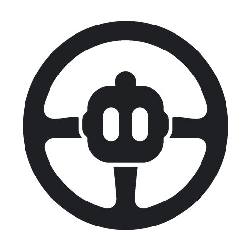
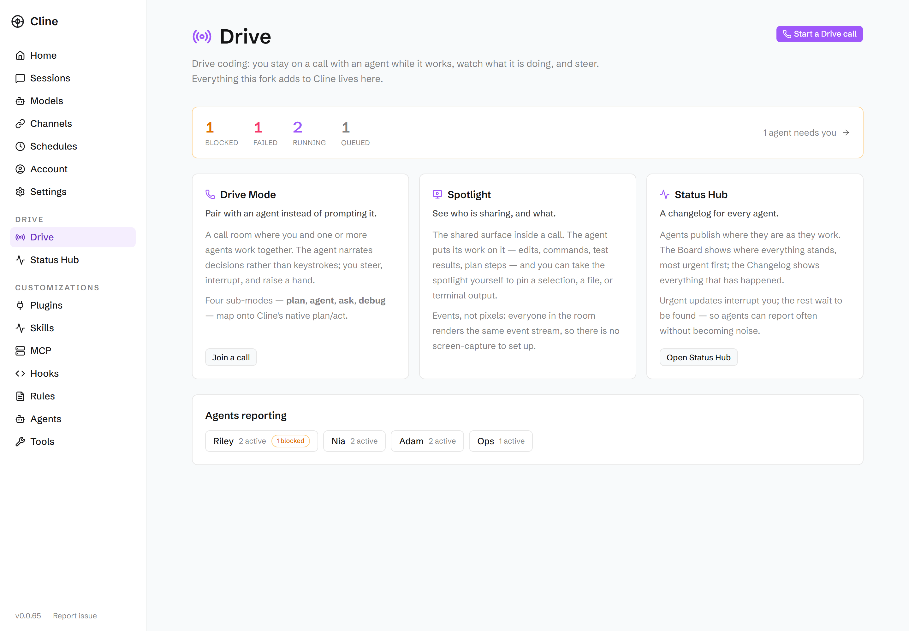
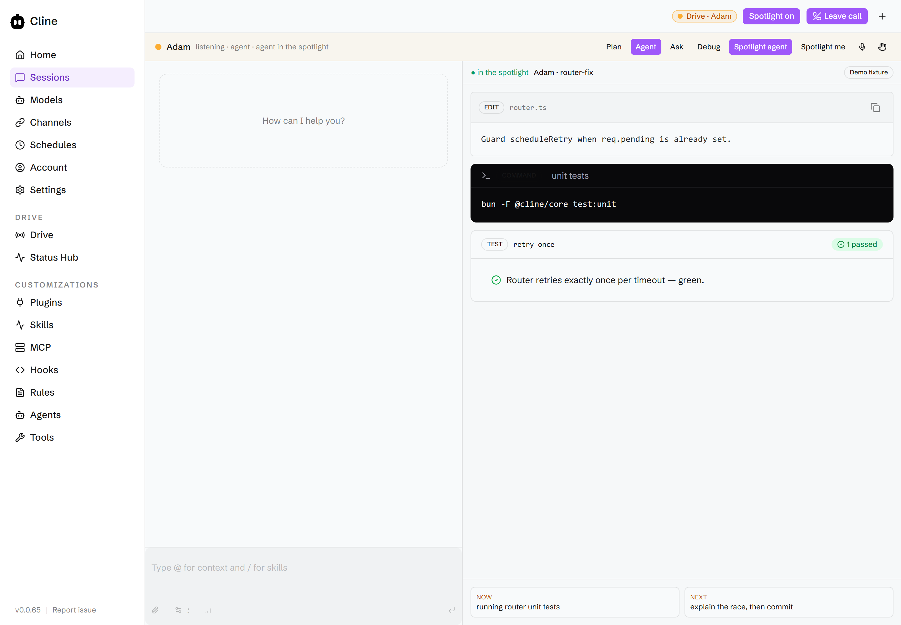
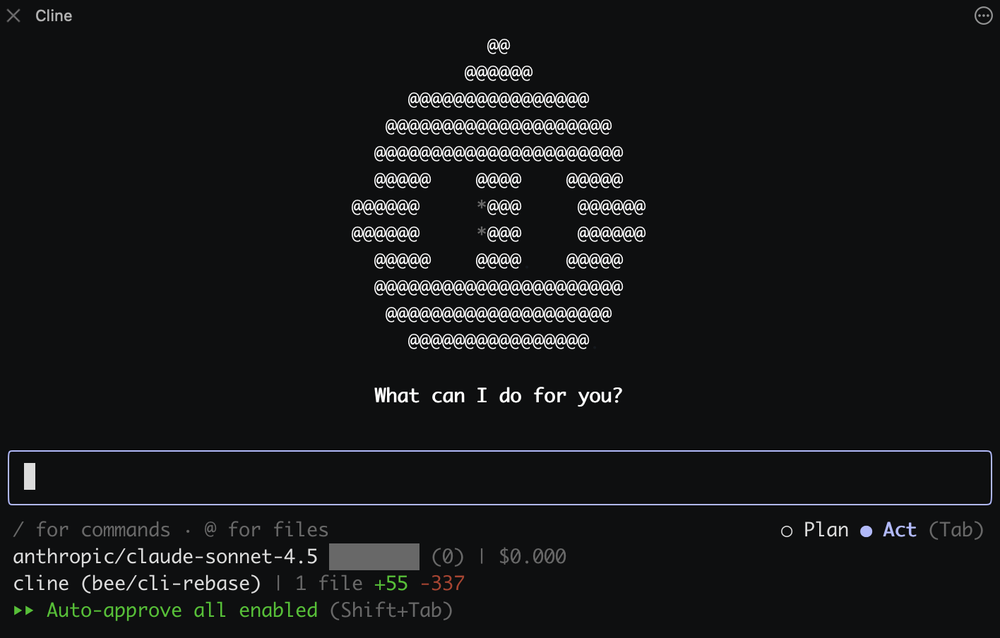
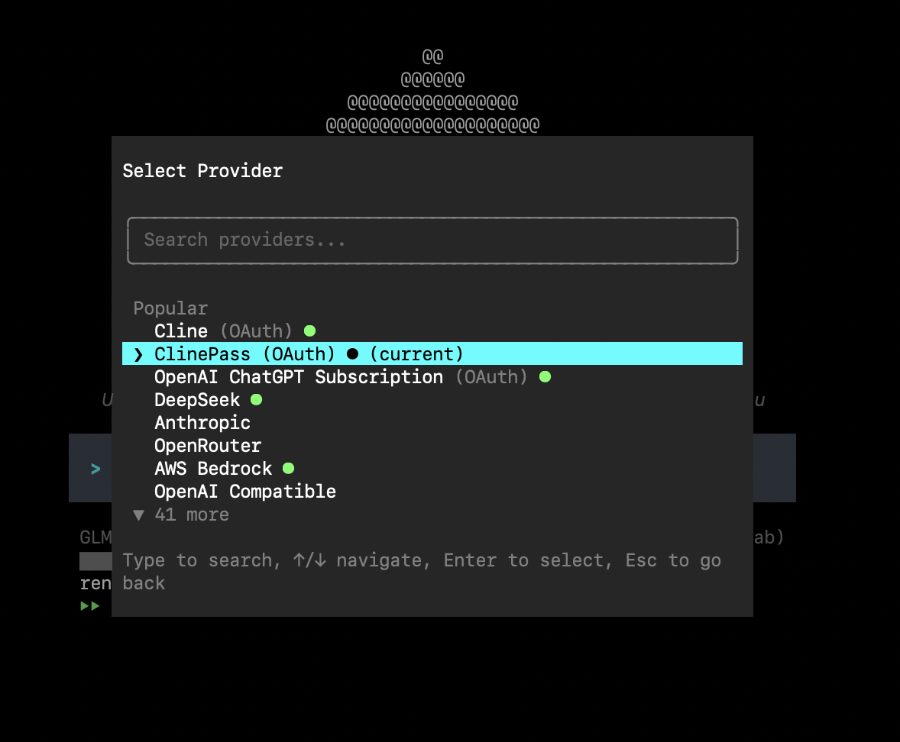
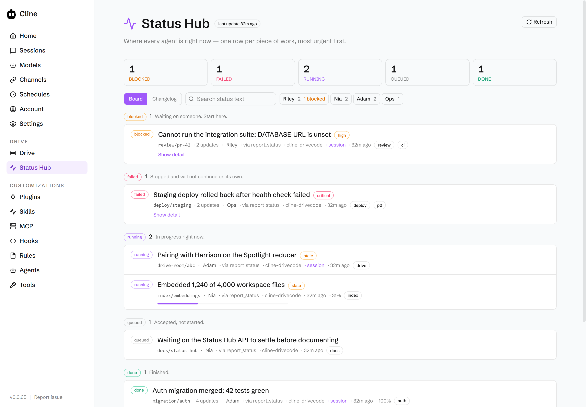
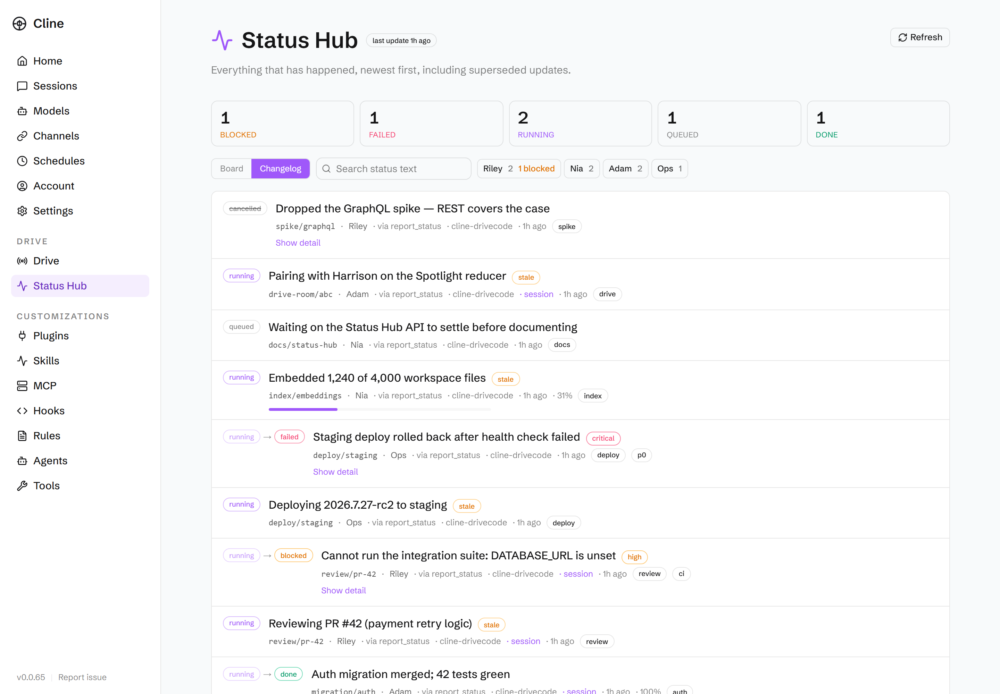

<p align="center">
  <picture>
    <source media="(prefers-color-scheme: dark)" srcset="docs/assets/drivecode/logo-dark.png">
    
  </picture>
</p>

<h1 align="center">Drive</h1>

<p align="center">
Stay on a call with your agents. See what they are doing. Steer.
</p>

<p align="center">
<em>Drive coding</em> — built on <a href="#cline-upstream">Cline</a>.
</p>

---

Prompting an agent is a turn-based conversation: you ask, you wait, you read a
wall of output, you ask again. That works for one agent doing one thing. It
stops working the moment an agent is doing something long, or several agents are
doing several things, because the two questions you actually care about —
**what is it doing right now** and **is anything stuck** — have no answer.

Drive answers both. You join a call with an agent and watch its work land on a
shared surface as it happens. Agents publish where they are to a durable log you
can read at any time, from any surface, including after the fact.

Everything Drive adds lives under one **Drive** tab in the hub, so it is never
scattered across the app.



> Hub screenshots are light theme. The hub ships light and dark and follows your
> theme choice. TUI screenshots below are the dark terminal surface.

## Contents

- [Drive Mode](#drive-mode) — pair with an agent on a call
- [CLI (TUI)](#cli-tui) — the same agent core in your terminal
- [Spotlight](#spotlight) — the shared surface inside a call
- [Status Hub](#status-hub) — a changelog for every agent
- [`report_status`](#the-report_status-tool) — how agents publish
- [Quickstart](#quickstart)
- [How it fits together](#how-it-fits-together)
- [Cline (upstream)](#cline-upstream) — everything the base product does

---

## Drive Mode

**Pair with an agent instead of prompting it.**

A Drive call is a room. You are in it, and so is at least one agent. The agent
narrates decisions rather than keystrokes — what it is about to try and why —
and you steer without waiting for a turn to end. Raise a hand to interrupt, mute
or deafen the partner, or take over the shared surface yourself.



Four sub-modes shape how the agent behaves. They map onto Cline's native
plan/act, so nothing about the underlying agent changes:

| Sub-mode | The agent… | Native mode |
|---|---|---|
| **Plan** | thinks out loud before touching anything | `plan` |
| **Agent** | does the work, narrating as it goes | `act` |
| **Ask** | answers questions without editing | `plan` |
| **Debug** | investigates a specific failure | `act` |

Rooms are owned by the hub, which is the single writer for room state — roster,
who holds the Spotlight, mute flags, sub-mode. Every client renders a projection
of that state rather than keeping its own copy, so two people looking at the same
room always see the same thing.

**Drive Settings** (in the call chrome) pick a runtime profile —
`local` / `cloud` / `hybrid` — and BYOK speech providers for STT and TTS. The
hub resolves a legal topology from those choices so voice input and narration
stay compatible with how the LLM is reached. Bring your own keys; nothing
Drive-specific is locked to a single vendor.

**Today:** rooms are in-memory, so restarting the hub ends the room. There is no
WebRTC or pixel capture — human sharing is a structured pin (see below), which is
what makes the Spotlight work as a plain event stream.

## CLI (TUI)

**The same agent core, in the terminal.**

Drive's hub is the call UI. The CLI is still first-class for everyday agent
work: interactive OpenTUI chat, plan/act toggle, slash commands, file mentions,
live tool approvals, and headless one-shots for scripts and CI. It auto-spawns
the hub daemon, so you are not managing a second process.





```bash
bun run cli -i                                    # interactive TUI
bun run cli -P anthropic -m claude-sonnet-4-5 "…" # one-shot
bun run cli doctor                                # local health
```

Configure providers with `cline auth` or env vars (`ANTHROPIC_API_KEY`,
`CLINE_API_KEY`, `OPENROUTER_API_KEY`, …). Full CLI docs:
[apps/cli/README.md](apps/cli/README.md).

## Spotlight

**See who is sharing, and what.**

The Spotlight is the shared surface inside a call. It always names who holds it.

When the **agent** holds it, its work streams onto the surface as cards — file
edits, commands and their output, test results, plan steps, decisions. You are
watching the work, not reading a transcript of it afterwards.

When **you** hold it, you pin something concrete for the agent to look at:

| Pin | What you share |
|---|---|
| **Selection** | a block of code, pasted as text |
| **File** | a path in the workspace |
| **Terminal** | command output |

Handing the Spotlight back and forth is one control: **Spotlight agent** /
**Spotlight me**. While you hold it, the agent's card deck dims rather than
disappearing, so nothing is lost.

The Spotlight is derived entirely from a versioned event stream — last event
wins. There is no screen capture to configure and no second connection to
babysit; a client that joins late replays the room snapshot and catches up.

> The hub wire protocol still calls this surface `stage` (`StageState`,
> `call_set_stage`). Renaming it is a breaking change across every client, so
> the UI name and the protocol name differ for now.

## Status Hub

**A changelog for every agent.**

Humans want status often. Agents should volunteer it rather than be asked. Most
updates land quietly in the Hub, where they are found on demand — and where
*other agents* read them to understand the state of the project. Only genuinely
urgent updates interrupt you.

Three lenses over the same status surface.

### Board — "where is everything, and what needs me?"

One row per piece of work, grouped by state in **attention order**: blocked
first, then failed, then running. The counts at the top are computed across every
live row, not across the rows on screen — a board that says "3 blocked" when 40
are blocked is worse than no board. Narrow the board with a filter and the
headings switch to counting what you are actually looking at, so they can never
contradict the rows beneath them.



### Changelog — "what happened?"

Flat and chronological, including superseded updates, showing transitions
(`running → blocked`) rather than a bare current state.



Every row answers what the work is, who did it, how it got there, and when:
subject, how many updates that subject has, the agent, the publisher it came
through, the workspace, a link to the originating session, and relative time with
the exact instant on hover. A `running` item that has not moved in 30 minutes is
flagged **stale**, which is usually the thing worth noticing.

### Dependency map — "what blocks what?"

The third lens is the **team task graph**, not another view of `status.db`. It
loads active multi-agent team tasks from the hub (`status.tasks_snapshot`), lays
them out by dependency layer, and flags cycles or missing references. Select a
task to see what blocks it and what it unblocks. The map stays empty until a
team session with tasks is live.

### How it works

- **Storage.** `~/.cline/db/status.db` — its own SQLite file, separate from
  `sessions.db` and `cron.db`, so a hot append path never contends with session
  storage. Override with `CLINE_STATUS_DB_PATH`.
- **Append-only, one current row per subject.** History is never rewritten,
  only stamped as superseded. A partial unique index makes "two current rows for
  one subject" impossible to represent, rather than something the code has to
  police.
- **Subjects are free-form**, `/`-delimited by convention — `drive-room/abc`,
  `migration/auth`, `review/pr-42` — so prefix queries work. Session, agent, and
  workspace are attribution, not identity: work that spans sessions, or that is
  not a Cline session at all, still gets a subject.
- **Keyset pagination.** A cursor is the sequence number of the last row you
  hold, never an offset. Offset paging rescans everything it skips, so deep
  scrolls of a long changelog get slower the further you go; this stays flat.
  On the Board, where rows are ordered by attention rather than by sequence,
  the cursor spans both — so **Load more** walks into the next attention band
  instead of stopping at the end of the current one.
- **`seq` is a monotonic cursor, not a clock.** A client that disconnects
  resumes with `since: seq` and gets exactly what it missed — no skew, no
  duplicates, no gaps it cannot detect.
- **Search** is indexed `LIKE` everywhere, upgraded to SQLite FTS5 where the
  runtime provides it. Bun ships FTS5; Node 22's built-in SQLite does not, so
  search degrades rather than failing.
- **Retention is explicit.** Pruning takes a cutoff or a per-subject keep count,
  the default is keep-everything, and a current row is never pruned.

## The `report_status` tool

Agents publish through an ordinary tool, so status flows through the normal
model → tool → hub path and shows up in the transcript like any other action.
It is on by default.

```jsonc
{
  "subject": "migration/auth",     // stable key; reuse it for the whole timeline
  "state": "blocked",              // queued | running | blocked | done | failed | cancelled
  "headline": "Cannot run the integration suite: DATABASE_URL is unset",
  "detail": "Tried .env.test and the CI defaults. I need a test database URL.",
  "priority": "high",              // low | normal | high | critical
  "progress": 0.4                  // optional, 0..1
}
```

**Priority decides who gets interrupted.** `high` and `critical` raise a
notification; everything else waits in the Hub to be found. That split is what
lets agents report often without becoming noise, and the tool description tells
the model plainly that over-using the loud levels makes the signal worthless.

**Attribution is not up to the model.** Session, agent, and workspace are filled
from the tool context, so an agent cannot file a status as another agent. A
failed publish returns a message rather than throwing — reporting on work must
never break the work.

Agents also get guidance on *when* to report unprompted: on starting a distinct
piece of work, on finishing it, the moment they are blocked, and at real
milestones — not after every tool call.

## Quickstart

Requires [Bun](https://bun.sh) 1.3+ and Node 22+.

```bash
bun install
bun run build:sdk          # required first — packages resolve each other through dist/
```

**Hub (Drive tab, Spotlight, Status Hub)**

```bash
bun run --cwd apps/cline-hub dev
```

Open **http://127.0.0.1:8787** and click **Connect**.

- **Drive** in the sidebar is the home for everything above.
- **Start a Drive call** opens a room with an agent.
- **Status Hub** is the Board, Changelog, and Dependency map.
- In a call, **Drive Settings** chooses local/cloud/hybrid plus STT/TTS providers.

Ports are configurable when 8787 or 5173 are taken:

```bash
CLINE_HUB_DASHBOARD_PORT=8791 CLINE_HUB_WEBVIEW_DEV_PORT=5175 bun run --cwd apps/cline-hub dev
```

**CLI (TUI)**

```bash
bun run cli -i
```

The interactive TUI auto-spawns the hub daemon. Use `bun run cli doctor` if
something looks unhealthy.

## How it fits together

```
 Browser (Drive tab · Spotlight · Status Hub · Drive Settings)
        │  WebSocket
 Cline Hub dashboard
        │  hub ops: call_* · status.* · drive.*
 CLI TUI  ── same hub daemon, same agent core ── bun run cli -i
        │
 Hub daemon  ── single writer for room state ── ws://127.0.0.1:25463
        │
 ├── @cline/drive     Drive kernel: sub-modes, narration, topology, BYOK
 ├── @cline/core      sessions, tools, status.db, cron.db, hub
 ├── @cline/llms      providers (AI SDK 7 / LanguageModelV4)
 └── @cline/shared    schemas: room + status + topology events
```

The hub is the only writer for shared state. Clients publish facts and render
projections; they never hold an authoritative copy. Everything above is built on
the [Cline SDK](https://docs.cline.bot/sdk/overview) — the same packages this
repo publishes — rather than beside it.

**Reference**

- [docs/drivecode/README.md](docs/drivecode/README.md) — status schema, hub op
  list, query options, room model
- [docs/drivecode/architecture.md](docs/drivecode/architecture.md) — diagram-first
  Status Hub / Drive protocol planes
- [docs/drivecode/skills-inventory.md](docs/drivecode/skills-inventory.md) —
  in-repo skills vs candidates for `cline/skills`
- [ARD-0005](docs/plans/cline-drivemode/ard/ARD-0005-status-hub.md) — Status Hub
  design and the alternatives rejected
- [ARD-0010](docs/plans/cline-drivemode/ard/ARD-0010-provider-harness-byok.md) —
  BYOK provider harness and runtime topology
- [docs/plans/cline-drivemode/](docs/plans/cline-drivemode/) — the full Drive
  plan set, vision through architecture
- [apps/cli/README.md](apps/cli/README.md) — CLI / TUI details

---

# Cline (upstream)

Everything below is the upstream Cline README, unchanged.

<p align="center">
  
</p>

<h1 align="center">Cline</h1>

<p align="center">
The open source coding agent in your IDE and terminal.
</p>

<div align="center">

<div align="center">
<table>
<tbody>
<td align="center">
<a href="https://docs.cline.bot" target="_blank"><strong>Docs</strong></a>
</td>
<td align="center">
<a href="https://discord.gg/cline" target="_blank"><strong>Discord</strong></a>
</td>
<td align="center">
<a href="https://www.reddit.com/r/cline/" target="_blank"><strong>r/cline</strong></a>
</td>
<td align="center">
<a href="https://github.com/cline/cline/discussions/categories/feature-requests?discussions_q=is%3Aopen+category%3A%22Feature+Requests%22+sort%3Atop" target="_blank"><strong>Feature Requests</strong></a>
</td>
<td align="center">
<a href="https://cline.bot/join-us" target="_blank"><strong>Join us!</strong></a>
</td>
</tbody>
</table>
</div>

</div>

<br>

<div align="center">
<table>
<tr>
<td align="center" width="50%">

### CLI

Run Cline in your terminal.
Interactive chat or fully headless
for CI/CD and scripting.

```
npm i -g cline
```

<a href="./apps/cli/README.md">Learn more</a>
<br><br>

</td>
<td align="center" width="50%">

### Kanban

Run many agents in parallel from a
web-based task board. Each card gets its own
worktree, auto-commit, and dependency chains.

```
npm i -g kanban
```

<a href="https://github.com/cline/kanban">Learn more</a>
<br><br>

</td>
</tr>
<tr>
<td align="center" width="50%">

### VS Code Extension

AI coding assistant in your editor.
Create files, run commands, browse the web,
and use tools with human-in-the-loop approval.

<a href="https://marketplace.visualstudio.com/items?itemName=saoudrizwan.claude-dev">Install from VS Marketplace</a>
<br><br>

</td>
<td align="center" width="50%">

### JetBrains Plugin

The same Cline experience in IntelliJ IDEA,
PyCharm, WebStorm, GoLand, and the rest of
the JetBrains family.

<a href="https://plugins.jetbrains.com/plugin/28247-cline">Install from JetBrains Marketplace</a>
<br><br>

</td>
</tr>
</table>
</div>

<div align="center">
<table>
<tr>
<td align="center">

### SDK

Build your own AI agents and integrations powered by the same engine that runs the CLI, Kanban, VS Code extension, and JetBrains plugin. Custom tools, multi-agent teams, connectors, scheduled automations, and more.

```
npm install @cline/sdk
```

<a href="https://docs.cline.bot/cline-sdk/overview">Documentation</a>
<br><br>

</td>
</tr>
</table>
</div>

---

## Index

| Product | Description | Location | CHANGELOG |
|---------|------------|--------------|--------------|
| **SDK** | Node.js programmatic agent API and extension exports. | [`sdk/`](https://github.com/cline/cline/tree/main/sdk) | [CHANGELOG.md](https://github.com/cline/cline/blob/main/sdk/CHANGELOG.md) |
| **CLI** | Terminal UI, headless mode, shell commands, and CLI-specific flows. | [`apps/cli/`](https://github.com/cline/cline/tree/main/apps/cli) | [CHANGELOG.md](https://github.com/cline/cline/blob/main/apps/cli/CHANGELOG.md) |
| **VS Code Extension** | The Marketplace extension and extension host integration. | [`/`](https://github.com/cline/cline/tree/main) (WIP migrating) | [CHANGELOG.md](https://github.com/cline/cline/blob/main/CHANGELOG.md) |
| **JetBrains Plugin** | JetBrains-hosted client that talks to the shared agent core. | Currently we are not open-sourcing JetBrains plugins | - |
| **Kanban** | Web-based multi-agent task board. | [`cline/kanban`](https://github.com/cline/kanban) | [CHANGELOG.md](https://github.com/cline/kanban/blob/main/CHANGELOG.md) |
| **Docs site** | Public documentation pages. | [`docs/`](https://docs.cline.bot/) | - |

## Edits Code Across Your Project

Cline reads your project structure, understands the relationships between files, and makes coordinated changes across your codebase. It monitors linter and compiler errors as it works, fixing issues like missing imports, type mismatches, and syntax errors before you even see them. In VS Code and JetBrains, every edit shows up as a diff you can review, modify, or revert. All changes are tracked with checkpoints, so you can easily undo the agent's work.

## Runs Bash Commands

Cline executes commands directly in your terminal and watches the output in real time. Install packages, run build scripts, execute tests, deploy applications, manage databases. For long-running processes like dev servers, Cline continues working in the background and reacts to new output as it appears, catching compile errors, test failures, and server crashes as they happen.

## Plan and Act

Toggle between Plan mode and Act mode. In Plan mode, Cline explores your codebase, asks clarifying questions, and lays out a strategy. Once you're aligned, switch to Act mode and Cline executes the plan. Every file edit and terminal command requires your approval, so you stay in control of what actually changes. Or toggle auto-approve and let Cline run autonomously.

## Rules and Skills

Define project-specific rules in `.clinerules` files that guide how Cline works in your codebase: coding standards, architecture conventions, deployment procedures, testing requirements. Rules are picked up automatically by the CLI, VS Code extension, and JetBrains plugin. Use skills to let the model load specific rules when needed.

## Works With Every Model

Cline is not locked to a single AI provider. Use whichever model fits your workflow:

| Provider | Models |
|----------|--------|
| Anthropic | Claude Opus, Sonnet, Haiku |
| OpenAI | GPT series models |
| Google | Gemini series models |
| OpenRouter | 200+ models from any provider |
| Vercel AI Gateway | Route to many providers through one gateway |
| AWS Bedrock | Claude, Llama, and more |
| Azure / GCP Vertex | All hosted models |
| Cerebras / Groq | Fast inference models |
| Ollama / LM Studio | Run local models on your machine |
| Any OpenAI-compatible API | Self-hosted or third-party endpoints |

## Extend With Plugins or MCP Servers

Extend Cline's capabilities with plugins. Using the SDK, register tools and lifecycle hooks programmatically through the plugin system for logging, auditing, policy enforcement, or adding domain-specific capabilities. Simple plugin example below.

```typescript
import { Agent, createTool } from "@cline/sdk"

const deployTool = createTool({
  name: "deploy",
  description: "Deploy the current branch to staging.",
  inputSchema: { type: "object", properties: { env: { type: "string" } }, required: ["env"] },
  execute: async (input) => {
    // your deployment logic
  },
})

const agent = new Agent({ tools: [deployTool], /* ... */ })
```
...or use [MCP servers](https://github.com/modelcontextprotocol) to connect to databases, query APIs, manage cloud infrastructure, and interact with external systems. Use [community-built servers](https://github.com/modelcontextprotocol/servers) or ask Cline to create custom tools on the fly. In the CLI, manage servers with `cline mcp`.

## Multi-Agent Teams

Coordinate multiple agents working together on complex tasks. A coordinator agent breaks the work into subtasks and delegates to specialist agents, each with their own tools and context. Team state persists across sessions so you can pick up where you left off.

```bash
cline --team-name auth-sprint "Plan and implement user authentication with tests"
```

## Scheduled Agents

Run agents on cron schedules for recurring automations. Daily PR summaries, weekly dependency checks, codebase health reports. Schedules persist across restarts and run independently of any terminal session.

```bash
cline schedule create "PR summary" \
  --cron "0 9 * * MON-FRI" \
  --prompt "List all open PRs and their review status" \
  --workspace /path/to/repo
```

## Connect to Slack, Telegram, Discord, and More

Chat with your agent from any messaging platform: Telegram, Slack, Discord, Google Chat, WhatsApp, and Linear. Each conversation thread maps to an agent session with full context. Set up access control to restrict who can interact with your agent.

```bash
# Connect to Telegram
cline connect telegram -k $BOT_TOKEN
# Connect to Slack through webhook
cline connect slack --bot-token $SLACK_TOKEN --signing-secret $SECRET --base-url $URL
# Connect to Slack using socket mode
cline connect slack --bot-token $SLACK_TOKEN --app-token $SLACK_APP_TOKEN
```

## Headless CLI for CI/CD

Run Cline with zero interaction for scripting and automation. Pipe input, get JSON output, chain commands, integrate into CI/CD pipelines.

```bash
cline "Run tests and fix any failures"
git diff origin/main | cline  "Review these changes for issues"
cline --json "List all TODO comments" | jq -r 'select(.type == "agent_event" and .event.text) | .event.text'
```

## Contributing

Start with the [Contributing Guide](CONTRIBUTING.md). Join our [Discord](https://discord.gg/cline) and head to the `#contributors` channel to connect with other contributors. Check our [careers page](https://cline.bot/join-us) for full-time roles.

## License

[Apache 2.0 © 2026 Cline Bot Inc.](./LICENSE)
