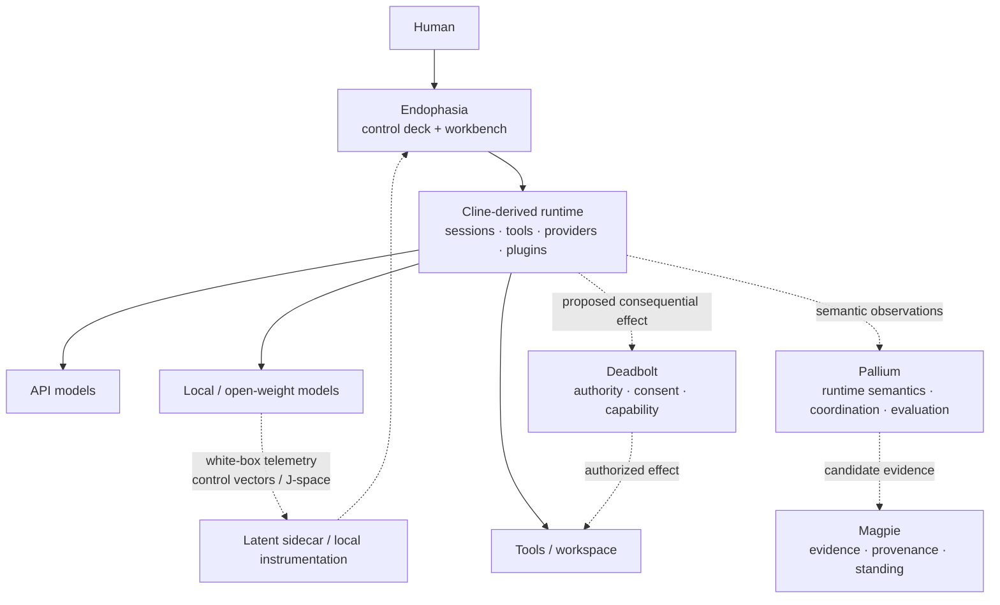

<a id="endophasia"></a>

<div align="center">

<p><sub>WORK &nbsp; / &nbsp; DREAM &nbsp; / &nbsp; OBSERVE &nbsp; / &nbsp; VERIFY</sub></p>

<h1>endophasia</h1>

<p><strong>Instrumented cognition for coding agents.</strong></p>

<p>
A Cline-derived agent workbench for making the computation around a model<br>
<strong>visible, controllable, comparable, and governable.</strong>
</p>

<p>
  <a href="#current-boundary"></a>
  <a href="https://github.com/cline/cline"></a>
  <a href="#model-access"></a>
  <a href="LICENSE"></a>
</p>

<p>
  <a href="#why-endophasia">Why</a> &nbsp; · &nbsp;
  <a href="#the-control-deck">Controls</a> &nbsp; · &nbsp;
  <a href="#work--dream">Dream</a> &nbsp; · &nbsp;
  <a href="#architecture">Architecture</a> &nbsp; · &nbsp;
  <a href="#current-boundary">Status</a> &nbsp; · &nbsp;
  <a href="#upstream">Upstream</a>
</p>

</div>

---

Most coding-agent interfaces show the prompt, the answer, and the tools.

Increasingly, the interesting part is everything in between:

```text
reasoning budget
      │
      ├── context selection
      ├── branching
      ├── tool policy
      ├── retries
      ├── verification
      ├── model-native thinking controls
      └── local latent interventions
```

**Endophasia is an attempt to turn that hidden harness into an instrument panel.**

The name is borrowed from *endophasia*: inner speech — language carried internally rather than spoken aloud.

> [!IMPORTANT]
> **Endophasia is experimental.** The repository currently begins as a clean fork of [Cline](https://github.com/cline/cline). The cognitive controls, Dream Mode, J-space instrumentation, Pallium telemetry, and governed Magpie/Deadbolt seams described below are a research direction unless explicitly marked implemented. This README is a design boundary, not a claim that the roadmap already exists in code.

<table>
<tr>
<td width="33%" valign="top">
<sub>01 / OBSERVE</sub><br><br>
<strong>Make the harness legible</strong><br><br>
Expose real session, branch, tool, verification, provider, and runtime events instead of decorating the UI with invented activity.
</td>
<td width="33%" valign="top">
<sub>02 / CONTROL</sub><br><br>
<strong>Give computation explicit knobs</strong><br><br>
Reasoning, exploration, verification, tool initiative, compute appetite, and local latent controls should resolve to inspectable runtime configuration.
</td>
<td width="33%" valign="top">
<sub>03 / GOVERN</sub><br><br>
<strong>Keep cognition separate from authority</strong><br><br>
A model may reason, branch, critique, and propose without silently acquiring epistemic standing or permission to act.
</td>
</tr>
</table>

## Why Endophasia

A modern agent is no longer just a single model call.

It is a runtime that chooses what context to expose, how much compute to spend, when to branch, when to retry, when to call tools, when to ask another model, when to compact history, and when to declare work complete.

Those decisions are consequential, but most interfaces reduce them to one or two controls such as `reasoning: high`.

Endophasia asks a different question:

> **What if the cognitive runtime itself were inspectable and steerable?**

Not as a theatrical chain-of-thought viewer. As a real systems surface.

```text
user intent
    │
    ▼
agent runtime
    │
    ├── provider reasoning
    ├── context / memory
    ├── branches / peers
    ├── tools / effects
    ├── critics / tests
    └── completion claims
    │
    ▼
observable semantic trace
```

The aim is to make the model harness feel less like a black box with a chat panel and more like a well-instrumented machine.

## The control deck

The intended interface separates controls that belong to the **provider**, the **harness**, and the **white-box model runtime**.

| Control | What it means | API models | Local / open models |
| :--- | :--- | :---: | :---: |
| **Reasoning** | Provider-native test-time reasoning effort or budget. | ✓ when exposed | ✓ |
| **Epistemic Rigour** | Named verification / evidence policy selected by the harness. | ✓ | ✓ |
| **Explore** | Breadth of materially different candidate trajectories. | ✓ | ✓ |
| **Verify** | Tests, critics, counterexample search, and independent checking budget. | ✓ | ✓ |
| **Compute Appetite** | How readily the harness spends more calls, tokens, branches, and time under uncertainty. | ✓ | ✓ |
| **Tool Initiative** | How readily the agent inspects, searches, tests, or proposes effects. | ✓ | ✓ |
| **Latent Deliberation** | Activation-level steering where the runtime permits it; otherwise a provider-level fallback. | provider-dependent | experimental |
| **J-space** | White-box latent workspace readout / intervention research. | — | experimental |

The UI may be continuous. The semantics underneath should not be vague.

```text
UI

VERIFY      ─────────────●──  HIGH
EXPLORE     ───────●────────  4
LATENT      ─────────●──────  +0.42

                  │
                  ▼

runtime configuration

verify_profile     = pallium.verify.v1/high
branch_budget      = 4
latent_vector      = reasoning-v3
latent_scale       = +0.42
apply_boundary     = next_turn
```

A slider is useful only if the system can say what moving it changed.

### Some things should not be floating-point policy

A value such as:

```text
epistemic_rigour = 0.783
```

looks precise while saying almost nothing.

Endophasia should prefer stable, versioned policy positions for semantic controls:

```text
EXPLORATORY ─ BALANCED ─ RIGOROUS ─ ADVERSARIAL
                         ▲

magpie.epistemic.rigour/v3/rigorous
```

Continuous values remain appropriate where the underlying quantity is genuinely continuous: activation scale, sampling temperature, branch budget, token budget, or control-vector strength.

## WORK / DREAM

Endophasia is intended to have two obvious cognitive postures.

<table>
<tr>
<td width="50%" valign="top">
<sub>WORK</sub><br><br>
<strong>Convergent execution</strong><br><br>
One primary trajectory. Bounded context. Conditional critique. Minimal branching. Fast deterministic checks where possible.<br><br>
Optimized for getting the task done without spending compute merely because it is available.
</td>
<td width="50%" valign="top">
<sub>DREAM</sub><br><br>
<strong>Exploratory cognition</strong><br><br>
Adaptive branches. Counterfactuals. Peer criticism. Broader retrieval. Latent experiments where available. Explicit synthesis before convergence.<br><br>
Optimized for exploring a problem before committing to one interpretation or plan.
</td>
</tr>
</table>

Dream Mode is not an autonomy bypass.

```text
more cognition ≠ more authority
more branches  ≠ more truth
more agreement ≠ more permission
```

The mode changes how the system **thinks around a task**, not what it is entitled to do.

### Dream Trace

The trace should be driven by real runtime events, not decorative animation.

```text
                         prompt
                    ┌──────┴──────┐
                    │             │
                approach A    approach B
                    │             │
                  tool          critic
                    │             │
                  test         rejected
                    │
                 verify
                    │
                    └──────┬──────┘
                           ▼
                       synthesis
```

Candidate event families include:

```text
intent.admitted
branch.created
branch.pruned
tool.proposed
tool.started
tool.finished
verification.started
verification.failed
verification.passed
synthesis.started
run.terminated
```

A dimmed branch should mean something actually happened to that branch.

## J-space

J-space is the intentionally white-box corner of the project.

For models where internal activations are available, Endophasia may experiment with a sparse, human-inspectable latent workspace and with recurrent latent reasoning interfaces.

The UI should distinguish the thing itself from its projection.

```text
high-dimensional latent state
            │
            ▼
      J-space readout
            │
            ▼
   fixed projection / view
            │
            ▼
      PROJECTED J-SPACE
```

A three-dimensional visualization is a view of the representation, not a claim that the underlying representation is three-dimensional.

For API-only models, this panel should say **unavailable** rather than fabricate an equivalent.

A separate **semantic workspace** may still visualize agent-visible concepts from retrieved context, tool results, memory, and generated text. That is useful, but it is not J-space.

## Model access

Endophasia should degrade honestly according to what the selected model exposes.

```text
                     model selected
                          │
                  capability resolver
                 /         |          \
                /          |           \
               ▼           ▼            ▼
        provider-native  harness-native  white-box
           controls        controls      controls

        reasoning effort   explore       J-space
        thinking budget    verify        control vectors
        structured tools   tool policy   layer probes
                           dream mode     activations
```

Example:

```text
API MODEL
────────────────────────────
Reasoning        HIGH
Explore          4
Verify           RIGOROUS
Dream Trace      LIVE
J-space          UNAVAILABLE
Latent Steering  PROVIDER-LEVEL ONLY

LOCAL OPEN MODEL
────────────────────────────
Reasoning        HIGH
Explore          4
Verify           RIGOROUS
Dream Trace      LIVE
J-space          AVAILABLE / EXPERIMENTAL
Latent Steering  +0.42
Layer Range      24–48
```

Unsupported capability should be visible as unsupported.

## Architecture

Endophasia starts from Cline's existing open-source agent harness, SDK, sessions, provider integrations, tools, plugins, CLI, and desktop work.

The intended Endophasia-specific layers sit **around** that runtime rather than pretending to replace all of it at once.



> [!NOTE]
> Dashed edges are intended research seams, not claims that those integrations are already present in this fork.

### The boundary matters

| Layer | Owns | Must not silently become |
| :--- | :--- | :--- |
| **Endophasia** | Human-facing cognitive controls, runtime telemetry, model capability presentation. | Epistemic authority or blanket execution permission. |
| **Cline-derived runtime** | Sessions, agent loop, tools, providers, persistence, plugins. | Root of trust merely because it runs the loop. |
| **Pallium** | Cognition, coordination, semantic runtime experiments, evaluation. | Truth or execution authority. |
| **Magpie** | Evidence, provenance, replayable history, policy-defined standing. | General agent runtime. |
| **Deadbolt** | Consequential-action authority, consent, narrow capabilities. | Memory or cognition. |
| **Local latent layer** | White-box model inspection and interventions. | Evidence that an interpretation of a latent state is true. |

A useful shorthand:

```text
Endophasia exposes.
Pallium reasons and measures.
Magpie remembers.
Deadbolt permits.
```

No line implies another.

## Design rules

Endophasia is being shaped around a few deliberately stubborn rules.

| Rule | Consequence |
| :--- | :--- |
| **Telemetry should be real.** | If the UI says a branch exists, a runtime branch should exist. |
| **A control should resolve to explicit configuration.** | Pretty sliders do not get to invent ambiguous semantics. |
| **Reasoning is not authority.** | More compute does not widen permission. |
| **Completion is a claim.** | A runtime terminal signal is not independent evidence that requested work is correct. |
| **API and local models may expose different surfaces.** | Capability-aware UI beats fake parity. |
| **White-box interpretation stays scoped.** | A latent probe is an instrument, not an oracle. |
| **Upstream stays visible.** | Endophasia should preserve attribution and make divergence from Cline easy to inspect. |

## Current boundary

### Inherited today

Endophasia currently starts from the live [Cline](https://github.com/cline/cline) codebase.

That inherited baseline includes, among other things:

- the Cline SDK and layered agent runtime;
- CLI and desktop application surfaces;
- session persistence and checkpoints;
- provider integrations for hosted and local models;
- built-in tools and tool orchestration;
- plugins and MCP integration;
- multi-agent / subagent facilities;
- scheduled and event-driven agent work.

Those are upstream Cline capabilities, not Endophasia inventions.

### Endophasia-specific status

At the time this README is introduced, the fork is at the **identity / architecture foundation** stage.

Not yet implemented as Endophasia features:

- product-wide rename and application bundle identity;
- cognitive control deck;
- capability resolver UI;
- Work / Dream runtime presets;
- Dream Trace / Oneiroscope visualization;
- Pallium semantic telemetry;
- Magpie epistemic profiles;
- Deadbolt authority integration;
- local control-vector UI;
- J-space observer or recurrent latent workspace.

That list is intentionally explicit so the README cannot be mistaken for a feature-complete release announcement.

## Roadmap

The current preferred sequence is conservative:

```text
0  identity + upstream hygiene
       ↓
1  capability-aware control deck
       ↓
2  real-time runtime / Dream Trace telemetry
       ↓
3  harness-native Explore / Verify / Compute controls
       ↓
4  Pallium semantic observations and conformance hooks
       ↓
5  local white-box latent controls and J-space research
       ↓
6  governed Magpie / Deadbolt seams
```

The order may change as experiments falsify assumptions.

A feature that cannot beat a simpler baseline should remain an experiment.

## Upstream

Endophasia is an independent experimental fork of [Cline](https://github.com/cline/cline).

Cline provides the open-source agent harness and much of the working application substrate this project begins from. Endophasia intends to remain **upstream-aware** rather than erasing that lineage.

Where practical:

```text
upstream/c​line
     │
     ├── provider / runtime improvements
     ├── session / tool fixes
     └── application infrastructure
              │
              ▼
         Endophasia
              │
     narrow cognitive layers
```

The goal is to keep Endophasia-specific changes reviewable and to make semantic divergence from upstream deliberate rather than accidental.

General Cline documentation remains the best reference for inherited behavior while the fork is young.

## Development

This repository currently follows the upstream Cline monorepo and toolchain.

```sh
git clone https://github.com/noctem-o/endophasia.git
cd endophasia
bun install
bun run build:sdk
```

Useful root checks include:

```sh
bun run types
bun run test
bun run check
```

See [CONTRIBUTING.md](CONTRIBUTING.md) and the existing package documentation before making broad structural changes.

For Endophasia-specific work, prefer small branches and narrow diffs so upstream synchronization remains tractable.

## What this is not

Endophasia is not a new foundation model.

It is not a claim that chain-of-thought should be exposed.

It is not a universal agent-runtime specification.

It is not a proof that latent representations have the interpretation shown in a UI.

It is not an execution sandbox or authority system.

It is not evidence that more agents, more branches, or more reasoning tokens make an answer more correct.

**It is a workbench for studying and controlling the systems wrapped around increasingly capable models.**

## License and attribution

Endophasia retains the repository's [Apache-2.0](LICENSE) license and upstream notices.

[Cline](https://github.com/cline/cline) is developed by Cline Bot Inc. Endophasia is an independent experimental fork and is not presented as an official Cline product.

Upstream copyright and attribution remain intact.

---

<div align="center">

<sub>MAKE THE HIDDEN RUNTIME LEGIBLE.</sub>

</div>
