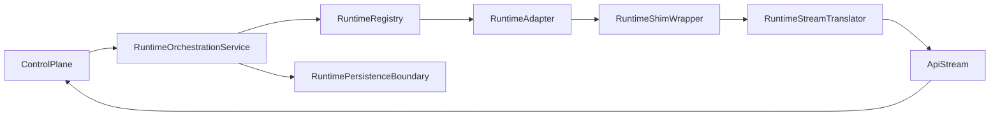

# Component Dependency

## Dependency Matrix

| Component | Depends On | Dependency Purpose |
|---|---|---|
| RuntimeOrchestrationService | RuntimeRegistry | Resolve the active runtime adapter |
| RuntimeOrchestrationService | RuntimePersistenceBoundary | Load config, credentials, and record execution |
| RuntimeOrchestrationService | RuntimeCapabilityValidator | Gate execution and rollout readiness |
| RuntimeAdapter | RuntimeShimWrapper | Execute runtime-specific invocation |
| RuntimeAdapter | RuntimeStreamTranslator | Convert runtime-native output into internal stream events |
| RuntimeConfigFacade | RuntimePersistenceBoundary | Persist and migrate runtime configuration |
| RuntimeValidationService | RuntimeRegistry | Inspect runtime definitions |
| RuntimeTestHarnessService | RuntimeAdapter, RuntimeStreamTranslator | Validate contract and parsing behavior |

## Communication Patterns
- **Synchronous resolution**:
  - `RuntimeOrchestrationService -> RuntimeRegistry`
  - `RuntimeConfigFacade -> RuntimePersistenceBoundary`
- **Asynchronous execution**:
  - `RuntimeAdapter -> RuntimeShimWrapper`
  - `RuntimeShimWrapper -> RuntimeStreamTranslator`
  - `RuntimeOrchestrationService -> control plane stream`
- **Validation support**:
  - `RuntimeValidationService -> RuntimeCapabilityValidator`
  - `RuntimeTestHarnessService -> adapter contract fixtures`

## Data Flow

### Text Alternative
1. The control plane submits a runtime execution request.
2. The orchestration service resolves the runtime adapter and loads persisted config.
3. The adapter prepares runtime invocation through the shim wrapper.
4. The shim emits raw process output.
5. The stream translator converts raw output into internal stream chunks.
6. The orchestration service returns those chunks to the control plane.

## Ownership Boundaries
- `RuntimePersistenceBoundary` owns settings, credentials, capability cache, and execution records.
- `RuntimeShimWrapper` owns process invocation concerns only.
- `RuntimeStreamTranslator` owns parsing and event normalization only.
- `RuntimeAdapter` composes shim + translator into a runtime-specific implementation.
- `RuntimeOrchestrationService` owns top-level execution coordination.
